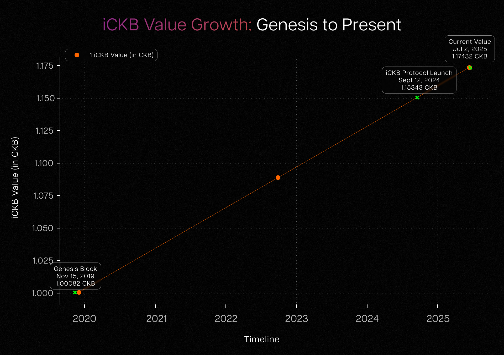

One of the defining features of CKB (the Common Knowledge Base) is the **[NervosDAO](https://explorer.nervos.org/nervosdao)**, a built-in staking mechanism that lets CKByte (also referred to as CKB) holders earn passive rewards by locking their tokens. While this supports the network’s long-term sustainability and helps protect against inflation, it comes with a trade-off: tokens staked in the DAO are locked for approximately 30 days. This lock-up restricts user liquidity and limits participation in the growing DeFi ecosystem on CKB. To solve this, the **[iCKB](https://ickb.org)** protocol was created: a smart, noncustodial liquid staking solution that bridges the gap between DAO participation and liquidity freedom. Developed by **[Phroi](https://phroi.com)** with support from the **[Nervos Foundation](https://www.nervos.org/foundation)**, iCKB allows users to stake CKB in the DAO and receive a tradable token in return iCKB that continues to accrue yield while remaining usable across DeFi applications.

## Understanding the Basics: What Is iCKB? 

At its core, iCKB is a synthetic token that represents CKB locked in the NervosDAO. The iCKB protocol launched on September 12, 2024, at which point** 1 iCKB** was already worth **1.15343076 CKB** due to accumulated DAO rewards since the CKB genesis block. While conceptually iCKB represents inflation-protected CKB pegged to the genesis block value (November 15, 2019), the actual iCKB protocol deployment occurred nearly 5 years later when significant secondary issuance had already occurred.

## How the iCKB Exchange Rate Works

The exchange rate is actually determined based on the accrued DAO rewards at the time of deposit, not after. To understand this, it's helpful to draw a parallel with fiat currency and inflation. Consider the U.S. dollar: $1 in 2019 had far more purchasing power than $1 in 2023. This isn’t because of any interest earned, but because the total money supply increased in economic terms, it experienced inflation. If we were to create a synthetic, non-inflationary version of the dollar, say, “iUSD” it would represent the value of $1 fixed at a specific point in time, like January 1, 2019. As the Federal Reserve continues to print money, the actual USD would gradually lose value compared to iUSD.

This same model applies to Nervos. In this analogy:

* CKB is like the inflationary USD. \

* iCKB is the inflation-protected version, like iUSD. \

* The Federal Reserve is analogous to CKB’s secondary issuance, which introduces new CKB into circulation over time. \

* The genesis block of CKB (November 15, 2019, UTC) is the fixed point of reference, just like January 1, 2019, in the USD example. \

When someone deposits CKB into the iCKB protocol, the system takes a snapshot of the DAO’s accumulated inflation or, more precisely, the rewards minted through secondary issuance from genesis to the deposit block. This baseline defines how much value that deposit holds in inflation-protected terms. The iCKB token minted reflects this fixed, inflation-adjusted value.

As time goes on, the broader CKB supply continues to inflate due to secondary issuance. But the iCKB remains pegged to that historical deposit value, preserving purchasing power. This is what makes iCKB inflation-protected CKB. Rather than chasing interest or yield, it serves as a long-term store of value, grounded in DAO rewards at the time of entry, not fluctuating after.

If a user wants to redeem iCKB for underlying CKB, but no matching DAO deposit is available at that moment, liquidity providers (or market-makers) can step in to fulfill the request. In return, they receive a transaction fee (typically 0.001%, but adjustable by liquidity providers), a small but meaningful incentive to ensure smooth and timely redemptions.

The chart below illustrates this cumulative effect of CKB's secondary issuance on iCKB value since genesis:

The chart illustrates the steady and predictable increase in the value of iCKB relative to CKB from the genesis block in November 2019 to the present. This growth is not the result of variable yield or market activity, but rather the deterministic effect of NervosDAO’s secondary issuance. At each point in time, iCKB represents the same inflation-protected share of the network as it did at the time of its creation. Key milestones, such as the genesis block, the launch of the iCKB protocol, and the current value, highlight how this mechanism works in practice: one iCKB continues to accumulate value compared to one CKB, reflecting over 17% growth since genesis. This consistent upward trend demonstrates why iCKB functions as an inflation-protected derivative of CKB in the NervosDAO, preserving long-term value even as new CKB enters circulation.

## Key Benefits of iCKB

The iCKB protocol brings several important advantages to the Nervos ecosystem and its users:

1. **Liquidity without Sacrificing Yield: **iCKB removes the biggest barrier to DAO participation: the 30-day lock-up period. Users can now deposit their CKB and still have a liquid, tradable asset. This unlocks a host of possibilities, from instant conversions to integrating iCKB into lending protocols or liquidity pools.

2. **Compounding with Value Preservation: **As time goes on, the value of iCKB increases due to the accumulation of DAO rewards. This is similar in structure to Compound’s cTokens or Lido’s stETH meaning users benefit from compounding while staying flexible.

3. **DeFi Integration and Composability: **Since iCKB is built as an [xUDT](https://blog.cryptape.com/enhance-sudts-programmability-with-xudt) (extended user-defined token) on CKB, it is fully compatible with the existing token standards and infrastructure. This means it can be used in smart contracts, traded on decentralized exchanges, and integrated into multi-asset protocols like Bitcoin-backed DeFi (BTCFi) or RGB++ applications.

4. **Transparency and Non-Custodial Design: **All iCKB operations deposits, redemptions, and interest calculations are handled on-chain via smart contracts. The system is fully decentralized, audited by Scalebit, and does not rely on any centralized custody solutions.

## Technical Structure and Tokenomics

The iCKB protocol maintains a deterministic exchange rate relative to CKB, based on NervosDAO’s accumulated rewards from the genesis block (November 15, 2019, UTC). While this rate evolves over time, it is globally consistent and not dependent on how long any specific user holds iCKB. 

When users convert CKB into iCKB, the protocol mints tokens based on the DAO’s inflation data at the deposit block. These iCKB tokens represent an inflation-protected claim on CKB. For example, while 1 iCKB equaled 1 CKB at genesis, at the time of this writing it equals roughly 1.174817 CKB (increases according to time), reflecting CKB’s inflation via secondary issuance. 

iCKB users do not own individual deposits, instead, they draw from a shared pool, and redemptions are fulfilled based on the global exchange rate at the time of withdrawal. Liquidity providers support off-cycle redemptions and are rewarded with transaction fees.

## Adoption and Community Support

Since launch, iCKB has seen growing adoption within the Nervos ecosystem. Its integration with **[NervDAO](https://nervdao.com/)** allows users to interact with the protocol through familiar interfaces. The community-driven nature of the project, supported by an open-source codebase and transparent funding mechanisms, has earned it credibility.

Beyond technical deployment, iCKB has received attention for its alignment with the Nervos vision: building decentralized, interoperable infrastructure that remains secure while promoting utility. Proposals and community threads on [Nervos Talk](https://talk.nervos.org) have highlighted ongoing efforts to expand iCKB’s use in other protocols and DeFi primitives.

## Risks and Considerations

Like any DeFi protocol, iCKB carries some risks:

* **Smart Contract Vulnerabilities:** While audited, on-chain contracts are always exposed to potential bugs.
* **Redemption Bottlenecks:** During high-demand periods, redemptions may be delayed if no matured DAO deposits are available.
* **Price Volatility and Liquidity:** iCKB may trade at a premium or discount depending on market conditions.

However, its carefully designed incentives, transparent mechanics, and secure structure mitigate many of these concerns.

## Conclusion

The iCKB protocol is a major step forward in making the NervosDAO more flexible and accessible. It solves a fundamental problem of liquidity loss, without compromising on the security and yield benefits of the DAO.

By introducing a liquid staking derivative on CKB, iCKB unlocks new layers of composability, efficiency, and inclusion for Nervos CKB users. As the CKB ecosystem continues to expand toward cross-chain interoperability and advanced DeFi applications, protocols like iCKB will be essential building blocks empowering users to move capital freely, protect their assets from inflation, and participate actively in on-chain finance.