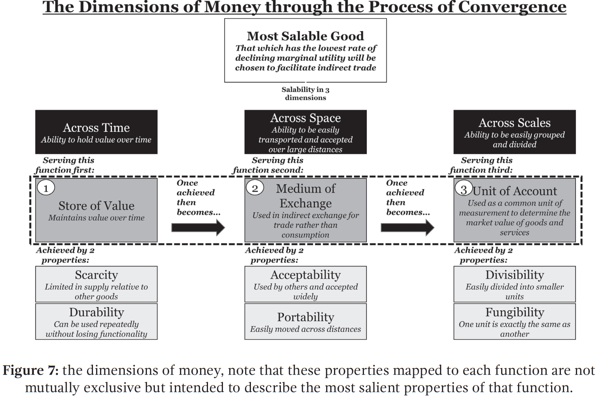
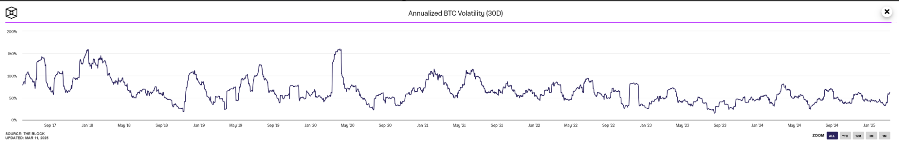
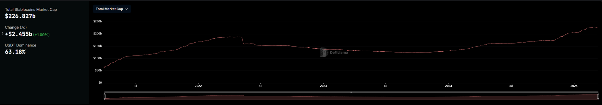
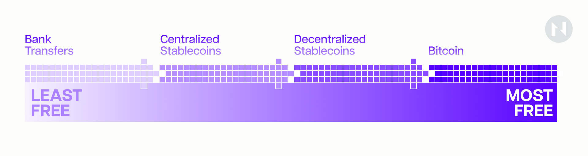
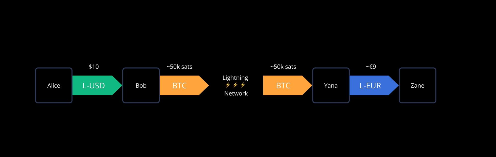

Anyone with genuine skin in the game who has tried to understand Bitcoin and its broader significance intimately knows what it's like to fall victim to the [Dunning-Kruger effect](https://en.wikipedia.org/wiki/Dunning%E2%80%93Kruger_effect). After the first dozen hours of study, one's confidence in understanding Bitcoin is highest despite their actual understanding being lowest.

Those in this initial stage of their Bitcoin journey can be easily recognized by their nonchalant eagerness to point out perceived critical "flaws" in Bitcoin's design, often thinking they were the first to have thought of them. 

Some common criticisms include claims that Bitcoin is slow, expensive, inefficient, and an enormous waste of energy; others argue that it is not real money or a legitimate currency. Among the more amusing critiques are the assertions that "Bitcoin is not scarce" because it's divisible up to the eighth decimal, that "it’s not truly decentralized" because mining pools exist, or that “it has no value” because it “isn’t backed by anything.”

Those who are curious and humble enough to continue studying soon realize that every perceived issue they thought they had discovered has already been thoroughly discussed on various Bitcoin forums for years.

Reading through these discussions, they come to understand that Bitcoin is far more multifaceted than they previously believed. It touches disciplines ranging from decentralized computing and cryptography to macroeconomics, behavioral economics, game theory, politics, psychology, and many more. This richness is a direct result of the elegant simplicity of Bitcoin’s mechanism design, which is described nearly completely in Satoshi’s 9-page Bitcoin whitepaper. 

After delving deeper into these related subjects, those who were once skeptical about Bitcoin typically capitulate and embrace its brilliance. In the process, they come to appreciate that the person(s) behind the Satoshi pseudonym had considered the system's design in ways that may initially seem unimaginable.

At this point, almost every design choice starts to make sense, and every previously perceived flaw becomes seen as a feature. They find that for every “why,” there’s a profound “because,” and for every ensuing “but” there’s a dead protocol, an autopsy record of which demonstrates why Bitcoin has succeeded in a domain where so many have failed.

However, escaping the middle of the inverted Dunning-Kruger bell curve can take years of diligent study, which is simply (and understandably) infeasible for most people. Furthermore, there seems to be a strong correlation between knowledge of Bitcoin and conviction in it, which could explain the contrasting panoptic jadedness permeating the “crypto” industry today. 

Despite Bitcoin’s market dominance, many still feel that its adoption rate should have been much higher after 16 years. Moreover, the way it’s currently utilized raises significant concerns. 

Bitcoin was originally designed as an electronic cash system, empowering financial sovereignty through trustlessness, censorship resistance, and disintermediation, yet its means of exchange have remained largely custodial, captured by centralized exchanges and other intermediaries with often worse UX, privacy, and security assumptions than commercial banks.

These concerns are exacerbated by the fact that Bitcoin’s block space is consistently underutilized, and consequently, transaction fees are low. As block rewards continue to halve every four years, doubts are prevalent about whether transaction fees alone can sustain network security over the coming decades.

However, most people, including high-conviction bitcoiners, fail to realize that all of these developments are natural and, given the long history of money, quite predictable.

## Becoming Money

Ludwig Wittgenstein once asked a friend, *“Tell me, why do people say it is more natural to think that the sun rotates around the earth than that the earth is rotating?”* The friend said, *“Well, obviously, because it just seems like the sun is going around the earth.”* Wittgenstein replied, “*Well, what would it seem like if it did seem like the earth were rotating?”*

Building on this anecdote, [Allen Farrington](https://allenfarrington.medium.com/wittgensteins-money-7cac8d0635cf), in his book [Bitcoin is Venice](https://store.bitcoinmagazine.com/products/bitcoin-is-venice), poses the following leading question: *“What would it seem like if it did seem like a global, digital, sound, open-source, programmable money was monetizing from absolute zero?”*

To answer the question: *this* is exactly what it would seem like. Bitcoin is going through the same transition as any other good that has ever become money throughout history, and understanding this transition is key to understanding where we’re at in our journey to hyperbitcoinization. 

*The process of monetization normally involves a few key steps:*

First, the good must possess qualities that allow it to store value over time, in the sense that market participants have reasons to believe its demand will remain stable. As more people recognize that this particular good effectively stores value compared to others, they first start to use it for saving and then begin trading it solely based on this forward-looking property.

As exchanges using this good increase, its widespread acceptance becomes *common knowledge*. This creates a self-fulfilling prophecy: everyone begins to trade their goods and services for this good, knowing that it can be easily exchanged for other goods and services in the future.

Once this practice becomes prevalent on a large scale, network effects propel the asset. Market participants begin quoting prices for their goods and services in terms of this good, which ultimately leads to its use as a common unit of account.

That said, not all goods that meet these criteria become money. In "[The Origins of Money](https://mises.org/library/book/origins-money)," Austrian economist [Carl Menger](https://en.wikipedia.org/wiki/Carl_Menger) argued that, in a free market, the most *salable* good is ultimately chosen as money, defining salability as the relative ability of a good to be sold in a particular market at the desired time and price.

*The evolutionary steps monetary goods go through in the process of becoming widely accepted as money. (Source: [The 7th Property](https://epochvc.io/pdf/The-7th-Property-Eric-Yakes-2021.pdf) by Eric Yakes)*

For a good to be recognized as money in a free market, it must excel in salability across three dimensions: *time, space,* and *scale*.

If a good is the most salable over time, it will be the best store of value. If it is the most salable across space, it becomes the best medium of exchange. Lastly, if it excels in salability at scale, it becomes the common unit of account.

Some goods may be highly salable in one dimension while lacking salability in another. The good that is most salable across all three dimensions will eventually emerge as money through the process of convergence.

A good’s monetary functionality is further contingent on six key properties:

* *scarcity* and *durability* ensure that it can serve as a reliable store of value over time;
* *acceptability* and *portability* enable it to function effectively as a medium of exchange across space; and
* *divisibility* and *fungibility* allow it to work as a unit of account at scale.

In debates with gold bugs and fiat defenders, Bitcoiners often mention these points to accurately argue that bitcoin is far superior to both gold and fiat (and any other monetary good, for that matter) across all six properties of money—thus, it’s the likeliest contender to eventually take over as money.

What they seem to forget, however, is that the evolution goods go through while monetizing is *path-dependent*.

[Path dependence](https://en.wikipedia.org/wiki/Path_dependence) is a concept in the social sciences that refers to processes where past events or decisions constrain or dictate later events or decisions. In bitcoin’s case, this means that it can’t become a universally accepted medium of exchange and unit of account until it’s done monetizing as a store of value.

And it doesn’t take a Nobel laureate in economics to figure this one out—it’s rather commonsensical.

For bitcoin to become a medium of exchange, holders must be willing to easily exchange it for other goods and services. As things currently stand, this can’t be the case because exchanging a highly volatile asset with an average yearly return of approximately 140% since inception for a consumable or depreciating asset doesn’t make much economic sense. 

In other words, bitcoin is monetizing or growing too fast to be considered anything other than a store of value. On-chain [data](https://app.intotheblock.com/coin/BTC/deep-dive?group=network&subgroup=avgTimeTokenIsHeld) supports this notion: bitcoin is held for an average of 4.4 years, indicating a relatively long-term investment perspective.

Beyond that, consider that price volatility plays a significant role in a good’s adoption as a medium of exchange and, more importantly, as a common unit of account.

People want to trade and denominate prices using an asset that has a consistently stable value relative to other goods. As a relatively young and emerging asset class with a modest market capitalization, bitcoin is more susceptible to higher volatility as new capital flows into it.

However, as it matures and grows bigger, the volatility dampens because the inflow of capital has a smaller impact on the price as it flows into a larger capital base. Supporting data shows that bitcoin's annualized volatility has decreased from 200% in 2010 to about 72% today. 

Bitcoin’s annualized 30-day volatility. (Source: [TheBlock](https://www.theblock.co/data/crypto-markets/prices/annualized-btc-volatility-30d))

To provide some historical context, a similar pattern has been observed with gold since it was depegged from the dollar in 1971: its 90-day annualized volatility has dropped from an average of about 23% to around 7%. In comparison, the current 90-day annualized volatility of the U.S. Dollar, measured against a basket of other currencies (DXY), is around 7%.

In other words, people want to save money in an asset that appreciates or at least maintains its value over time, rather than one that depreciates, and prefer to trade and denominate prices in an asset that is relatively stable in value.

Bitcoin enthusiasts have collided head-on with this fact numerous times, with El Salvador being the most recent and notable case.

In 2021, El Salvador became the first country in the world to make Bitcoin [legal tender](https://en.wikipedia.org/wiki/Bitcoin_in_El_Salvador), introducing its own Lightning Network-compatible wallet called Chivo. Despite significant government efforts, Bitcoin and the Lightning Network saw barely any adoption in real-life commerce. The local entrepreneurs reportedly loved the Lightning Network's benefits as a technology but really wanted the stability of the dollar.

None of Bitcoin's and Lightning Network's advantages mattered to Salvadorean entrepreneurs without stability, which shows just how important this attribute is. To some Bitcoin maximalists, this may have been a surprise, but not to anyone keeping an eye on the broader crypto market.

Stablecoins, as an industry-native product, have achieved the best product-market fit among all crypto asset classes. The annual stablecoin trading volume reached [$27.6 trillion](https://blog.cex.io/ecosystem/stablecoin-landscape-34864), surpassing the combined volume of Visa and Mastercard in 2024 by over 7.68%. For comparison, Bitcoin ended the year with about $19 trillion in value settled on the network. In the same year, the total stablecoin market reached a capitalization of above $200 billion, accounting for 6% of the total crypto market cap and 1% of the total U.S. dollar supply.

The total market capitalization of stablecoins. (Source: [DeFiLlama](https://defillama.com/stablecoins))

Until recently, this was an entirely untapped market for Bitcoin. However, early this year, the largest fiat-backed stablecoin issuer, Tether, [announced](https://lightning.engineering/posts/2025-01-30-Tether-on-Lightning/) that it would launch its stablecoin on the Bitcoin Lightning Network via Lightning Labs’ [Taproot Assets Protocol](https://docs.lightning.engineering/the-lightning-network/taproot-assets/taproot-assets-on-lightning) (TAP), which launched late last year. The [RGB++](https://www.rgbppfans.com/) protocol also allows developers to launch various assets on Bitcoin, including fiat-backed and decentralized over-collateralized stablecoins. 

We believe that crypto market participants have greatly underappreciated these developments. Stablecoins on Lightning Network can act as a powerful gateway drug for Bitcoin’s broader adoption and could be the necessary intermediary step toward hyperbitcoinization.

## Stablecoins: The Trojan Horse to Hyperbitcoinization

Instead of convincing people to transact *with bitcoin*, we should persuade them to transact *on Bitcoin*. Not only would the latter require much less convincing, but it would also indirectly help with the former.

The Lightning Network isn’t struggling with adoption because it’s a lousy technology, but because it’s a payment solution built around an asset that isn’t suitable for payments yet. However, TAP, RGB++, and Bitcoin-based stablecoins issued through them can change that.

Dollar-denominated stablecoins can be an enticing entry point for new users, especially in markets facing currency instability or lacking banking access. By downloading a Lightning wallet to manage their digital dollars for everyday transactions, people would unwittingly step into the Bitcoin world.

These new users may initially begin interacting with the Lightning Network without buying Bitcoin, enjoying instant, low-fee payments in a familiar currency. However, as they become comfortable using the technology—opening and closing channels, managing private keys, making payments, and so on—and experience its speed and reliability firsthand, their curiosity about bitcoin (the asset) will grow.

It’s a small leap from using stablecoins on the Lightning Network to stacking sats for savings, especially when the same wallet can seamlessly hold both.

Additionally, as anyone who’s done so knows, transacting on decentralized and permissionless networks can be very liberating, almost addicting—particularly when contrasted with the inherently invasive experience of dealing with banks.

Sending money to clients, friends, or family overseas without waiting for days, paying an arm and a leg, and providing DNA samples to a compliance officer at the local branch office can be a radicalizing experience.

While using stablecoins on the Lightning Network may be more liberating than sending wire transfers, it doesn’t compare to natively holding and transacting with bitcoin.

Unless we are discussing decentralized, over-collateralized stablecoins—which are significantly more challenging to scale—centralized stablecoin issuers like Tether will certainly still have to comply with regulations, meaning they can censor transactions and must adhere to data collection requirements.

There exists a spectrum in this transition, and we cannot expect people to move from one side to the other overnight. Instead, we should recognize that moving towards “freedom money” may take years, and stablecoins could be the necessary catalyst that kickstarts this process.

In essence, a fiat–Bitcoin hybrid era powered by Lightning could compress the timeline to hyperbitcoinization by familiarizing billions with the Bitcoin network while they’re still using fiat. As trust in bitcoin grows—or conversely, trust in fiat erodes—the balance naturally tips toward “bitcoin” proper. When that tipping point arrives, the infrastructure and user base will already be in place, largely thanks to stablecoins.

This brings us to an important point: capturing even a small portion of the rapidly increasing stablecoin volume will significantly enhance the utility of the Lightning Network.

With innovations like TAP and RGB++, Lightning can transform into a global, instant foreign exchange (forex) settlement network. Users will be able to send one currency while the recipient receives another.

For instance, Alice can pay using a dollar-denominated stablecoin, while Bob receives a euro-denominated stablecoin—all within a single atomic transaction. This means merchants and businesses won't have to endure the volatility associated with forex transactions, which is a primary barrier to their adoption of Lightning.

The sender and recipient do not need to transact in the same asset type. (Source [docs.lightning](https://docs.lightning.engineering/the-lightning-network/taproot-assets/taproot-assets-on-lightning)).

This capability alone could lead to a rapid expansion of commerce over the Lightning Network, which would, in turn, encourage further growth of Lightning infrastructure. More stablecoin activity on Lightning translates to more routing fees for node operators, which incentivizes an increase in nodes, more and better-connected channels, and more liquidity. All of this combined makes Lightning more attractive to operate in for everyone.

Perhaps even more crucially, a rise in stablecoin transactions on Lightning boosts the demand for bitcoin. Although end users may think in terms of dollars or euros, every Lightning Network payment made with a stablecoin essentially [utilizes bitcoin as the underlying routing "fuel."](https://docs.lightning.engineering/the-lightning-network/taproot-assets/taproot-assets-on-lightning)

The increased demand for bitcoin means that the asset can grow and mature more quickly, leading to a decrease in volatility and accelerating its transition from being primarily a store of value to functioning as a medium of exchange.

Finally, increased stablecoin activity on Lightning will eventually translate into increased security for the Bitcoin base layer. Every Lightning channel carrying stablecoins ultimately involves bitcoin transactions at the base layer: channels must be opened and closed using on-chain bitcoin, and liquidity channels often need rebalancing or settlement.

The more people use Lightning (even for stablecoins), the more on-chain transactions will occur to manage those channels, adding to miner fee revenue.

Suppose billions of new stablecoin users migrate from competing blockchains or traditional rails onto Bitcoin’s Layer 2. In that case, we’d see a wave of channel openings and liquidity adjustments anchored in its base layer. This influx of transactions could significantly boost miners' transaction fee revenue, helping offset their declining income from the diminishing block reward.

Yet, as promising as stablecoins on Lightning may be, achieving truly scalable, multi-asset functionality often demands more flexibility than Bitcoin’s base layer alone can provide. This is where novel infrastructure solutions come into play.

## Building Beyond the Lightning Network

One such approach is the Fiber Network, a Lightning-like, multi-asset payment channel implementation on CKB, which connects to Bitcoin and the Lightning Network through “gateway nodes”.

The Fiber Network leverages the Turing-complete capabilities of the CKB blockchain to natively support user-defined assets. For example, stablecoin assets based on the RGB++ protocol can be issued on the Bitcoin chain, then transferred to the CKB chain using the bridgeless cross-chain leap functionality, and finally enter Fiber Network and Lightning Network since they are seamlessly interconnected.

Furthermore, using HTLC (Hash Time-Locked Contracts) and PTLC (Point Time-Locked Contracts), edge nodes serve as intermediaries between two networks, facilitating atomic swaps of assets. 

This process enables seamless exchanges of assets, such as BTC and stablecoins, across both networks, ensuring that transactions are either fully completed or completely rolled back. For example, a BTC payment can be received on the Lightning Network side of an edge node and then converted into an equivalent value in stablecoin for transfer from the Fiber Network side, continuing its route through the Fiber Network until it reaches the final recipient.

Thanks to the Turing-complete programmability of CKB, this is just the start. It underscores just how versatile Bitcoin’s broader ecosystem can become when integrated with complementary chains, all while maintaining Bitcoin’s trust-minimized, censorship-resistant ethos.

## Final Thoughts

Onboarding stablecoins to Bitcoin and its Layer 2 networks may initially seem counterintuitive to Bitcoin purists, but it could be a crucial step towards accelerating hyperbitcoinization. This approach combines the stability and familiarity of existing currencies with Bitcoin's permissionless and efficient architecture. 

Rather than ceding the stablecoin phenomenon to other chains, Bitcoin can absorb it, turning a perceived challenge into an advantage. In doing so, Bitcoin the network cements itself as the universal settlement layer for all value (fiat or otherwise) and bitcoin, the asset, gains exposure to vast new audiences who will in time, recognize its superior qualities as money. 

The economic and security implications of this initiative are overwhelmingly positive. More transactions, users, and liquidity anchored to Bitcoin translate into stronger network effects for Lightning and a more secure base layer.

Meanwhile, an ever-growing cohort of individuals and businesses will use the Bitcoin network for their daily needs—a subtle but powerful form of adoption that will ultimately lead to greater acceptance of the bitcoin asset itself.