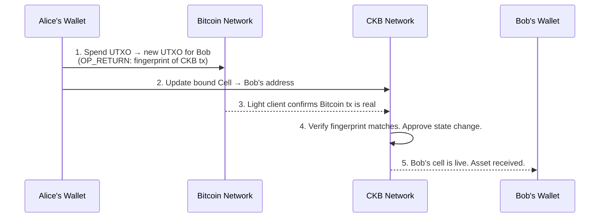

*Reflections of a CKBuilder is a field-note series from my CKBuilders learning journey, translating CKB concepts through the eyes of someone building with them for the first time.*

Open your Bitcoin wallet right now. Look at your balance.

Now try to do something interesting with it.

You can send it to someone. That's mostly it. Bitcoin was built to be a store of value and a payment network, and it is extraordinarily good at those two things. But ask Bitcoin to run a swap, execute a lending position, or mint a token with custom rules, and the answer is no. The scripting language was deliberately kept limited. The designers thought, correctly, that complexity equals attack surface.

But the demand for programmable Bitcoin didn't go away. And the solutions the industry reached for were, for a long time, all variations of the same workaround: **wrap the Bitcoin, move it somewhere else, trust the bridge**.

RGB++ is a different answer entirely. And understanding why requires starting somewhere unexpected: a sealed envelope.

---

## The Problem With Bridges

Before explaining what RGB++ does, it helps to be clear about what it's *not*.

The traditional approach to making Bitcoin "programmable" goes like this:

1. You lock your real Bitcoin inside a contract or a multi-sig wallet controlled by a group of people.
2. They mint a "wrapped" version of your BTC on another chain (Ethereum, Solana, etc.).
3. You use the wrapped version to do DeFi things.
4. When you're done, you burn the wrapped token and hope the bridge operators give you your real BTC back.

Every word in that last sentence should make you uncomfortable. *Lock. Wrapped. Hope.* You are trusting a third party to hold your assets. The bridge is a honeypot - a single point where billions of dollars sit behind a lock that a group of humans control. The history of crypto bridges is mostly a history of those locks getting picked.

The Force Bridge hack in June 2025 was a reminder. It wasn't the first. It won't be the last.

RGB++ doesn't lock your Bitcoin anywhere. It doesn't mint a wrapped copy. There is no custodian. The Bitcoin stays on Bitcoin. What changes is: *something on CKB now knows what your Bitcoin UTXO is doing, and the two are permanently, cryptographically linked.*

---

## Start Here: What Is a UTXO?

If you've followed this series, you know this from part one. But it's worth restating clearly because it's the foundation of everything RGB++ does.

When you "own" Bitcoin, you don't own a balance stored in a database. You own one or more **UTXOs** - Unspent Transaction Outputs. Each UTXO is like a sealed envelope sitting on the Bitcoin blockchain. The envelope has a value stamped on it (say, 0.1 BTC) and a lock. The lock says: *only the person who can produce a valid signature from this specific key can open me.*

Your "balance" is the sum of all envelopes your key can open.

When you spend Bitcoin, you don't edit a number. You consume one or more envelopes and create new ones. The old envelopes are destroyed. The new ones take their place.

This is the UTXO model. CKB uses a version of it too, with cells instead of envelopes, which is why these two blockchains are unusually compatible at a structural level. RGB++ exploits that compatibility directly.

---

## The Key Insight: A UTXO Is a Perfect Lock

Here is the idea that makes RGB++ possible.

A Bitcoin UTXO has one property that makes it uniquely trustworthy: **it can only be spent once.** Once it's consumed, it's gone. No replay. No duplication. There is no way to spend the same UTXO twice. Bitcoin's entire security model is built on this guarantee.

Cryptographers call this a **single-use seal**. Not a fancy term - exactly what it sounds like. You seal something with it, and breaking the seal is a one-time, permanent, irreversible event. Anyone watching the Bitcoin blockchain can see exactly when the seal was broken and by whom.

RGB++ takes this guarantee and repurposes it.

> *What if spending a specific Bitcoin UTXO was the key that unlocks a corresponding action on CKB?*

That's the whole idea. Not a bridge. Not a lock-and-mint. Just a rule: **this CKB cell is bound to that Bitcoin UTXO. The cell can only be updated when that UTXO is spent. When the UTXO is spent, the CKB cell updates automatically.**

The Bitcoin UTXO acts as the seal. Spending it is the event. The CKB cell reflects the result.

This binding is called **isomorphic binding** - "isomorphic" meaning "same shape." The Bitcoin UTXO and the CKB cell mirror each other. One is the lock on Bitcoin. The other is the live, programmable state on CKB.

---

## How a Transaction Actually Works

Let's walk through what happens when someone transfers an RGB++ asset. Concretely.

Imagine Alice owns some USDT that lives in the RGB++ ecosystem. She wants to send it to Bob. Here's what actually happens - in plain language:

**Step 1: Alice prepares two transactions simultaneously.**

The first is a normal Bitcoin transaction. It spends Alice's UTXO (her Bitcoin "envelope") and creates a new one that Bob can unlock. Tucked inside this Bitcoin transaction, in a field called `OP_RETURN` (a slot Bitcoin allows for small pieces of arbitrary data), is a short cryptographic fingerprint. That fingerprint points to the second transaction.

The second is a CKB transaction. It updates the CKB cell - the one that was bound to Alice's UTXO - to reflect the transfer. The new cell is now bound to Bob's Bitcoin address instead of Alice's.

**Step 2: Both transactions go out.**

The Bitcoin transaction lands on the Bitcoin blockchain. It's now part of Bitcoin's permanent, proof-of-work secured record. The `OP_RETURN` fingerprint is committed to that record.

The CKB transaction lands on CKB.

**Step 3: CKB checks its work against Bitcoin.**

Here's the part that makes the bridge unnecessary. CKB runs a **Bitcoin light client** - a piece of code built into the CKB protocol that continuously monitors Bitcoin block headers. It doesn't download every Bitcoin transaction, but it has enough information to verify that a specific Bitcoin transaction really happened, in a specific block, at a specific time.

When the CKB transaction comes in, the protocol checks: *did the Bitcoin UTXO that was supposed to be spent actually get spent in the Bitcoin transaction referenced by this CKB transaction?*

If yes: the CKB state update is valid. The cell is updated. Bob now has the asset.

If no: the CKB transaction is rejected. No orphan state. No inconsistency.

The Bitcoin blockchain didn't run any smart contract logic. It just did what it always does: confirm a transaction. But that confirmation, verified by CKB's light client, is what unlocks the state change on CKB. The security comes from Bitcoin's proof-of-work. The programmability comes from CKB's Turing-complete VM.

Neither chain had to change anything about how it works.

---

## Why This Is Different From What Came Before

The original RGB protocol (the one that inspired RGB++) had the right instinct but a painful implementation.

In the original design, if you received an RGB asset, you had to download and verify the **entire history of that asset** yourself - every transaction it had ever been part of, all the way back to when it was first issued. This is called client-side validation, and it has some elegant properties for privacy. But it also means:

- You can't receive an asset unless you're online and actively watching.
- Wallets have to maintain enormous amounts of off-chain history.
- Verification is slow and the burden grows as the asset changes hands more.

RGB++ moves the verification burden onto CKB. Instead of you verifying the asset's history, the CKB blockchain maintains a live, globally-available record of every RGB++ cell's current state. Anyone can query the state. You don't need to download anything. The chain has done the bookkeeping.

The tradeoff is privacy - your asset history is publicly readable on CKB rather than known only to the parties involved. But for most DeFi use cases, that's a fine tradeoff, and it's what makes RGB++ practical where the original RGB protocol remained mostly theoretical for everyday users.

---

## The Leap: When Bitcoin Isn't Fast Enough

So far, everything described is Bitcoin-secured. The UTXO is on Bitcoin. The CKB cell mirrors it. Transfers require both chains to participate.

But what if you want to trade your asset 50 times in an afternoon? Bitcoin confirms a block every 10 minutes. You can't be waiting 10 minutes between each swap.

This is what the **Leap** operation solves.

Leaping is the process of moving an asset from "Bitcoin-secured mode" into "CKB-native mode." Instead of binding the asset to a Bitcoin UTXO, you bind it to a CKB address directly. Once an asset has leaped onto CKB, it moves at CKB's speed - transactions that confirm in seconds, not minutes.

Think of it as two modes:

| Mode | Asset lives... | Speed | Security anchor |
|------|---------------|-------|----------------|
| **RGB++ (bound)** | On CKB, locked to a Bitcoin UTXO | Bitcoin speed (~10 min) | Bitcoin PoW |
| **Leaped (CKB-native)** | On CKB directly | CKB speed (~seconds) | CKB PoW + Nakamoto consensus |

You leap when you want to participate in fast DeFi. You leap back to Bitcoin-bound when you want the strongest security guarantee for long-term holding.

JoyID, one of the most polished wallets in the CKB ecosystem, has built this leap functionality into its interface. Users don't need to understand what's happening under the hood - they tap "Leap to CKB," the protocol handles the binding update, and suddenly their Bitcoin-native assets are moving at CKB speed.

---

## Transaction Folding: One Bitcoin Block, Many CKB Transactions

There's one more feature worth understanding, because it solves a real problem.

Bitcoin is slow by design. Ten-minute block times are a feature - they make the network more secure and decentralized. But if every RGB++ transaction required a separate Bitcoin confirmation, the throughput would be comically low.

RGB++ solves this with **transaction folding**.

Because the binding between a Bitcoin UTXO and a CKB cell is cryptographic - not a one-for-one real-time sync - you can batch multiple CKB state updates behind a single Bitcoin transaction. Ten swaps, fifty transfers, a hundred NFT mints. One `OP_RETURN` commitment on Bitcoin. All ten, fifty, or a hundred CKB transactions are validated against that single anchor.

Bitcoin sees one transaction. CKB processes a hundred. Both chains are happy. The security guarantee still holds because the `OP_RETURN` fingerprint commits to the entire batch of CKB operations.

This is how RGB++ achieves Bitcoin-level security without Bitcoin-level throughput constraints.

---

## What This Enables

The practical result is that the entire CKB smart contract environment - AMMs, lending markets, NFT marketplaces, stablecoin protocols - becomes accessible to Bitcoin assets without those assets ever leaving the Bitcoin security model.

The Spore NFT standard, which I wrote about in part one, stores content directly on-chain inside a cell. An RGB++ bound Spore NFT would have its ownership secured by a Bitcoin UTXO and its content - say, a piece of digital art - living on CKB, accessible forever, with no IPFS link to rot.

The Fiber Network (CKB's Lightning-compatible payment layer) can route RGB++ assets across payment channels at sub-second speed, settling back to Bitcoin when channels close.

DeFi protocols on CKB can list BTC-native assets alongside native CKB tokens. A DEX swap between an Ordinals asset and a CKB-native token becomes technically possible without a bridge or a custodian in the middle.

Bitcoin holders get programmability. CKB builders get liquidity. Neither side had to compromise on their security model to get there.

---

## What I Still Don't Know

The honest part.

**The UX is still rough at the edges.** Running the full RGB++ flow - binding, transacting, leaping - requires either JoyID (which hides most of the complexity) or a fairly deep understanding of the protocol internals. There is no "just deploy this contract and your users can use it" experience yet. Building an application that takes full advantage of RGB++ still means understanding the binding mechanics, the light client verification timing, and the leap lifecycle.

**Bitcoin finality is slow, and you feel it.** A Bitcoin-bound RGB++ transaction isn't truly final until the Bitcoin transaction has enough confirmations. For low-value transfers you might not care. For large DeFi positions, waiting for six Bitcoin confirmations before a CKB state change is considered final is a real UX constraint.

**The ecosystem is still being assembled.** As of mid-2026, the number of production applications fully utilizing RGB++ DeFi is still small. The infrastructure is there. The protocols are live. But the density of usage that makes a DeFi ecosystem feel real - competing liquidity pools, active lending markets, a price discovery layer - is still being built. The pieces exist. The complete picture is still forming.

---

## The Honest Take

What RGB++ does - at its core - is find a use for something Bitcoin already had: the irreversible, unforgeable, one-time nature of spending a UTXO.

Nobody had to modify Bitcoin to make this work. No hard fork. No new opcodes. Bitcoin doesn't know any of this is happening. It just keeps doing what it always did: confirming transactions and securing UTXO state. The CKB side does the interpretation.

That's the elegance of it. The whole construction is built on a read, not a write. RGB++ reads Bitcoin's state. CKB reflects it. Bitcoin's 15 years of security and trust are inherited by every application built on this foundation, without Bitcoin needing to change a single line of code.

The question of whether Bitcoin's programmability problem was a problem to solve or a feature to preserve is still debated. RGB++ is a bet that programmability is worth having, and that you can have it without weakening what makes Bitcoin worth building on.

I find myself increasingly convinced that bet is right.

---

*This is part of an ongoing series documenting progress through the CKBuilders program. Part 1 covered the Cell Model and why your Ethereum account doesn't actually exist. Part 2 covered the External Builder and who does the real work in a CKB transaction. The next piece will cover the Fiber Network - CKB's Lightning-compatible payment layer - and what it means to route payments at machine speed over Bitcoin-secured channels.*
