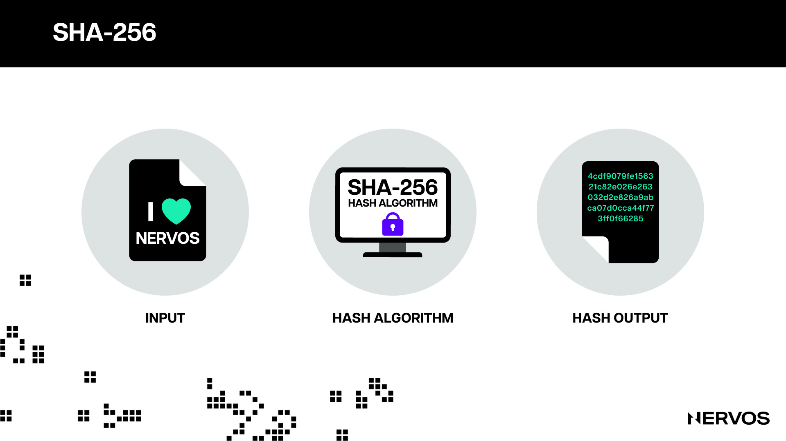
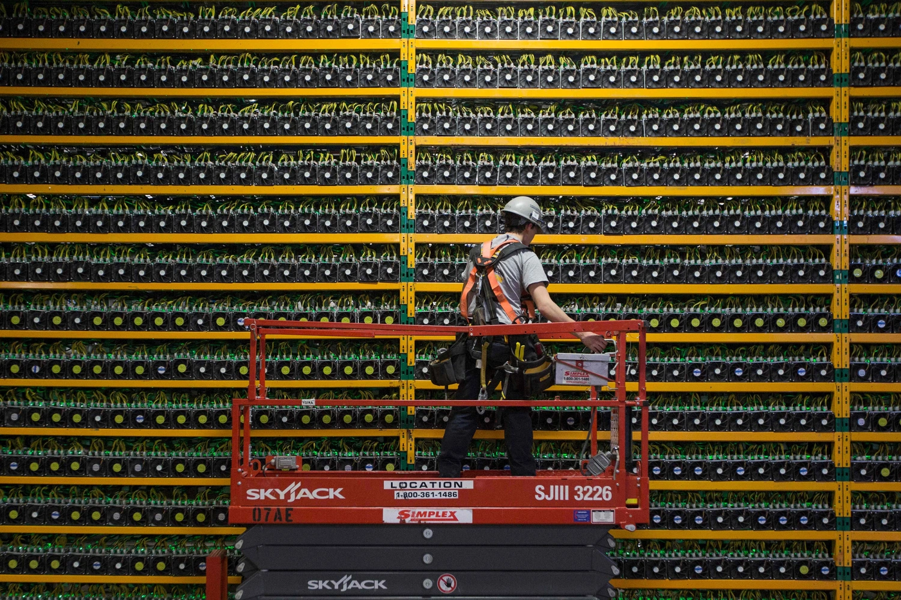
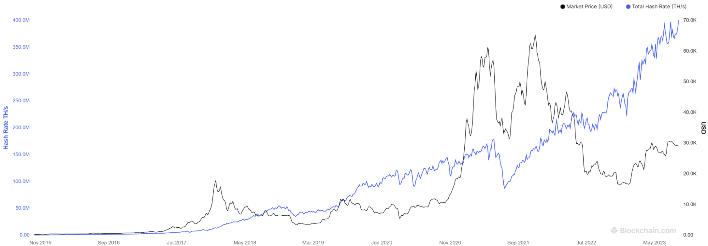
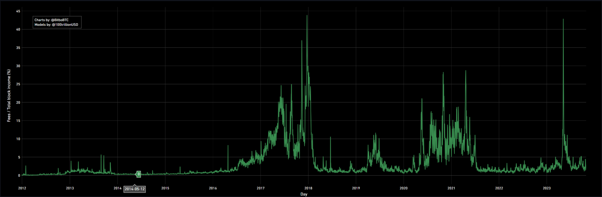
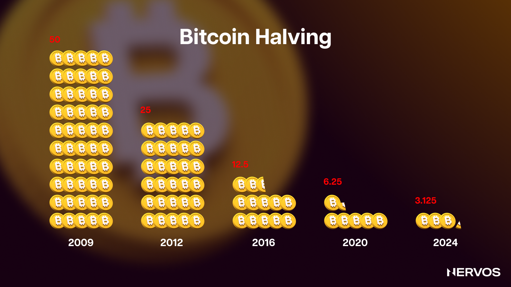
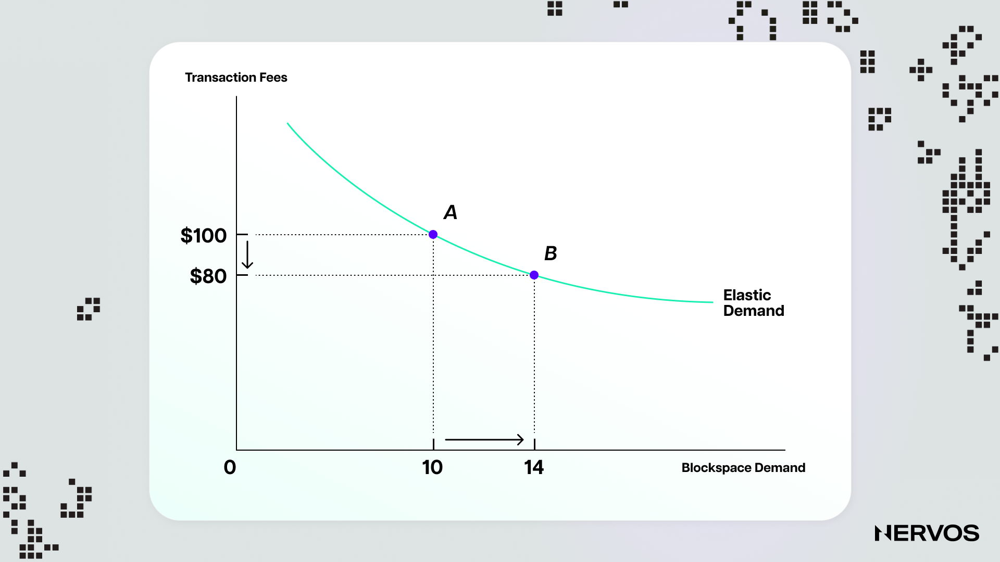
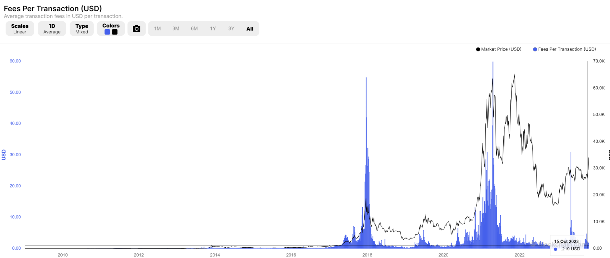
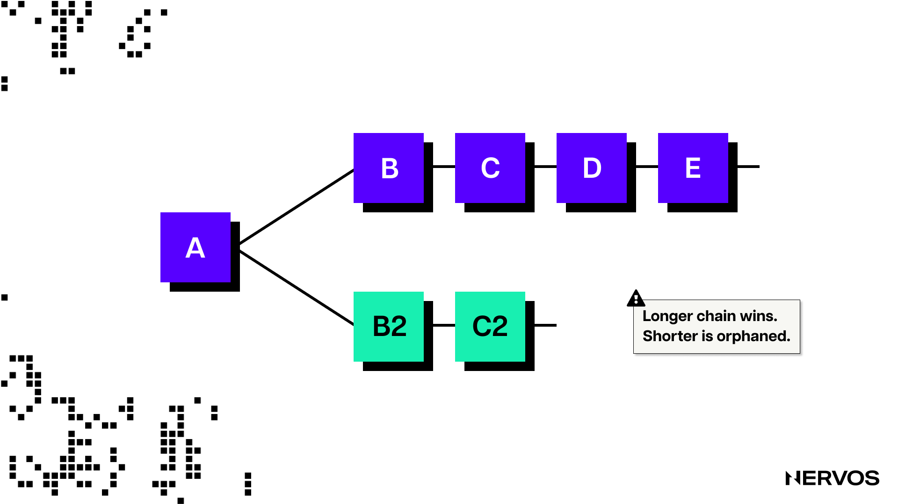
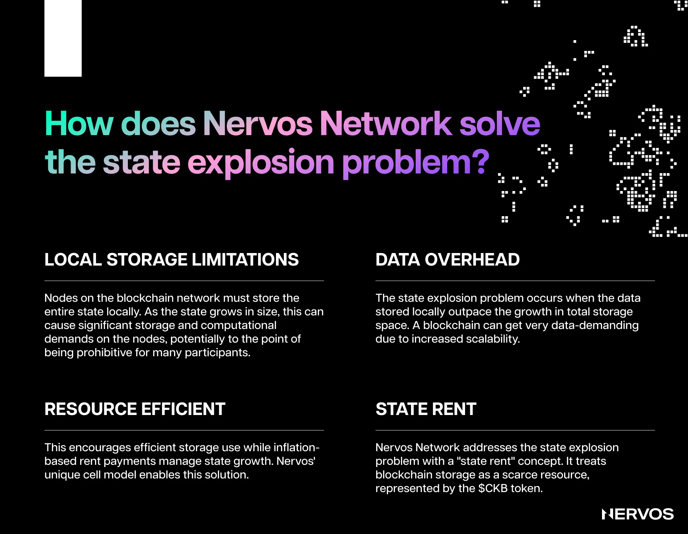

Every four years, typically in the six months preceding the halving, the debate around the sustainability of Bitcoin's security model gets reignited. 

The discussion can be summed up in two opposing arguments: one states that Bitcoin's security model is perfect as is and will ensure long-term stability, while the other argues that Bitcoin's disinflationary monetary policy and consequent long-term reliance on rising transaction fees is unsustainable and will eventually lead to much weaker, potentially dangerously low security.

While many in the Bitcoin community brush off this issue as either already settled or irrelevant, the reality is that it's nothing but. The issue is incredibly nuanced, involving multi-layered technical, economic, and game-theoretical considerations. To that point, both sides of the aisle hold very legitimate arguments, the most notable of which will be laid out in this article in the most unbiased way possible.

## Understanding Proof-of-Work

The Bitcoin blockchain represents a public database of transactions that is updated and replicated across a distributed network of computers called nodes. To achieve consensus on the ledger's true state, the network of nodes adheres to a set of rules or a protocol called [Proof-of-Work](https://www.nervos.org/knowledge-base/why_is_proof_of_work_required) (PoW). 

In the PoW consensus mechanism, special types of nodes called [miners](https://www.nervos.org/knowledge-base/difference_between_miner_full_node_(explainCKBot)) are responsible for validating and recording transactions on the blockchain. Every ten minutes on average, miners "mine" a new block containing transactions that occurred since the last block. Each subsequent block is cryptographically linked with the previous parent block, forming a chain of blocks. The blockchain is said to be immutable because miners can't change a given block's data without re-mining all subsequent blocks up to the current tip of the chain, which would consume exponentially more mining power depending on the given block's depth. 

To that point, the transactions included in a block that gets added to the blockchain are considered “confirmed,” meaning the users can spend the bitcoins they received in those transactions. The more confirmations a transaction has—or the more blocks built on top of the block containing the transaction—the lesser the chance that the transaction gets tampered with. 

To get the chance to update the blockchain with the latest block of transactions, miners race to complete a specific task that involves finding a valid hash output of the [SHA-256](https://www.nervos.org/knowledge-base/SHA256_most_used_hash_function_(explainCKBot)) cryptographic [hash function](https://www.nervos.org/knowledge-base/what_is_a_hash_function). 

For the uninitiated, a [hash function](https://www.nervos.org/knowledge-base/what_is_a_hash_function) is a mathematical function that converts an arbitrary-length input into a deterministic, fixed-length output—a cryptographic fingerprint of the input. Hash functions are “one-way,” meaning the hash inputs cannot be reverse-engineered from the hash outputs. For any specific input, the resulting hash will always be the same and can be easily calculated and verified by anyone, using the same hash algorithm. 

The key characteristic of hashing algorithms is that it isn’t possible to find two different inputs that produce the same hash output or pick an input in such a way as to produce a desired output, other than randomly trying different inputs. 

The output of the SHA-256 hashing algorithm is always 256 bits long, regardless of the input’s size. For [example](https://xorbin.com/tools/sha256-hash-calculator), the hash output of “I Love Nervos” is: 4cdf9079fe156321c82e026e263032d2e826a9abca07d0cca44f773ff0f66285. 

If we make only a slight modification to the input, like adding the number 1 at the end of the phrase, we get an entirely different hash: 955146eb7dfa0d263b0fc8d943f642e26524435ae63a894a6f1879a259db0487. 

The number used to vary the hash function output in the above example is called a _nonce_. 

In Bitcoin, finding a “valid hash” involves hashing the block’s header and checking whether the output falls below the protocol’s “target.” If it doesn’t, the miner will modify the input by repeatedly changing the nonce until it finds a hash that meets the target. The protocol sets the target by asking miners to produce a hash that starts with a specific number of zeros. Using an algorithm called “difficulty adjustment,” the protocol changes the target value every 2,016 blocks (approximately every two weeks) to maintain the desirable block time (the time it takes the entire network of miners to mine a block) of 10 minutes. 

To better illustrate how this works, let’s assume that miners need to hash the “I Love Nervos” phrase until they produce a hash that starts with one zero. By modifying the nonce (the number used as a random variable at the end of the phrase) by incrementing it by one, we can see that the phrase “I Love Nervos 16” produces a hash that starts with a zero: 0632ded6d4e4d0ee20f107eae3373d07d45d57a8a49d1b8668c38084880cb05e. 

This means it took 16 attempts to find a valid hash. However, if the target were hypothetically set at four zeros, it would take us tens of thousands of attempts on average to find a suitable hash. At Bitcoin’s current [mining difficulty](https://www.nervos.org/knowledge-base/cryptocurrency_mining_difficulty_(explainCKBot)), miners must collectively try quintillions (a billion billion, or 10^18) of times before finding a nonce that results in a valid hash.

 \
_A chart showing Bitcoin’s price (black line) and the mining difficulty (blue line). (Source: [Blockchain.com](https://www.blockchain.com/explorer/charts/difficulty))_

The point here is that the only way for miners to find a valid hash and mine a block that gets accepted as valid by all other nodes in the network is to brute force the SHA-256 algorithm by iterating on as many nonces, as fast as possible.

To do this, miners use specialized chips, called [ASICs](https://www.nervos.org/knowledge-base/crypto_mining_hardware_(explainCKBot)), that can calculate trillions of hashes per second but consume a lot of electricity. This is where this consensus algorithm’s name comes from—the only way to mine a valid block is by actually doing the work. Due to SHA-256’s deterministic nature, it’s impossible to produce a valid hash or forge the proof of work without expending the necessary computing power.

## Understanding Bitcoin’s Security Budget

To that point, miners don’t do all this work for naught. They race to find a valid hash because the first to mine a new block gets the _block reward_, which consists of newly created coins (the _“block subsidy”_) and _transaction fees_.

The block reward lies at the heart of Bitcoin’s cryptoeconomic design. For miners, the block reward represents a return on investment for the capital (hardware, real estate) and operational (electricity, maintenance, and employee wages) expenditures required to mine. It is the monetary stimulus incentivizing them to dedicate computing power to the network, effectively securing it from malicious actors. Anyone wishing to attack the network would have to gain and maintain control over 51% of the network’s total hash power, and the higher the network’s total hash power, the harder or more expensive it is to pull off a [51% attack](https://www.nervos.org/knowledge-base/what_is_51_attack).

Basic economic reasoning tells us that honest miners are willing to spend up to but no more than what they’d earn from the block reward. For example, if the Bitcoin block reward is $1,000 per block, collectively miners would be willing to spend (CapEx + OpEx) up to ~$999 to maximize their odds of earning this reward. Since the total amount of money miners are willing to spend is capped by their revenue—which comes from the block rewards—this reward is really what sets Bitcoin’s security level. If miners spend a lot of money to mine Bitcoin, then potential attackers would have to spend a lot to attack it.

 \
_A technician inspecting the ASICs at a large-scale Bitcoin mining farm. (Photo: Lars Hagberg/AFP; Getty Images.)_ \

This is one of the first myths we must dispel about Bitcoin’s security model. Bitcoin’s security budget is (determined by) the block reward, not the network’s total hash rate. A nominally high total hash rate doesn’t imply high security because the hash rate is influenced by improvements in the [mining hardware](https://www.nervos.org/knowledge-base/crypto_mining_hardware_(explainCKBot)) over time ([Moore’s law](https://en.wikipedia.org/wiki/Moore%27s_law)).

This means that as the efficiency of mining hardware improves, the costs to acquire a set amount of hashing power decrease. Suppose, for example, that Bitcoin’s total hash rate sat at around 500 terahashes per second (TH/S) year after year for five years, but the efficiency of the mining hardware improved by a factor of ten over the same period. Then, Bitcoin’s security hasn’t stayed the same but instead decreased by a factor of ten because it has become ten times cheaper for malicious actors to attack the network.

Of course, this is only an example for conceptual understanding. In reality, miners must use relatively new equipment to be profitable, and we see the total Bitcoin hash rate continuously growing as a result.

 \

 \
_A chart representing Bitcoin’s total hash rate (blue line) and Bitcoin’s price (black line). (Source: [Blockchain.com](https://www.blockchain.com/explorer/charts/hash-rate))_

The cost to mine, not the nominal hash rate, is what determines Bitcoin’s security. In fact, the whole point of the PoW consensus mechanism is to make the process of confirming transactions (securing the network) and issuing new coins costly. The mining process ensures miners incur significant costs to mine, giving them skin in the game, which, in turn, keeps them honest.

At the moment, Bitcoin’s security budget (considering operational expenses alone) is around [$25.6 million](https://www.crypto51.app/coins/BTC.html) per day, meaning that if attackers were to suppress the Bitcoin network via a never-ending, month-long 51% attack campaign, they would need to spend roughly $768 million in operational costs alone, assuming all things stay equal. Additionally, the cost to acquire enough hardware to pull off this attack would cost billions, and sourcing the hardware is not as straightforward a process as it may seem—if possible at all. Considering that nobody has attempted to attack the network so far, it can be concluded that Bitcoin’s current security budget is more than sufficient. 

However, what is important to consider here is the breakdown of the security budget. Namely, roughly 97% of the block reward comes from the block subsidy (144 blocks per day x 6.25 BTC per block at a current price of $27,500 equals $24.8 million), while only 3% comes from transaction fees (average $576,000 per day).

 \
_Fees as a percentage of Bitcoin block rewards. (Source: [Bitbo.io](https://charts.bitbo.io/fees-percent-of-reward/))_

Per Bitcoin’s hard-coded monetary policy, the block subsidy, or the amount of newly minted coins per block, is set to halve or decrease by 50% every four years (or precisely every 210,000 blocks) until all of the 21 million bitcoins are mined in the year 2140. The block subsidy started at 50 bitcoins when the network went live in Jan. 2009 and halved to 25 bitcoins per block in Nov. 2012. It halved to 12.5 bitcoins in July 2016 and then again to 6.25 bitcoins per block in May 2020.

Why is this important? Because, as things currently stand, almost the entirety of miner revenue comes from the block subsidy, which is destined to halve every four years. This puts the Bitcoin network in quite a predicament: for the security budget to stay the same, either (i) the bitcoin price has to double every four years, or (ii) the revenue coming from transaction fees has to increase enough to compensate for the drop in block subsidy.

The first option is obviously mathematically impossible over the long run. Bitcoin’s market capitalization currently sits at around $0.5T. If the price doubled every four years, the market capitalization would surpass the current [global wealth](https://www.credit-suisse.com/about-us/en/reports-research/global-wealth-report.html) of $454.4T after just ten halving cycles. On the other hand, if Bitcoin’s price stagnated over the same 40-year period, the security budget would shrink to merely $25,000 per day, leaving the network extremely vulnerable to 51% attacks.

Accepting this reality, we’re left with the crux of the debate: can the Bitcoin network remain secure and continue properly incentivizing miners without relying on the block subsidy?

## Miner Spend: How Secure is Secure?

Before discussing whether Bitcoin can remain secure by relying on transaction fees alone, it’s first worth defining what “secure” means precisely.

One way of thinking about security is as a given _threshold_, essentially stipulating that Bitcoin can be assumed absolutely secure past a given security spend, as no entity could marshal the necessary resources to attack it. As to what that threshold is, it’s unfortunately impossible to know. Is the current security budget of $25.6 million daily enough to secure Bitcoin indefinitely? Is it too low? Is the network overpaying for security? It’s anyone’s guess.

Thinking about the security budget in absolute terms, or as a given threshold, without considering the value of the network is problematic because the incentive to attack the network is clearly related—perhaps even proportional—to the value of the network. In other words, the expected returns from attacking Bitcoin are a function of its price. Namely, Bitcoin can be sold short on liquid markets, which means the value of a successful attack varies with the market value of Bitcoin itself. \

Therefore, a better way of thinking about the problem is by indexing the cost of attack to the network’s value. 

This implies that Bitcoin must maintain some _security factor_ (defined as attack cost/network value) that can be deemed adequate. For example, at the moment, it costs $1.1 million per hour to attack a $500 billion network (1.1/500 = 0.22% SF). This is arguably an adequate security factor, as nobody has attempted to attack Bitcoin yet. However, if Bitcoin grew to $5 trillion, but the cost to attack the network stayed the same, then the security factor would have decreased by ten times (1.1/5,000 = 0.022% SF). Whether a security factor of 0.022% is adequate remains anyone’s guess, but it’s certainly worse than a security factor of 0.22%.

## Transaction Fees

Everything considered, the fact remains that Bitcoin must maintain a high security budget in relative terms (high security factor) to remain secure.

This means that an organic tradeoff will have to occur where the decreasing miner revenue from the halving block subsidy gets replaced with increasing revenue from transaction fees. The viability of a pure transaction fee security model is a major source of controversy within the Bitcoin community, with two sides making opposite predictions.

In simplistic terms, the optimists—where Satoshi themselves belong—argue that this organic tradeoff will indeed occur. As the network becomes larger and more valuable, the demand for block space will naturally increase, raising the net transaction fees and decreasing the need for a block subsidy. Bitcoin’s block space is scarce, and a unique commodity in that there’s no alternative to it—similar to prime real estate. Bitcoin currently is and will likely continue to be the most secure blockchain for the foreseeable future. Therefore, transacting on it—which can be seen as purchasing scarce block space, provides different benefits, including security guarantees, compared to transacting on any other network, meaning users should (in theory) be willing to pay a premium.

The optimists imagine a future where Bitcoin becomes the primary settlement layer for the financial systems of entire nations. Most of the low-value payments would go through Layer 2 networks like the Lightning Network that only occasionally settle the outcome of a countless number of transactions. On the other hand, the Bitcoin blockchain itself would be exclusively used for closing Lightning channels and the final settlement of high-value transactions between high-net-worth individuals and financial institutions like commercial and central banks. In this case, the fees could easily shoot up to the equivalent of thousands of dollars in purchasing power without hurting block space demand. According to the optimists, this security budget—along with the skin in the game of everyone involved—would be enough to fortify Bitcoin’s security.

The pessimists, on the other hand, paint a much grimmer picture. While acknowledging Bitcoin’s undisputed status as a supreme store-of-value asset, they doubt the network’s medium-of-exchange capacity or competitiveness as a payments platform. To this point, Bitcoin was purposefully optimized for decentralization, not scalability. Spreading the burden of a security budget over a larger number of transactions would require increasing the block space, shortening the block time, or both. Doing this, however, would significantly raise the hardware requirements for running full nodes, compromising decentralization. Considering that even the optimists don’t advocate for this change, Bitcoin is left with charging a premium for its scarce block space as the only option for securing a sufficient security budget.

To that point, the pessimists argue that transaction fees are subject to what economists call the “[long-run price elasticity of demand](https://www.khanacademy.org/economics-finance-domain/microeconomics/elasticity-tutorial/price-elasticity-tutorial/a/elasticity-in-the-long-run-and-short-run).” Just because users may want to hold bitcoin, it doesn’t mean they’ll be willing to pay the high transaction fees to transact on Bitcoin. Everything in the economy has been getting significantly cheaper, more elastic, and more competitive every year since forever. One of the biggest drivers of elasticity is time—i.e., over the short term, users can’t search for alternatives and may be willing to pay a premium, but it's the reverse in the long run.

That is to say, people have a vested interest in innovating and making transacting cheaper, and Bitcoin payments aren’t immune to this. As a payments layer, Bitcoin doesn’t exist in a vacuum but is rather surrounded by competitors, including fiat payment processors, other more scalable cryptocurrencies, and even Layer 2 networks like the Lightning Network. And while users may want to pay a premium to hold bitcoin on a secure network, it doesn’t make sense for them to pay a premium to transact. Bitcoin transactions are immediate, and transactors don’t have a vested interest in the networks’ long-term security. As soon as their payment is settled, they’re done and couldn’t care less about what happens to Bitcoin. On the other hand, long-term bitcoin holders have a long-term vested interest in the network’s security but don’t have a mechanism to pay for it beyond the one-time transaction fees.

Furthermore, the pessimists point to the lack of empirical evidence that transaction fees can remain high for extended periods. Excluding the short periods of mania nearing the peaks of the previous bull runs, Bitcoin fees have remained stubbornly low, finding equilibrium in the low single-digit numbers.

 \
_Bitcoin fees per transaction (blue bars) and Bitcoin price (black line). (Source: [Blockchain.com](https://www.blockchain.com/explorer/charts/fees-usd-per-transaction))_

The optimists counter this argument by saying that historical data has no predictive power over the future. But even if that were the case, for Bitcoin to reach today’s security budget of $25.6 million per day solely from transaction fees, the average transaction would have to cost $85. At a $5T market cap, the average transaction fee would have to hold at $850 for Bitcoin to maintain the same security factor, assuming zero block subsidy. Suffice it to say, that’s a long way to go from the current average fee of around $2 per transaction.

However, the idea of transaction fees holding at $850 isn’t necessarily unimaginable for the optimists, as they also see Bitcoin as being useful in novel ways, which may create very different economics for the system. Namely, projects such as [Rollkit](https://rollkit.dev/), which uses Bitcoin as a data availability layer for the data of other blockchains, or [BitVM](https://www.bitvm.org/), which can utilize Bitcoin for general computation, can greatly increase the scope of what Bitcoin’s system resources are useful for, potentially justifying transaction fees much larger than what we would consider reasonable for simple transfers.

Everything considered, the persisting problem of the transaction-fee-based security model is that, unlike the block subsidy, which provides a stable and predictable revenue source for miners, transaction fee revenues are volatile, going up and down adjusting to supply and demand. This volatility opens the door for sophisticated MEV attacks, making it attractive for miners to fork “wealthy” blocks in order to “steal” the rewards. Miners would be heavily incentivized to reorganize the chain to mine the highest reward blocks for themselves, leading to instability, insecurity, and terrible user experience.

Finally, and perhaps most importantly, the network's equilibrium gets completely thrown off—entering a sort of a death spiral—in an entirely transaction fee-based security model. This is because, as already explained, the block subsidy is constant and predictable, only changing following halving events once every four years. At the same time, the transaction fee revenue is variable, constantly changing based on block space demand.

The fee required to get a transaction in a block is based on competing demand. When there is little or no competition for block space, fees trend toward zero. When blocks become filled to about 80% capacity, fees start to rise meaningfully and then trend toward the stratosphere as blocks become full. This was detailed empirically in the seminal work "[Monopoly without a Monopolist […](https://academic.oup.com/restud/article/88/6/3011/6169547)]" in 2016. 

The current block reward regime offers a relatively steady equilibrium, in which the transaction demand/supply determines the fees, and the block reward (block subsidy + fees) determines the total hash power or security budget. We know that the cost of using Bitcoin impacts people's willingness and, thus, the number of transactions. Namely, rising costs negatively affect transaction demand, whereas rising transaction demand pushes up the costs to use the network. This self-correcting mechanism eventually pushes the ecosystem towards a relatively steady equilibrium, where the block space stays near full, and the costs have stabilized. However, because the fees play a relatively minor role as a percentage of the block reward, their volatility hardly affects the miners' willingness to mine or the network's security.

However, in an entirely transaction fee-based security model, the equilibrium takes an additional step. Namely, now the fees alone determine the security budget, and it's reasonable to expect that the security budget will affect transaction demand, as people will be less willing to transact on an insecure (or less secure) network. This may, in theory, lead to a death spiral, where decreasing fees leads to lower security, lower security leads to lower transaction or block space demand, lower transaction demand leads to even smaller fees, which leads to even lower security, and so on, ad infinitum.

In other words, in both cases—i.e., in the current regime and in a wholly transaction fee-based security model—there's a gravitational force pulling fees down. However, in the former case, the block subsidy acts almost as an anti-gravity force that sets a lever to how low the security budget can fall. On the other hand, in the latter case, there's no lever, so the same gravitational force that works to push the fees down is pushing the network's security down, initiating a death spiral.

Everything considered, all this reasoning about the adequate security model is for naught if we don’t define the potential attack vectors. What is Bitcoin defending against, and what are the potential consequences of such attacks, precisely?

## 51% Attacks & Defending Against Them

Bitcoin security is typically discussed in the context of 51% of attacks. This is when a malicious actor or actors gain control over 51% of the network’s hash rate, giving them the power to attack the network in several ways, including executing double-spend transactions, censoring transactions by mining empty blocks or blocks containing only the attackers’ transactions, and fooling light or so-called [SPV clients](https://www.nervos.org/knowledge-base/ultimate_guide_to_light_clients) to the point of making them useless.

Previously, we explained that miners validate transactions by checking them against a set of criteria, packing them into blocks, and then racing to find the proof of work or a hash that falls below the protocol’s threshold. When other nodes in the network receive the block, they check whether it contains the proof, and if it does, they accept it as valid and append it to their copy of the blockchain. 

However, because mining is inherently a random process (a game of chances or trial and error), sometimes two miners can find a valid hash simultaneously. When this happens, other nodes in the network are forced to choose between two different (valid) blocks, A and B, at the same block height, referencing the same parent block, C, leading to a [fork](https://www.nervos.org/knowledge-base/what_is_a_hard_fork_soft_fork_(explainCKBot)) in the blockchain. Because there can only be one true canonical chain, the PoW consensus mechanism settles this issue by instituting the “longest chain rule.” 

The longest chain rule (also known as the “heaviest chain”) means that when nodes face a fork in the blockchain, they must always adopt the chain that took the most energy to build as the canonical chain and discard the competing blocks (orphaned blocks) as invalid. 

Two miners proposing two different valid blocks referencing the same parent block simultaneously is a relatively common occurrence. However, the chances of this happening two, three, or four times in a row are astronomically low. 

This means that after a fork occurs, a miner will eventually find a block D referencing one of the two contending blocks (say, block B) at the same height and build on top of it as the parent block. As soon as that happens, the longer of the two contending chains, C>A and C>B>D, will win out and get accepted by the network as the canonical chain. In this case, the C>B>D chain has more blocks, which means it has taken more energy to build it and is therefore accepted as the canonical chain.

All of this means that an attacker who controls over 51% of the hash rate can outcompete and mine blocks faster than other miners in the network, granting them monopoly power over the canonical chain. Once they do this, they can hypothetically mine empty blocks or blocks containing only their own transactions and effectively exclude all other network participants from transacting on the network.

Moreover, a 51% attacker could spend the same bitcoin twice (double-spend attack) by sending bitcoin to an exchange, withdrawing the money in fiat, and then reorganizing the chain to reverse the sending transaction, leaving them with both the bitcoin and the fiat. If the reorganization is successful, the attacker would also earn the block rewards from the blocks they mined, offsetting some cost of the attack (whatever they end up being worth after such an attack, as that would undoubtedly tank Bitcoin’s price).

To this point, while many Bitcoin pundits acknowledge that a lower security budget weakens Bitcoin’s security, they mistakenly think this isn’t necessarily detrimental to the network and that users could respond by simply waiting for more block confirmations for their transactions. 

For example, instead of requiring six confirmations as they do now, exchanges could require 60 confirmations before allowing users to withdraw or spend their Bitcoin deposits. This would significantly decrease the chances of double-spend attacks, as reorganizing 60 blocks is at least ten times more expensive than reorganizing six.

Unfortunately, if the attacker can pay the entire security budget, they can control how many confirmations each transaction has, as the security budget is the cost of marshaling 100% of the hash rate. The “wait for more confirmations” counterargument wrongly assumes that an attacker only has relative or temporary power and that honest transactions will settle slowly but eventually. But the attack will never end if the security budget is rightly regarded as a flow, not a stock. In fact, the attack will eventually become free as honest miners realize that they’re losing the hash war and turn off their rigs. At this point, the security budget or the cost to attack would drop to zero.

## 51% Attacks & Force Majeure

Another mistake Bitcoin optimists make essentially boils down to having complete faith in the protocol’s incentive structure and not thinking outside it. They rightfully argue that it’s much better for a majority miner to mine honestly and profit from the block rewards than to attack the network, destroy it, and potentially risk counterattacks or other types of blowback. After all, an attack of that magnitude won’t go unnoticed by Bitcoin’s honest majority of users, who do have ways of defending, including executing sophisticated counter-51% attacks, changing the hashing algorithm, using checkpoints, employing old mining rigs at a loss to dilute the attacker’s majority hash rate share with the subsequent difficulty adjustment, and so on.

However, this argument only applies to a rational miner who doesn’t have anything to gain by hurting Bitcoin outside the parameters of the network. Even without considering any gains, if we assume complete irrational malice, then the argument falls apart, and what’s left to consider is how hard or costly it is to 51% attack Bitcoin, instead of how sound or profitable that endeavor would be. A hypothetical, purely irrational and malicious attacker could go against Bitcoin even to their own detriment if it were possible—so what matters is ensuring the security budget remains high enough to make this impossible.

As a counter-counter argument to that point, it’s worth highlighting that such a scenario is highly unlikely. Individuals and groups are mostly rational actors, so, in reality, attacking Bitcoin would have to hinge on some sort of subjective economic or political gain for the attacker, whatever it may be. That considered, as Bitcoin grows, it becomes ever more socially and politically costly to attack it, as more people’s livelihoods depend on it.

The question of whether a nation-state can 51% attack and destroy Bitcoin doesn’t boil down only to the state’s technical or economic capabilities, but also to the political (even geopolitical) feasibility of such an endeavor. Without going through every leaf of the possible outcomes tree, the point is that the higher the incentives to attack Bitcoin, the higher the incentives to defend it. One can theoretically think of a valid defense for every potential attack vector, and vice versa, ad infinitum. Moreover, because an attack carries a significant expense, the mere possibility of a successful defense could be enough to deter potential 51% attacks.

## How CKB Iterates on Bitcoin’s Security Model

Like Bitcoin, Nervos' Layer 1, Common Knowledge Base (CKB) is optimized for decentralization and security. However, unlike Bitcoin, CKB leans harder on this disposition and leverages a security model that's aligned with the platform's store-of-value nature. 

Bitcoin's transaction fee-based security model doesn’t fit a true store-of-value or preservational platform. Long-term Bitcoin holders utilize the blockchain to store value indefinitely while only paying for the ongoing security miners provide via one-time transaction fees. Moreover, the fee-based security model is misaligned with Bitcoin's goals of scaling transaction throughput via Layer 2 networks, which unfortunately don't siphon those network’s transaction fees to Bitcoin miners.

Acknowledging these shortcomings early on, the design of CKB improved on this model by employing [two types of token issuance](https://www.nervos.org/knowledge-base/tokenomics_of_nervos_network): primary and secondary. The primary issuance works exactly like in Bitcoin. It's hard-capped, with a set issuance schedule that halves every four years, until all of the coins from the base issuance are mined. The secondary issuance, on the other hand, is uncapped and follows a fixed emissions schedule of 1.344 billion CKB annually.

Unlike the primary issuance, which goes entirely to miners, the secondary issuance is split between miners, NervosDAO depositors (an inflation shelter mechanism), and the Nervos treasury (currently burned), based on how the CKB tokens are utilized on-chain. For example, suppose 50% of the circulating CKB is used to store state, and 25% is deposited in the NervosDAO. In that case, 50% of the secondary issuance will go to miners, 25% to NervosDAO depositors, and 25% to the treasury.

This tokenomics design achieves two goals:

One, it ensures the network’s long-term sustainability, by tying blockchain security to its utilization as a store of value platform rather than a payments platform. This means that CKB miners aren’t left to rely on unpredictable revenues from transaction fees, but instead can count on the predictable block subsidy rewards from the secondary issuance. Important to highlight here is that the inflation from the secondary emissions targets state occupiers exclusively, as long-term CKB holders can deposit into the inflation shelter and effectively hold a CKB as a scarce, disinflationary asset. Through this inflation tax, state occupiers perpetually compensate miners for the security they enjoy. 

This leads us to the second goal, solving the problem of the “tragedy of the commons,” where long-term state occupiers get to use and abuse the network’s storage without appropriately paying for it. Specifically, storing data on the CKB blockchain requires locking a requisite amount of CKB tokens. In this context, CKB tokens effectively represent storage capacity in bytes, where one CKB grants holders the right to store one byte of data on the blockchain. This means that the state space on CKB is effectively privatized, which leads to decreased state bloat, as state occupiers are always incentivized to optimize and occupy as little state as possible to avoid paying excessive state rent.

Moreover, because block rewards are denominated in CKB, and CKB is required to store data on-chain, the blockchain’s security can increase or decrease based on the store-of-value demand for the platform, not its utilization as a payments network. A higher security budget attracts more miners to secure the network, while high security further attracts users to store more value on the network. 

The goal of the CKB security model is to create a flywheel where more value stored on the blockchain leads to higher security, and higher security leads to more value stored. The historical transaction volume is—by design—somewhat irrelevant to the platforms’ long-term security prospects, as CKB’s main purpose is to serve as a store-of-value, not a medium-of-exchange platform. 

Ironically, the Nervos network should become more scalable as the Layer 1 becomes more secure, and the high security of the base layer should attract developers to build more performance-oriented Layer 2 networks on top. In this way, Nervos kills two birds with one stone: it achieves both long-term sustainable security and off-chain scalability while delivering a native token that acts as a scarce, disinflationary asset for its long-term holders.
