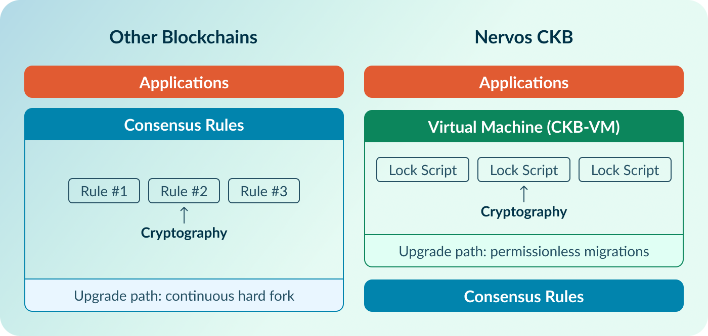
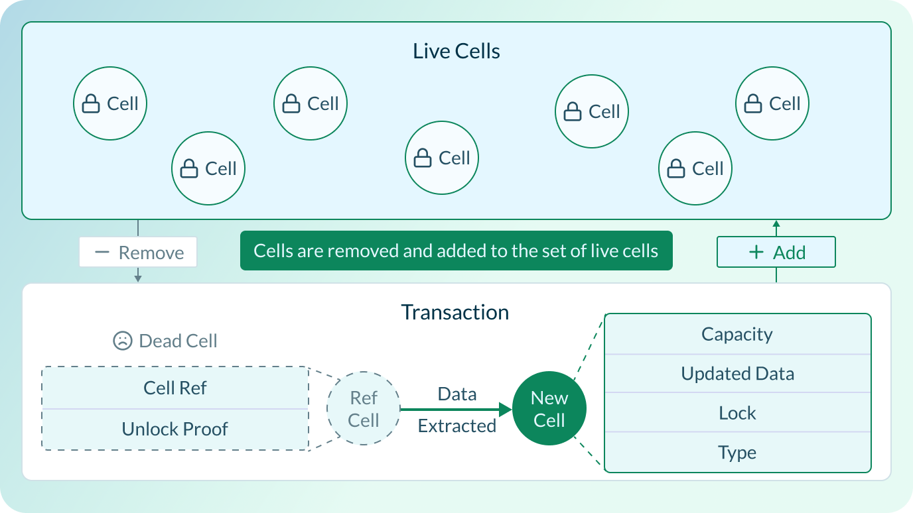
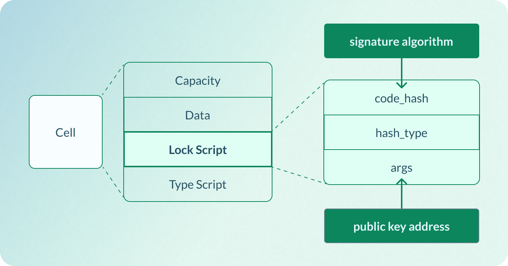

## Key Takeaways

- **Quantum computing threatens the public-key cryptography that most blockchains currently rely on for security.**
- **The real blockchain security problem is not only quantum resistance, but cryptographic rigidity: on most chains, signature schemes are baked into the protocol and difficult to change.**
- **Bitcoin, Ethereum, Solana, and many other chains can support new cryptography only through protocol-level changes that require network-wide consensus and coordination.**
- **CKB is different because transaction authorization is not hardcoded into the protocol as a single native signature rule. Instead, it lives in programmable Lock Scripts, allowing new signature schemes—including post-quantum ones—to be deployed permissionlessly.**
- **This makes CKB the only blockchain architected for true crypto agility.**

Blockchains are often described as trustless systems, but that trustlessness rests on a very specific kind of trust: trust in cryptography.

Every cryptocurrency wallet and transaction ultimately depends on the assumption that certain mathematical problems are infeasible to solve. For most major blockchains today, that means relying on public-key cryptography, especially [elliptic-curve cryptography](https://www.nervos.org/knowledge-base/understanding_ECDSA_(explainCKBot)), to prove that the person authorizing a transaction actually controls the corresponding private key.

That assumption, which has held for decades, is now being threatened by a new kind of machine: the [quantum computer](https://en.wikipedia.org/wiki/Quantum_computing).

Unlike classical computers, which process information using bits that represent either 0 or 1, quantum computers use quantum bits, or qubits, which can represent and manipulate information in fundamentally different ways.

Through properties such as superposition and entanglement, quantum computers can explore certain mathematical structures far more efficiently than classical machines. They are not simply “faster computers” in the ordinary sense. For most everyday tasks, they offer no magical shortcut. But for a narrow class of problems, including the number-theoretic problems behind much of modern public-key cryptography, they could be transformative.

## Why Quantum Computing Threatens Blockchains

A sufficiently powerful Cryptographically Relevant Quantum Computer (CRQC) running Shor’s algorithm could, in principle, derive private keys from exposed public keys. 

For cryptocurrency users, this is not an abstract concern. Public keys are typically exposed when users make peer-to-peer transactions, interact with smart contracts, bridge assets across chains, operate validator infrastructure, or simply reuse addresses. Once exposed, those keys can be harvested and stored by an adversary preparing for a future quantum attack.

The timeline for “Q-Day”, the point at which CRQCs become a practical threat, remains one of the most contentious debates in technology. Estimates vary widely, ranging from several years to several decades. The incentives behind those estimates are, of course, to some degree biased: quantum hardware companies have every reason to emphasize rapid progress, while blockchain communities often have every reason to downplay the urgency of the threat.

What is increasingly difficult to deny, however, is that the timelines are compressing, and blockchains have a serious security problem to solve before the threat becomes real.

## Why Blockchain Cryptography Is So Hard to Change

In ordinary Web2 systems, migrating to post-quantum cryptography can be difficult, but it’s still relatively straightforward. A company can inventory its cryptographic dependencies, rotate keys, update libraries, deprecate vulnerable algorithms, issue new certificates, and push upgrades through a controlled deployment pipeline. The process may be expensive and operationally painful, but the authority to execute the migration is centralized. The organization controls the servers, the software stack, the release process, and the timeline.

Public blockchains do not have that luxury.

A blockchain is not—or at least is not supposed to be—a product controlled by a single operator. It is a decentralized ledger maintained by thousands of independent actors who must agree on the protocol rules. Its cryptography is often embedded at the deepest level—the consensus or protocol layer—determining how these actors distinguish between valid and invalid state transitions.

Changing the cryptography of a blockchain is therefore not as simple as a Web2 software upgrade, but instead a contentious technical and socio-economic event affecting the entire network and ecosystem.

When a signature scheme is baked into consensus, replacing it means changing the rules every [full node](https://www.nervos.org/knowledge-base/difference_between_miner_full_node_(explainCKBot)) uses to recognize a valid transaction. For most blockchains, this requires a protocol-level intervention that the entire ecosystem must coordinate around—wallets, exchanges, custodians, hardware devices, infrastructure providers, developers, and users alike.

That might be tolerable if cryptographic assumptions were permanent, but they are not.

Cryptography has a long history of primitives moving from “secure enough” to “legacy” to “dangerous.” [SHA-1](https://en.wikipedia.org/wiki/SHA-1) was once widely used for digital signatures and certificates before practical collision attacks made it unfit for sensitive or security-critical use. [MD5](https://en.wikipedia.org/wiki/MD5) was widely used for checksums and data integrity, but became unsafe in adversarial settings. [DES](https://en.wikipedia.org/wiki/Data_Encryption_Standard) was once a federal encryption standard; today, its key size is so small that it can be brute-forced with commodity-scale hardware.

The lesson is straightforward: cryptographic assumptions do not last forever. Algorithms age, attacks improve, hardware gets faster, and standards bodies eventually deprecate primitives that earlier generations of systems were built around. The systems that survive these transitions are not simply those using the strongest cryptography at a given moment, but those able to replace it when circumstances change.

For most blockchains, that is precisely where the problem begins.

## **Blockchains And Cryptographic Rigidity**

To understand the crux of the problem, we need to look at where signature verification actually happens.

In most blockchains, signature schemes are not merely wallet-side preferences or replaceable software libraries. Depending on the chain, they may be embedded as precompiled contracts, script opcodes, native account rules, or hardcoded transaction verification logic. In each case, they are deeply tied to the rules the network uses to determine transaction validity.

### Signature Verification in Bitcoin

Bitcoin illustrates the problem clearly.

When a user makes a normal [P2PKH](https://www.nervos.org/zh/knowledge-base/bitcoin_legacy_vs_segwit_vs_taproot_addresses_(explainCKBot)) transaction, their wallet spends one or more [UTXOs](https://www.nervos.org/knowledge-base/utxo_model_explained) by providing two pieces of unlocking data: a public key and a [digital signature ](https://www.nervos.org/knowledge-base/What_is_a_digital_signature_ in_Blockchain_(explainCKBot))produced with the corresponding private key. The transaction is then broadcast to the Bitcoin peer-to-peer network, where each node that receives it validates it before accepting it into its mempool or relaying it further.

“Valid” here means several things: the referenced UTXO must exist and remain unspent, the transaction must not create more bitcoin than it spends, and each input must satisfy the spending conditions of the output it is trying to spend. In a P2PKH transaction, that ultimately comes down to one key question: was this transaction signed by the private key that controls the UTXO?

Bitcoin answers that question through [Script](https://www.nervos.org/knowledge-base/bitcoin_script_(explainCKBot)), a simple stack-based language used to define and evaluate spending conditions. Script is made up of opcodes: operations already defined by the Bitcoin protocol that every validating node executes deterministically during transaction validation.

In a P2PKH spend, the previous output contains a locking script that commits to a public-key hash and ends with OP_CHECKSIG, the opcode responsible for signature verification. To spend it, the transaction provides a signature and public key. Bitcoin Script checks that the public key matches the hash committed in the UTXO, then uses OP_CHECKSIG to verify that the signature is valid for the transaction under that public key. In traditional P2PKH, that means checking the signature against Bitcoin’s native ECDSA/[secp256k1](https://www.nervos.org/knowledge-base/secp256k1_a_key algorithm_(explainCKBot)) rules.

This is the essence of Bitcoin’s cryptographic rigidity: the user’s wallet creates the signature, but the protocol defines which signatures the network recognizes as valid. A signature produced with another scheme—BLS, SPHINCS+, ML-DSA, or anything else—would not satisfy the existing P2PKH rules, causing the network to reject the transaction.

That is the key point: ECDSA/secp256k1 is part of the validity logic enforced by every full node. To enable Bitcoin to natively recognize a different signature scheme, the network must change the rules that nodes enforce. That can happen by introducing new spending rules through a soft fork, as Taproot did for Schnorr, or by changing existing rules through a hard fork.

### Signature Verification in Ethereum

Ethereum shows the same rigidity through a different architecture.

Unlike Bitcoin, Ethereum is [account-based](https://www.nervos.org/knowledge-base/utxo_vs_account_based). A user does not spend UTXOs locked by scripts; they control an externally owned account, or EOA, and submit cryptographically signed transactions that update Ethereum’s global state. In Ethereum’s native account model, state-changing transactions originate from EOAs, and EOAs are controlled by private keys.

When a user sends an Ethereum transaction, their wallet signs it with the private key associated with their EOA. The transaction includes the usual execution fields—recipient, value, nonce, gas parameters, input data—and a signature proving that the account owner authorized it.

Once the transaction is broadcast, Ethereum nodes check that it is well-formed, that the nonce is correct, that the account can pay for gas, and that the signature is valid. To verify authorization, the protocol uses the signature to recover the sender, derive the sender’s address, and confirm that the transaction came from the claimed EOA.

This native signature check is part of Ethereum’s built-in transaction verification rules. The user’s wallet creates the signature, but Ethereum’s protocol defines what the network recognizes as a valid transaction from an EOA. At that layer, validity depends on a signature that satisfies Ethereum’s ECDSA/secp256k1 rules.

That is Ethereum’s version of cryptographic rigidity. A user cannot simply decide that a normal EOA transaction will be authorized by a BLS, Ed25519, SPHINCS+, or ML-DSA signature instead. If the transaction does not satisfy Ethereum’s native signature rules, nodes reject it before it ever reaches application logic. As with Bitcoin, the signature scheme is not merely a wallet preference; it is part of the protocol’s transaction-validity machinery.

### Crypto-Agility is The Key

The same pattern appears across much of the industry.

Many account-based chains define transaction authenticity at the protocol level. Solana, for example, uses Ed25519 signatures for native transaction signing and also offers built-in verification programs for schemes such as secp256k1 and [secp256r1](https://www.nervos.org/knowledge-base/what_is_secp256r1). Those additional programs are useful for application logic, cross-chain bridges, and custom protocols, but they do not make native transaction authentication freely pluggable. The base transaction pipeline still defines what kind of signature ordinary signers must provide—and the native/default schemes used here are not post-quantum secure.

That is why blockchain quantum resistance or quantum readiness is usually framed too narrowly.

The question is not whether a blockchain can eventually support a post-quantum signature scheme, but whether it can change its cryptographic primitives without disruptive protocol upgrades such as soft or hard forks.

Can different signature schemes coexist? Can users migrate gradually? Can developers deploy new verification logic without waiting for the base protocol to change? Can applications experiment with stronger cryptography before the entire network standardizes around it?

In other words, the real issue is not just post-quantum cryptography.

The real issue is crypto agility.

## Why CKB Is Different

This is where Nervos CKB stands apart.

On most blockchains, cryptographic primitives are baked deep into the protocol. On CKB, transaction authorization is programmable: the logic that decides whether a Cell can be spent lives in a Lock Script, not in a fixed native account model, opcode, or precompile.

CKB was designed around the Cell Model, a generalized version of Bitcoin’s UTXO model. In Bitcoin, UTXOs represent spendable coins. In CKB, Cells are generalized state containers. Like UTXOs, Cells are immutable once created: they are not edited in place. To update state, a transaction consumes existing live Cells and creates new Cells with updated data.

This means a CKB transaction is a state transition: old Cells are consumed, new Cells are created, and the network validates whether that transition is allowed.

CKB performs that validation by executing the Scripts associated with the Cells involved in the transaction. There are two main kinds of Scripts: **Lock Scripts** and **Type Scripts**.

A Lock Script controls ownership. It determines whether a Cell can be used as an input in a transaction. In ordinary payment terms, this is the authorization layer: who is allowed to spend this Cell?

A Type Script controls application logic. It defines the rules for creating, transforming, or destroying Cells of a certain type. In smart contract terms, for example, a Type Script can enforce token issuance and transfer rules, while the Lock Script still determines who owns the specific Cell.

In short, Lock Scripts answer “who can spend this Cell?” while Type Scripts answer “how is this Cell allowed to change?”

When a user spends a CKB Cell, the transaction includes the Cell as an input and provides witness data. That witness can contain a signature, public key, proof, or any other data the Lock Script expects. During validation, the node executes the referenced Lock Script in [CKB-VM](https://www.nervos.org/knowledge-base/comparing_blockchain_virtual_machines), CKB’s RISC-V virtual machine. The Lock Script reads the relevant transaction data, reads the witness, applies its verification logic, and returns success or failure.

If the Lock Script returns success, the Cell is unlocked. If it fails, the transaction is invalid.

The crucial point is that the CKB protocol does not need to know in advance whether the Lock Script is verifying ECDSA, Schnorr, multisig, WebAuthn, a zero-knowledge proof, SPHINCS+, ML-DSA, or another future primitive. From the network’s perspective, these are not new native account types requiring new protocol rules. They are different pieces of executable validation logic running in the same VM.

That is why CKB can support new cryptographic primitives without base protocol changes. Instead of redefining what every node considers a valid native signature, developers can deploy new verification logic as Lock Scripts, and users can migrate to Cells secured by those Scripts at their own pace.

This also means different cryptographic schemes and authorization policies can coexist on CKB simultaneously. One Cell can be locked by the default secp256k1-style Lock Script. Another can be locked by a multisig Script. Another can be locked by a post-quantum Script.

Most importantly, the network does not need to undergo a protocol upgrade just to introduce a new signature scheme. As long as the verifier can be implemented as a CKB Script and executed within CKB-VM’s constraints, it can be deployed permissionlessly at the script layer.

This is what genuine crypto agility looks like in the blockchain context.

CKB already has a SPHINCS+ post-quantum Lock Script deployed on-chain, allowing users to experiment with quantum-resistant asset protection today. But the larger point is architectural: CKB is not limited to SPHINCS+, or to any single post-quantum scheme. When the cryptographic landscape changes again, CKB can adopt new signature schemes through new Lock Scripts deployments rather than disruptions to the base protocol.

That is what makes CKB more than merely quantum-resistant today, but quantum-ready forever.

## **FAQ**

### **What is crypto agility in blockchain?**

Crypto agility is the ability of a blockchain to adopt, replace, or support new cryptographic primitives quickly and easily, without major network disruptions, such as soft or hard forks.

### **Why does quantum computing threaten blockchains?**

A sufficiently powerful quantum computer running Shor’s algorithm could derive private keys from exposed public keys, undermining the cryptography used to prove ownership of blockchain assets.

### **Are Bitcoin and Ethereum quantum-resistant?**

Not today. Bitcoin and Ethereum currently rely heavily on elliptic-curve cryptography, which is vulnerable to attacks by sufficiently powerful quantum computers.

### **Why is changing blockchain cryptography difficult?**

On most blockchains, signature schemes are part of transaction validity rules. Changing them requires protocol-level changes, which in turn necessitate network- and ecosystem-wide consensus and coordination that can take years.

### **How is Nervos CKB crypto-agile?**

CKB moves transaction authorization into programmable Lock Scripts. Developers can permissionlessly deploy new cryptographic verification logic as scripts, and users can migrate assets to Cells secured by those scripts at their own pace.

### **Is CKB quantum-resistant today?**

Yes. CKB already has a SPHINCS+ post-quantum Lock Script deployed on-chain, and Quantum Purse provides a self-custodial wallet built around that script, allowing users to secure their assets against potential quantum attacks today.

### **What is Q-Day?**

Q-Day is the point at which cryptographically relevant quantum computers become powerful enough to break widely used public-key cryptography, including the signature schemes that secure most blockchain wallets and transactions.

### **What is SPHINCS+?**

SPHINCS+ is a post-quantum digital signature scheme based on hash functions. It was standardized by NIST as SLH-DSA and is designed to remain secure against both classical and quantum attacks.
