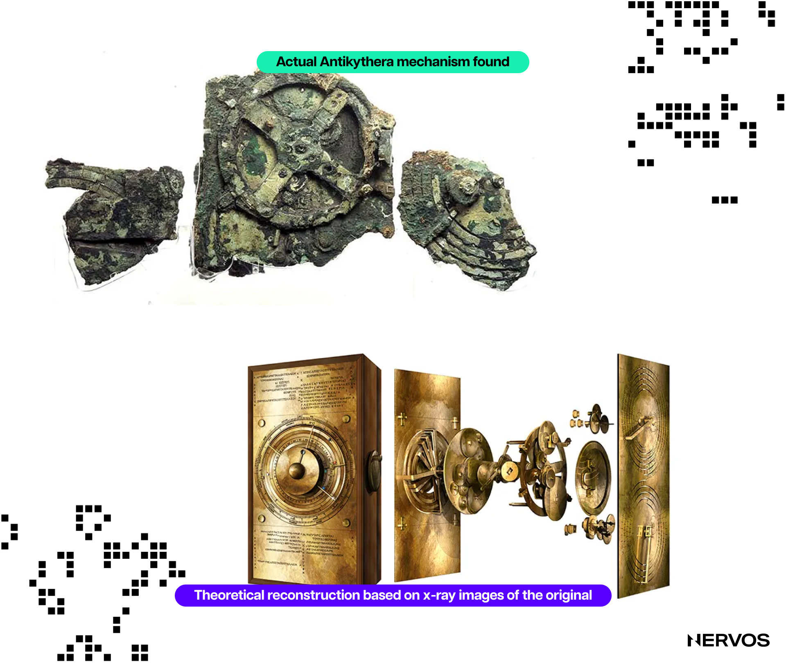
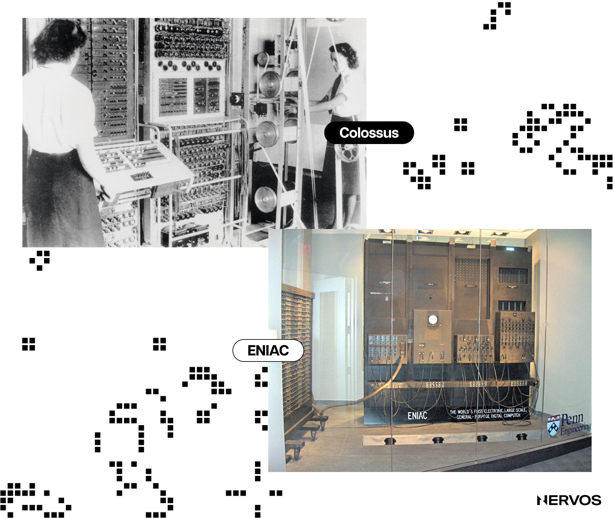
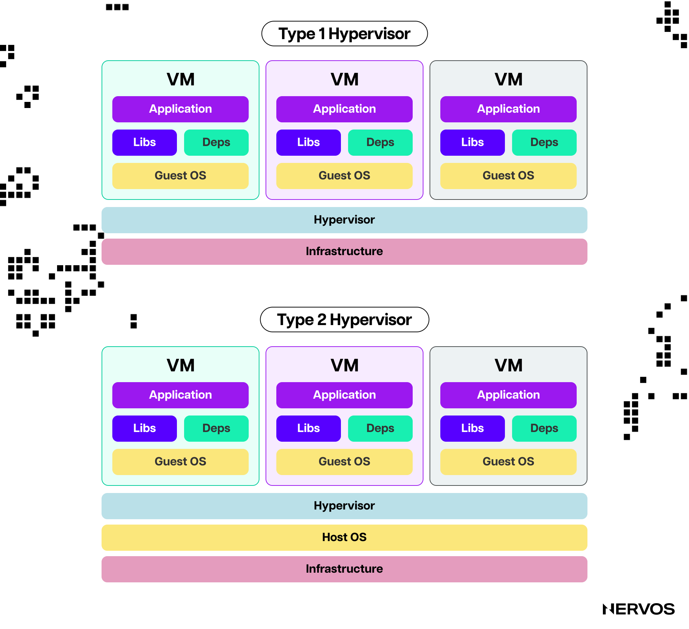
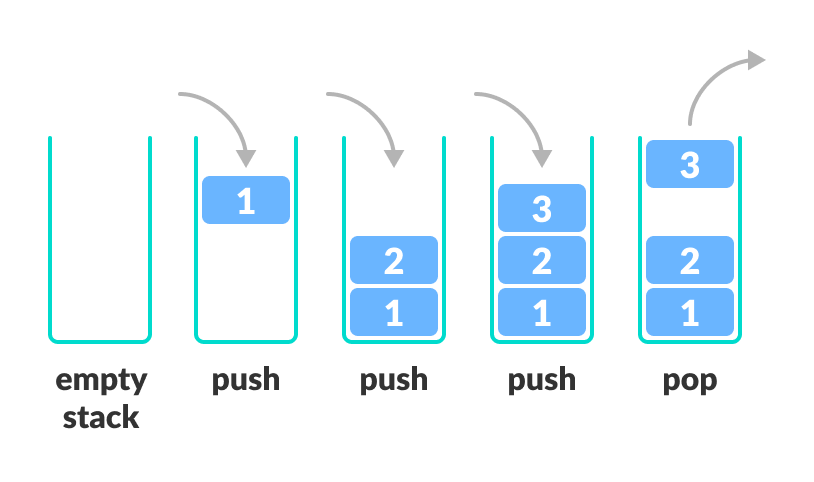
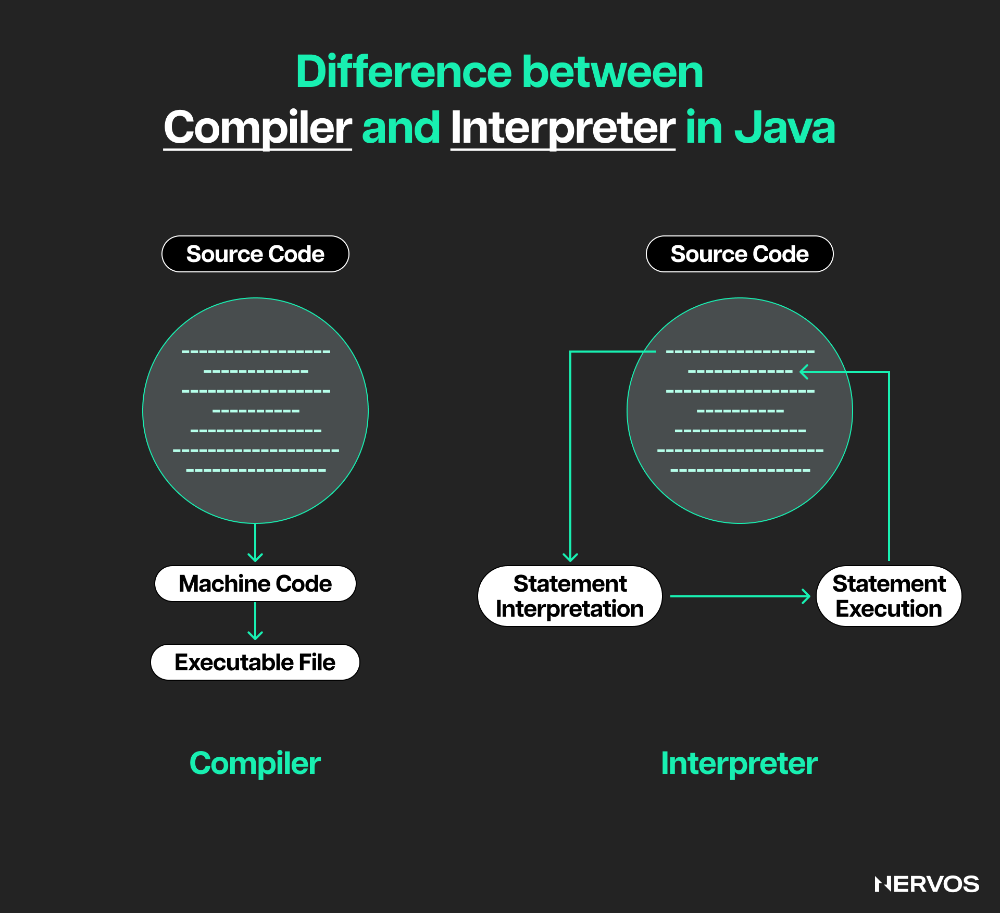
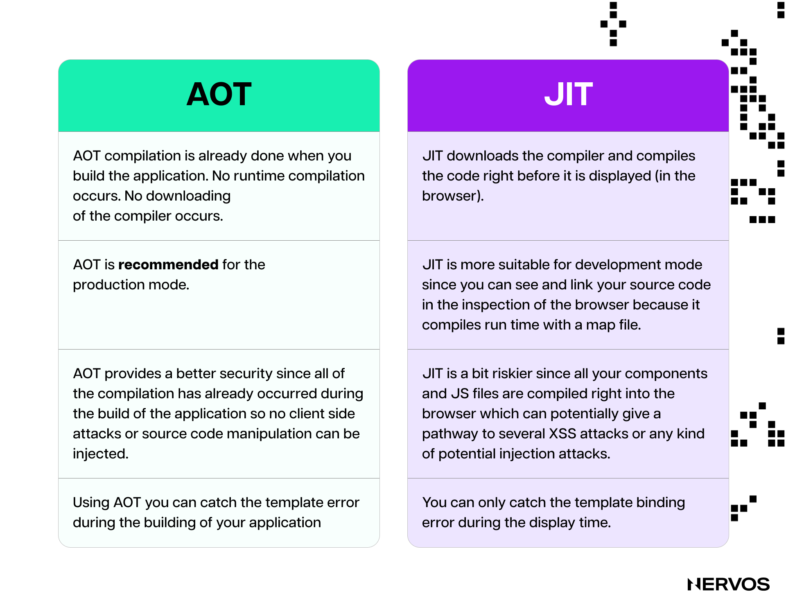
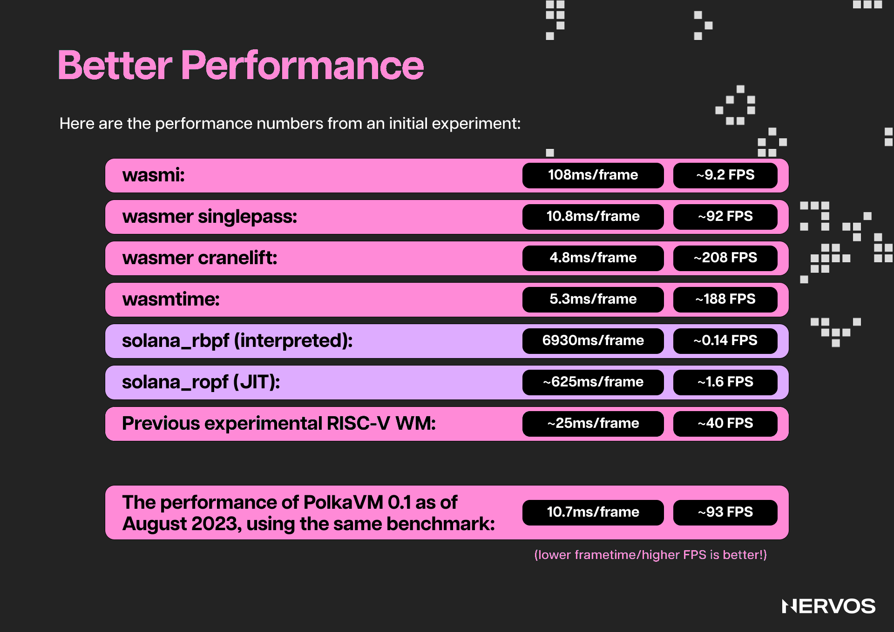

Blockchain [virtual machines (VMs)](https://www.nervos.org/knowledge-base/what_is_a_VM_in_blockchain_(explainCKBot)) are the backbone of decentralized computing, enabling smart contract execution and decentralized application development across various blockchain platforms. 

These VMs, such as the Ethereum Virtual Machine (EVM), Solana's Sealevel, Polkadot's [WebAssembly (WASM)](https://www.nervos.org/knowledge-base/what_is_webassembly_(explainCKBot)), and Nervos’ CKB-VM, provide the environment in which code runs on the blockchain. Comparing these virtual machines involves evaluating their design principles, performance, scalability, and security features to understand their strengths and weaknesses and how they influence the ecosystem's functionality and developer experience.

## What are Virtual Machines, and Why Do Blockchains Need Them?

When people think of computers, they typically think of personal desktop computers or laptops. And while these devices are indeed computers, non-tech-savvy people may find it easier to understand _virtual_ machines if they consider computers more conceptually.

Conceptually, a computer is a _system_ that performs calculations and processes data according to a set of instructions. This concept is not limited to any specific physical form and can exist in various embodiments, including mechanical, electronic, digital, and virtual forms. 

In fact, the earliest computers were mechanical, using gears, levers, and other mechanical components to manipulate data and execute programs. The [Antikythera](https://en.wikipedia.org/wiki/Antikythera_mechanism) mechanism, a hand-powered mechanical model of the Solar System that used gears to predict astronomical positions and eclipses decades in advance, is believed to be the oldest mechanical computer, dating back to around 100 BCE.

In the 19th century, Charles Babbage conceptualized and partially built the [Analytical Engine](https://www.britannica.com/technology/Analytical-Engine#:~:text=The%20Analytical%20Engine%20was%20to,alone%20attempted%20to%20build%20one.). It was an attempt at creating a general-purpose mechanical computer, complete with memory, an arithmetic logic unit, and control flow through conditional branching and loops. Historians believe that the first computer program ever written was authored by English mathematician [Ada Lovelace](https://en.wikipedia.org/wiki/Ada_Lovelace), who detailed in a note a method for calculating [Bernoulli numbers](https://en.wikipedia.org/wiki/Bernoulli_number) using Babbage’s Analytical Engine.

_Reconstruction of Babbage’s Analytical Engine. (Source: [Britannica.com](Britannica.com))_

While Babbage’s machine was never completed in his lifetime, his work laid the groundwork for modern computing, which saw computers transition from mechanical to electronic. The first electronic computers, the [Colossus](https://en.wikipedia.org/wiki/Colossus_computer) and [ENIAC](https://en.wikipedia.org/wiki/ENIAC), were developed during and after World War II. They used vacuum tubes as the primary switching elements and later transistors to perform calculations much faster than their mechanical predecessors.

### Modern-day Computers and Virtual Machines

Modern-day digital computers are built using integrated circuits that contain millions or even billions of transistors on a single silicon chip and are capable of performing billions of calculations per second. Beyond their speed, modern-day computers are general-purpose or [Turing-complete](https://en.wikipedia.org/wiki/Turing_completeness#:~:text=In%20colloquial%20usage%2C%20the%20terms,purpose%20computer%20or%20computer%20language.), meaning they can execute any algorithm and perform complex mathematical operations.

This somewhat longer introduction to computers should help the non-tech-savvy person make a clearer distinction between physical hardware, such as the physical device that is the desktop computer or laptop, and the abstract concept of the computational machine—the system that performs calculations and processes data according to a set of instructions, which can run or be implemented on different hardware.

To that point, a virtual machine (VM) is a software-based emulation of a computer system. It provides the functionality of a physical computer but runs within another operating system. In a more conceptual sense, a _virtual_ machine is a computer _within a computer_. This means that the same physical device, e.g., a laptop, can simultaneously run multiple computational machines, i.e., virtual machines or "emulated computers,” complete with their own virtualized CPU, memory, storage, and operating system. 

One of the benefits of VMs is that they abstract the hardware layer and provide a consistent environment for software execution regardless of the underlying hardware. Moreover, VMs provide an isolated execution environment, meaning that issues in one VM do not affect other VMs or the host computer.

The key components of a VM include the [hypervisor](https://en.wikipedia.org/wiki/Hypervisor), the guest operating system (the OS that runs inside the virtual machine), and the host OS (the OS on which the hypervisor runs.) The hypervisor is the software that integrates the host’s physical hardware and the VM's virtual "hardware," managing both to allow multiple VMs or computers to run on the same hardware.

The hypervisor’s primary role is to divide the host machine's physical resources, like the CPU and memory, among the virtual machines. To the guest operating system running inside the VM, these virtual resources look and act just like real hardware. When the guest operating system and its applications run, they send instructions to the virtual hardware. The hypervisor then intercepts these instructions and translates them into instructions that the host's real hardware can understand and execute.

This means that a MacBook running MacOS could run both a Windows VM and a Linux VM simultaneously, allowing the user to, for example, play a game available only on Windows computers on hardware natively built to run MacOS. Naturally, this approach may result in reduced game performance compared to running the same game on a native Windows system—which leads to the next point.

Depending on their design, different computing machines and different hardware have different capabilities, both in terms of speed or performance and in “breadth” or ability to compute various programs. 

For example, a calculator is technically a simple computer that is designed only to perform arithmetic operations on numbers. Implementing a calculator on the most powerful hardware will only make it faster, not turn it into a general-purpose computer capable of running Dota, for example. On the other hand, not all general-purpose computers are equal, capable of running the same programs, or natively compatible with all hardware. This point will become more apparent later on when we explore the differences between different blockchain VMs.

### Why do Blockchains Need VMs?

In theory, smart-contract-enabled blockchains don't necessarily need VMs. Instead, they could be designed to execute smart contracts natively or run them directly on the node's hardware without an intermediary VM layer. 

In this hypothetical native execution model, smart contracts could be written in a high-level programming language like Python, which blockchain nodes directly support. Then, instead of compiling this code into bytecode for a VM, a Python interpreter running on each node would execute the smart contracts written in Python. Alternatively, if the blockchain were designed to support a language like C++, the nodes could compile the smart contract code into machine code and execute it directly.

However, this approach would lead to severe issues that are unacceptable to blockchains. 

Blockchains are deterministic state machines or, more broadly, "stateful systems." This means they are systems configured to record all events and user interactions on replicated immutable ledgers. The retained information on the ledgers is defined as the "state" of the blockchain, and every time a new block is added to the blockchain, its state changes.

However, doing complex general-purpose computation on blockchains is tricky because blockchains decentralize things by replication, not by distribution. This means that each node in the network does the same computation (e.g., executes the same smart contract) and needs to arrive at the same state for the blockchain network to achieve consensus. For this to happen, blockchains’ computation and state transitions must be deterministic, which means that, assuming the same rules, the same inputs must lead to the same computational outputs or states across all nodes.

Executing code natively is problematic in this scenario because computation is an unpredictable process. If the nodes execute the same smart contract on different software and hardware or essentially on different computing machines, they could arrive at different states, undermining the fundamental principle of blockchain consensus. If nodes cannot agree on the state resulting from a transaction, they cannot reach consensus, which could lead to forks and instability in the network.

Consider a scenario where a smart contract is designed to use integer arithmetic (blockchains avoid floating-point arithmetic due to its non-deterministic nature) to calculate a simple token transfer between two accounts. When transferring tokens, a smart contract deducts the number of tokens from the sender’s balance and adds the same amount to the recipient’s balance. An example of such a smart contract written in Solidity might look like this:

This code first checks whether the sender has sufficient tokens to complete the transfer. If the sender's balance is adequate, the function subtracts the specified amount from the sender's balance and adds it to the recipient's balance. These operations—subtraction from the sender and addition to the recipient—are performed using integer arithmetic. This ensures that the transfer is executed precisely, without the rounding errors associated with floating-point arithmetic.

However, if the blockchain network's nodes don't use a VM but instead execute the Solidity code natively, how they handle the integer arithmetic can vary significantly depending on the hardware and software configurations each node uses.

Suppose Node A operates on a 32-bit architecture and processes token transfers using 32-bit signed integers (`int32`). If it attempts to process a token transfer where the receiver’s balance is at the maximum value that a signed 32-bit integer can hold, adding tokens could cause an overflow. For instance, if a user’s balance is 2,147,483,647 tokens (or 2^31-1, the maximum for a signed 32-bit integer), and they received one token from an airdrop, their balance should now be 2,147,483,647 + 1 = 2,147,483,648. However, since this number exceeds the maximum value for a 32-bit signed integer, adding 1 to 2,147,483,647 would result in an overflow, causing the balance to wrap around to a large negative number. Due to how binary arithmetic handles signed integers, in a 32-bit signed integer system, this operation wraps around to −2,147,483,648, the minimum value for a 32-bit signed integer.

.png "image_tooltip")

_https://algodaily.com/lessons/understanding-integer-overflow-and-underflow_

In contrast, Node B might be running on a 64-bit architecture with a more robust handling of integer operations. Node B's environment can accommodate much larger numbers without causing overflow in similar arithmetic operations, meaning the result of adding 1 to 2,147,483,647 would actually be 2,147,483,648.

This example illustrates how the differences in how nodes' computing machines handle arithmetic can lead to inconsistent results. Without proper overflow checks, Node A might incorrectly allow a transfer that leaves the sender's balance in an invalid state. At the same time, Node B would’ve correctly calculated the user’s balance and arrived at a valid state.

This is where VMs, like the Ethereum Virtual Machine, provide significant advantages. The EVM standardizes the execution of smart contracts by interpreting bytecode consistently across all nodes. It ensures that operations such as integer arithmetic are handled uniformly, with explicit rules for managing overflow, underflow, and other potential issues. By isolating the execution environment and abstracting away differences in hardware and software, the EVM ensures that smart contracts produce the same results on every node, maintaining the consistency and reliability of the blockchain.

## EVM

As things currently stand, the most popular smart contract execution environment is the [EVM](https://ethereum.org/en/developers/docs/evm/). It was first introduced by Ethereum and later adopted by many other blockchains that wanted to leverage the EVM's first-mover advantage in building out a comprehensive toolchain and amassing a large community of smart contract developers. However, despite its advantages and innovations, the EVM comes with some inherent challenges and limitations, especially amidst a growing demand for more advanced and scalable decentralized applications.

Regarding its architecture, the EVM is a _stack-based state machine_ that _interprets_ and executes _bytecode_ instructions. That's a lot of technical terms, so let's break that definition down:

A **_stack-based architecture_** is a type of computer architecture that uses a stack to manage the data required during execution. A stack is a linear data structure that operates on a [Last In, First Out (LIFO)](https://blog.bitsrc.io/mastering-stacks-and-queues-understanding-lifo-and-fifo-data-structures-531c8d17194c) principle to store temporary data while executing instructions. More specifically, the EVM uses the stack to hold operands and operation results as it processes smart contract code. 

For instance, when executing an addition operation (0x01 ADD), the EVM pops two values from the stack, adds them, and pushes the result back onto the stack (the "push" and "pop" are fundamental stack operations.) This mechanism simplifies the execution model but can introduce inefficiencies compared to other architectures, such as register-based systems (more on that later).

Important to note here is that the EVM operates with a stack with specific constraints: a maximum depth of 1024 items and a native data size of 256-bit [words](https://en.wikipedia.org/wiki/Word_(computer_architecture)) (standard unit of data for the processor design). The stack depth determines how many items can be held and manipulated during the execution of a smart contract, while the word size defines a standard for the size (in bits/bytes) of each stack item, typically used as an operand for computations or as a temporary result. The native data size of the EVM means that all data items on the stack are represented as 256-bit integers, even if the actual data might be smaller. 

These limitations show some of the first cracks in EVM's architectural choices. 

Namely, the limited stack depth of 1024 items significantly affects the complexity of smart contracts that can run on Ethereum. Complex smart contracts often rely on multiple layers of function calls, each of which may require pushing data onto the stack. For instance, recursive functions or functions with deep call hierarchies can quickly consume stack space. If a contract tries to exceed the 1024-item limit, it will result in a stack overflow, causing the transaction to fail.

The 256-bit word size is also problematic due to its "incompatibility" with most modern CPUs, which are designed with word sizes of 32 or 64 bits. When a processor needs to handle data larger than its native word size (such as the EVM's 256-bit words), it must break the task into smaller parts. For example, for a 64-bit processor, a 256-bit operation would typically be broken down into four 64-bit operations, significantly increasing the computational overhead. Considering that Ethereum nodes run on 64-bit processors, EVM's reliance on 256-bit operations, while necessary for certain blockchain functionalities, results in increased computational effort, longer execution times, and higher resource consumption, ultimately translating into excessive fees for users due to this inefficiency.

More importantly, the integer underflow and overflow issues arising from EVM's stack depth and word size choice can generate serious smart contract vulnerabilities. In fact, Ethereum's history is loaded with instances where malicious actors have exploited such vulnerabilities, leading to substantial losses in user funds. This[ article](https://dreamlab.net/en/blog/post/ethereum-smart-contracts-vulnerabilities-integer-overflow-and-underflow/) provides an excellent overview of this specific issue.

Moving on, a **_state machine_** is a computational model used to design a system that transitions between different states based on inputs and predefined rules. In the context of the EVM, a state represents the complete snapshot of the Ethereum blockchain at a given time, including all account balances, contract storage, and code. The EVM transitions between states by executing transactions. Each transaction can alter the state by changing account balances, executing smart contract code, or modifying contract storage. These state changes are deterministic, meaning that given the same initial state and inputs, the EVM will always produce the same final state.

The EVM operates as a state machine by interpreting and executing bytecode instructions to transition from one state to another. **_Bytecode_** is a form of intermediate code that is more abstract than machine code (binaries, or 1s and 0s) but lower-level than high-level source code. Bytecode is designed to be executed by a virtual machine rather than directly by the hardware.

When a smart contract is deployed on Ethereum, its source code (written in a high-level language like [Solidity](https://soliditylang.org/) or [Vyper](https://docs.vyperlang.org/en/stable/)) is compiled into EVM bytecode, which is stored on the blockchain. This bytecode is a low-level, stack-based language designed explicitly for the EVM. It consists of a series of instructions ([opcodes](https://en.wikipedia.org/wiki/Opcode)) that the EVM needs to execute.

Regarding smart contract execution, the EVM functions as an **_interpreter_** for EVM bytecode, representing another significant drawback. An interpreter is a type of program that executes code directly by reading and performing each instruction line by line without converting it to machine code ahead of time (compilation). Instead of converting the bytecode into native machine code (which is directly executable by the CPU), the EVM reads each opcode, translates it into a series of lower-level operations, and executes these operations using the host machine's resources. Naturally, this interpretation process adds significant overhead and is slower (in some cases, orders of magnitude slower) than native execution.

Because running EVM nodes is computationally expensive, Ethereum users must pay or compensate Ethereum validators for every resource they consume, including computation, bandwidth, and storage. The computational cost of smart contracts is represented through the fundamental unit called "gas." Gas, or the price of smart contract execution, is calculated before each operation. Every opcode has either a fixed or a dynamic cost, depending on its computational complexity. 

The EVM uses a gas cost table defining each opcode's gas cost. This table is part of the Ethereum protocol and ensures consistent gas calculation across all nodes. If a transaction runs out of gas before completion (the EVM subtracts gas after executing each opcode), it halts and reverts to prevent excessive resource consumption. In this case, the transaction fails, and the state reverts to its old pre-transaction state, while the gas used up to this point is still consumed and paid for by the user. 

While EVM's gas model is brilliant, allowing—for the first time—for Turing-complete computation on a fully decentralized VM, it does have its issues. Namely, it's difficult to design a proper gas computation method for different EVM opcodes because each opcode performs different tasks with varying computational complexity and resource requirements. This means that the gas cost calculation in the EVM is sub-optimal, with users paying what is only an approximation of the resources used for execution. Other blockchain VMs, like the CKB-VM, have improved on this issue by utilizing a different VM design.

Finally, one of EVM's biggest limitations is its rigidity or lack of flexibility, which has prompted many newer blockchains to adopt alternative VMs. More specifically, the EVM is designed with fixed precompiles hardcoded into it. While this benefits computational efficiency, especially for more computationally intensive tasks like cryptographic operations such as hashing, hardcoding precompiles also means that they cannot be easily modified, extended, or replaced by newer, more efficient algorithms. This rigidity restricts developers to the predefined set of operations, limiting innovation and adaptation to evolving computational needs. Adding or changing precompiles in the EVM requires a hard fork, a complex and contentious process requiring consensus from the entire Ethereum community.

Beyond precompiles, the EVM's narrow support for high-level programming languages further underscores its lack of flexibility. Currently, Solidity and Vyper are the primary languages used to write smart contracts that compile to EVM bytecode. While both languages are well-suited for Ethereum's needs, this limited support constrains developers who might prefer other languages or who wish to integrate more diverse programming paradigms into their smart contracts. The need to compile these languages into the EVM's custom bytecode format means that any new language targeting the EVM requires the development of a bespoke compiler and toolchain, which is very difficult to create and places the burden of maintenance solely on the Ethereum community.

For these and many other reasons, even the Ethereum developer community once considered upgrading the EVM by switching to a subset of WebAssembly (WASM). A 2015 [EIP](https://github.com/ethereum/EIPs/issues/48) states: 

_“To truly distinguish Ethereum as the World Computer, we need to have a performant VM. The current architecture of the VM is one of the greatest blockers to raw performance. Being stack-based and the 256-bit word size make translation from EVM opcodes to hardware instructions more difficult than needed._

_With an architecture that provides a closer mapping to hardware, the VM will have a considerably enhanced performance which will effectively open the door to a much wider array of uses that require a much higher performance/throughput. Also, by choosing a common and more standardized architecture, anyone will be able to compile C/C++, Solidity (, etc.) once, and the compiled code will run in multiple environments. Using the new Assembly standard will make running a program either directly on Ethereum, on a cloud hosting environment, or on one's local machine - a frictionless process.”_

## WebAssembly (WASM)

[WASM](https://www.nervos.org/knowledge-base/what_is_webassembly_(explainCKBot)) is a binary instruction format designed for executing code on the web at near-native speed. Released in 2017, it was developed by a consortium that included major players like Google, Mozilla, Microsoft, and Apple. It allows developers to write code in high-level languages, including C, C++, and Rust, which can then be compiled into this compact binary format.

This format is designed to run efficiently on various platforms and is independent of the programming languages used to create it. In simple terms, WASM serves as a compilation target for high-level languages, enabling them to run on any platform that supports the WASM runtime. 

Since the term WASM is often used more loosely to mean a WASM VM, it’s worth distinguishing the two to avoid confusion. Namely, WASM itself is the format for the compiled code—it’s the “what” that is being executed. It provides a way to package and deliver binary instructions that can be run on any WASM-compatible environment. On the other hand, a WASM VM is the “how”—it’s the runtime that actually executes the WASM code. The VM provides the necessary infrastructure to load, interpret, and run the WASM binaries, managing aspects like memory allocation, security, and integration with host system capabilities.

WASM VMs share many features with the EVM, including deterministic execution (typically excluding floating-point arithmetic to ensure this) and isolation or sandboxing. Newer smart contract platforms like Polkadot, Cosmos, NEAR, MultiverseX, ICP, Radix, EOSIO, and others have chosen WASM for their VMs due to its many advantages over EVM.

Namely, unlike EVM’s instruction set, which is relatively high-level, abstracting various operations into more complex instructions that require additional overhead to decode and execute, WASM is designed to be a low-level, efficient format that translates more directly into the machine code understood by CPUs. This design reduces the execution overhead, as less translation is required between the bytecode and the hardware-level instructions. In practice, this means that WASM VMs can execute code at near-native speeds, which is critical for the performance-intensive operations typical in blockchain applications.

Moreover, unlike the EVM, which operates primarily through interpretive execution (executing each instruction in the bytecode one at a time), WASM VMs can utilize Just-In-Time ([JIT](https://en.wikipedia.org/wiki/Just-in-time_compilation)) and Ahead-Of-Time ([AOT](https://en.wikipedia.org/wiki/Ahead-of-time_compilation)) compilation to convert WASM bytecode into native machine code at runtime. JIT and AOT compilation can offer an order of magnitude faster execution times than line-by-line interpretation. Beyond this, JIT and AOT compilation allows the WASM VM to apply various runtime optimizations—which aren’t possible with interpretation in the EVM— tailoring the machine code to the specific hardware it runs on, which can result in even more efficient execution.

Furthermore, WASM VMs utilize standard 32 and 64-bit word sizes, which match the capabilities of modern processors. This alignment with native machine word sizes allows WASM to leverage the full power of the host’s CPU, resulting in more efficient memory and storage usage, no stack overflow and underflow issues, and, ultimately, much faster and more efficient smart contract execution. This efficiency also means that WASM VMs don’t have to rely on precompiles like the EVM. Instead, developers can implement and use any algorithms or crypto primitives as smart contracts without needing network-wide permission.

Beyond mere performance, WASM also offers much broader support for high-level languages than EVM. This capability results from WASM's design as a compilation target for numerous languages supported by modern compiler infrastructures like the Low-Level Virtual Machine ([LLVM](https://llvm.org/)). LLVM is a highly modular and reusable compiler and toolchain that supports many languages' frontends and targets various instruction sets. 

For instance, Rust, a language popular for its performance and safety features, uses LLVM to compile down to WASM. Similarly, C and C++ can be compiled to WASM using [Emscripten](https://en.wikipedia.org/wiki/Emscripten). AssemblyScript, which is syntactically similar to TypeScript and JavaScript, allows developers familiar with web technologies to write WASM modules. This flexibility makes it easier for a broader range of developers to enter the blockchain space, as they can use languages they are already familiar with.

Finally, WASM brings massive interoperability benefits because it was designed to be platform and language-agnostic. In the blockchain context, this means that smart contracts compiled to WASM can theoretically run on any environment that supports a WASM runtime with minimal modifications. For example, Polkadot uses a WASM-based VM to execute smart contracts on its parachains while allowing the parachains to implement their own VM configurations (all sharing WASM as the standard execution environment). This means that smart contracts written for one parachain can easily be ported to another parachain with minimal modifications. NEAR, another Layer 1 that uses WASM as its execution environment, has [stated](https://innakondratova.medium.com/smart-contracts-on-near-protocol-a-developers-guide-668cb38355cf) this in its technical documentation: \
 \
_“The use of WebAssembly also means that smart contracts on Near are cross-platform. They can be executed on any machine that supports WASM, making Near smart contracts highly portable and flexible.”_

In conclusion, WASM VMs offer significant performance, security, and flexibility improvements compared to EVM. However, WASM VMs aren’t the be-all and end-all of blockchain VMs, especially when RISC-V-based VMs are gaining more recognition.

## CKB-VM (RISC-V)

[RISC-V](https://www.nervos.org/knowledge-base/what_is_riscv_(explainCKBot)) is an open-source, simple, and extensible Instruction Set Architecture (ISA) designed to be an efficient alternative to the more complex and often proprietary ISAs that dominate the market, such as x86 and ARM. 

RISC-V stands out due to its minimalist approach, with its base set comprising only 47 instructions, significantly less than the hundreds or thousands in other ISAs. It is also modular, meaning developers can customize the ISA by adding extensions that support floating-point operations, atomic operations, and vector processing, among others, to suit their specific needs. Its straightforward design translates into faster execution of instructions and lower overhead in both hardware and software. Most importantly, unlike WASM, which has several advanced features and extensions still under continuous development, the RISC-V ISA has a finalized, stable, and matured base instruction set, which makes it ideal for blockchain development.

To that point, a RISC-V-based blockchain VM, like the [CKB-VM](https://www.youtube.com/watch?v=90GHScLe5U8) of the Nervos Network, operates by executing smart contract code compiled into RISC-V instructions. This approach allows for a highly efficient, isolated, and secure execution environment tailored to blockchains' deterministic and resource-constrained nature. Before diving deeper into CKB-VM, it is worth going over why Polkadot is building its new PolkaVM using RISC-V.

Last year, Polkadot developers [outlined](https://forum.polkadot.network/t/exploring-alternatives-to-wasm-for-smart-contracts/2434) their motivations for moving away from WASM and choosing RISC-V above other ISAs and execution environments for their smart contract platform. Some of their main issues with WASM (which Polkadot is currently using) were: (i) simpler than other ISAs like x86 but not simple enough for their needs; (ii) complicated to write a performant single-pass JIT compiler; (iii) didn't JIT compile fast enough; and (iv), the MVP variant of WASM that excludes all the extra features that blockchains don't need runs a risk of not being supported by LLVM, meaning it may become outdated and buggy over time.

In contrast, RISC-V ticks all the boxes a blockchain VM could ever need: it's simple, easy to secure (sandbox), fast to execute, compact (less state bloat), standardized, and ossified (future-proof), guaranteed to be supported by the [rustc](https://doc.rust-lang.org/rustc/index.html) compiler and LLVM in the future, and has enough features to compile existing programs efficiently, without unnecessary features.

Polkadot conducted an experiment to test whether RISC-V would offer better smart contract execution performance than WASM. In short, they wrote a RISC-V interpreter from scratch in less than a day—something that would take an experienced developer months to do for other ISAs like x86. Then, they took it a step further and built a JIT compiler from scratch in two days, something that would also take much longer with other real ISAs.

After running the benchmark smart contract with the RISC-V JIT (which had about 1,000 lines of code), it generated code that was only 2.5 times slower than the Wasmer Singlepass (about 150,000 lines of code, and many years of worth of effort invested into it)—and that is without any optimizations. After some optimizations, the RISC-V-based PolkaVM was already slightly [faster](https://forum.polkadot.network/t/announcing-polkavm-a-new-risc-v-based-vm-for-smart-contracts-and-possibly-more/3811) than the gold standard of WASM Singlepass VMs. Polkadot is now [fully committed](https://wiki.polkadot.network/docs/learn-jam-chain) to switching their WASM VM to RISC-V.

However, as things currently stand, [CKB](https://www.youtube.com/watch?v=zD9xFpLmkVM) is the longest-running and one of the few blockchains that run a RISC-V-based VM. The benefits of doing so are numerous. For one, RISC-V is an actual CPU ISA, meaning its instructions are designed to be executed directly by a CPU that understands RISC-V. This means that CKB nodes running on RISC-V hardware can execute smart contracts not at native speed but literally natively, without additional layers of interpretation or translation. When the CKB nodes run on x86 hardware, which is typically the case, the CKB-VM can interpret or JIT compile the RISC-V instructions to x86 machine code extremely efficiently. This process is streamlined because RISC-V's simplicity and open design make implementing and optimizing such translations easier, as Polkadot's experiment has shown.

Beyond performance, CKB-VM's biggest advantage over other VMs is flexibility. Developers can write smart contracts on CKB using any high-level language that targets RISC-V, including Rust, Go, Java, JavaScript, and Ruby. Beyond that, the CKB-VM was designed to be very low-level, running as close to the hardware as possible. This means that there are no precompiles hardcoded into the VM, but instead, developers can seamlessly integrate any cryptographic primitive (e.g., Schnorr, BLS, zk-SNARKs, and zk-STARKs) as CKB scripts stored in [cells](https://www.youtube.com/watch?v=EBoTUw4MI0k) (CKB's native data model), without requiring network-wide consensus or hard forks. 

Finally, by keeping the VM as simple as possible and offloading program storage to cells on the blockchain, updating key algorithms is as simple as loading the algorithm into a new cell and updating existing references. This unprecedented flexibility allows blockchain developers to build decentralized applications that aren't possible elsewhere. This includes dApps that can be accessed by other wallets' blockchains or even standard authentication protocols like Passkeys.

## Conclusion

The Ethereum Virtual Machine (EVM), as the pioneering and most widely adopted VM, set a high standard for decentralized computing but has shown its limitations in performance, scalability, and flexibility. These constraints have driven the development and adoption of alternative VMs like WebAssembly (WASM) and RISC-V, each bringing unique advantages.

WASM VMs stand out for their efficiency and versatility, offering near-native execution speeds and broad language support, which makes them attractive for new blockchain projects aiming for high performance and cross-platform interoperability. WASM’s low-level design aligns well with modern CPU architectures, reducing computational overhead and enhancing execution efficiency.

However, RISC-V-based VMs, exemplified by CKB-VM, represent an even greater leap forward. With its minimalistic instruction set and ability to execute natively or through efficient JIT and AOT compilation, RISC-V offers unmatched simplicity, performance, and flexibility. The CKB-VM’s approach allows seamless integration of advanced cryptographic primitives and supports a wide range of programming languages, positioning it as a powerful platform for developing the next generation of blockchain applications.

While the EVM laid a strong foundation, the future of blockchain VMs lies with the more flexible and powerful WASM and RISC-V architectures. Between these two, the simplicity, extensibility, and low-level nature of RISC-V present a particularly promising path forward, paving the way for novel decentralized applications that the crypto space has yet to see.

### Appendix: Solana VM (SVM)

Because Solana is a blockchain that prioritizes scalability, it employs a specifically optimized VM for fast execution. On Solana, smart contracts are typically written in Rust (C/C++ are also supported), which is then compiled down to [Berkeley Packet Filter](https://en.wikipedia.org/wiki/Berkeley_Packet_Filter) (BPF) bytecode, a technology initially designed for network packet filtering and data link layer processing. 

BPF provides an efficient instruction set that can be executed in an interpreted virtual machine or as efficient JIT-compiled native instructions. It was designed to efficiently capture and filter packets in a high-performance, low-overhead manner, making it a great fit for Solana's throughput-focused execution environment.

One of SVM's key capabilities and differentiators is its ability to process many blockchain transactions in parallel or execute thousands of smart contracts concurrently via the [Sealevel](https://medium.com/solana-labs/sealevel-parallel-processing-thousands-of-smart-contracts-d814b378192) parallelization engine. This parallel processing model contrasts sharply with the sequential, single-threaded execution of the EVM. SVM is a multi-threaded runtime environment, meaning it's designed to process multiple transactions in parallel using all the validator machine's cores.

While leveraging higher-end hardware for its validators allows Solana to scale more effectively, it comes at the cost of decentralization. Namely, raising the costs and hardware requirements for running validators decreases the number of people capable or willing to run them, leading to a more centralized and less censorship-resistant blockchain.

In conclusion, the SVM’s combination of high-speed parallel processing and relatively robust language support gives it a solid position in the blockchain VM landscape. However, due to its relatively high hardware requirements compared to Bitcoin, Ethereum, and CKB, some consideration of decentralization is warranted.
