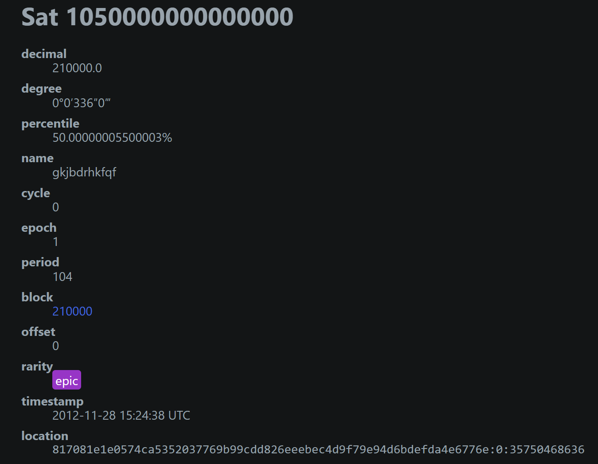
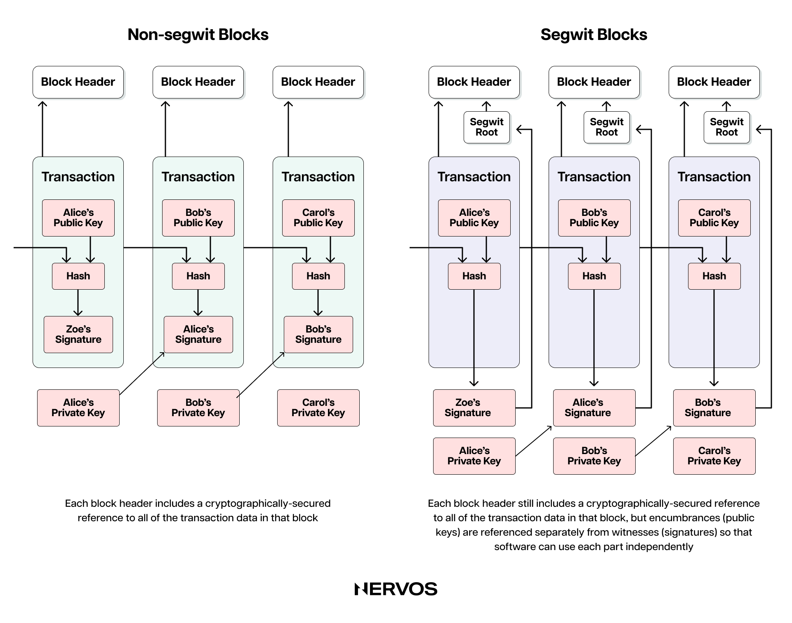
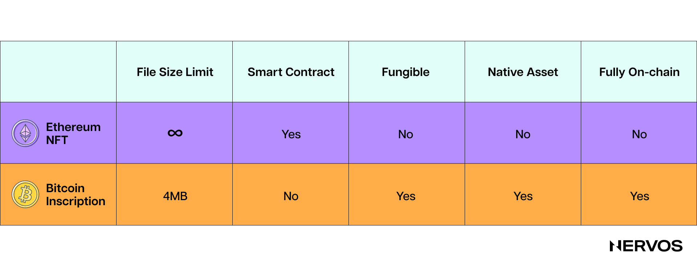
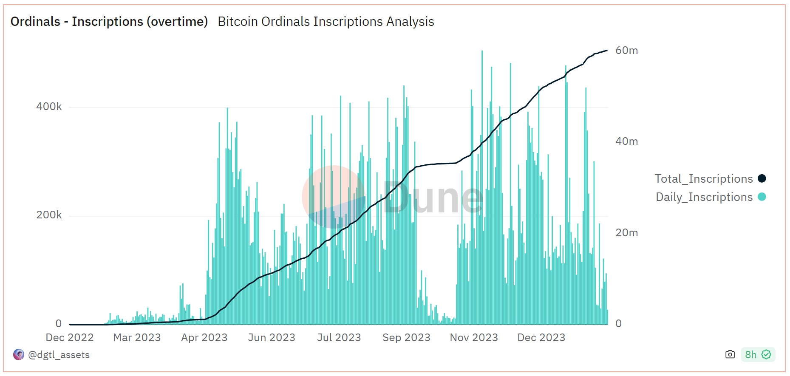
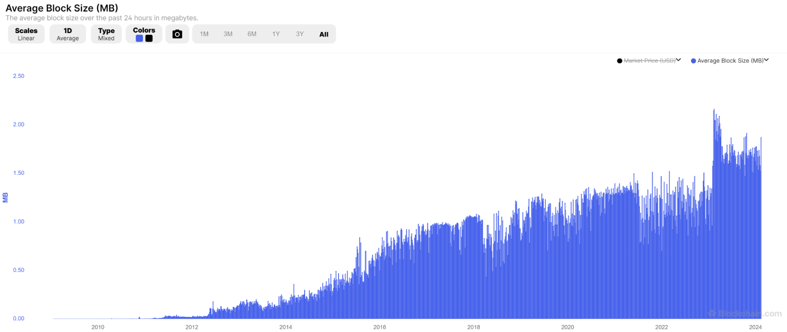
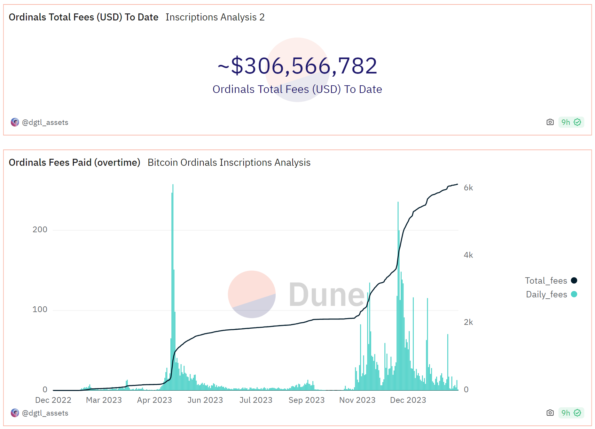

Last year, we saw an unexpected trend emerge on the Bitcoin network—one that angered and surprised many Bitcoin purists but also ignited hope and enthusiasm amongst the broader crypto community for the industry's oldest and most secure blockchain. 

The trend in question involves inscriptions, a novel way of etching data in the form of code, image, audio, and text files to the Bitcoin blockchain. Each inscription is tied to a so-called ordinal, representing an individual, unique satoshi (sat)—the smallest unit of Bitcoin. The term ordinal comes from what its inventor Casey Rodamor dubbed "Ordinals Theory," a proposed methodology for the off-chain tracking and labeling of individual sats based on the order in which they're mined and transferred.

While the Bitcoin community often uses the terms original and inscription interchangeably, it's essential to clear the confusion and note that they refer to two distinct, albeit very intertwined, concepts. In this text, we'll explore the technical foundations, fundamental properties, and potential mid to long-term implications of these two phenomena on Bitcoin and the broader crypto industry.

## Bitcoin Ordinals: An Entirely Social Phenomenon

Invented or, as its creator, [Casey Rodamor](https://twitter.com/rodarmor?ref_src=twsrc%5Egoogle%7Ctwcamp%5Eserp%7Ctwgr%5Eauthor) likes to say, "discovered" in January 2023, [Ordinal Theory](https://docs.ordinals.com/) concerns itself with the smallest Bitcoin denomination, satoshis, imbuing them with numismatic value, and allowing them to be tracked, traded, and transferred across Bitcoin's Unspent Transaction Output ([UTXO](https://www.nervos.org/knowledge-base/utxo_model_explained)) set as unique or non-fungible digital collectibles.

It's essential to note right off the bat that Ordinal Theory is an entirely social or "off-chain" phenomenon. To anyone who doesn't subscribe to this opt-in methodology, ordinals are no different than regular sats. In fact, Bitcoin users who don't run the "ord" client can't see what individual sats have been mined and in what order and, therefore, can't technically recognize them as "ordinals," let alone identify their subjective value.

In a sense, Ordinal Theory is a way of looking at Bitcoin, or more specifically, individual sats, through a different lens. To the vast majority of Bitcoin users, a sat is a sat, and all sats are of equal value, but to ordinal collectors, some sats are more exotic than others and, therefore, more desirable. 

This is very similar to how numismatists approach coin collecting. While a coin could have a nominal value of $1 (and could be spent as such), its origin, unique design, minting year, and provenance may all play a role in its rarity and perceived value. Hence, it's not uncommon in numismatics for coins to trade for thousands of times more than their nominal value.

In the same vein, ordinal collectors may perceive certain sats as more valuable than others based on the order in which they're mined and transferred from transaction inputs to transaction outputs. For example, the first sat mined following a Bitcoin halving, or the first sat mined following some other monumental event in Bitcoin, like a [hard fork or a soft fork](https://www.nervos.org/knowledge-base/what_is_a_hard_fork_soft_fork_(explainCKBot)) update, may hold particular numismatic value to ordinal collectors. Some ordinal collectors may deem certain sats more exotic than others on entirely subjective grounds, like the first sat they ever bought or received or the first sat mined on the exact hour they were born, married, or had their child. 

In any case, what makes these or any other sats exotic is entirely subjective, as they're like any other sat, and there's nothing inherently different or special about them beyond their place among other sats on the blockchain.

### **Ordinal Notations and Rarity**

Ordinal Theory enumerates or structures ordinals based on different representations:

* **Integer notation:** The ordinal number, assigned according to the order in which the sat was mined. E.g.: 2099994106992659;
* **Decimal notation:** The first number is the block height at which the sat was mined, and the second is the offset of the satoshi within the block. E.g.: 3891094.16797;
* **Percentile notation:** The sat's position in Bitcoin's supply, expressed as a percentage. E.g.: 99.99971949060254%;
* **Name:** An encoding of the ordinal number using the characters A through Z. E.g.: satoshi.

In addition to the above representations, each ordinal also has a **degree notation** that describes its rarity according to Ordinal Theory. It describes the sat's position in the blockchain using four parameters: 

* **A°** - Index of the sat in the block;
* **B' **- Index of the block in the difficulty adjustment period;
* **C" **- Index of block in the halving epoch;
* **D'" **- Cycle number.

This methodology for categorizing sats in Ordinal Theory gives them six rarity levels: common, uncommon, rare, epic, legendary, and mythic. An example of a mythic sat is the first sat of the Genesis block, the first Bitcoin block mined in 2009 by Satoshi. Since all of the sats that Satoshi mined have never been moved, suggesting that Satoshi has either died, lost access to their private keys, or never had any plans to sell the bitcoin they mined in the first place, this mythical sat will most likely remain unobtainable to ordinal collectors.

An example of an epic ordinal is the first sat of each halving epoch, which occurs roughly every four years. So far, only [three epic ordinals](https://ordiscan.com/satribute/epic) have been mined, with the fourth one due on April 22. To make things more concrete, the representations of the first epic ordinal, or the first sat mined following the first Bitcoin halving in 2012, look like this:

As can be seen, Ordinal Theory leaves collectors lots of room for experimentation and speculation. For example, beyond the rare and legendary sats, the Nervos Foundation would hypothetically be willing to buy the sat with the name "[nervos](https://ordinals.com/sat/nervos)" at a significantly higher price than its nominal price—if that sat weren't due to be mined in the year 2,102.

Beyond ordering and classifying sats based on their arbitrary rarity, Ordinal Theory's methodology for tracking and labeling individual sats allowed Bitcoin users to inscribe sats with arbitrary data, including text, image, audio, video, and even application files, enabling their trading as NFTs and birthing a whole new trend of collecting Bitcoin-based digital artifacts.

Unlike Ordinal Theory, which is an entirely social phenomenon, inscriptions represent a mix of both on-chain objectivity and social consensus. That is to say, while inscriptions can exist on their own (as they're actually etched on-chain and available for all full Bitcoin nodes to see), their association with concrete, individual sats (ordinals), which is what allows them to be traded as NFTs, is based on the off-chain cataloging methodology (Ordinal Theory) whose recognition hinges on social consensus.

## What are Bitcoin Inscriptions, and How Do They Work?

As previously mentioned, inscribing is a method of inserting arbitrary data like images, text, audio, or even software files inside individual satoshis or ordinals. Inscriptions, in their current form, were made possible by two Bitcoin upgrades, [SegWit](https://en.wikipedia.org/wiki/SegWit) and [Taproot](https://en.bitcoin.it/wiki/BIP_0341).

SegWit, which stands for Segregated Witness, was introduced to Bitcoin via a soft work in 2017 in a bid to improve its scalability. More specifically, SegWit enabled both smaller transactions, allowing miners to pack more transactions inside a fixed amount of block space, and larger blocks (from 1MB to 4MB), enabling even more transactions per block. This was done by separating the signature or witness data from all the other transaction data and moving it as a separate structure at the end of a block, replacing the concept of bytes (data size) with virtual bytes (weight), and recalculating the weight of witness data to count as ¼ of a weight unit. This means that the data in the witness portion of the transaction "weighs" four times less than regular transaction data, therefore also costing that much less in transaction fees to be mined.

The second upgrade, Taproot, was introduced to Bitcoin via a soft fork in 2021 to enhance Bitcoin's smart contracting capabilities, specifically time-locked contracts (outlined in witness data) used for payment channels in Layer 2 networks like the Lightning Network. It removed the size limit for witness data and allowed for much more complex scripting inside the witness portion of a transaction.

While the [OP_RETURN](https://en.bitcoin.it/wiki/OP_RETURN) opcode made it possible to inscribe up to 80 bytes of data even before SegWit and Taproot, the 75% discount on weight units and the removal of the size limit for witness data introduced by these two updates inadvertently opened the door to inscriptions as we know them today. 

We say inadvertently because the goals of the SegWit and Taproot updates were never to enable anything resembling inscriptions. In fact, the Bitcoin purists who overwhelmingly supported these updates as a great and safe way to improve Bitcoin without introducing potential vulnerabilities now vehemently critique the inscription trend and see it as a negative externality.

### **Creating an Inscription**

Creating an inscription starts by wrapping arbitrary data, like a JPEG, for example, into a Taproot [script](https://www.nervos.org/knowledge-base/bitcoin_script_(explainCKBot)) and injecting it into the witness portion of a Bitcoin transaction. Because the data is inscribed between the [opcodes](https://www.nervos.org/knowledge-base/what_are_opcodes_%28explainCKBot%29) in the form of data pushes, and Taproot limits individual data pushes to 520 bytes, inscribing larger data files can necessitate multiple data pushes up to the size of the inscription.

Next, the inscribed sat is broadcasted to the network in two transactions: a commit transaction and a reveal transaction. This two-step process is necessary because spending a Taproot script (think sending a JPEG-inscribed sat) requires having an existing Taproot output in one's wallet. The commit transaction consists of a hash to the Taproot script (a reference to it) and creates a Taproot output whose spending conditions are defined by the script. On the other hand, the reveal transaction spends the input of the commitment transaction by revealing the entire script and creating the output of the sat that will be inscribed. 

These transactions are then sent to the [mempool](https://www.nervos.org/knowledge-base/mempool_in_cryptocurrency_(explainCKBot)), where all pending transactions await miner confirmation. Once the transactions are mined, the inscription becomes a permanent part of the Bitcoin blockchain and is traceable and visible to everyone via custom tools like the [Ordinals Explorer](https://ordiscan.com/). Needless to say, ordinal or inscription collectors and traders leverage tools that abstract away all of these processes, making them much more accessible to the non-technical audience.

Unlike sending regular Bitcoin transactions—or Ethereum NFTs, for that matter—creating, minting, and tracking inscriptions requires running the proprietary "ord" client on top of a fully synchronized full node. The "ord" client works in conjunction with [Bitcoin Core](https://bitcoin.org/en/bitcoin-core/), allowing users to inscribe individual sats and track them across the UTXO set. Without this client, a regular Bitcoin wallet cannot distinguish between inscribed and regular sats, which leads us to the next point.

## Bitcoin Inscriptions vs. Ethereum NFTs

The core difference between Bitcoin inscriptions and non-Bitcoin NFTs is precisely their aforementioned fluid or "semi-fungible" nature. From the core protocol's point of view, an inscribed sat or an ordinal is no different from a regular sat, meaning it can be used as part of a regular Bitcoin transaction or as payment for transaction fees, even though the arbitrary data may stay attached. Whether the inscribed ordinal is recognized as a non-fungible coin is left entirely to its owner.

The same, on the other hand, doesn't apply to Ethereum NFTs. An Ethereum NFT is a second-class citizen or asset on the Ethereum network and is entirely different from Ether, the chain's native coin. Like all other non-native Ethereum tokens (most of which leverage the ERC-20 token standard), Ethereum NFTs are created by different smart contracts, typically leveraging the ERC-721 or ERC-1155 standards for non-fungible tokens.

Unlike first-class assets like sats on Bitcoin and Ether on Ethereum, Ethereum NFTs are not interchangeable, hence their name "non-fungible tokens." NFTs are created via different smart contracts or have unique TokenIDs when created via the same contract (part of the same collection), making them easily distinguishable. Moreover, the respective protocols also treat them differently than native assets. 

Another key difference between inscriptions and non-Bitcoin NFTs is their fully on-chain nature. Namely, non-Bitcoin NFTs typically only contain reference pointers to the target file or, in this case, the image that itself is hosted somewhere else: a cloud server, IPFS, or file-storage blockchains. This means that whoever has access to the server where the image is hosted can delete or change the file, rendering the NFT useless. On the other hand, inscriptions have the actual, raw file data etched directly into the Bitcoin blockchain, making them impossible to tamper with.

The last couple of differences include the file size limits and the management or holding requirements. Namely, some of the most popular Ethereum NFT platforms, like [OpenSea](https://opensea.io/) and [Mintable](https://mintable.com/), allow uploading file sizes of up to 100MB and 200MB, respectively, but this only refers to the size of the actual files—not the size of the on-chain NFTs, which only contain the pointers. On the other hand, inscriptions are much smaller and can only be as large as Bitcoin's blocksize limit of 4 MB. Furthermore, NFTs can be viewed, minted, and traded using regular wallets, whereas inscriptions require running the "ord" client on top of a fully synchronized full node.

### **The Impact of Inscriptions on Bitcoin**

Since Ordinal Theory and inscriptions were introduced a little over a year ago, more than 60 million inscriptions in various forms and sizes have been minted on the Bitcoin blockchain. Some of the more popular collections, like Taproot Wizards and Bitcoin Punks, have reached floor prices of upwards of 0.2 BTC, with inscriptions' total trading volume surpassing that of NFTs on chains like Solana and Ethereum on certain days.

As a result of this accelerating trend, new discussions concerning inscriptions' long-term impact on Bitcoin have arisen, including its effects on both the state size and total blockchain size, the security budget, and the transaction fee market and miner operations.

Concerning the first issue, on-chain data shows that since ordinals and inscriptions took off in March last year, the average block size has approximately doubled, jumping from around 1 MB to 2 MB. This means that if this trend continues or even accelerates to where the average block size equals the maximum block size of 4 MB, Bitcoin's blockchain size will grow two to four times faster moving forward. This could significantly slow down the time it takes Bitcoin nodes to fully sync with the blockchain and increase the hardware requirements for running full nodes, potentially impacting the network's decentralization.

The silver lining to this negative outcome is the impact of inscriptions on miner revenues and, thereby, Bitcoin's security budget. According to Glassnode data, inscriptions have contributed between 15% and 30% of the total transaction fee revenue for miners last year. Interestingly, inscription transactions account for around half of all Bitcoin transactions, paying a meaningful proportion of fees, while consuming a minority share of the blockspace (in bytes) due to SegWit's witness data weight discount.

This substantial demand for inscriptions has already significantly impacted miner revenues. If the trend persists, miner economics will meaningfully improve, positively impacting Bitcoin's security budget both amid the fast-approaching fourth halving and on a more long-term time horizon. For the uninitiated, a larger security budget means higher Bitcoin security in absolute terms.

As a side note, inscriptions have also had an intriguing impact on the transaction fee market structure beyond the effect on the size of the transaction fees. Namely, because inscription transactions have a lower time preference than regular strictly financial transactions, inscribers can afford to settle later (after 10-15 blocks) rather than sooner (in the following 1 to 3 blocks) when the average fee rates are higher. This difference in economic behavior between inscribers and the typical Bitcoin users has led to a consistent floor for blockspace demand or a consistent transaction fee floor price, introducing previously non-existent revenue predictability for miners.

Similarly, inscriptions have also led to a significant increase in so-called out-of-band transactions for miners. These types of transactions are sent to miners directly instead of being broadcast to the entire network. However, since inscribers pay these fees upfront (in a bid to mint whole collections in a single block at a greater block height), the network could find itself unable to accurately calculate the genuine demand for blockspace and therefore adjust the transaction fees accordingly.

## The Impact of Inscriptions on Bitcoin Culture

The rise of Ordinal Theory and inscriptions has been the most contentious issue within the Bitcoin community since the [blocksize war](https://blog.bitmex.com/the-blocksize-war-chapter-1-first-strike/) ended in 2017. Naturally, this issue has split the community into two camps: the Bitcoin "purist" or "maximalist" camp, which is vehemently against Bitcoin being utilized for anything other than peer-to-peer payments, including inscriptions, and the more "cosmopolitan" camp, which has wholeheartedly endorsed inscriptions as an exciting new development and a positive narrative shift for the otherwise "boring" protocol.

The arguments in favor of inscriptions include their positive impact on blockspace demand, miner fees, and, consequently, [Bitcoin's security budget](https://www.nervos.org/knowledge-base/bitcoin_and_ckb_security_models), the possibility of onboarding more users (of an entirely different caliber) to Bitcoin and its values, and their potential to evolve Bitcoin into not only a financial but also a cultural layer, where the most valuable digital collectibles could be settled.

On the other hand, critics consider inscriptions to be unnecessary and dangerous state bloat that could skew people away from Bitcoin’s true purpose (peer-to-peer electronic cash) and hurt the network’s decentralization by exploding the chain’s size and increasing the hardware requirements for running full nodes. Furthermore, Bitcoin purists argue that inscriptions are introducing new values, like high time preference, and focus on speculation and profit instead of ideals, thereby threatening the core ethos of the project.

The way Ordinal Theory and inscriptions found their way into the Bitcoin ecosystem could also make introducing new protocol updates even more contentious and burdensome than before. Namely, nobody who proposed and supported the SegWit and Taproot updates foresaw that they could lead to the rise of something like inscriptions, serving as a wake-up call to the dangers of introducing _any _updates to Bitcoin—however safe they may initially seem—in the future.

## Inscriptions’ Impact on Non-Bitcoin NFTs

Beyond significantly changing Bitcoin’s on-chain structure, the rise of inscriptions has dramatically impacted the broader NFT scene, leading to numerous innovations and changes in user behavior. 

Perhaps most notable are the innovations happening on Nervos’ CKB blockchain, such as the Omiga and Spore protocols. [Omiga](https://omiga.io/) is a CKB-native inscriptions protocol that, powered by CKB’s flexibility and superior programmability, enables fair minting of fully on-chain verifiable (without relying on centralized indexers) Turing-complete inscriptions that can have utility beyond being simple meme tokens. 

On the other hand. the [Spore](https://spore.pro/) protocol is a new standard for NFTs on CKB that establishes an intrinsic link between the token’s content and its value. Namely, spore NFTs are stored in cells—the basic accounting unit of the CKB blockchain (similar to UTXOs in Bitcoin)—that allow users to store arbitrary data by locking a certain amount of CKB tokens inside them. When users want to redeem the NFTs for their intrinsic value, they can “melt them down” for the underlying CKB backing them. Moreover, beyond being fully on-chain, the content held by Spore NFTs can also be generative and dynamic, which isn’t the case with Bitcoin inscriptions.
