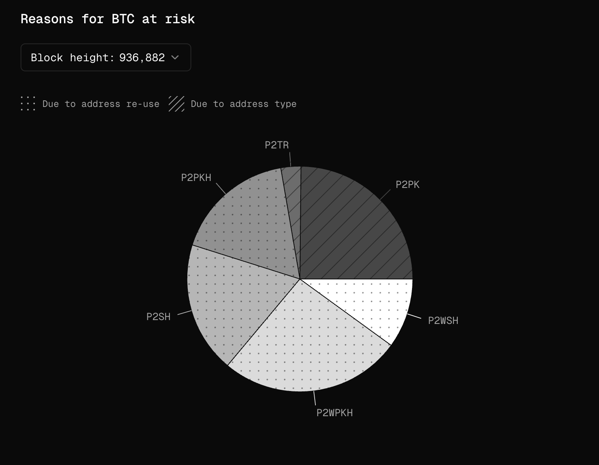
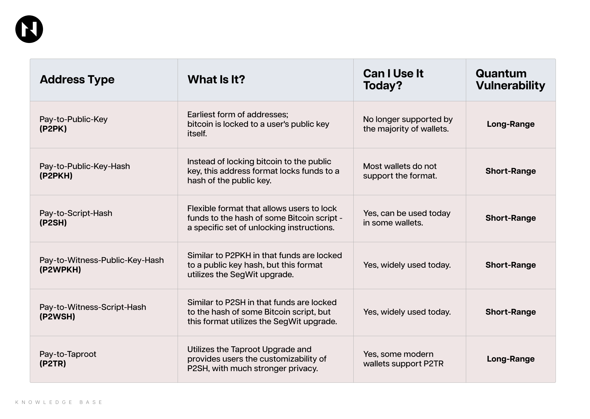
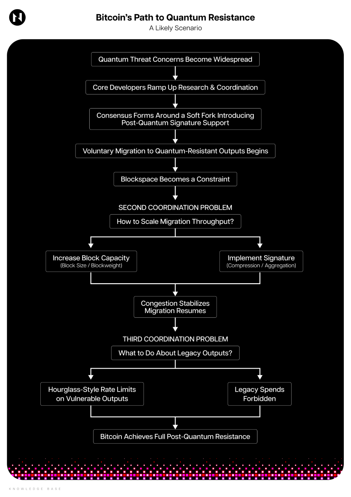

For nearly two decades, Bitcoin’s security has rested on a simple mathematical assumption: that reverse-engineering a private key from a publicly visible public key is practically impossible. This foundation, built on [Elliptic Curve Cryptography](https://en.wikipedia.org/wiki/Elliptic-curve_cryptography) (ECC), currently underpins trillions of dollars in global wealth.

However, the bedrock is shifting. The looming arrival of Cryptographically Relevant Quantum Computers (CRQCs)—machines capable of executing [Shor’s algorithm](https://en.wikipedia.org/wiki/Shor%27s_algorithm) at scale—threatens to render Bitcoin’s core security assumptions obsolete.

The timeline for 'Q-Day' remains one of the most contentious debates in the space. Projections vary wildly, ranging from a mere four years to over two decades. The bias in these estimates is often evident: quantum hardware firms, who are obviously on the optimistic side, have a vested interest in promoting the idea of rapid progress, while the Bitcoin community has a vested interest in downplaying the potential threat.

What’s undeniable, however, is that the timelines are rapidly crunching. So much so that you’re reading a revamped version of this article because in the time it took to draft it, Iceberg Quantum—a quantum architecture company—published a [paper](https://arxiv.org/abs/2602.11457) claiming that their new Pinnacle Architecture can crack RSA-2048 with approximately 100,000 physical qubits—a staggering drop from the 900,000 qubits estimated in 2025, and a world away from the 170 million qubits projected just seven years ago.

In simple, non-technical terms, this means that—*if* the quantum hardware firms are to be believed—which is a considerable *if*—Bitcoin doesn’t have decades but rather several years to prepare for Q-Day.

## Prologue

To that end, we decided to explore *how* this transition could look. 

For the sake of brevity, we won’t go into the technical details about how quantum computers work or how they’re able to break ECC. Instead, we’ll briefly cover potential attack vectors and the attack surface, then move on to the transition process.

Before we do that, however, it’s important to clarify that we’re isolating Bitcoin not because it is uniquely vulnerable (most leading blockchains share this risk), but because its greatest strength—namely, its notorious inertia or resistance to change—may also turn out to be its greatest weakness in addressing the quantum threat. Its last two soft fork updates demonstrate this well: [SegWit](https://en.bitcoin.it/wiki/Segregated_Witness) was first formally proposed in March 2015 and adopted only in August 2017\. [Taproot](https://en.bitcoin.it/wiki/Taproot) was conceptually defined in early 2018 and was not activated until late 2021\.

That’s roughly a two-and-a-half-year gap from a clearly defined proposal to activation—for upgrades that were materially less complex and far less existential than any post-quantum soft fork would be. SegWit, in particular, was anything but smooth; it became one of the most contentious chapters in Bitcoin’s history, culminating in a [chain split](https://en.wikipedia.org/wiki/Bitcoin_Cash). Taproot, by contrast, was comparatively uncontroversial (aside from later contentions around inscriptions), with broad social consensus coalescing around it relatively quickly. In either case, however, both upgrades were eventually taken across the finish line.

Contrarily, the quantum question does not appear to be generating the same level of urgency or alignment among the protocol’s kingmakers. While many major blockchains openly acknowledge the quantum threat and are actively exploring mitigation pathways, Bitcoin’s informal power centers appear markedly less concerned—even amid reports that certain large holders are allegedly reassessing or reducing exposure specifically due to mid- to long-term quantum uncertainty.

Nic Carter—a crypto analyst, prominent Bitcoiner, and one of the most vocal quantum alarmists—has arguably captured this dynamic most clearly. In a recent blog [post](https://murmurationstwo.substack.com/p/bitcoin-developers-are-mostly-not), he mapped the informal power structure within Bitcoin by identifying its most influential developers and cataloging their public statements on the issue. The takeaway, in his own words, is stark: *“A majority of the most influential Bitcoin leaders have never even acknowledged quantum risk.”* And among those who have, he notes, *“with the exception of Jonas Nick, [they] view it as theoretical, distant, or non-actionable.”*

Whether the concerns of the quantum alarmists are warranted remains to be seen, but the asymmetry between the threat's potential severity and the urgency of the response is difficult to ignore.

## Threat Assessment

The complex technical nature of both quantum computers and blockchains has led to a host of misconceptions about what a realistic quantum attack would actually entail in practice.

One of the most persistent misunderstandings is the assumption that a CRQC could crack SHA-256—the hash function underpinning Bitcoin’s PoW-based consensus mechanism. This framing conflates two distinct cryptographic primitives, namely [*hash functions*](https://en.wikipedia.org/wiki/Hash_function) and [*public-key signature schemes*](https://www.sciencedirect.com/topics/computer-science/public-key-signature), which rely on entirely different security assumptions.

Hash functions such as SHA-256 derive their security from preimage and collision resistance, properties that are not directly vulnerable to CRQCs. At most, a sufficiently advanced quantum computer running [Grover’s algorithm](https://en.wikipedia.org/wiki/Grover%27s_algorithm) would provide a quadratic speedup in brute-force search, effectively reducing the security margin but not outright breaking the hash function.

In simple terms, this means the consensus layer is safe.

The more credible quantum threat lies in the potential compromise of ECC-based public-key signature schemes, where a CRQC could, in principle, recover private keys from exposed public keys and seize control of funds held in vulnerable addresses.

To that point, not all Bitcoin addresses are equally at risk; the key differentiator is whether the underlying public key has already been revealed onchain.

Legacy outputs such as [Pay-to-Public-Key](https://learnmeabitcoin.com/technical/script/p2pk/) (P2PK) and bare [multisigs](https://learnmeabitcoin.com/technical/script/p2ms/) (P2MS) embed the raw public key directly onchain, making them the most structurally exposed, as the cryptographic target is permanently visible. By contrast, modern, more commonly used address types, including [Pay-to-Public-Key-Hash](https://learnmeabitcoin.com/technical/script/p2pkh/) (P2PKH) and SegWit, store only a hash of the public key onchain, concealing the key itself until the coins are spent.

However, this protection is conditional, as spending BTC from these address types reveals the public key onchain, making them viable targets indefinitely. This means that address reuse—which is frowned upon, but nevertheless widespread among Bitcoiners—significantly expands the attack surface.

Speaking of attack surface, according to estimates from [Project Eleven](https://www.projecteleven.com/bitcoin-risq-list), roughly 6.9 million BTC currently reside in addresses with exposed public keys. That’s a little more than one-third of all BTC in existence today.

*Proportion of quantum vulnerable BTC due to address re-use and address type. [Source: [Project Eleven](https://www.projecteleven.com/bitcoin-risq-list/metrics)]*

To make matters worse, these numbers don’t account for so-called short-range attacks, which affect all addresses. Even if a public key has never been revealed before—whether the coins are held in P2PKH or SegWit outputs—it becomes visible the moment a transaction is broadcast to the mempool.

This creates a narrow pre-confirmation window, typically \~10 minutes, during which a sufficiently powerful quantum attacker could derive the private key and rebroadcast the same transaction with a higher fee, stealing the coins mid-flight. This scenario remains highly unlikely, at least in the mid-term, as it would require a far more powerful quantum computer than the one needed for long-range attacks.

To summarize, even if we completely remove short-range attacks from the realm of possibility, roughly one-third of all BTC in circulation is vulnerable to long-range quantum attacks. Three-fourths are due to address reuse, and roughly one-fourth, or 1.7 million BTC, is due to the address type (P2PK). The coins still sitting in these legacy addresses are strongly believed to belong to people who’ve lost access to them in one way or another. For instance, roughly 1.1 million of these are Satoshi’s coins, which haven’t moved since 2010.

## What Needs to be Done?

At a high level, Bitcoin’s path to quantum resistance reduces to two distinct—but complementary—objectives.

First, the protocol must minimize the exposure of public keys onchain, reducing the immediate attack surface available to a quantum adversary.

Second, it must eventually replace its existing signature schemes with post-quantum alternatives, ensuring long-term security against CRQCs.

The good news is that there’s already some traction on the first front—exposure minimization. One of the most prominent proposals in this direction is [BIP-360](https://github.com/bitcoin/bips/blob/master/bip-0360.mediawiki#user-content-Conclusion).

As currently formulated, BIP-360 introduces a new output type called Pay-to-Merkle-Root (P2MR). Conceptually similar to Taproot, P2MR removes the key-path component present in P2TR outputs—a mechanism that commits a tweaked public key onchain, leaving it indefinitely exposed to quantum attacks. Instead, P2MR commits only to a Merkle root of spending conditions, ensuring that no public key is revealed onchain until the moment of spending.

In practical terms, BIP-360 is a deliberately conservative upgrade. It addresses Taproot’s exposure to long-range quantum attacks, and little else. It meaningfully reduces the long-range attack surface and buys time—but it does not, on its own, make Bitcoin quantum-resistant. As the proposer puts it:

*“BIP 360 is step one. It proposes a quantum-resistant output type that has the upgradability and features of P2TR without the quantum vulnerability. If we want full quantum safety, we also need step two: adopting a post-quantum signature algorithm."*

### What Are The Options?

“Step two” is fundamentally an engineering problem: selecting an appropriate algorithm, integrating it into Bitcoin’s scripting and validation model, and doing so without breaking backward compatibility or introducing unintended consequences.

The bad news is that it remains unsettled—there is no clear successor to ECDSA or Schnorr, only a spectrum of trade-offs.

The leading contenders include [SPHINCS+](https://sphincs.org/), a stateless hash-based scheme that offers extremely conservative security assumptions but produces even larger signatures and is slower. [XMSS](https://datatracker.ietf.org/doc/html/rfc8391#section-4.1) and [LMS](https://datatracker.ietf.org/doc/html/rfc8554), stateful hash-based schemes, have strong theoretical foundations but introduce operational complexity due to state management. 

Then, we have [ML-DSA](https://www.digicert.com/insights/post-quantum-cryptography/mldsa) (Dilithium) and [Falcon](https://falcon-sign.info/), both lattice-based, NIST-standardized signature schemes. They offer relatively fast verification and moderate key sizes, but are still measured in kilobytes—an order of magnitude larger than Schnorr.

Other alternatives, such as [LaBRADOR](https://eprint.iacr.org/2022/1341) and various aggregation-friendly lattice constructions, aim to optimize for signature compression or proof aggregation but are newer and less battle-tested.

In short, there is no free lunch. Lattice schemes are efficient but rely on relatively untested hardness assumptions; hash-based schemes are conservative but computationally expensive; aggregation-friendly designs promise scalability but add complexity. 

In the best case, the signature size remains an issue; even the lightest post-quantum signatures are at least five times larger than current ones. Here’s a [great illustration](https://www.howbigistoobig.com/) of the differences in size and signing/verification speeds of different post-quantum signature schemes.

This means that, without accompanying changes to Bitcoin’s block size, which has historically been a highly contentious topic, or the introduction of some signature compression or aggregation mechanism, which significantly increases protocol and implementation complexity, Bitcoin could run into network congestion or scaling issues.

Beyond the choice of signature primitive lies an equally consequential question: how to implement it. 

There are several ideas floating around. One class of proposals centers on staged, opt-in migration. One of the most prominent examples is the [Commit-Delay Reveal](https://eprint.iacr.org/2018/213) (CDR) protocol, which would enable users to migrate to vulnerable coins in three steps: (1) publish an onchain commitment linking their existing ECC public key to a new post-quantum key; (2) observe a mandatory delay period that prevents reorg-based substitution attacks; and (3) reveal both keys and complete the spend using the post-quantum signature, proving the original commitment.

The CDR approach assumes that post-quantum signatures have been activated via a soft fork and that a second soft fork would introduce the new consensus rules enabling the migration. Its limitation is that it would only work for coins whose owners are active and whose keys have not yet been exposed, leaving legacy coins up for grabs.

At the opposite end of the spectrum lies the [Quantum-Resistant Address Migration Protocol](https://groups.google.com/g/bitcoindev/c/8PM6iZCeDMc/m/PiGGU0hmAgAJ) (QRAMP). Rather than voluntary migration, QRAMP proposes a mandatory migration window with a fixed deadline, after which UTXOs secured by classical ECC would become unspendable. Users would receive advance notice and a defined period to move funds into post-quantum outputs; coins left unmigrated would effectively be burned. 

Unlike CDR, QRAMP would require a hard fork, as it invalidates previously valid spending conditions. That, and the fact that it would blatantly violate bitcoiners’ property rights and set a dangerous precedent, makes it deeply controversial. 

The third class of proposals occupies a middle ground, adopting a more adversarially pragmatic stance. One such idea is the so-called [Hourglass strategy](https://groups.google.com/g/bitcoindev/c/0E1UyyQIUA0/m/FrKeI_1tBwAJ), which, rather than attempting to outright prevent quantum attackers from stealing exposed coins, proposes rate-limiting those spends—for example, allowing only a fixed number of quantum-vulnerable UTXOs (and BTC) to be spent per block. The objective is to preserve formal property rights at the protocol level while dampening the potential market shock of a sudden, large-scale quantum breach by stretching it out over time.

In practice, this approach would also require two soft forks: first to activate post-quantum signatures, and second to introduce new consensus rules that govern how many vulnerable spends are considered valid per block.

Finally, the activation path for any of these proposals itself would ultimately depend on social alignment. In a cooperative environment, established mechanisms such as [BIP8](https://bips.dev/8/), [BIP9](https://bips.dev/9/), or [Speedy Trial](https://gnusha.org/pi/bitcoindev/20210306034343.fhwrxmq6gbb2os5m@ganymede/) could be used to deploy changes. In a more contentious scenario—reminiscent of the SegWit era—activation might instead require a [User Activated Soft Fork](https://github.com/bitcoin/bips/blob/master/bip-0148.mediawiki) (UASF). 

As things stand, however, there is no meaningful consensus on either the post-quantum signature standard or the preferred migration framework, leaving the activation path as unsettled as the cryptography itself.

## How the Journey to Quantum Resistance May Unfold

Speculating on Bitcoin’s trajectory toward quantum resistance is an extremely difficult—possibly futile endeavor. This is because Bitcoin’s quantum transition isn’t a linear storyline but a branching narrative game, where each decision closes off certain futures while unlocking others, and the ending depends not on a single move but on the accumulation of many.

To attempt a forecast, then, is to play this game at maximum difficulty. Every choice introduces new uncertainties: the choice of a post-quantum signature scheme shapes future migration strategies, which in turn influence other technical, economic, and political decisions, each steering Bitcoin toward different pathways and endings.

Nevertheless, we believe that mapping these branches is a useful exercise in constraint discovery. By outlining possible paths forward, we can better understand where the bottlenecks lie and how the game could play out.

What follows is one such plausible trajectory.

### A Potential Scenario

Widespread concerns about the quantum threat eventually force Bitcoin’s core developers to change tune and ramp up research and coordination efforts to find a solution.

The most immediate—and politically feasible—step would likely be to reach consensus on a BIP introducing a post-quantum signature scheme via a soft fork within a couple of years. This upgrade would add a new output type that supports quantum-resistant signatures, enabling users to voluntarily migrate funds without invalidating existing outputs.

Such a move would not confer full quantum immunity but would instead serve as a short-term contingency measure—an opt-in safety valve. It could plausibly be implemented within a few years, providing Bitcoin with a minimal viable defense: a mechanism for proactive users to secure funds early, and buy some time for more comprehensive long-term solutions to be built.

Following the soft fork activation, users begin to spend their existing UTXOs into post-quantum outputs. Common sense suggests that those with the most to lose, such as exchanges, institutional custodians, and whales, move first. Initially, things go smoothly, but soon blockspace becomes an obvious constraint.

Bitcoin’s UTXO set currently contains roughly 190 million UTXOs. In an ideal world, all of them would eventually migrate to quantum-resistant outputs. In practice, only a subset is accessible, and an even smaller subset—those with exposed public keys—require urgent migration.

Now, research suggests that migrating the full UTXO set under theoretically optimal conditions—100% of blockspace dedicated exclusively to migration transactions—would require \~142 days. That assumption is, of course, detached from reality. 

Bitcoin is not a laboratory environment but a live decentralized monetary network. In a more realistic scenario where only 25% of blockspace is available for migration, the timeline stretches to roughly 305-568 days. 

That optimistically assumes sustained coordination, stable fee markets, and efficient transaction construction, and ignores the increased size of post-quantum signatures. As users begin utilizing post-quantum cryptography, transaction weight increases materially, further exacerbating the block space issue.

At this stage, the network could face a secondary coordination problem. If the mission is to succeed, either block capacity must increase, or signature compression or aggregation mechanisms must be introduced to offset the overhead. The former reignites old debates around scaling and decentralization from the [blocksize war](https://en.bitcoin.it/wiki/Block_size_limit_controversy) era and triggers PTSD among many of the veterans, while the latter risks introducing significant complexity to the protocol.

Eventually, something has to give. One of these pressure valves is released: either block size is increased, signature aggregation techniques mature, or the fee market equilibrates at a higher but tolerable level. Congestion stabilizes, and migration resumes to a satisfactory tempo.

However, even if all accessible UTXOs migrate successfully over the two years post-activation, an unresolved class of outputs remains: legacy coins that cannot or will not move.

This is the point at which Bitcoin’s fate is decided. The year is 2030, and the time has come for the final boss fight. 

If no further rules are introduced, exposed legacy outputs remain quantum-vulnerable indefinitely. Should a sufficiently powerful quantum adversary emerge, those coins (millions of BTC) could be stolen and liquidated, potentially crashing the market.

At this point, the mere possibility of that happening is beginning to scare off potential sophisticated investors. Every viral announcement of a breakthrough in quantum computing makes bad price action even worse. The pressure to take radical measures keeps ramping up. Even if the timeline to Q-Day is still a decade away, the stakes are too high to simply ignore the threat.

At some point over the next several years, a consensus is reached to introduce new constraints. Either rate-limiting vulnerable spends (hourglass-style) or forbidding them altogether. This finally puts Bitcoin over the full-quantum-resistance finish line, albeit at the cost of violating long-standing norms of immutability and unconditional property rights. Chances are, this move is—at that point—widely seen as a necessary one-time compromise and doesn’t inflict long-term narrative damage to the asset.

### Not So Fast

The forecast we outlined above is admittedly optimistic: Bitcoin adds post-quantum signatures by 2028, most active UTXOs migrate within 2031, and it takes another three to five years thereafter to complete the final update to full quantum-resistance. The forecast assumes Bitcoin makes the right call at every turn, faces no technical hiccups along the way, and any contentious decisions converge to consensus within reasonable timeframes.

What could go wrong, right?

Everything.

The scenario above assumes that credible quantum concern materializes early enough to trigger meaningful action before it’s too late. But what if quantum computing breakthroughs begin to outpace social consensus on a post-quantum signature scheme or a mitigation pathway? In this alternative reality, Bitcoin finds itself on its back foot, and migration becomes reactive rather than proactive. What had once felt like a controlled stress test turns into a live-fire exercise, and God knows what happens to the social dynamics under that kind of pressure.

Or, suppose migration begins smoothly; the block space issue reignites the old debate over increasing the block size, but in this alternate reality, social consensus isn’t reached, leading to a chain split. Or, suppose the same thing happens over the issue of handling the legacy coins.

Or, worst of all, imagine Q-Day arrives far sooner than expected—within three to five years from today—well before Bitcoin has completed its transition. A sufficiently capable quantum adversary, most plausibly a state actor, begins selectively compromising high-value targets such as exchange cold wallets or institutional custodians.

Such an actor would have little incentive to reveal their capability immediately. Rather than sweeping up obvious legacy addresses or touching Satoshi’s coins, they would likely operate surgically—targeting specific wallets and making each incident resemble a conventional breach: a compromised key, sophisticated malware, or insider misconduct. From the outside, nothing would clearly signal a quantum breakthrough.

Meanwhile, the protocol itself would have no native mechanism to distinguish a legitimate spend from one authorized by a derived private key—the chain would validate both identically. As isolated “security incidents” accumulate, uncertainty compounds, markets deteriorate, confidence erodes, and panic begins to feed on ambiguity and rampant speculation over the causes. By the time the cause becomes apparent, the financial and psychological damage may already be done.

## Final Thoughts

There’s a key piece of information we intentionally left for last: transitioning to post-quantum cryptography is far more complex for blockchains than for traditional Web2 systems because most blockchains aren’t built with cryptographic flexibility in mind.

In other words, it’s one thing to be quantum resistant, and entirely another to be cryptographically agile. Quantum resistance simply means adopting a post-quantum signature scheme, whereas cryptographic agility is the ability of a system to replace and adapt its cryptographic primitives without disrupting its own operation.

This distinction matters because cryptography is not static. As we are being reminded today, cryptographic primitives can age out of favor as new threats emerge and their underlying security assumptions erode. A system that must coordinate a global protocol upgrade whenever a cryptographic primitive needs to change inherits enormous operational and social friction. In practice, this makes rapid adaptation—or timely threat response—extremely difficult, precisely the opposite of what is required under today’s circumstances.

As we noted above, most blockchains lack this ability. The only exception we can think of is the Common Knowledge Base (CKB) blockchain, which was designed for cryptographic agility from the outset. Unlike most blockchains, CKB does not hardcode cryptographic primitives as precompiles into the consensus layer, but instead implements them at the “application” layer.

In practical terms, this means that anyone can implement and deploy new cryptographic schemes—including post-quantum signature algorithms—without requiring protocol-level upgrades or global coordination. Implementing a new post-quantum signature scheme on CKB is as simple as launching a smart contract on Ethereum. The network does not need to converge on a single post-quantum standard but can, instead, support multiple independently deployed schemes in parallel, as it does today with SPHINCS+ and many others.

As a result, the chain’s underlying cryptography can evolve organically and quickly in response to novel environmental pressures. The security isn’t constrained by the pace of social consensus but strengthened through something closer to natural selection. 

