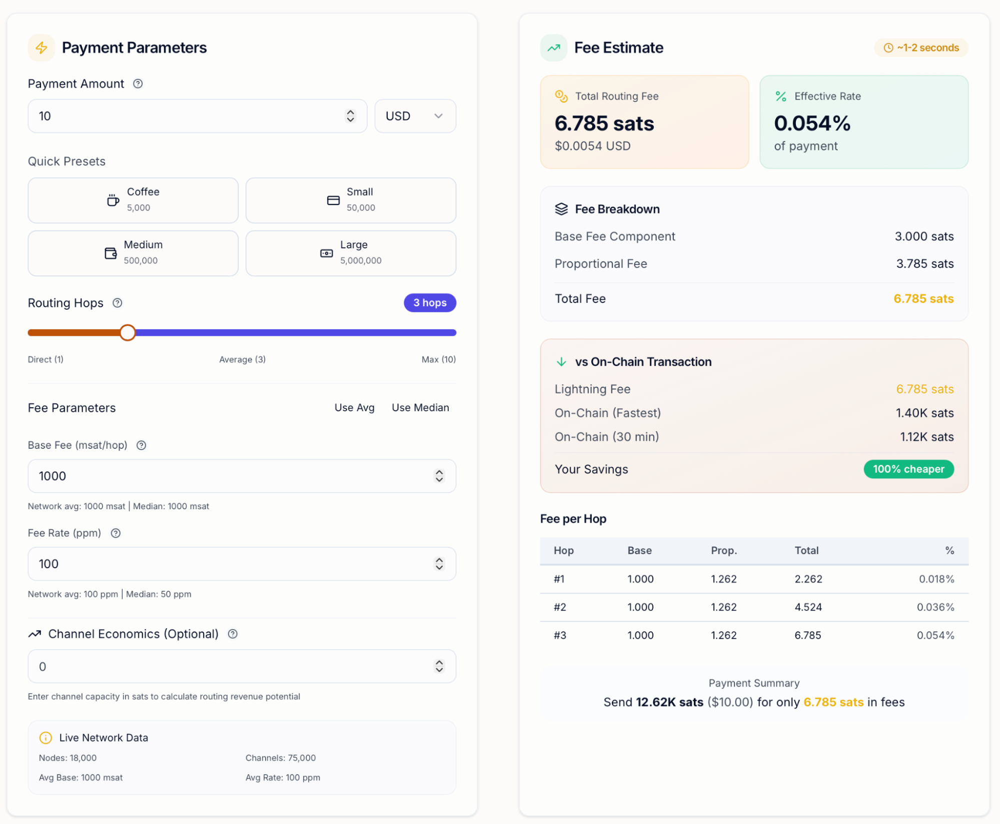
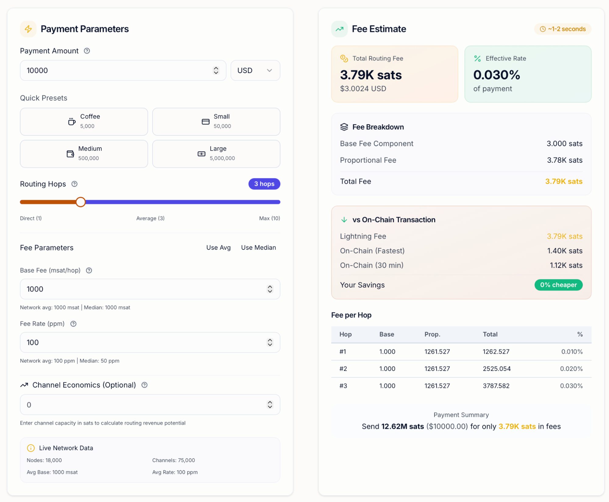

The fee system of the Bitcoin Lightning Network exists to solve a delicate economic puzzle: It must keep transactions extremely cheap while still rewarding participants who provide the infrastructure that makes those transactions possible.

At first glance, this may appear contradictory. If payments are supposed to cost almost nothing, why charge fees at all? The answer lies in the design of the Lightning Network itself.

## Understanding the Basics of the Lightning Network

The Lightning Network is a Layer‑2 protocol built on top of Bitcoin that enables fast, low‑cost transactions by moving most transfers off the main blockchain. At its core, Lightning operates through [payment channels](https://www.nervos.org/knowledge-base/what_are_payment_channels), which are bilateral agreements between two participants who lock funds into a shared account. Once established, these channels allow users to transact back and forth without broadcasting each payment to the Bitcoin blockchain, which reduces fees and confirmation times dramatically.

Traditional Bitcoin transactions must be confirmed by [miners](https://www.nervos.org/knowledge-base/difference_between_crypto_miners_validators_(explainCKBot)) and recorded on the blockchain, a process that can take minutes to hours and is costly during periods of network congestion. Lightning sidesteps this by keeping most interactions off‑chain, as only the opening and closing of a channel require on-chain transactions.

When a user wishes to send funds to someone with whom they do not share a direct channel, the payment travels through multiple intermediary nodes in the network. Each of these nodes forwards the payment along a path toward the destination. The process resembles routing data across the internet, where packets move through various routers before reaching their final destination.

The nodes that facilitate these transfers contribute resources and liquidity to the system, and in return they earn small routing fees. These fees are the economic engine that sustains the Lightning Network, ensuring that participants are willing to maintain open channels and provide reliable connectivity.

## Lightning Network Fee Structure Explained

The Lightning Network charges fees through a simple but flexible structure composed of two primary components: a base fee and a proportional fee. These two elements work together to create a pricing model that remains both predictable and adaptable to different network conditions.

### Base Fee

A base fee is a fixed amount charged by a node each time it forwards a payment, regardless of the transaction size. This fee exists to offset the cost of processing the payment and committing bandwidth and storage resources. It is typically measured in millisatoshis (msat), which are thousandths of a satoshi (the smallest unit of Bitcoin). Many Lightning implementations use a default base fee of around 1,000 millisatoshis, or about 1 satoshi per payment.

Even though base fees seem tiny, they apply to every hop in a payment route. If a payment must pass through multiple nodes to reach its destination, each will charge its base fee. Over a long route, these base fees can add up, especially for small payments where they represent a larger proportion of the total cost.

### Proportional Fee (Fee Rate)

In addition to the base fee, nodes charge a proportional fee based on the amount of Bitcoin being routed. This fee is typically expressed in parts per million (ppm), which represents a tiny fraction of the payment value. For example, a fee rate of 100 ppm equates to a 0.01 % charge on the payment amount.

To illustrate, if a payment of 100,000 satoshis is routed with a fee rate of 100 ppm, the proportional portion of the fee would be 10 satoshis (100,000 × 0.0001). Combined with the base fee, this node would charge the sender 11 satoshis in total.

### Total Routing Fee Calculation

When a payment is sent across the Lightning Network, the total fee is the sum of the fees charged by each node along the route. Suppose a payment goes through three intermediate nodes before reaching the receiver; the base and proportional fees from all three will be aggregated into the total cost you pay. This means that even though each fee component is small, the cumulative effect across several hops can be noticeable, especially for larger payments. For example, a Lightning payment of $10 (12.62K sats) may only need to pay 6.785 sats in fees, while a Lightning payment of $10,000 (12.62M sats) needs to pay about 3.79K sats in fees. 

*Fees of a Lightning payment. [Source: [Lightning Network Fee Calculator](https://bitcoincalculator.tools/calculators/lightning)]* 

By design, Lightning fees remain many times lower than on‑chain fees, often just fractions of a cent even for multi‑hop payments, making them far more suitable for frequent and small transactions.

## Additional Cost Considerations in the Lightning Network

While Lightning transactions themselves are typically extremely inexpensive, several additional factors can influence the overall cost of using the network. Understanding these costs provides a more complete picture of how Lightning operates in practice.

**Channel Opening and Closing Costs**

Before Lightning payments can occur, a payment channel must first be opened through a transaction on the Bitcoin blockchain. This opening transaction locks funds into a multisignature address and therefore incurs a standard Bitcoin miner fee.

Similarly, closing a channel also requires broadcasting a transaction to the blockchain, which introduces another onchain fee. Depending on network congestion, these blockchain fees may vary significantly.

For this reason, many Lightning participants attempt to open channels when Bitcoin transaction fees are relatively low and keep channels open for extended periods of time. By distributing the cost of opening and closing channels across many Lightning transactions, the effective per-payment cost becomes extremely small.

**Wallet and Service Provider Fees**

Another factor that can influence the total cost of Lightning payments involves fees charged by wallet providers, exchanges, or custodial services. Some platforms impose additional service fees for deposits or withdrawals conducted over the Lightning Network. These charges are separate from the routing fees paid to Lightning nodes and may vary depending on the policies of the service provider.

In certain cases, these platform fees can exceed the underlying Lightning routing costs. For this reason, it is important to distinguish between network-level fees and third-party service fees when evaluating the true cost of Lightning transactions.

## Conclusion

The fee structure of the Lightning Network reflects a carefully balanced economic system designed to support fast, low-cost Bitcoin payments while maintaining decentralized infrastructure. Rather than relying on a central authority to process transactions, the network depends on thousands of independent node operators who provide liquidity and routing services.

These participants earn income through small routing fees composed of a base fee and a proportional fee, which together compensate them for locking capital into payment channels and maintaining reliable nodes. Although each individual fee is tiny, the system scales effectively across large transaction volumes, allowing node operators to earn rewards while keeping payments inexpensive for users. 
