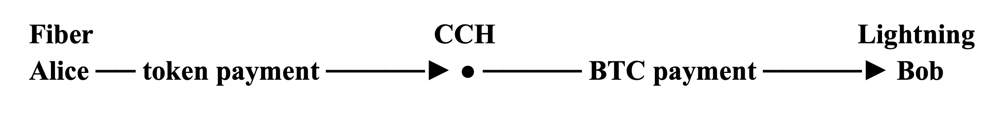

Payment channels, pioneered at scale by Bitcoin’s Lightning Network, allow participants to make repeated [payments off-chain](https://www.nervos.org/knowledge-base/how_off_chain_payments_work) while relying on the blockchain for opening, closing, and ultimately settling the channel. This makes frequent, low-value payments possible without recording every transfer on the base layer.

But making payments fast and cheap is only part of the problem. A useful payment network may also need to support different assets.

Alice might pay one service in bitcoin, buy something from a merchant that accepts a dollar stablecoin, and use another token inside an application. Supporting those payments requires more than simply recognizing different assets. The network also needs a way to route them, provide sufficient [liquidity](https://www.nervos.org/knowledge-base/how_liquidity_works_in_the_lightning_network), and ensure that the correct asset can ultimately be settled on-chain.

That raises several architectural questions:

Which asset is held in each channel? Which asset does the recipient want to receive? Which channels can carry that asset? Can one asset be converted into another along the payment path? And when a channel closes, how are the resulting balances settled on-chain?

Different payment networks answer these questions differently.

**Taproot Assets** and **RGB** extend the Bitcoin and Lightning ecosystem with additional systems for representing and transferring non-BTC assets. **Fiber Network**, by contrast, is built on CKB, where user-defined assets already exist as first-class on-chain state and can be used directly as payment-channel denominations.

Those different starting points produce meaningfully different approaches to multi-asset payments.

## Extending Lightning Beyond BTC

Lightning was originally designed around BTC-denominated payment channels. Supporting another asset therefore requires an additional system for identifying that asset, proving ownership, and tracking how its balances change as payments move through channels.

Taproot Assets and RGB both provide that additional asset layer, but they integrate with Lightning in different ways.

### Taproot Assets and Edge Conversions

Taproot Assets is a protocol for issuing and transferring assets on Bitcoin. Rather than placing the full asset history directly on-chain, it records cryptographic commitments inside Bitcoin transactions. These commitments allow Taproot Assets software to verify that the corresponding off-chain asset records are consistent with what has been anchored to Bitcoin.

In practice, Bitcoin continues to validate ordinary Bitcoin transactions, while Taproot Assets software handles the additional logic needed to identify assets, verify their ownership history, and track transfers.

To connect Taproot Assets with the wider Lightning Network, payments can use **Edge Nodes**. An Edge Node sits at the boundary between a Taproot Asset channel and ordinary BTC Lightning liquidity and provides the conversion between them.

For example:

**Alice ── stablecoin channel ──► Edge Node ── BTC Lightning ──► Bob**

Alice can send a stablecoin through a Taproot Asset channel to the Edge Node. The Edge Node then converts that value into BTC and forwards the payment through ordinary Lightning channels.

If Bob accepts BTC, the payment can end there. If Bob instead wants another supported asset, an Edge Node on the receiving side can convert the BTC payment again before delivering it to him.

The important consequence is that the middle of the route does not need to carry the original asset. Most of the payment can travel through existing BTC Lightning channels, while conversion happens at the edges.

That model avoids requiring every intermediate Lightning node to understand or hold the asset Alice is sending. The trade-off is that the Edge Nodes must provide sufficient liquidity for the conversion and determine an exchange rate. Taproot Assets uses a **Request for Quote (RFQ)** mechanism to obtain that price before the payment proceeds.

So, in the Taproot Assets model, different segments of the payment route can carry different assets: the asset at the edges, BTC through the Lightning network in the middle, and potentially another asset at the destination.

### RGB and Dedicated Token Channels

RGB takes a different approach. It is a smart contract protocol for Bitcoin that allows assets and other states to be defined and transferred without requiring Bitcoin nodes to validate that additional logic.

Instead, RGB uses **client-side validation**. The parties involved keep and verify the relevant contract history themselves, while Bitcoin provides the transaction history and cryptographic commitments that anchor those records.

To use RGB assets in payment channels, the RGB Lightning Node implementation extends Lightning software so that a channel can track RGB token balances alongside its Bitcoin state. Changes to the RGB asset are tied to the channel’s Lightning commitment transactions—the transactions that represent the latest enforceable state of the channel.

This allows an RGB-denominated payment to travel through multiple compatible channels:

**Alice ── Token A channel ──► RGB-compatible node ── Token A channel ──► Bob**

Unlike the Taproot Assets example above, Token A does not need to be converted into BTC in the middle of the route. It can remain Token A from sender to recipient.

The trade-off is that every channel along the route must support that RGB asset and have enough Token A liquidity in the correct direction to forward the payment. That makes the route more asset-specific than the Taproot Assets model, where the middle of the route can use ordinary BTC Lightning liquidity.

The RGB Lightning Node implementation is currently in early alpha, with testing documented on test networks.

Together, Taproot Assets and RGB illustrate two different ways of extending Lightning beyond BTC. Taproot Assets can convert between assets and BTC at the edges, allowing the middle of the route to use ordinary Lightning liquidity. RGB can instead keep the same asset throughout the route, provided each participating channel supports it.

## Fiber Network’s Native Multi-Asset Model

Fiber Network starts from a different foundation. It is built on Nervos CKB, where user-defined tokens already exist as on-chain assets with their own validation rules.

Fiber carries that asset model into its payment channels. A channel can be opened using CKB or a supported user-defined token as its denomination, allowing different assets to use the same underlying channel protocol without first being represented through a separate asset layer.

This is the sense in which Fiber is **natively multi-asset**: the network’s channel model is designed to work with assets that already exist at the base layer.

Fiber also connects with Bitcoin Lightning through its **Cross-Chain Hub (CCH)**. Together, these capabilities give Fiber two distinct pieces of multi-asset functionality: native support for CKB-based assets within Fiber channels, and a mechanism for connecting Fiber payments with BTC payments on Lightning.

*For a broader look at Fiber’s architecture, see* [*What is Fiber? A Complete Guide to the Next-Gen Payment Network*](https://www.nervos.org/knowledge-base/what_is_fiber).

### First-Class Tokens via the Cell Model

The foundation for this comes from CKB’s **Cell Model**.

[Cells](https://docs.nervos.org/docs/tech-explanation/cell) are the basic units CKB uses to store assets and other state. Each cell can contain data together with scripts that define how that state may be used. A **lock script** controls who is authorized to spend the cell, while a **type script** can enforce additional rules over its contents.

For a user-defined token, the type script identifies the asset and enforces its rules, while the cell’s data records the amount.

This means the asset already has a protocol-level identity before it ever enters a Fiber channel. Two stablecoins might both represent one US dollar, for example, but different type scripts identify them as distinct assets with different rules.

When a Fiber channel is funded with a user-defined token, the funding transaction places that token’s type script and amount into the channel’s funding cell. Fiber then carries that asset identity into the channel state while tracking how much of the token belongs to each participant.

The channel also reserves CKB for the on-chain cells and transaction costs needed to close the channel, but the payment balances themselves remain denominated in the selected token.

This is the key architectural difference from the Bitcoin-based approaches discussed above. Taproot Assets and RGB introduce additional systems for representing and validating non-BTC assets, then connect those systems to Lightning. Fiber instead builds on a base layer where user-defined assets already exist, and uses those assets directly as payment-channel denominations.

### How an Asset Moves Through The Fiber Network

Suppose Alice wants to send Carol ten units of Token A through Bob:

**Alice ── Token A channel ──► Bob ── Token A channel ──► Carol**

Alice and Bob have a channel denominated in Token A, and Bob and Carol have another channel denominated in the same asset.

When Carol creates an invoice requesting ten units of Token A, Fiber carries that asset requirement into the payment. The network then looks for a route through channels denominated in Token A with enough available liquidity in the direction of the payment. Channels denominated in other assets are not eligible for that route.

Ignoring fees, Alice’s balance decreases by ten units in her channel with Bob, while Bob’s balance on that side increases by ten. Bob then forwards ten units through his channel with Carol, increasing Carol’s balance by the same amount. Any routing fee charged by Bob is added on top of the ten units Carol requested.

Each hop therefore needs sufficient Token A liquidity in the correct direction.

This is a **same-asset payment**: Token A remains Token A from sender to recipient, and every channel along the route is denominated in that asset.

Connecting Fiber to Bitcoin Lightning introduces a different problem. The payment now has to cross between two separate networks that use different assets and channel protocols.

That is where the Cross-Chain Hub comes in.

## Connecting Networks: Inside Fiber’s Cross-Chain Hub

Fiber’s **Cross-Chain Hub (CCH)** connects payments between Fiber and Bitcoin Lightning.

A hub operator runs both a Fiber node and an LND node, maintains payment channels on each network, and provides the liquidity needed to move value between them.

Conceptually, a Fiber-to-Lightning payment looks like this:

The hub sits between two separate payment networks. Alice pays the hub on Fiber, while the hub pays Bob using its own liquidity on Lightning.

The important part is that these two payments are cryptographically linked.

### Linking the Two Payments

Both sides of the payment use the same **payment hash**, which is derived from a secret known as the **preimage**.

The payments are conditional: they can only settle when the correct preimage becomes available.

On Lightning, this condition is enforced through a [**Hash Time-Locked Contract (HTLC)**](https://www.nervos.org/knowledge-base/What_is_a_Hashed_Timelock_Contract). Fiber uses its corresponding **Time-Locked Contract (TLC)** mechanism. For CCH payments, both sides use [SHA-256](https://www.nervos.org/knowledge-base/SHA256_most_used_hash_function) for the payment hash, allowing the same preimage to satisfy the condition on both networks.

This shared secret is what links the Fiber payment to the Lightning payment.

Suppose Alice wants to pay Bob on Lightning.

Alice’s payment to the hub on Fiber is first accepted but left pending. The hub then uses its own Lightning liquidity to pay Bob.

When Bob successfully claims the Lightning payment, the hub learns the preimage. That same preimage allows the hub to settle Alice’s pending Fiber payment and collect the funds.

The sequence is therefore:

**Alice’s Fiber payment becomes pending → CCH pays Bob on Lightning → Bob’s payment succeeds → CCH learns the preimage → Alice’s Fiber payment settles**

The hub only settles the incoming payment after the outgoing payment has succeeded.

### Fiber → Lightning

For a Fiber-to-Lightning payment, Bob first creates a Lightning invoice.

CCH uses the payment hash from that invoice to create a corresponding Fiber invoice. Alice pays the Fiber invoice, but the payment remains pending.

Once the hub has accepted Alice’s payment, it pays Bob’s Lightning invoice using its own Lightning liquidity. A successful payment reveals the preimage, which CCH then uses to settle Alice’s pending payment on Fiber.

### Lightning → Fiber

The process also works in the opposite direction.

The Fiber recipient first creates a compatible Fiber invoice. CCH takes its payment hash and creates a Lightning **hold invoice** using the same hash.

A hold invoice can accept a Lightning payment without immediately settling it.

Once the Lightning payment is held, CCH pays the recipient on Fiber. If that payment succeeds, CCH receives the preimage and uses it to settle the pending Lightning payment.

In both directions, the recipient-side payment succeeds first. The secret revealed by that successful payment then allows the hub to collect the payment waiting on the other network.

Timeouts provide enough time for this sequence to complete. If the outgoing payment fails and the hub never obtains the preimage, CCH cancels the pending incoming payment instead of settling it.

### Asset Conversion at the Hub

The current CCH implementation also defines how amounts are translated between the two sides.

On Fiber, the hub operator configures a UDT representing “wrapped BTC” through its type script. The token uses eight decimal places, and CCH treats one smallest token unit as equivalent to one satoshi.

For example, a Lightning invoice for **1,000 satoshis** corresponds to **1,000 token base units**, plus the hub’s fee, on the Fiber side.

Lightning can represent even smaller amounts using millisatoshis, where one millisatoshi equals one-thousandth of a satoshi. When converting a Lightning amount into the Fiber-side token amount, CCH rounds these values up to whole satoshis. In the opposite direction, it converts the Fiber amount into millisatoshis after accounting for the hub’s fee.

CCH therefore allows Fiber users to reach recipients on Bitcoin Lightning, and Lightning users to reach recipients on Fiber, while each network continues to use its own payment-channel protocol.

In **v0.9.1**, this works in both directions for the configured UDT/BTC pairing. Support for native CKB and additional UDTs is part of the [broader multi-asset swap](https://github.com/nervosnetwork/fiber/pull/1257) work still under development.

## Conclusion

Payment channel networks already provide a way to make repeated payments without recording every transfer on-chain. Supporting multiple assets means enabling payments in the assets people want to use: A merchant may price goods in a dollar stablecoin, a service may accept bitcoin, and an application may use its own token.

Taproot Assets and RGB bring additional asset systems into the Bitcoin and Lightning environment. Fiber builds on CKB’s existing asset model and connects with Bitcoin Lightning through CCH. These different approaches extend the reach of payment channels, bringing their capacity for frequent, small transfers to a wider range of assets and applications. 
