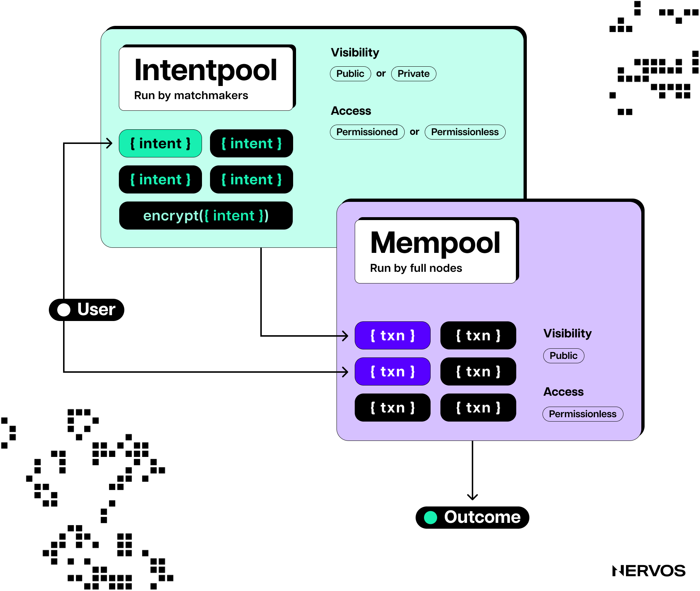
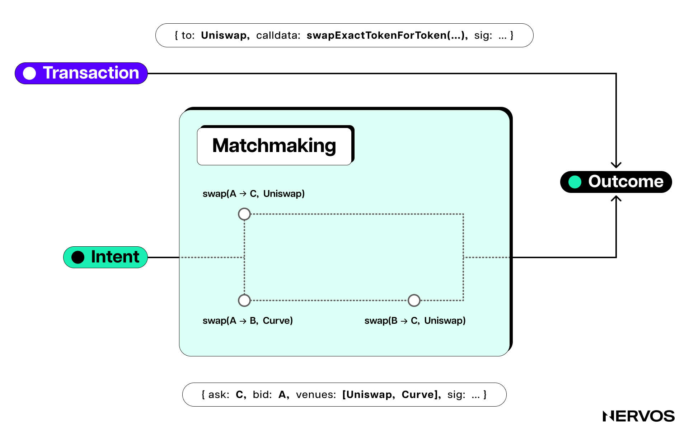
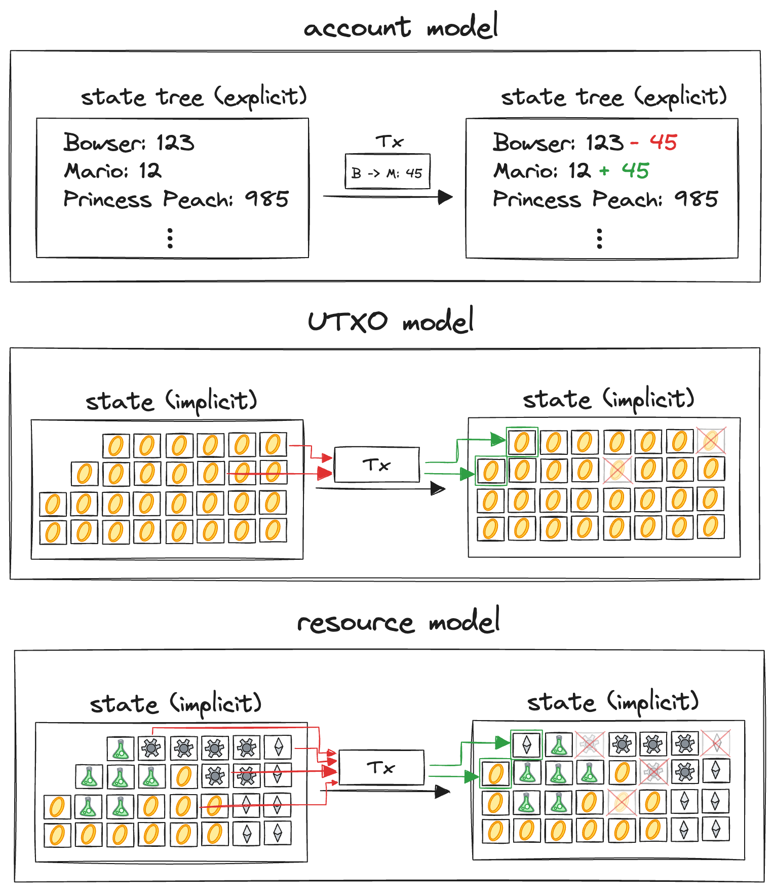

Time and time again, when developers building on account-based blockchains hit a roadblock, they’re forced to reckon with fundamental architectural choices underpinning these systems—only to find solutions to their problems already exist in the parallel universe of [UTXO](https://www.nervos.org/knowledge-base/utxo_vs_account_based) blockchains.

The latest in a series of such rediscoveries is the concept of “[intents](https://www.nervos.org/knowledge-base/what_are_blockchain_intents_%28explainCKBot%29),” which, in simple terms, are a special type of instruction that allows users to directly express a deterministic outcome for their transaction.

<blockquote class="twitter-tweet">
Many intent-centric protocols today emerge from Ethereum (on chain execution) ecosystem. Thus, things like off-chain state transition generation + on-chain verification seem like novel ideas.  But those who come from UTXO world know that this is how things began, and extended…
&mdash; Tak Boglantane (@TannrAllard) <a href="https://twitter.com/TannrAllard/status/1775728744453357778?ref_src=twsrc%5Etfw">April 4, 2024</a></blockquote> 
While Bitcoin already functions this way, the typical peer-to-contract transaction today only allows for specifying the _inputs_ to a transaction, while the _outcome_ is impossible to control. This is referred to as an “imperative” programming paradigm, in which a user specifies exactly the steps the virtual machine must take but can not control the outcome of the transaction. 

Considering that users only care about the outcomes of their transactions, it would be reasonable to assume that most blockchains are designed with this reality in mind. Unfortunately, however, this is far from the case. With the exception of UTXO-based blockchains like Bitcoin, CKB, Cardano, Ergo, and others, a majority of our world’s actual blockchain transactions only specify inputs rather than outcomes.

With blockchains memetically destined to secure trillions of dollars, it’s impossible to understate the magnitude of this disparity. The uncertainty produced by the imperative approach is undeniably bad for users. It is the culprit behind costly failed transactions and unexpected loss of funds. 

In the last two years, developers from these ecosystems have begun to appreciate the importance of specifying outcomes in transactions, and thus, “intents” have arrived.

The imperative blockchain world brought us the “MEV Supply Chain,” and these intent projects seek to re-envision the stack, focused on user-expressed outcomes instead of execution steps. Some of the most notable of these projects include solver infrastructure provider [Khalani](https://khalani.network/), intent networks [1inch](https://1inch.io/), [Anoma](https://anoma.net/), [Across](https://across.to/), [Aori](https://www.aori.io/), [Aperture](https://aperture.finance/), [Bebop](https://bebop.xyz/), [Brink](https://www.brink.trade/), [CowSwap](https://cow.fi/), [DeBridge](https://debridge.finance/), [Everclear](https://www.everclear.org/) (formerly [Connext](https://www.connext.network/)), [FastLane Atlas](https://github.com/FastLane-Labs/atlas/tree/main), [Flashbots](https://www.flashbots.net/), [Flood](https://www.flood.bid/), [Intentify](https://www.intentify.network/), [IntentX](https://intentx.io/), [Mycel](https://mycel.land/), [Paraswap](https://www.paraswap.io/), [Particle](https://particle.network/), [RainLang](https://rainlang.xyz/), [RouterProtocol](https://www.routerprotocol.com/), [Shogun](https://twitter.com/shogunfi), [Socket](https://www.socket.tech/), [Symm](https://symm.io/), [UniswapX](https://uniswap.org/), [Valantis](https://valantis.xyz/), and the intent-centric chain [Essential](https://essential.builders/).

## Why Do Blockchains Need Intents?

To understand intents, how they are designed, and the recent fuss around them, one must first understand the problem they're trying to solve.

In account-based blockchains, there is a natural tension between the network's objectives and the users' needs. The network's priority is achieving consensus over the system's state. Given an initial state and a list of transactions (imperative user instructions), any node can compute the next state following the protocols' rules. By following the same protocol rules and operating the same VM, all nodes get the same computational results, leading to network-wide consensus on the system's state.

[_Understanding intents at a deeper level necessitates fundamental knowledge of the architectural differences between UTXO and account-based blockchains. Our article, [How to Optimize Layer 1 Blockchains for Modularity](https://www.nervos.org/knowledge-base/optimizing_layer_1_for_modularity#blockchains_are_for_verification%2C_not_computation), is a great resource on this topic._]

On the other hand, the users’ priority is to effect a desired outcome. When it comes to simple peer-to-peer payments, things are generally fine, as these transactions are entirely explicit. They specify the exact state changes that need to be made and prove that the user or signer has the permission to make them. 

However, smart contracts complicate things. The outcomes of peer-to-contract interactions are unpredictable. They are affected by the internal state of any contracts the transaction directly interacts with, as well as the state of every contract those contracts interact with. This is all affected by transaction ordering, which is at the whim of builders, miners, relayers, and/or validators.

Any user of a web3-style decentralized finance application understands what this means. The moment a token swap transaction on an AMM-based DEX is signed, it’s sent out there—into the ether—a user powerless over its destiny. 

Until [confirmation](https://www.nervos.org/knowledge-base/transaction_confirmation_in_blockchain_(explainCKBot)), a user can only pray for a desired outcome: a successful swap of one amount of token for another, or the dreaded red text of “Failed” and the ensuing frustration of a lost fee and the need to make another transaction.

## Explained Through An Analogy

The complexity of the intricate web of smart contracts can make it tricky to predict the environment in which a transaction will actually occur when it is accepted in a block. Thinking in an analogy can help to appreciate the challenge the imperative paradigm introduces: 

In the real world, people typically express their desire to transact declaratively, e.g., I will pay $20 for a double cheeseburger delivered to my door by 8 PM. However, in the blockchain world, users are forced to send imperative instructions: Hop into your car, go to the McDonald's restaurant around the corner, order a double cheeseburger, and bring it to my address; here's $20, $18 for the burger, and $2 for fuel.

The imperative paradigm forces the user to dictate the execution path that they anticipate would lead to their desired outcome, while the declarative paradigm allows the user to express a preference for a specific outcome. 

Going back to the real-world analogy, in the imperative paradigm, if the McDonald's restaurant around the corner is closed, even though many others nearby are open, the transaction will fail. If the delivery driver doesn't have a car, the transaction will fail, even though they may have had a scooter or a bike. Suppose the burger is $19 and the fuel is $1, again, the transaction will fail, even though the customer's $20 is enough to cover the total expenses. 

Moreover, it's important to consider here that the users' imperative instructions (transactions in account-based chains) are applied to a specific state, which determines the outcome, and that state can change between when a user sends the transaction and the moment a validator picks it up for execution. 

Using our real-world analogy again, suppose the driver accepts the order and heads off to the McDonald's around the corner. The delivery of the burger depends on the correlated "state" of the driver's fuel tank status, the traffic on the road, and the availability of double cheeseburgers at the specific restaurant, among many other things.

If the driver does not have enough fuel to reach McDonald's, he may be able to use the $2 to purchase fuel. However, the cost of fuel is determined by other factors, i.e., "the state of other contracts." If, for some reason, the driver cannot obtain the fuel needed to reach McDonald's, the transaction would fail solely due to an unforeseen complication from the contract state at a distance, while the user will still be on the hook for the delivery fees.

This is because the user gave the service provider specific execution instructions instead of a goal, which could be satisfied in a multitude of ways.

The uncertainty produced by the imperative approach is undeniably bad for users. It creates a long list of negative results, including failed or reverted transactions, undesirable state changes or outcomes, [MEV](https://cryptobriefing.com/what-is-mev-ethereums-invisible-tax-explained/), and high slippage. For this reason, and in a bid to improve the UX for users, researchers and developers working on account-based blockchains have sought to implement the declarative paradigm via "intents"—a novel blockchain primitive that allows users to express their desires in terms of _outcomes_ instead of execution steps.

Whereas in the standard transaction-based imperative paradigm, transaction signatures permit validators to follow exactly one computational path against an initial state, intents express a goal preference via constraints on state changes, allowing the intent recipients to choose a computational path that satisfies the users' goal on their behalf.

## Intents in Account-Based Blockchains

Using Ethereum as an example of an account-based blockchain, the most apparent and immediate channel for intents to find their way into the hands of willing middlemen for inclusion on the blockchain would be the Ethereum [mempool](https://www.nervos.org/knowledge-base/mempool_in_cryptocurrency_(explainCKBot)), a database of published but unconfirmed transactions independently maintained by each node. 

However, the Ethereum mempool doesn’t support the propagation of intents; it only supports transactions, which the network then attempts to execute prima facie.

For this reason, most intent-based architectures have been designed with separate mempools that allow for the propagation of intents between various nodes in the system. This approach entails outsourcing transaction execution to specialized parties called solvers, who attempt to most closely approximate and execute the users’ preferred desires expressed declaratively.

Suppose someone wanted to trade 0.3 native ETH for an equivalent amount of MEME tokens on Avalanche. Typically, they’d think about creating a transaction to bridge ETH to Avalanche, then finding a DEX that hosts an ETH:MEME liquidity pool, and then finally initiating a swap transaction. 

Suppose, however, that the only token pair available was AVAX:MEME. This would require swapping ETH for AVAX and then AVAX for MEME. Each step of the process will require a separate transaction and fee on the respective chain.

Understandably, finding the optimal path to an outcome can be challenging for even experienced crypto users, which is why the primitive of intents has been gaining momentum in the past year, with over 26% of Ethereum’s order flow now originating from intent-based protocols.

 \
_Order flow data indicates that roughly 26% of Ethereum transaction-based orders go through intent-based protocols. Source: [Flashbots](https://dune.com/queries/3362105/5642598)._

With intents, there’s no need to go through all of the steps in the example manually, intent-based applications allow users to express their desired outcome in a declarative manner, i.e., I want at least 420,000,000 MEME tokens on Avalanche, here is 0.3ETH waiting in this Ethereum contract.

Depending on the app’s specific design (permissioned or permissionless mempools), an intent then finds its way—in one way or another—to a solver, who then works to find the optimal or least expensive/most profitable path to the fulfillment of the user’s goal. 

More importantly, the solvers are, at least in theory, supposed to maximize the users’ utility with respect to their stated objective and not simply satisfy their intent. While these systems promise to significantly improve user experience and outcomes, we can already see some challenges emerging.

Most notably, the existing intent-based projects on Ethereum allow users to declaratively express intents only ostensibly. In actuality, their intents are registered and fulfilled on an imperative state machine. Due to the account model’s inherent limitations, intent-based projects can’t unequivocally guarantee intent outcomes—as they’re still ultimately executed as imperative transactions—meaning that users still face some degree of transaction unpredictability.

Additionally, the introduction of an additional third party, the solvers, as middlemen between the users and the validators, raises a whole new set of potential issues, including increased centralization and solver/relayer MEV. Most of these issues arise due to the misalignment of the incentives between the users and solvers.

A good real-world analogy to illustrate the incentives misalignment problem is taxis. Namely, while giving a taxi driver the exact route to the desired destination may lead to an optimal and predictable outcome, it’s often burdensome and not always feasible. After all, passengers—especially tourists visiting new cities—rely on taxis because they don’t always know how to get to where they want to go. 

However, similar to the “trust the solver” approach in intent-based systems, trusting drivers to pick the route can end up being excessively costly. This is because the passenger wants to pay the least amount of money and get to their destination as fast as possible, while the driver wants to make the most amount of money, which often means running up the meter by taking a longer route. In the case of intent-based architectures, the solvers are profit-motivated entities, meaning they’re incentivized to execute the intents that best serve them and not the users.

While intent-based projects, like taxi systems, have mechanisms in place to keep the solvers honest, these aren’t simple or easy to design and may still lead to centralization or solver monopolies. 

Intent-based projects typically fall into two categories: permissioned and permissionless, based on how the intents are propagated or delegated to solvers. The former utilize permissioned mempools accessible only to a small number of trusted solvers who typically have reputations attached to them, serving to keep them honest. However, the execution quality in these systems is only guaranteed as long as the trust assumptions hold, and strong trust assumptions are antithetical to the whole blockchain ethos. 

On the other hand, projects in the permissionless category outsource intents to a competitive market of solvers, which lessens the trust assumptions and may temporarily avoid centralization. However, in the long term, as solvers specialize in serving specific market niches, there’s a tangible risk they may still end up monopolizing them. 

Early research has even shown that the role being played by solvers may be [conducive to centralization to maximize user benefit](https://arxiv.org/pdf/2403.02525).

## UTXO: Declarative Supremacy

<em>“In current smart contract systems based on the account model, contracts do not share common knowledge about the transaction in which they are executing, nor do they share common knowledge about how to interpret the meaning of other contracts. The interoperability of modern smart contract systems is consequently superficial and fundamentally limited in their ability to facilitate intent-centric interactions. This is a great example of how the design decisions at the base layer of a system cannot be perfectly abstracted away.” — <a href="https://blog.khalani.network/intents-solvers-and-everything-aggregators">Tannr Allard</a>, CTO at Khalani Network</em>

Transactions in UTXO-based chains are declarative in nature, meaning an intent-centric paradigm emerges naturally. This difference in programming paradigms does carry a learning curve for developers building decentralized applications, but it also provides out-of-the-box solutions for the many problems that many account-based blockchain researchers are consumed by: [parallelism](https://www.nervos.org/knowledge-base/utxo_vs_account_based#key_differences_in_utxo_vs._account-based_blockchains), privacy, intents, and [local fee markets](https://www.helius.dev/blog/solana-fees-in-theory-and-practice).

In fact, Bitcoin is the first declarative blockchain, but due to its lack of expressiveness, it is not typically mentioned in the context of intents. However, the [SegWit](https://github.com/bitcoin/bips/blob/master/bip-0141.mediawiki) and [Taproot](https://lists.linuxfoundation.org/pipermail/bitcoin-dev/2018-January/015614.html) upgrades significantly improved Bitcoin’s programmability, leading to [the rise of ordinals, inscriptions](https://www.nervos.org/knowledge-base/guide_to_inscriptions), Atomicals, Runes, and a whole ecosystem of Bitcoin Layer 2 networks. More recently, there have even been proposals for the potential introduction of intent-based trading infrastructure.

<blockquote class="twitter-tweet">
The entire Bitcoin eco is going to be intents driven *by default*. There’s simply no other ways possible - it’s not just UX, but also about standards and app integration. It’s built-in for the UTXO model.  Programmable liquidity and market making is going to be enabled by…
&mdash; knwang (@knwang) <a href="https://twitter.com/knwang/status/1780393428745887754?ref_src=twsrc%5Etfw">April 17, 2024</a></blockquote> 

Namely, the inventor of [Ordinal Theory](https://docs.ordinals.com/), Casey Rodarmor, recently published a [blog post](https://rodarmor.com/blog/light-pools/) outlining an idea for what is essentially an intent-based system for decentralized trading of Bitcoin-native assets called light pools. “The idea behind light pools is simple,” he wrote, explaining that users who want to trade Bitcoin-native assets like rare sats, inscriptions, or runes can run nodes that quote prices for swaps. 

The quotes are signed messages (essentially “intents”) gossiped between other light pool nodes. When market takers want to accept a market maker's quote, they use the information in the message to construct a partially signed Bitcoin transaction ([PSBT](https://river.com/learn/what-are-partially-signed-bitcoin-transactions-psbts/#:~:text=A%20Partially%20Signed%20Bitcoin%20Transaction%20(PSBT)%20is%20a%20Bitcoin%20standard,easily%20sign%20the%20same%20transaction.)) that includes their signature and broadcast it to the light pool network. When the maker receives the PSBT, they counter-sign it and broadcast the final transaction to the Bitcoin network to be mined.

In this scenario, the quote messages express the users' desire for a specific outcome, e.g., "I want to sell this rare sat for 0.001 BTC." The intent is then sent to a network of nodes that effectively act as their own solvers, accumulating their own order books. Once the [PSBT](https://www.nervos.org/knowledge-base/what_is_a_partially_signed_bitcoin_transacion_%28explainCKBot%29) is counter-signed and broadcasted to the Bitcoin network, its fate is sealed, i.e., the outcome is determined. 

This is because a Bitcoin transaction, or for that matter, a transaction on any UTXO-based chain, is nothing more than two lists of state changes and authorization information. Once it's mined, it can't revert or fail, as the network doesn't compute implicit instructions to arrive at an explicit state like imperative blockchains do, but merely verifies an explicit transaction to arrive at an implicit state.

<blockquote class="twitter-tweet">
Explicit is better than implicit
&mdash; James Prestwich (@_prestwich) <a href="https://twitter.com/_prestwich/status/927950141620854784?ref_src=twsrc%5Etfw">November 7, 2017</a></blockquote>  

In other words, in account-based blockchains, transactions only state the action or a function call with parameters. This is essentially a computation request, where the actual state is computed (in sequential order) and inferred from the blockchain. On the other hand, in UTXO-based chains, all the states are included in the transaction. The blockchain only verifies (which can be done in parallel, allowing for better scaling) the transaction to ensure submitted data are in the correct format. 

In even simpler terms, in UTXO-based chains, transactions express the state changes that users want to see, and they're either settled as defined or not settled at all. In contrast, transactions in account-based chains authorize a specific execution path or express the computation that users want the chains to do, hoping that they'll result in a state change that they want to see, with no real control over the end result. 

Or, as James Prestwich put it in a [tweet](https://twitter.com/_prestwich/status/1151883351046815744): “Ethereum transactions can internally fail while being applied (revert), and their effect may be different if applied to different states. Bitcoin transactions can't revert, and their effect is always the same no matter what state they're applied to.”

This declarative property of UTXO chains went largely unnoticed until the primitive of intents was introduced. Luckily, more recently, UTXOs seem to be gaining wider recognition and appreciation among builders of intent-centric architectures. [Anoma](https://anoma.net/), a project building a unified intent-centric architecture for decentralized applications, is a good example of this. The [Anoma Resource Machine](https://anoma.net/blog/rise-of-the-resource-machines#the-role-of-the-arm-in-anoma) (ARM), part of the Anoma protocol that defines and enforces the rules for valid state updates that satisfy users' preferences, uses so-called “resources” as its atomic unit or fundamental data structure.

The resource model draws heavy inspiration from the UTXO model and functions in much the same way. However, unlike the Bitcoin UTXO model, which sees UTXOs as currency units and is limited in expressivity to that context, the resource model is generalized and provides much greater expressivity.

 \
_Comparison between the account, UTXO, and Anoma’s resource data models. (Source: [Anoma.net](https://anoma.net/blog/rise-of-the-resource-machines#the-role-of-the-arm-in-anoma).)_

This is because each resource has a predicate associated with it, called resource logic, that declaratively sets the conditions under which the resource can be created and consumed. The conditions or the resource logic set by the predicates can include authorization requirements, relations with other resources, and so on. By imbuing UTXOs or “resources” with predicates, developers can build sophisticated intent-centric decentralized applications that allow for deterministic outcomes.

<blockquote class="twitter-tweet">
Fuel enables intents via predicates.  You can do things like, make a UTXO spendable only when certain conditions are met by any party.  This is perfect for order book exchanges. But could be used in a general purpose way for a multitude of things.
&mdash; nick.sway ⛽️ (@IAmNickDodson) <a href="https://twitter.com/IAmNickDodson/status/1661079953339760649?ref_src=twsrc%5Etfw">May 23, 2023</a></blockquote> 

Another example of the increasing appreciation for the UTXO model is Fuel, a UTXO-based Ethereum Layer 2. Fuel actually pioneered the primitive of [predicates](https://medium.com/@compolabs/predicates-on-fuelvm-enabling-a-new-dex-paradigm-fa013baed9f7), which, in simple terms, are stateless programs or delegate functions that return either True or False based on transaction input and output metadata. Fuel uses predicates very differently from Anoma, but much to the same purpose: to unlock unprecedented [expressivity](https://medium.com/blockchain-capital-blog/the-power-of-predicates-73f874cfa9a5) while retaining many of the UTXO model and verification-centric chain’s benefits, including parallelism, declarative transactions and applications, and so on.

Speaking of Fuel, in a 2020 [forum post](https://forum.celestia.org/t/accounts-strict-access-lists-and-utxos/37), John Adler, co-founder of Fuel and Celestia and advisor at [Essential](https://blog.essential.builders/essential-the-first-declarative-blockchain/), a project that markets itself as “the first declarative blockchain,” demonstrated that, leveraging covenants, UTXO-based chains can achieve the same smart contracting capabilities as account-based chains.

<blockquote class="twitter-tweet">
UTXOs are basically strict access lists. This means parallelism. You can also get way better state access patterns.  In addition to that, you can ask yourself: &quot;what EVM features should be removed/changed?&quot; and &quot;what EVM operations are mispriced?&quot;<a href="https://t.co/KC4NDj0Zqr">https://t.co/KC4NDj0Zqr</a>
&mdash; John Adler | ✨🧱🟣⛺ (@jadler0) <a href="https://twitter.com/jadler0/status/1365271411372265475?ref_src=twsrc%5Etfw">February 26, 2021</a></blockquote> 

For the uninitiated, a [covenant](https://fc16.ifca.ai/bitcoin/papers/MES16.pdf) is a crypto primitive that allows a transaction to enforce conditions on future transactions. For example, using a covenant, one could restrict how the value they transfer with a transaction can be used in the future, i.e, requiring a timelock, escrow function, or any other spending condition. 

_[[This](https://blog.casa.io/why-bitcoin-needs-covenants/) is an excellent resource for anyone looking to dive deeper into covenants and their potential use cases.]_

More importantly, as Adler demonstrated, covenants can be used to create _contract UTXOs_ that have the same expressivity as Ethereum smart contracts, with additional benefits that come out-of-the-box for UTXOs, like [parallelism](https://twitter.com/jadler0/status/1531402751929982985).

## Examining CKB

While enabling covenants on Bitcoin has been a [long-debated issue](https://blog.casa.io/why-bitcoin-needs-covenants/), other UTXO-based chains, including Nervos Common Knowledge Base (CKB), have enabled them for years. CKB’s data model, called the [cell model](https://medium.com/nervosnetwork/https-medium-com-nervosnetwork-cell-model-7323fca57571), is a generalized version of the UTXO model. It includes state constraints via Lock and Type scripts, transaction introspection, and state storage with no fixed structure, leaving the layout entirely to developers.

_“CKB inherits the ideas of Bitcoin’s architecture and creates the Cell model from generalizing the UTXO model, retaining the consistency and simplicity of Bitcoin. In Nervos CKB, all the states are stored in Cells, all computation is done off-chain, and all the verification work is handled by nodes.”_

The cell model, combined with the exceptionally flexible nature of CKB’s RISC-V-based virtual machine, [CKB-VM](https://www.nervos.org/knowledge-base/nervos_overview_of_a_layered_blockchain#ckb-vm%3A_a_virtual_machine_built_using_the_risc-v_instruction_set), gives CKB endless potential. Type scripts are typically used to implement validation logic for the cell’s transformation (think state transitions), while Lock scripts define the spending conditions (which can include any arbitrary rules beyond signature verification).

To understand how CKB’s novel data model enables intents, one only needs to look at [Open Transactions](https://talk.nervos.org/t/ckb-open-transaction-otx-cobuild-protocol-overview/7739) (OTX). OTX is intended to be a common-use implementation of intents on the cell model. 

The OTX solution works by allowing users to create an “open transaction” where they only declaratively express their intention (intent)—through a special signature in the witness field of the OTX that includes their requirements to complete a transaction—instead of constructing a complete transaction.

To better understand how OTXs work in practice, comparing them with traditional coin swap transactions is warranted. With a conventional transaction, a coin swap between two parties can only be successful and safe if they both agree to sign the same transaction. Essentially, such a transaction states, “I want to exchange two coins A for three coins B, but the three coins B must come from Alice, and if Alice exchanges the three B coins with Bob first, then the deal between Alice and me is null.” While this succinctness can be very beneficial in some cases, it’s very limiting when it comes to decentralized on-chain trading.

In contrast, an OTX allows users to express intent declaratively, i.e., “I want to exchange these two A coins for three B coins.” The user doesn’t care where the B coins come from or who brokers the trade; they sign the intent and broadcast it to a mempool where automated agents or solvers can work to fulfill the intents and later form CKB transactions.

It is important to note here that, unlike in Ethereum, where solvers eventually transform intents into imperative transactions, OTX intents are expressed declaratively and settled deterministically, meaning they’re either executed as is or not executed at all. 

The OTX architecture is extremely powerful because the solving of the intent is not constrained by anything. Instead, developers can use the OTX protocol to source liquidity from different dapps and potentially even chains to fulfill the intent.

Finally, a key feature of the UTXO model comes to light: intents can be expressed in-protocol, whereas in account-based chains, they must be expressed out-of-protocol. And, for what it’s worth, the off-chain intent-centric infrastructure on account-based chains would more or less have to resemble the UTXO model, if ought to be done right. Anoma is a straightforward example of this.

## Conclusion

Everything considered, it’s safe to assume that the future of Web3 UX will be based on intents. However, if that’s the case, then account-based blockchains will certainly be fighting an uphill battle against UTXO-based chains. For the latter, intents represent a natural development—almost a necessity that arises as a natural consequence of their core architecture. 

In contrast, intents in account-based chains almost seem like an attempt to force a square peg into a round hole; the underlying architecture simply isn’t a fit. This is perhaps best evidenced by the fact that some of the most prolific intent-centric projects, like Anoma, have turned their focus back to generalized UTXOs, and some of the latest UTXO-based chains, like Fuel, see intents as a natural extension of their transaction models.

Beyond being genuinely compatible with intents, UTXOs offer numerous other benefits, including multi-user transactions, parallel transaction execution, a cryptographically authenticated state without a global state tree—which makes it easier to construct trust-minimized light clients and fraud proofs, verification-focused instead of computation-focused, and immutable smart contracts. All of this means genuine determinism or predictability and better security, scalability, and decentralization.

Analyzing the history or developmental evolution between these two largely separate worlds, it seems that the UTXO camp seems to always be right on a long enough timeframe, which isn’t surprising, given that this industry was birthed out of the historic and long-lived success of Bitcoin.
