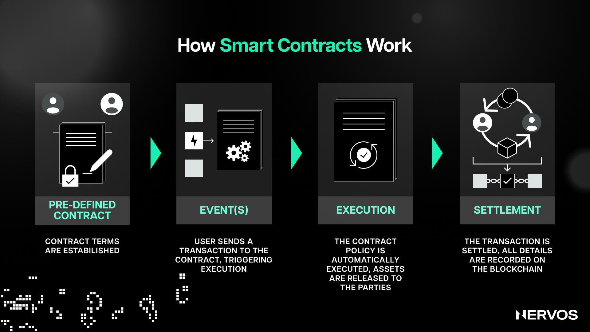

One strand of thinking that has become popular in crypto land recently is that the only way for blockchains to solve the [Scalability Trilemma](https://www.nervos.org/knowledge-base/blockchain_trilemma)—or obtain the trifecta of high security, decentralization, and scalability—is to adopt a layered or modular architecture. 

This design implies separating transaction execution, consensus, and data availability into [separate layers](https://www.nervos.org/knowledge-base/layer_1_vs_layer_2) to achieve high transaction throughput, without sacrificing decentralization and security. Not only is this kind of layer separation an excellent idea, but as things currently stand, it seems like it's the only viable way to achieve this goal.

For this reason, many smart contract platforms, which were designed as monolithic and initially dismissed this approach, have recently shifted course and embraced this path toward scaling. This has naturally raised a very important question: what role should Layer 1 blockchains play in an industry increasingly moving toward modularity?

If we're going to address the blockchain scalability trilemma through the principle of separation of concerns, then what should the ideal Layer 1 in a [modular blockchain](https://www.nervos.org/knowledge-base/nervos_overview_of_a_layered_blockchain) stack be concerned with? After all, the principle implies separating software into specialized components according to functionality and responsibility. If monolithic chains have tried to be jacks of all trades only to end up masters of none, in layered networks, reason would say each layer must have its own specialty. So, for a Layer 1, what should that specialty be?

## Blockchains are for Verification, Not Computation

Before we can answer the above question, we have to ask what blockchains are good for in the first place.

The massive success of Ethereum has popularized the idea of smart contracts as “a general-purpose computation that takes place on a blockchain." This idea, however, wasn't always popular, and to understand how it came to be, we have to start with Bitcoin.

The Bitcoin blockchain was originally designed with a straightforward single purpose: to move bitcoins from one owner to another. However, once the network was up and running, people started doing other things on top of it, including embedding metadata in transactions to create new assets and protocols. Soon enough, other projects like Ripple and Stellar started popping up, seeking to overcome Bitcoin's programmability and scalability limitations and support a broader range of activities, including creating user-created assets, decentralized exchanges, and inter-bank transfers.

However, these were still application-specific blockchains with quite limited capabilities, and after losing patience working with the Mastercoin protocol on top of Bitcoin, Vitalik Buterin, creator of Ethereum, set out to create a single, public, “Turing-complete” blockchain—one with general-purpose programmability. In late 2015, Ethereum was born, allowing anybody to create a smart contract—a general purpose program associated with a small database that can only be modified by the program that owns it—on the blockchain.

When a smart contract is created on Ethereum (or any other [account-based](https://www.nervos.org/knowledge-base/utxo_vs_account_based) smart contract platform, for that matter), it sets up the initial state of its database and then stops and idles until it's called upon. Users can call the contract into action by sending it a message (using a transaction). Depending on the contract's internal code, it can do all sorts of things, including triggering other contracts, modifying its database, or sending various responses to the caller. The key point to note here is that all of these steps are performed or computed independently on every node in the network, with identical results.

On the surface, doing all sorts of computation via smart contracts on the blockchain seems like a very powerful and good idea. However, this concept quickly turns sour when one starts thinking about what blockchains actually are and what they're meant to do.

Namely, it turns out that computation is—by its very nature—unpredictable, meaning it's impossible to determine in advance by simply looking at the program what its outcome will be or whether it will ever finish running once deployed. This wouldn’t work in a blockchain setting, where every node needs to agree on each block.  \
 \
Thus, smart contract platforms solve this issue by introducing transaction fees or "gas" for computing. More specifically, every blockchain transaction states up front how much of the sender's gas (typically paid in the blockchain's native currency) can be spent on processing it. The fee is then gradually spent as the contract executes, step-by-step, within the smart contract platform's virtual machine. Suppose the transaction runs out of gas before it's finished executing. In that case, any database changes are reverted, meaning no permanent changes in the blockchain's state are made, and the gas is consumed. In this way, users can only burden the network to the extent they're willing to pay for it.

Smart contract platforms like Ethereum face another fundamental issue called concurrency. Concurrency refers to a system's ability to process different tasks out-of-order or in partial order without affecting the outcome. In the context of blockchains, a network with good concurrency can process many transactions in parallel, leading to great benefits in scalability.

However, smart contracts have a challenge when it comes to concurrency, because they need access to the global state (information stored on the other contracts on the blockchain) to function properly. This means that if two smart contracts are executing simultaneously, and they both try to modify the same piece of data, a conflict can occur. This issue is known as a race condition, and to solve it, smart contract platforms must execute transactions one at a time, in a specific order. This serial execution (opposite of concurrent execution) ensures that all transactions are processed correctly and in the same way and order by all nodes, but it also significantly slows down the blockchain because the network can't process multiple transactions at the same time (this also increases the amount of time it takes for a new user to sync a node).

These issues point to a simple fact that has been well understood in Bitcoin's highly technical community for years: blockchains are terrible for computation. The reason for this is simple and determined by the very nature of blockchains, which are designed to provide a decentralized, trustless system for _verifying_ transactions, and not for handling large-scale _computation_ or data storage tasks.

### **The Difference Between Computation and Verification**

Computation is a stochastic process that involves executing a set of instructions or a program, which can be complex and require arithmetic calculations, data manipulations, and logical comparisons, which require significant processing power. The result of a computation is a new blockchain state based on the input and the rules defined in the protocol or contract. For example, executing a smart contract may involve multiple operations, loops, and condition checks, which may require many CPU cycles and be computationally expensive for individual nodes. Additionally, the computation results often need to be stored, which adds an additional burden on nodes regarding memory and disk space requirements.

Verification, on the other hand, is a deterministic process that involves checking the correctness or validity of a result against a known standard or set of rules, which is significantly less resource-intensive than performing original computations. For example, verifying the validity of a simple blockchain transaction involves checking a digital signature, and verifying the validity of a block involves checking whether the proof of work a miner has broadcasted to the network meets the protocol's current difficulty target. Both are single operations that require very little computation.

Complex general-purpose computation simply doesn't make sense in this paradigm because blockchains decentralize things by replication, not by distribution. It would make sense to distribute heavy computational tasks amongst the many nodes in the network by providing them with different bits of the task (this was the premise behind scaling through “sharding,” an idea that has mostly [fallen out of favor](https://ethereum.org/en/roadmap/#what-about-sharding))—but not to make them calculate the same thing altogether—which is precisely what blockchains do. Verification, on the other hand, makes sense because it's not resource-intensive, and replicating this task across the whole network is the only way to ensure trustlessness.

All of this is to say that introducing serial execution and gas limits and requirements for executing transactions is a way of artificially bounding the complexity of computation blockchains can do from the get-go to deal with the fact that they can't do complex calculations in the first place.

### **A Different Way to Think About Blockchains**

Considering the above, a better way to think of blockchains is by likening them to courts. 

One way of ensuring that no one could be defrauded in a transaction would be for everyone to do all of their trades before a court so that an impartial and perfectly trustworthy judge can ensure that nobody cheats or fails to do what they've promised. However, if everyone takes all of their transactions to court, the courts will get overcrowded (because they don't scale particularly well), and people will have to wait unacceptable times to have their transactions approved by them. To solve this issue, people could—instead of taking every single transaction before the court (the whole network)—organize their business engagements with contracts and record keeping so that only in the case of a dispute would they need to go before a court to settle their grievances. This way, everyone can settle their transactions on time without overcrowding the court.

This analogy perfectly describes how layered blockchains work. Instead of executing and verifying all of the transactions on a single layer, modular blockchains separate these functions into different layers, where the Layer 1 is used for verification and final settlement, and Layer 2’s are used for transaction processing. 

Namely, blockchains rely on block producers (miners or validators) to bundle transactions into blocks. However, without checks and balances, malicious block producers could include fraudulent transactions in a block (for example, minting tokens out of thin air). To prevent this, blockchains rely on a network of full nodes, to independently determine the validity of a block before adding it to their version of the chain.

The problem with monolithic blockchains is that computation or transaction execution and verification are performed by the same entities (validators/miners, i.e., full nodes). When a user broadcasts a transaction, a validator or miner will compute/execute it and include it in a block. When the block is created and propagated, other full nodes will download it and re-execute all of the transactions in the block to confirm they're valid. If the block is valid, honest nodes will append it onto their version of the blockchain, thereby attesting to its validity. 

Monolithic blockchains' scalability is severely limited by this design because, to increase transaction throughput, the block size and/or frequency of the blocks must be increased, which in turn raises the resource requirements for full nodes. Processing bigger and faster blocks requires more computation, which leads to higher costs. Unlike block producers, full nodes aren't rewarded for their services, meaning they have no financial incentive to incur higher costs. This predicament naturally leads to more network participants opting out and running light nodes, which don't download the full blockchain and verify that all previous transactions are valid, but instead, blindly assume that the majority of hashpower or stake is honest. Moreover, even running light nodes is the optimistic scenario, as the reality on the ground shows that most smart contract platform users rely on centralized RPC providers to connect to the blockchain instead of running any type of node themselves.

In short, when block production (transaction execution) and validation are coupled, increasing the throughput necessarily increases the centralization of block validation or full nodes, representing a significant risk to the network. This beats the whole purpose of blockchains, which are systems that are supposed to ensure trustlessness, censorship resistance, and permissionlessness via decentralization. Blockchains must remain decentralized because decentralized systems are (i) less likely to fail, due to relying on many separate components that operate independently (fault resistance); (ii) more expensive to attack, destroy, or manipulate because they lack central points of failure; and (iii) are more collusion resistant.

### **What's a Layer 1 to do?**

The good thing about modular blockchains is that they can have their cake and eat it too. 

By offloading transaction execution almost entirely to Layer 2’s, a Layer 1 can specialize almost exclusively in verification and data availability and aim for high security and decentralization without worrying about any of the constraints that necessarily emerge when attempting to scale computation on Layer 1.

The genius of the modular approach is that as long as verification or block validation is sufficiently decentralized, the computation or block production doesn't need to be decentralized. The blocks' size and frequency can be increased, leading to centralization in block producers—but as long as verification is decoupled and performed by different entities on Layer 1, invalid blocks will never be added to the chain. 

This is precisely what happens with Layer 2 scaling solutions like [optimistic and zero-knowledge rollups](https://www.nervos.org/knowledge-base/zk_rollup_vs_optimistic_rollup), where the resource-intensive task of transaction execution or block production is done by centralized entities called sequencers that bundle (or "roll up") multiple off-chain transactions together in large batches before submitting them for validation and final settlement to the Layer 1.

While the verification of the off-chain transaction varies depending on the type of rollup (zero-knowledge or optimistic), verifying fraud proofs or validity proofs to ensure the validity of batches of transactions is a much less resource-intensive task for the full nodes on the Layer 1 than executing transactions altogether. On the other hand, the rollups can operate with lower security guarantees and optimize for scalability because they're borrowing the security of the underlying Layer 1, where the verification process is enshrined.

The most important thing to note here is that the decentralized, widespread  validation of the Layer 1 is extremely important for all of this to work. Suppose that a powerful malicious actor tries to force a change to the protocol (e.g., changing the native token's issuance) and has the support of the majority of block producers. In that case, if no one else validates the chain, the attack can easily succeed, with everyone else adopting the new fraudulent chain as canonical. However, if most of the blockchain's users are validating (running full nodes), the attack is almost certain to fail, as it's up to the malicious actor to convince the users to download the software patch to accept the change actively.

For this reason, it's very important to keep the resource requirements for running full nodes as low as possible to ensure that as many users as possible run them. The only scalable way to do this, as already explained, is by optimizing Layer 1 for verification and offloading computation to Layer 2 networks. 

In this case, the Layer 1 can't do too much, as that would imply greater complexity which increases brittleness, but it also must be powerful enough to support the Layer 2 networks on top. If the Layer 1 enables the publication and guarantees the data availability for a sufficiently large amount of data, then its computational capacity can remain very limited, as everything else that is execution-related can (and should) be built on top.

These are precisely the concerns that Nervos' Layer 1, Common Knowledge Base (CKB), has been designed to solve. Nervos separates decentralized knowledge and computation to push the heavy lifting off of the base chain, allowing it to focus on the common knowledge that needs global consensus and providing security to the Layer 2 networks on top. 

For developers, the Nervos CKB offers a versatile settlement engine that [supports all current and future cryptographic primitives](https://www.nervos.org/knowledge-base/ckb_blockchain_developers_dream) and “just enough” support for validations. It’s more expressive and efficient as a validation and settlement engine and less likely to introduce bugs than general-purpose smart contract platforms like Ethereum. 

Moreover, the fact that cryptographic primitives like [hash algorithms](https://www.nervos.org/knowledge-base/what_is_a_hash_function) and signing schemes can be imported by dApp developers as if they were mere plug-ins means that CKB will forever be able to support all types of Layer 2 solutions without needing to undergo hard forks for updates to stay relevant.

CKB optimizes for decentralization and security by sticking to the most battle-tested consensus mechanism, [Proof-of-Work](https://www.nervos.org/knowledge-base/why_is_proof_of_work_required), and by solving the state explosion issue by introducing state rent and pegging the right to expand the global state to the platform’s native token CKB, where one CKB equals one byte of space on the blockchain. The latter ensures that the resource requirements for running full nodes remain low in the long term, ensuring lasting decentralization of the validation layer. 

Perhaps most importantly, CKB’s protocol economics were designed from the ground up to align with the platform’s preservational nature, which brings us to our next point.

## Layer 1 Blockchains are Preservational, Not Transactional Platforms

Conceptually, blockchains have the dual functions of preserving value and performing transactions. 

Preserving value requires long-term occupation of the global state, while transactions consume instantaneous but renewable computation and bandwidth resources. The issue with the current Layer 1 blockchains is that none have economic designs that reflect their preservational nature. This is especially concerning considering that many blockchains are currently embracing the modular or layered scaling approach, where most of the transactions are supposed to be offloaded off-chain, while the base layer primarily serves as a final settlement layer or a store of value platform.

Beyond relying on inflation, the current Layer 1 blockchains’ long-term security assumptions depend on transaction fees, which directly contradicts their goal of offloading most of the transactional activity on Layer 2s to increase throughput and lower the transaction fees. This means that the more successful blockchains are at off-chain scaling, the lower the incentives are for miners or validators to secure the chain in the long term. 

More off-chain transactions mean higher throughput but also lower fees for miners and validators, and therefore less overall security on Layer 1, which ironically is the primary security-providing module in the stack. With anyone being able to create a Layer 2 execution engine at any time, the base layer no longer needs to worry about computation or transaction execution but instead about decentralizing verification, providing security, and storing value.

This means that _Layer 1 blockchains should specialize in being preservational instead of transactional platforms_, as that is their primary purpose when additional execution layers are introduced on top. Economically, this means that the miners or validators on the Layer 1 should be incentivized and compensated for the long-term preservation of value, not for the one-time processing of transactions. 

To that point, CKB is the only Layer 1 that has been designed from the bottom up with a preservation-first goal in mind. 

The peripheral mechanism that ensures this is the Cell accounting model, which is a generalized version of the [UTXO model](https://www.nervos.org/knowledge-base/utxo_model_explained). Due to how it works, all assets—including non-native tokens, NFTs, and smart contracts—are [first-class citizens](https://en.wiktionary.org/wiki/first-class_object#English) on the CKB blockchain. This means that they’re stored in cells directly controlled by the users, instead of third-party smart contracts, as in account-based blockchains like Ethereum. This ensures that users have direct control and ownership over all of their assets on CKB, which is a necessary feature that a preservational platform should maintain.

The main mechanism that ensures the preservational nature of CKB, however, is its unique tokenomic model and the incentive structure it generates. Namely, CKB has two types of native token issuance: base issuance and secondary issuance. 

The base issuance works exactly like in Bitcoin, halving every four years until all base issuance tokens are mined into circulation. All of the base issuance tokens go to CKB miners, which are rewarded a fixed amount of CKB tokens per block as an incentive for providing the computer resources needed to process transactions and secure the network. 

While the base issuance plays a key role in guaranteeing that the network is secure and the initial token distribution is fair during the network’s bootstrapping phase, the mechanism that truly ensures the long-term sustainability of CKB is the secondary issuance. The secondary issuance, which is uncapped and follows a fixed emission schedule of 1.344 billion CKB per year—is designed to extract state rent from long-term state occupiers and ensure that the miners are compensated for their security services in perpetuity, regardless of historical transaction volume. 

The secondary issuance is split between miners, [NervosDAO](https://www.nervos.org/knowledge-base/nervosdao_withdrawal_process_explained) depositors, and the Nervos treasury, depending on the blockchain’s current state utilization. Suppose, for instance, 60% of the CKB tokens are used to store state, 25% are deposited to the NervosDAO, and 15% are kept liquid. Then, 60% of the secondary issuance will go to miners, 25% to NervosDAO depositors, and 15% to the treasury (learn more about the treasury [here](https://github.com/nervosnetwork/rfcs/blob/master/rfcs/0001-positioning/0001-positioning.md#46-treasury), this allocation is currently being burned). 

This means that because state occupiers need to hold one CKB token for each byte of data they want to store on Layer 1, they can’t deposit the same tokens into the NervosDAO inflation shelter, which, in turn, means that they’re constantly being diluted. This dilution is narrowly targeted and only affects state occupiers, meaning the CKB token effectively acts as a hard-capped asset to every other stakeholder in the system.

Nervos leverages a secondary issuance because, like all other modular blockchain networks, it is intended to scale by offloading transaction execution off-chain. This means that, as the miner rewards from the base issuance dwindle with every halving, and ever more transactions are executed off-chain, CKB can’t rely on transaction fees alone for its long-term security. With its primary role as a Layer 1 being lending security to upper layers and serving as the final settlement and data availability layer, CKB must fund its security in a way that’s aligned with its preservational function.

The state rent mechanism, executed through secondary issuance, is exactly what enables CKB to do this. By introducing targeted inflation on state occupiers, CKB can tax long-term state occupiers and reward the miners that act as long-term state preservers. The incentive structure that arises from this both prevents excessive state expansion and ensures the long-term security of the blockchain by guaranteeing a predictable source of income for miners that is independent of transaction volume.

## Conclusion

In a blockchain world where all roads lead toward concentrated block production and decentralized block validation, separating these two functions on different layers is the only way to scale without sacrificing decentralization and security. 

However, doing this necessitates a modular blockchain stack that’s founded on a preservation-first Layer 1 that is: (i) optimized for verification instead of computation; (ii) is powerful or flexible and expressive enough to support all current and future types of Layer 2 scaling technologies; (iii) future-proof, as to ensure long-term sustainability without requiring potentially contentious hard forks; (iv) ossified at the core protocol level, as to exude technical certainty and predictability; and (v), have an economic and incentive structure aligned with its preservational nature.

As things currently stand, Nervos’ Layer 1, Common Knowledge Base, is the only blockchain that exudes all of these qualities and is purposefully built for modularity from the ground up.
