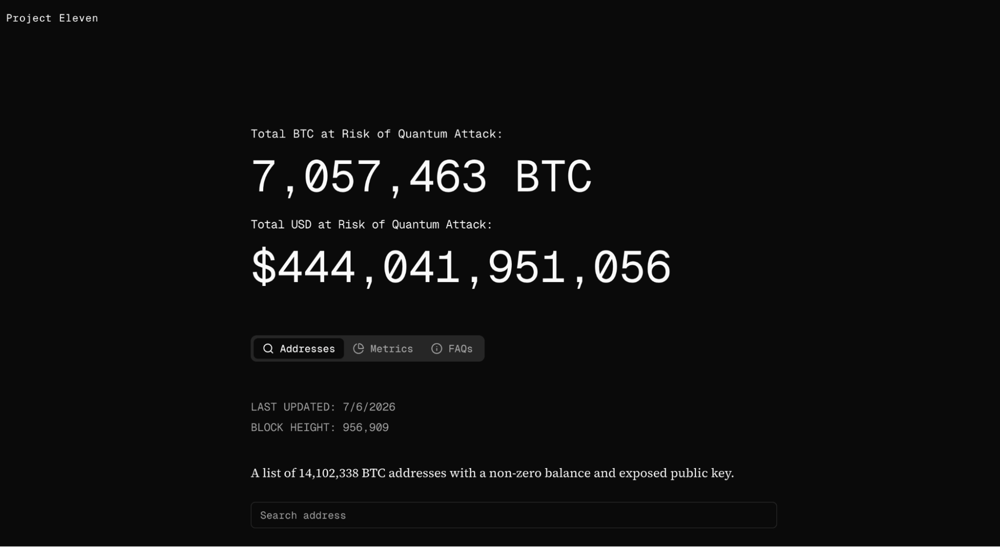

Shor’s algorithm is one of the main reasons quantum computing is treated as a serious long-term threat to modern cryptography.

Most public-key cryptography relies on a simple asymmetry: some mathematical operations are easy to perform but extremely hard to reverse on a classical computer.

RSA relies on the difficulty of factoring large composite numbers. Diffie–Hellman, [ECDSA](https://www.nervos.org/knowledge-base/understanding_ECDSA), Schnorr signatures, and elliptic-curve cryptography rely on the difficulty of solving [discrete-logarithm](https://en.wikipedia.org/wiki/Discrete_logarithm) problems. These are different mathematical problems, but they share the same basic security assumption: classical computers cannot reverse them fast enough to matter.

Shor’s algorithm breaks that assumption.

Published by mathematician [Peter Shor](https://en.wikipedia.org/wiki/Peter_Shor) in 1994, Shor’s algorithm showed that a sufficiently large, fault-tolerant quantum computer could efficiently solve both integer factorization and discrete logarithms. That means it could break RSA, Diffie–Hellman, elliptic-curve cryptography, and the signature schemes used to authorize Bitcoin transactions.

The threat is real, but it is not here yet.

This guide explains what Shor’s algorithm does, how it works, why it threatens public-key cryptography, whether it can break Bitcoin, and what still prevents that attack from happening today.

## What Is Shor’s Algorithm?

Shor’s algorithm is a quantum algorithm that can solve certain mathematical problems much faster than any known classical algorithm.

Its best-known use is factoring. Given a large number formed by multiplying two prime numbers, Shor’s algorithm can efficiently recover those prime factors on a sufficiently powerful quantum computer. That is why it breaks RSA.

But Shor’s algorithm is not only a factoring algorithm.

It also has a discrete-logarithm version, which is the version that matters for Diffie–Hellman, elliptic-curve cryptography, ECDSA, Schnorr signatures, and Bitcoin.

In simple terms:

Integer factorization breaks RSA.

Discrete logarithms break Diffie–Hellman, ECDSA, Schnorr signatures, and elliptic-curve cryptography.

Bitcoin is threatened by the second attack, not the first.

Bitcoin does not use RSA. It uses [secp256k1](https://www.nervos.org/knowledge-base/secp256k1_a_key%20algorithm), an elliptic curve used for digital signatures. A quantum attack on Bitcoin would not involve factoring Bitcoin keys. It would involve using Shor’s discrete logarithm algorithm to recover a private key from a publicly known public key.

## Why Does Shor’s Algorithm Matter?

Shor’s algorithm matters because public-key cryptography is everywhere.

It protects encrypted web traffic, secures software updates, authenticates servers, supports digital signatures, and authorizes blockchain transactions. If a sufficiently large quantum computer can run Shor’s algorithm at cryptographic scale, many of today’s public-key systems become unsafe.

For RSA, the attack is straightforward: factor the public modulus, recover the private key, and break encryption or signatures.

For elliptic-curve systems, the attack is different: solve the elliptic-curve discrete-logarithm problem, recover the private key from the public key, and forge signatures.

That second case is the one that matters for Bitcoin.

Bitcoin funds are not protected by encryption in the usual sense. They are protected by digital signatures. To spend Bitcoin, a wallet must produce a valid signature proving that it controls the relevant private key. If a quantum computer could derive that private key from the corresponding public key, it could create valid signatures and move the funds.

That is the real quantum threat to Bitcoin: not decryption, but signature forgery.

## How Does Shor’s Algorithm Work?

Shor’s factoring algorithm has three broad steps:

1. Choose a suitable random number.
2. Use a quantum computer to find the period of a repeating mathematical sequence.
3. Use ordinary classical arithmetic to recover the factors.

Only the period-finding step requires a quantum computer.

That period-finding step is the breakthrough. Classical computers do not have a known efficient way to find the relevant period at cryptographic sizes. A quantum computer can extract it using superposition, interference, and the quantum Fourier transform.

The easiest way to understand the idea is with a small example.

## How Does Shor’s Algorithm Factor a Number?

Suppose we want to factor:

N = 21

Anyone can factor 21 by hand, but the same structure applies to much larger numbers.

### Step 1: Choose a Random Coprime

Pick a random number x less than N that has no common factors with N.

Let:

x = 2

Since 2 and 21 share no common factors, they are coprime.

### Step 2: Find the Period

Now calculate the sequence:

x^k mod N

Using x = 2 and N = 21:

2^1 mod 21 = 2

2^2 mod 21 = 4

2^3 mod 21 = 8

2^4 mod 21 = 16

2^5 mod 21 = 11

2^6 mod 21 = 1

The sequence has looped back to 1, so the period is:

r = 6

This period is the key. Once the period is known, the factors can usually be recovered using classical arithmetic.

### Step 3: Recover the Factors

If the period r is even and x^(r/2) is not congruent to -1 mod N, we can continue.

Here:

r = 6

r / 2 = 3

x^(r/2) = 2^3 = 8

Since 8 is not congruent to -1 mod 21, which would be 20, we calculate:

gcd(2^3 - 1, 21) = gcd(7, 21) = 7

gcd(2^3 + 1, 21) = gcd(9, 21) = 3

The factors of 21 are therefore:

3 and 7

If the period is odd or if the arithmetic fails, Shor’s algorithm simply tries again with a different random value. For large numbers, the process still succeeds efficiently with high probability.

## Why Is Shor’s Algorithm Faster Than Classical Factoring?

Shor’s algorithm is faster because it turns factoring into a period-finding problem and then uses quantum mechanics to efficiently find that period.

A classical computer has to search for mathematical structure using classical computation. For cryptographic key sizes, that search becomes infeasible. The best classical algorithms are extremely powerful, but they still do not scale efficiently enough to break properly sized RSA or elliptic-curve keys.

A quantum computer works differently.

It can evaluate a function over a superposition of many possible inputs. But the important point is not that it simply “tries every answer at once.” That phrase is misleading. The useful power comes from interference.

Shor’s algorithm arranges the quantum computation so that irrelevant paths cancel out while values related to the hidden period are amplified. The quantum Fourier transform then extracts the periodic structure from the quantum state.

A measurement does not usually reveal the period directly. Instead, it produces a value related to the period. Classical post-processing, usually continued fractions, then recovers the period with high probability.

That combination is what creates the speedup.

The quantum computer finds the hidden structure. The classical computer turns that structure into the answer.

## Is Shor’s Algorithm Proven?

Yes. Shor’s algorithm is proven in mathematics.

There is no serious doubt that the algorithm works on an ideal, sufficiently large quantum computer. The open question is whether quantum hardware can be built large, stable, and sufficiently error-corrected to run against real cryptographic targets.

So far, Shor’s algorithm has only been demonstrated on small examples. Early [experiments ](https://www.nature.com/articles/414883a)factored 15. Later [demonstrations](https://www.nature.com/articles/s41598-021-95973-w) reached small numbers, such as 21.

These experiments matter as proof-of-concept demonstrations, but they are not cryptographic attacks.

Many widely reported quantum “factorizations” of larger numbers have also relied on shortcuts, compiled circuits, or prior knowledge about the answer. They should not be confused with a scalable run of Shor’s algorithm against RSA-2048, secp256k1, or any real-world cryptographic target.

As of 2026, no quantum computer has run Shor’s algorithm at a cryptographically relevant scale.

## Is Shor’s Algorithm Practical Today?

No. Shor’s algorithm is not practical against real cryptography today.

The reason is simple: no Cryptographically Relevant Quantum Computer, or CRQC, currently exists.

A CRQC is a quantum computer large, stable, and error-corrected enough to break widely deployed public-key cryptography. Current quantum computers are still far below that threshold.

The main gap is fault tolerance.

Today’s physical qubits are noisy. They make errors, lose coherence, and cannot reliably run the deep circuits required for cryptographic attacks. To run Shor’s algorithm at scale, physical qubits must be combined into error-corrected logical qubits.

A logical qubit is much more reliable than a physical qubit, but it usually requires many physical qubits to create and maintain.

That overhead is why raw qubit counts can be misleading. A machine with thousands of physical qubits is not the same thing as a machine with thousands of usable logical qubits.

Recent estimates suggest that the number of qubits required to attack elliptic-curve cryptography may be lower than older projections. For example, Google Quantum AI’s [2026 work](https://quantumai.google/static/site-assets/downloads/cryptocurrency-whitepaper.pdf) estimated that solving a 256-bit elliptic-curve discrete-logarithm problem could require fewer than roughly 1,200 to 1,450 logical qubits, depending on the circuit design. Under specific assumptions, that could correspond to fewer than about 500,000 physical qubits.

Other theoretical architecture papers [suggest](https://arxiv.org/html/2603.28627v1) that advanced error-correction methods, such as qLDPC (Quantum LDPC) codes in neutral-atom systems, could further reduce physical-qubit requirements under aggressive assumptions.

These estimates are important because the target is moving closer.

But they do not mean the attack is possible today.

No publicly known quantum computer currently has the logical qubits, error correction, gate fidelity, circuit depth, or runtime needed to break Bitcoin, RSA, or other real-world public-key systems with Shor’s algorithm.

### What Are the Limitations of Shor's Algorithm?

The main limitation is hardware, not theory.

Shor’s algorithm already exists. The problem is building a machine capable of running it at the required scale.

There are three major obstacles:

- **Not enough logical qubits:** Real attacks require stable, error-corrected logical qubits. Each logical qubit may need many noisy physical qubits, so current machines lack the usable scale needed for cryptography.
- **Error rates are too high:** Qubits are fragile and accumulate errors during long computations. Large-scale, fault-tolerant error correction needed for cryptographic attacks has not yet been achieved.
- **Circuits are too deep:** Shor’s algorithm requires complex, repeated arithmetic operations (like modular exponentiation or elliptic-curve math). This demands high gate fidelity, fast error correction, and long runtimes—beyond current hardware capabilities.

## Can Shor's Algorithm Break Bitcoin?

Yes, in principle.

Shor’s algorithm can break Bitcoin’s signature schemes through its discrete-logarithm variant. It cannot break Bitcoin through RSA factoring because Bitcoin does not use RSA.

Bitcoin uses secp256k1, an elliptic curve used in its digital signature schemes. Older Bitcoin outputs use ECDSA over secp256k1. Taproot uses Schnorr signatures over secp256k1. Both depend on the hardness of the elliptic-curve discrete-logarithm problem.

A sufficiently powerful quantum computer running Shor’s algorithm could solve that problem. If the attacker has the relevant public key, they could recover the private key, forge a valid signature, and move the funds.

So the Bitcoin attack requires two conditions:

1. The relevant public key must be visible to the attacker.
2. A CRQC capable of solving the secp256k1 discrete logarithm problem must exist.

The first condition is already true for some Bitcoin outputs.

The second condition is not.

That is why Shor’s algorithm can break Bitcoin in principle but cannot break Bitcoin today.

### How Shor's Algorithm Derives a Private Key From a Public Key

Bitcoin’s security depends on a one-way relationship between a private key and a public key.

A private key is a secret number.

A public key is created by multiplying that secret number by a generator point on the secp256k1 elliptic curve.

This is easy in one direction and infeasible in the other.

Given the private key, producing the public key is easy.

Given the public key, recovering the private key requires solving the elliptic-curve discrete-logarithm problem.

With classical computers, it is believed to be infeasible for Bitcoin’s key size. With a sufficiently powerful quantum computer, Shor’s algorithm can efficiently solve it.

That means a future quantum attacker could take a visible Bitcoin public key, recover the private key, and generate valid signatures.

Those signatures would be indistinguishable from signatures produced by the legitimate wallet.

This is why public-key exposure is the central issue in Bitcoin’s quantum threat model.

## Which Bitcoin Coins Are Vulnerable to Shor’s Algorithm?

Bitcoin’s quantum exposure depends on the output type and whether the relevant public key is already visible.

Not all Bitcoin coins expose the same information.

Some outputs reveal a public key immediately. Others reveal it only when spent. Taproot again exposes public-key material in a different way.

### P2PK Outputs

Early pay-to-public-key (P2PK) outputs include the full public key directly in the locking script.

That means the public key is exposed from the moment the output is created.

These coins are permanently visible to a future quantum attacker. Many early coinbase-era outputs are P2PK, which is why early mined coins–such as the million BTC believed to belong to Satoshi–are often discussed in quantum-risk analysis.

### P2PKH and P2WPKH Outputs

Pay-to-public-key-hash outputs are different.

P2PKH and P2WPKH outputs do not immediately expose the public key. Instead, they contain a hash of the public key. The public key is revealed only when the coin is spent.

This matters because Shor’s algorithm does not directly break cryptographic hashes. A quantum attacker needs the public key itself, not merely its hash.

However, once a P2PKH or P2WPKH output is spent, the public key appears in the spending transaction and remains visible on-chain forever.

If all funds controlled by that key are spent at once, there may be no remaining coins attached to the exposed key. But if the same address is reused, or if other UTXOs remain controlled by the same key, those remaining coins become long-exposure targets.

### Reused Bitcoin Addresses

Address reuse is especially dangerous in a quantum-threat model.

Once a wallet spends from an address, the public key behind that address becomes visible. Any other coins still controlled by the same key can become vulnerable to future private-key recovery.

This is one reason why Bitcoin best practices already discourage address reuse. Quantum risk makes hygiene even more important.

### Pending Bitcoin Transactions

There is also a short-lived attack window for hash-protected outputs.

When a P2PKH or P2WPKH transaction is broadcast, the public key appears in the pending transaction before the transaction is confirmed. In a future world where a fast enough quantum computer exists, an attacker could theoretically derive the private key during that mempool window and try to broadcast a conflicting transaction.

This is not possible today because no such quantum computer exists.

But it shows why quantum migration cannot be left to the last minute. Once fast quantum attacks become practical, moving coins from old address types could itself become risky.

### Taproot and P2TR Outputs

Taproot outputs should not be described as hiding the public key behind a hash in the same way as P2PKH or P2WPKH.

A Taproot output contains an x-only secp256k1 output public key directly in the witness program. That means the relevant public-key material is visible from the moment of output creation.

Taproot improves privacy, efficiency, and script flexibility, but it does not make Bitcoin quantum-resistant.

A future quantum attack against secp256k1 would still be relevant to Taproot outputs.

For a more detailed explanation of Bitcoin address types, see: [*A Beginner’s Guide to Bitcoin Address Formats*](https://www.nervos.org/knowledge-base/bitcoin_legacy_vs_segwit_vs_taproot_addresses).

## How Much Bitcoin Is Exposed to Quantum Risk?

Estimates vary, but on-chain analyses often put the amount of Bitcoin with exposed public keys in the range of several million BTC.

Common estimates are around 6 to 7 million BTC, or roughly 30% of the supply, depending on methodology and what is counted.

For a precise, real-time look at this vulnerability, we can turn to the [Bitcoin Risk List](https://bitcoin-risq-list.projecteleven.com/) by Project Eleven, a technical database that actively audits the blockchain for exposed public keys. According to their tracking, there are over 14.1 million addresses with non-zero balances and exposed public keys. Together, these vulnerable addresses hold more than 7.05 million BTC, representing over $444 billion in value at risk of a future quantum attack.

*Figure: The Project Eleven Bitcoin Risk List dashboard tracking the total BTC and USD value exposed to quantum attacks due to visible public keys.*

This includes coins in output types that expose public keys directly, as well as coins associated with reused or previously spent keys.

The exact number changes over time. It also depends on assumptions about address reuse, output types, lost coins, and what should count as economically vulnerable.

The important point is not the precise figure.

The important point is that a large, economically meaningful share of Bitcoin already has public-key exposure.

Coins held in fresh, never-spent P2PKH- or P2WPKH-style outputs are safer against this specific attack because only a hash of the public key is visible. But they are not permanently safe. Their public keys become visible when the coins are moved, and a future migration would still need to protect them before a CRQC exists.

### The Attack Has Not Happened Yet

The second condition is not met. No CRQC exists today, and as the limitations above show, current hardware falls short by orders of magnitude. The open question is not whether the requirement can be met but when. Research forecasts are spread out, clustering loosely from the late 2020s into the mid-2030s. One detailed analysis put the odds of a capable machine at roughly one in six by 2035 and better than even by 2050 (arXiv: [Quantum Horizon](https://arxiv.org/html/2606.14484v1)).

## Defending Against Shor's Algorithm: Post-Quantum Cryptography

The defense against Shor’s algorithm is post-quantum cryptography.

Post-quantum cryptography replaces vulnerable public-key systems with algorithms based on mathematical problems that are not known to be efficiently solvable by either classical or quantum computers.

The main families include lattice-based, hash-based, code-based, multivariate, and isogeny-based approaches, although not all have survived standardization equally well.

In August 2024, NIST finalized its first three post-quantum cryptography standards:

FIPS 203: ML-KEM, a lattice-based key-encapsulation mechanism for key establishment.

FIPS 204: ML-DSA, a lattice-based digital signature scheme.

FIPS 205: SLH-DSA, a hash-based digital signature scheme derived from SPHINCS+.

These standards are designed for migration before a CRQC exists.

For ordinary encrypted communications, the urgency is partly about “harvest now, decrypt later” attacks. An attacker can record encrypted traffic today and decrypt it later if the original key exchange was quantum-vulnerable.

For blockchains, migration is a heavier lift. It calls for new signature schemes, new address formats, and often a coordinated upgrade or fork. For a deeper look, see [*Quantum Resistance in Blockchains*](https://www.nervos.org/knowledge-base/quantum_resistance) and [*How Bitcoin's Path to Quantum Resistance Could Look*](https://www.nervos.org/knowledge-base/how_bitcoins_path_to_quantum_resistance_could_look_like)*.*

## Other FAQs

### How Does Shor's Algorithm Break RSA?

Shor's algorithm breaks RSA by factoring the large number at the core of an RSA public key back into its two secret primes. On a sufficiently powerful quantum computer, it finds those primes in a low-degree polynomial number of steps, rather than the astronomical time required by a classical computer, thereby exposing the private key and defeating the encryption.

RSA is still one of the most widely used cryptosystems on the internet, in TLS, email, and code signing. It is not used in most blockchains, though. RSA keys and signatures are large, at 2048 to 4096 bits, while a 256-bit ECC key offers comparable security. On a blockchain where every byte incurs fees and storage costs, RSA is simply too heavy, which is why Bitcoin and Ethereum use ECC instead.

### What Is the Difference Between Shor's and Grover's Algorithms?

Shor’s algorithm gives an exponential speedup against public-key cryptography. It breaks RSA via factoring and Diffie–Hellman, ECDSA, Schnorr signatures, and elliptic-curve cryptography via discrete logarithms. Grover’s algorithm gives only a quadratic speedup against brute-force search. It affects symmetric ciphers and hashes such as AES and [SHA-256](https://www.nervos.org/knowledge-base/SHA256_most_used_hash_function), but it does not break them in the same way. The fix is different, too. Public-key schemes vulnerable to Shor’s algorithm must be replaced. Symmetric schemes and hashes generally need larger security margins, such as longer keys. This is why [even quantum computers cannot break SHA-256](https://www.nervos.org/knowledge-base/Unbreakable_SHA256_Why_Even_Quantum_Computers_Cannot_Do_It) in any practical sense.

### How Do You Use Shor's Algorithm?

To use Shor's algorithm in practice, you run it on a quantum framework rather than on ordinary hardware, since today's quantum computers can only handle very small inputs. Developers typically use a framework such as [Qiskit](https://www.ibm.com/quantum/qiskit?utm_content=SRCWW&p1=Search&p4=570048403439&p5=e&p9=199648696710&gclsrc=aw.ds&gad_source=1&gad_campaignid=23433259594&gbraid=0AAAAAD-_QsQ4_uvCUtSSSKDr4z1_8dHgw&gclid=CjwKCAjwx7LSBhB3EiwAjcodxDx6TVJLM54zLCWrK3dLZgbj-3Ym_b1CqZObmj95a86iXgujs9bcMBoCKlAQAvD_BwE) or IBM Quantum, running the algorithm on a simulator or a small device to factor numbers such as 15 or 21. That is enough to see the full pipeline in action: the classical setup, the quantum period-finding circuit, and the classical post-processing that turns the measurement into factors.

------

*This article is for educational purposes. Quantum hardware capabilities and qubit-requirement estimates are moving quickly, and the figures cited reflect research published through mid-2026.* 
