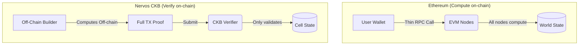
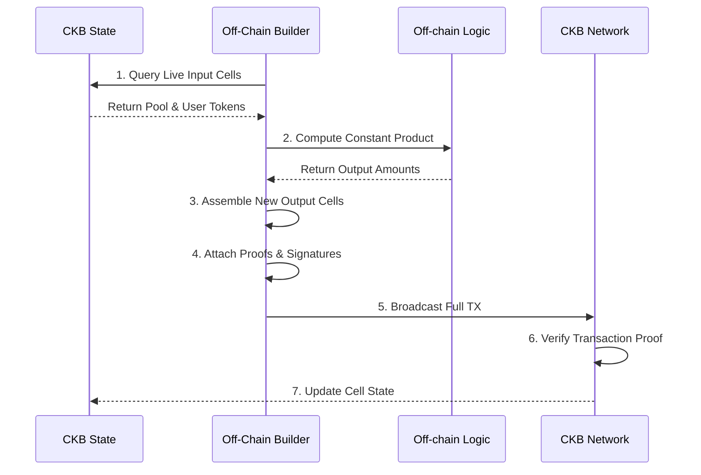

*On Nervos CKB, the most important actor in any transaction is one you never see. And understanding that changes everything about how you think about building.*

---

On Ethereum, there is a comfortable illusion at the center of every DeFi interaction.

You click Swap. A contract runs. Balances change. The chain did the work.

That illusion is load-bearing. The entire developer experience of the EVM is built around it. You write a function, deploy it, and your users call it. The chain computes the result. The state updates in place. You, the developer, never had to think about *how the transaction was built*. You only had to think about what the function does.

CKB removes that illusion entirely. And in doing so, it forces a question that most blockchain ecosystems have never had to answer cleanly:

**Who builds the transaction?**

---

## The Account Model's Hidden Worker

On Ethereum, the answer is: the user's wallet does, but in a way so thin that it almost doesn't count.

When you call a contract function from MetaMask, your wallet constructs an `eth_sendTransaction` RPC call with:

- `to`: the contract address
- `data`: the ABI-encoded function call
- `value`: any ETH to attach
- `gas` and `nonce`

That's it. There's no output specification. There's no description of what state the world will be in after this transaction succeeds. The wallet hands a command to the chain, the EVM executes it sequentially against the global World State, and the chain figures out the resulting state itself.

The builder in the account model is essentially a thin wrapper around an RPC call. It doesn't reason about state. It doesn't know what cells exist or what their balances are. It says: *"run this function"*, and trusts the chain to handle everything else.

This works. But it comes with a cost that only becomes visible when you push the model hard:

- **Sequentiality.** Every transaction runs in order through the EVM. Parallelism requires heroic engineering at the layer-2 level.
- **On-chain computation.** The logic that computes the swap output, the interest rate, the liquidation price, all of it runs on every node in the world simultaneously. You pay for it in gas. The network pays for it in throughput.
- **No external verifiability.** There is no artifact you can inspect before submission that tells you what a transaction will do to the world state. You simulate it, and hope the simulation matches execution.

None of these are bugs in Ethereum. They're design choices, made for expressiveness and developer convenience. But they create a ceiling. And the more sophisticated your application, the closer you get to it.



---

## CKB's Answer: The Transaction Is the Proof

CKB's philosophy can be stated simply: **the chain does not compute. It only verifies.**

Every CKB transaction is a complete, self-contained description of a state transition. It says:

> These specific cells exist right now. After this transaction, these new cells will exist instead. Here is a cryptographic proof that this transition is valid.

The chain's job is to confirm that:
1. The input cells actually exist and are unspent.
2. Every Lock Script governing the inputs approves the spend.
3. Every Type Script governing the involved cells approves the state change.
4. The total capacity in equals the total capacity out (no creation of CKB from nothing).

The chain does not compute the new reserve balances of your AMM pool. You do. Off-chain. Before you submit. Then you show the chain your answer, and the chain checks your work.

This is the fundamental inversion. And it is what makes the External Builder not just useful, but *necessary*.

---

## What Is the External Builder?

In an account-based world, "the builder" is your wallet. It constructs a thin envelope around a function call and sends it off.

In CKB, the External Builder is the off-chain agent responsible for constructing the entire transaction: finding the relevant live cells, reading their current state, running the business logic that determines what the new state should be, and assembling the full `inputs → outputs` picture that the chain will verify.

It is called *external* because it lives entirely outside the chain. The chain has no notion of it. The chain only sees the finished transaction. But without the builder, no transaction can be constructed at all.

Here is what a builder must do for even a basic token swap:

1. **Discover live cells.** Query the indexer for the AMM pool cell (by type script hash), the user's token A cells, and a CKB capacity cell to cover fees.
2. **Deserialize state.** Read the pool's current reserves from the cell data: `reserve_a`, `reserve_b`, `total_lp`, `fee_rate_bps`.
3. **Compute the new state.** Apply the constant product formula off-chain to determine the output amount and the new reserve values after the swap.
4. **Check slippage.** Enforce `amount_out >= min_output` before constructing anything.
5. **Assemble outputs.** Create the new pool cell with updated reserves, the output token cell for the user, and a change cell for any leftover capacity.
6. **Attach cell deps.** Reference the deployed ELF binaries for every type and lock script involved.
7. **Encode witnesses.** Produce the action witness bytes that the type script will read to understand which action is being executed.
8. **Sign and submit.** Attach the user's signature over the complete transaction hash and broadcast.

Every single one of those steps is on the builder. The chain only receives step 8's output, checks it, and says yes or no.



This is not a convenience layer. This is the protocol.

---

## Why This Is Different, Not Just Harder

The first reaction most Ethereum developers have to this is: *that sounds like a lot more work*. And it is. But the reaction misses what you get in return.

**First: computation happens where it's cheapest.**

The builder runs on your hardware, or on a dedicated solver's server, not on 10,000 nodes simultaneously. The chain's validation scripts are designed to be fast and deterministic: they check a proof, not compute one. This is why CKB's throughput model scales differently from the EVM's. When the computation is off-chain, adding more nodes doesn't create more bottlenecks.

**Second: the builder can be arbitrarily sophisticated.**

An Ethereum smart contract is bounded by gas. A loop that iterates too many times hits the block gas limit and reverts. The builder on CKB has no such constraint. You can run a full order-matching algorithm, iterate across thousands of user intents, sort and rank them by price, and submit a single perfectly optimal batch transaction. All of that logic runs off-chain at machine speed.

**Third: transactions are auditable before submission.**

Because the builder constructs the complete before-and-after state, you can inspect a transaction before it ever touches the chain. You can write tooling that says: given this proposed transaction, does it satisfy all the contract invariants? Does the pool's constant product hold? Is the user's slippage tolerance respected? You can catch errors before they cost fees. On Ethereum, your only option is `eth_call` simulation, which can diverge from actual execution when the state changes between your simulation and your submission.

**Fourth: parallelism is natural.**

Two CKB transactions that don't consume the same cells can be validated by different nodes simultaneously. There is no shared global state that serializes execution. The EVM's parallelism problem is structural and hard. CKB's parallelism is the default case, and the contention case (multiple builders competing to update the same pool cell) is the problem to solve, which brings us to the ecosystem's open questions.

---

## The Open Problems

Honesty requires saying what doesn't work yet.

**State contention is real and unsolved at scale.**

If Alice and Bob both try to swap against the same AMM pool cell at the same moment, one of them will fail. Both builders read the same live pool cell, compute different output transactions, and race to submit. Whichever lands first destroys the input cell. The other arrives to find its input already spent.

On Ethereum, the EVM queues them. On CKB, the second one crashes.

The ecosystem's proposed solution is **CoBuild Open Transactions (OTX)**: users sign partial transactions expressing their *intent* (I want to swap 100 USDT for at least 95 USDC), and a dedicated **Solver** collects these intents off-chain, batches compatible ones together, resolves the contention, and submits a single valid transaction that satisfies all of them. The Solver earns a fee for this coordination work.

This is elegant in theory. In practice, the OTX collector infrastructure is still being built. There is no production-ready solver network today. This is probably the biggest gap between CKB's theoretical design and its current DeFi practicality.

**The builder has no standardized interface.**

Today, every protocol ships its own builder. The CellScript toolchain helps (more on this below), but there is no universal transaction construction API that lets a frontend say "build me a swap" without knowing the protocol's internal cell structure. This is the missing middleware layer. Something like a `@ckb/builder-sdk` that can take a ProofPlan and a user intent and produce a valid transaction skeleton.

**Bootstrap problems are deeper than they look.**

When I was building the AMM builder this past week, I hit a specific wall: the `token.cell` contract's `mint` action requires an existing `MintAuthority` cell as an input. But no action in `token.cell` creates the first `MintAuthority`. You need a bootstrap step, a genesis transaction, that the compiler doesn't tell you about.

This is a pattern that repeats across CKB protocols. The full cell lifecycle isn't always documented, and the External Builder must understand it end-to-end, including the parts that only happen once at protocol deployment. Tooling that makes the bootstrap chain explicit would save every new builder from rediscovering this.

---

## CellScript: A Language Built for Builders

Up to this point, the External Builder has been described abstractly. CellScript makes it concrete.

CellScript is a domain-specific language for writing CKB type scripts. Unlike writing Rust or C and manually marshaling cell data, CellScript is designed around the cell model's consume-and-recreate paradigm. It compiles to RISC-V ELF binaries that run in the CKB-VM, but its syntax expresses the contract's logic in terms the builder can directly reason about.

The key concept is the **resource**: a typed schema that maps directly to what lives in a cell.

```cellscript
shared Pool has store, create, replace {
    reserve_a:    u64,
    reserve_b:    u64,
    total_lp:     u64,
    fee_rate_bps: u16,
    token_a_symbol: [u8; 8],
    token_b_symbol: [u8; 8],
}

resource Token has store, create, consume, replace, burn, relock {
    amount: u64,
    symbol: [u8; 8],
}
```

A `shared` resource is a cell that any builder can spend and recreate, provided they satisfy the type script's rules. A `resource` is a cell owned by a specific lock script. These aren't abstractions layered over the chain. They *are* the cells, with type-safe names.

The contract logic lives in **actions**: declared state transitions.

```cellscript
action swap_a_for_b(
    pool_before: Pool,
    input:       Token,
    min_output:  u64,
    to:          Address,
) -> (pool_after: Pool, token_out: Token)
where
    assert(input.symbol == pool_before.token_a_symbol, "wrong input token")

    let fee        = input.amount * pool_before.fee_rate_bps as u64 / 10000
    let net_input  = input.amount - fee
    let amount_out = (net_input * pool_before.reserve_b)
                     / (pool_before.reserve_a + net_input)

    assert(amount_out >= min_output, "slippage exceeded")

    let pool_after = Pool {
        reserve_a:      pool_before.reserve_a + net_input,
        reserve_b:      pool_before.reserve_b - amount_out,
        total_lp:       pool_before.total_lp,
        fee_rate_bps:   pool_before.fee_rate_bps,
        token_a_symbol: pool_before.token_a_symbol,
        token_b_symbol: pool_before.token_b_symbol,
    }

    consume input
    replace pool_before with pool_after
    create token_out = Token {
        amount: amount_out,
        symbol: pool_before.token_b_symbol,
    } with_lock(to)
```

Read that carefully. The action declares exactly what it consumes (`input`, `pool_before`), what it creates (`pool_after`, `token_out`), and what invariants it enforces (`slippage check`, `constant product formula`). The chain's job is to verify this ran correctly. Your builder's job is to run it first.

What the chain does *not* do here: it does not search for the pool cell, it does not look up token prices, it does not decide the output amount. The builder did all of that. The type script merely confirms that the numbers the builder produced are consistent with the rules the contract defines.

---

## The ProofPlan: A Contract's Letter to Its Builder

This is where CellScript becomes genuinely novel.

When you compile a CellScript contract, the compiler produces not just a RISC-V ELF binary, but a `.meta.json` file containing a `proof_plan` array. Each entry in this array describes one rule that the contract enforces:

```json
{
  "action": "swap_a_for_b",
  "trigger": "type_script_group_contains_replaced_pool",
  "scope": ["pool_input", "pool_output", "token_input", "token_output"],
  "reads": ["pool.reserve_a", "pool.reserve_b", "pool.fee_rate_bps", "token.amount"],
  "builder_assumptions": [
    "pool_output.reserve_a == pool_input.reserve_a + net_input",
    "pool_output.reserve_b == pool_input.reserve_b - amount_out",
    "token_output.amount >= min_output",
    "constant_product invariant holds within rounding"
  ]
}
```

This is a letter from the contract to whoever builds transactions for it. It says: *here is every assumption you must satisfy before I will approve your transaction*.

For a human builder, this is documentation. For an AI agent, it's an instruction set.

An agent doesn't need to reverse-engineer a compiled RISC-V binary to understand what a CKB protocol does. It reads the ProofPlan, learns the invariants, and constructs transactions that satisfy them. The chain's validation becomes the cryptographic guarantee that the agent did its job correctly. If the agent cheats or miscalculates, the type script rejects the transaction. The builder's correctness is enforced by the protocol, not by trust.

This is what the CoBuild OTX architecture is building toward: a world where user intents float around as signed partial transactions, and sophisticated off-chain agents compete to match, route, and fulfill them, earning fees, with the chain acting as the final, incorruptible arbiter of correctness.

---

## What Needs to Exist

Based on everything built and broken this past month, here is the honest list of what the external builder ecosystem still needs:

**1. A standardized bootstrap registry.**
Every deployed CKB protocol has genesis cells: the initial pool cell, the mint authority, the type script ELF. There should be a on-chain registry (or a well-known indexer query pattern) that lets a builder discover the complete lifecycle of a protocol from its type script hash. Right now this is scattered across deployment docs and Discord messages.

**2. A composable builder SDK.**
The builder for a simple token transfer, the builder for a pool seed, and the builder for a swap all share 80% of the same logic: cell discovery, capacity balancing, fee estimation, witness construction. This should be a library, not something each protocol reinvents. The CCC SDK is the right foundation, but it needs a higher-level "protocol adapter" layer that consumes a ProofPlan and generates the transaction skeleton.

**3. A production OTX collector network.**
The contention problem doesn't go away until there's real infrastructure to solve it. This probably means: a standardized OTX mempool API, a public solver registry, and tooling that lets protocol developers declare their contracts as OTX-compatible with a single configuration flag.

**4. Simulation before submission.**
The builder should be able to run the type script locally against a proposed transaction before broadcasting. `cellc validate-tx` exists as a developer tool. It needs to exist as a runtime library that dApps can call to give users a "this will succeed / this will fail because..." response before they sign.

---

## The Honest Take

The External Builder is not a workaround for CKB's limitations. It is the architecture.

In a system where the chain only verifies, the builder is where the application logic lives. The chain's scripts are the *rules*. The builder is the *referee who applies them to reality*. Every state transition in CKB is authored off-chain and ratified on-chain. That's the design.

What makes this hard today is not the model itself. It's that the tooling around the model is still young. The pieces are there: CellScript gives you typed contracts with machine-readable invariants, the CKB-VM gives you a real RISC-V execution environment, CCC gives you the transaction primitives. The missing layer is the glue that turns those pieces into a complete builder stack that a developer can pick up and use without having to rediscover the bootstrap problem, the witness encoding format, and the contention handling pattern from scratch.

That's the work that's left. And it's worth doing, because the underlying model is genuinely better for a specific class of applications: anything that requires parallel execution, anything that benefits from auditable pre-submission state proofs, and anything that wants to delegate transaction construction to an autonomous agent.

The chain that computes everything will always be slower than the chain that only checks your work.

---

*This is part of an ongoing series documenting progress through the CKBuilders program. Previous posts cover the Cell Model's ownership semantics and the architectural case against the account model. The next piece will cover what happens when the bootstrap problem is solved and the first real AMM swap finally runs end-to-end.*
