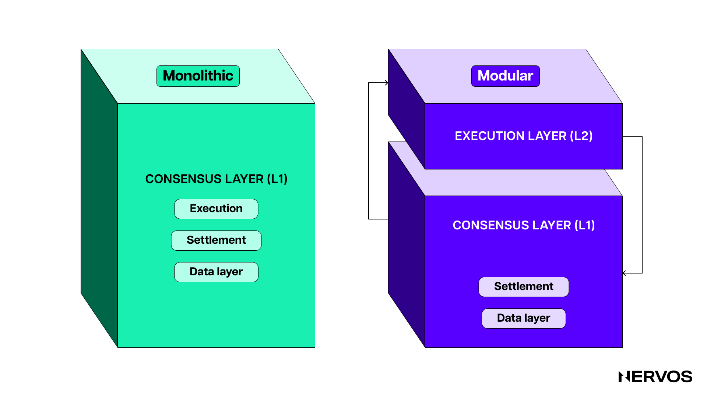
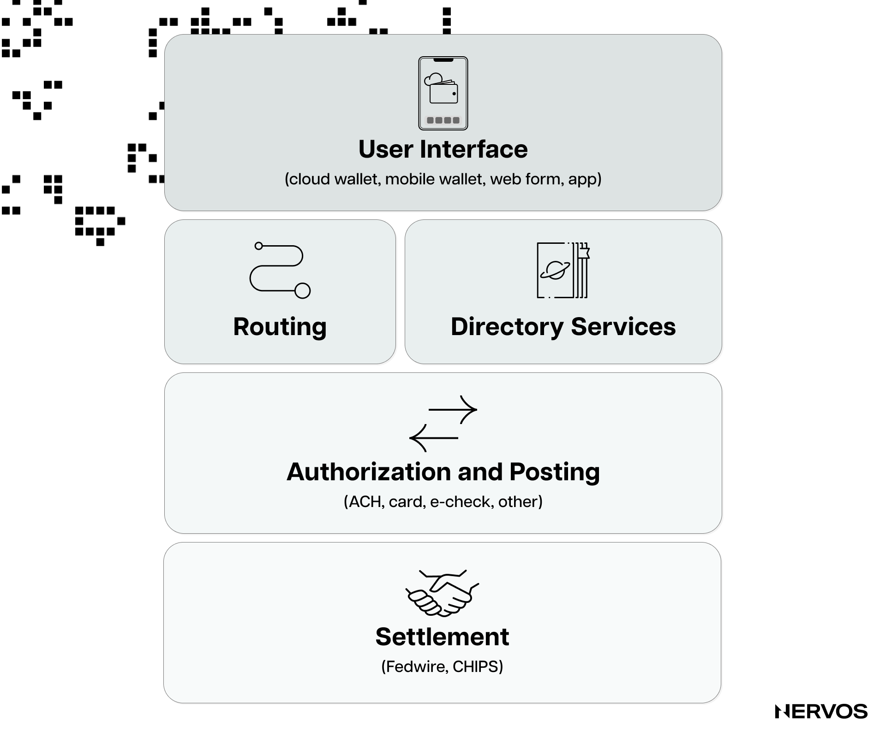
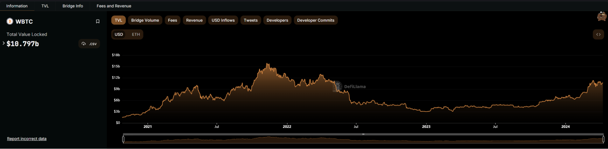
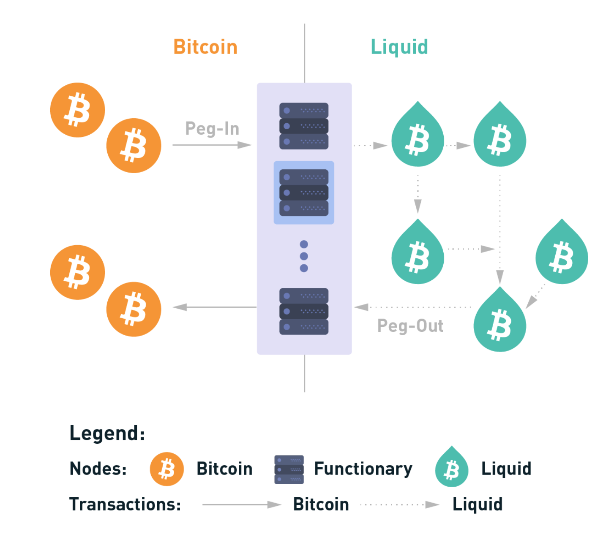
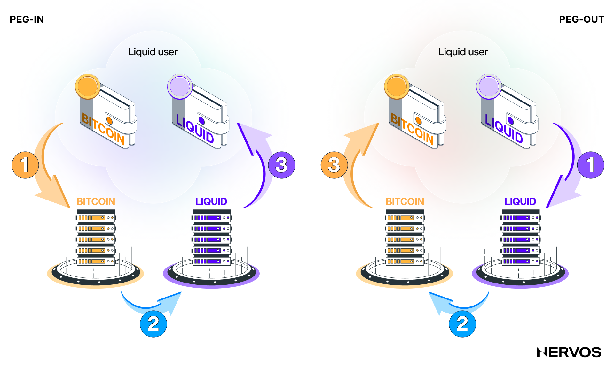
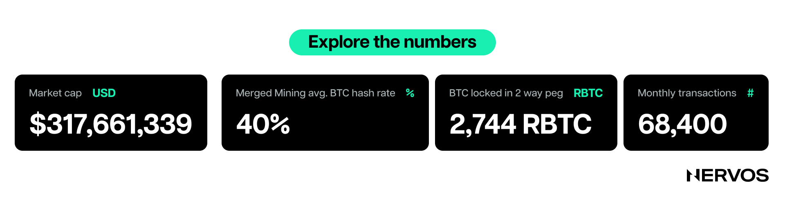
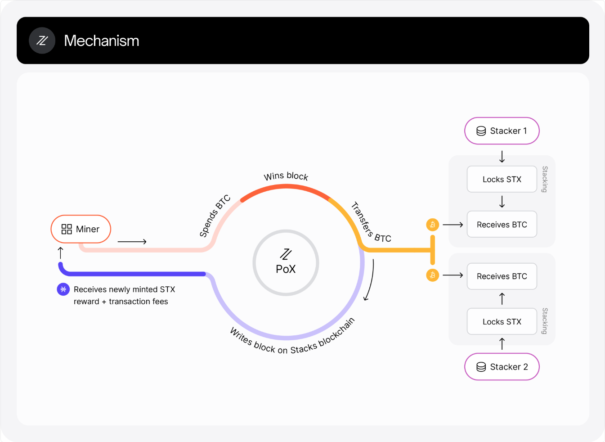
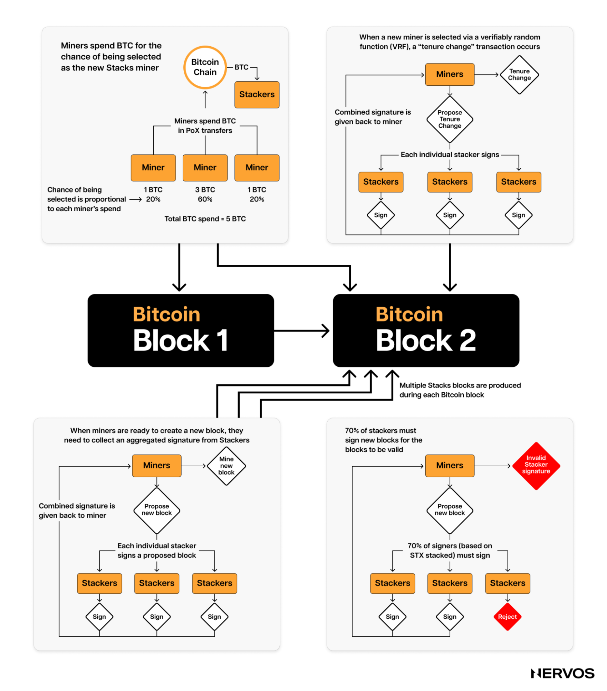
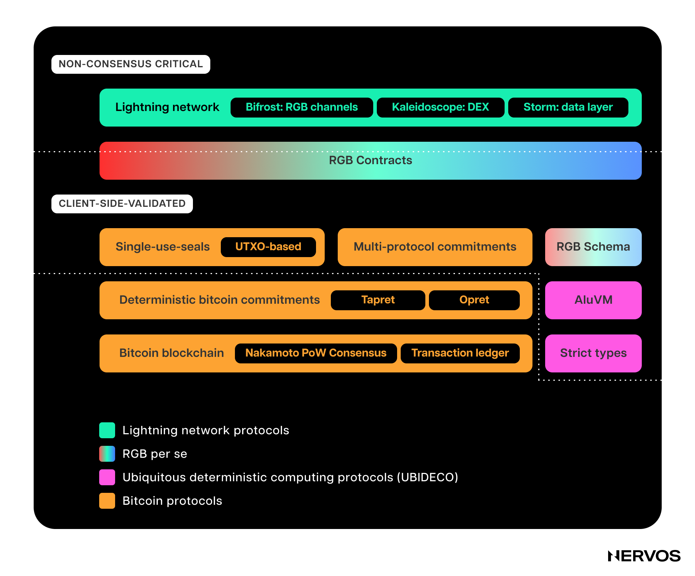
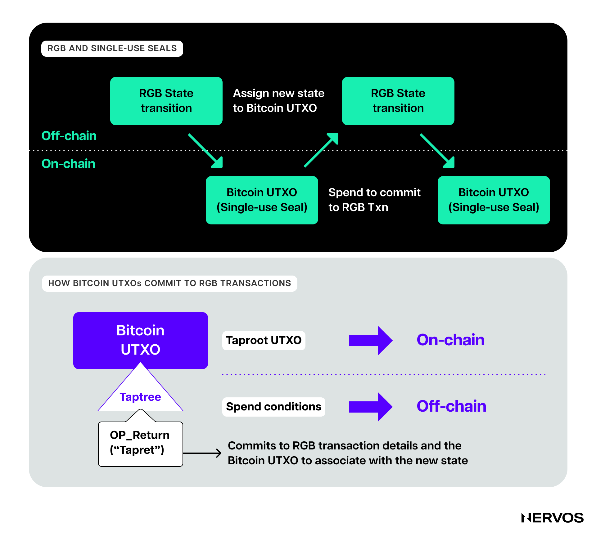

The arrival of [ordinals](https://docs.ordinals.com/) and inscriptions on Bitcoin not only triggered a new wave of experimentation with Bitcoin-native digital artifacts, it also sparked the crypto community’s interest in the potential of Layer 2 protocols built on top of it. 

While the [Lightning Network](https://lightning.network/) has been experiencing growth since its inception, more recently, protocols like [Stacks](https://www.stacks.co/) and [Rootstock](https://rootstock.io/) have gained significant traction, both in the value of their respective tokens and in the on-chain usage and mindshare occupied within the Bitcoin community. Moreover, many innovative Layer 2 solutions are currently being ideated and developed, including drivechains, spiderchains, RGB, zk-rollups, BitVM, ARK, and RGB++ built on Nervos CKB.

This comprehensive guide to Bitcoin Layer 2s consists of two parts. Part 1 covers the three oldest and most popular Bitcoin Layer 2s (excluding the Lightning Network, which you learn more about in [this article](https://www.nervos.org/knowledge-base/ultimate_guide_to_payment_channels)) in depth and introduces the reader to the still-in-development [RGB](https://www.rgbfaq.com/what-is-rgb) protocol. The analysis of the first three protocols should give the reader a good general sense of the most common Bitcoin Layer 2 architectures. 

Before we dive into the architectures of the specific solutions, it’s first important to define Layer 2 networks within the context of Bitcoin.

## What are Bitcoin Layer 2s?

The classification of Layer 1 and Layer 2 systems is a legitimate subject of controversy within the crypto community, with different projects and factions of the industry having differing views.

Generally speaking, Layer 1 chains are sovereign blockchains with their own consensus mechanisms and security budgets, that can function independently without relying on any other chain for consensus, data availability, or execution. On the other hand, there is no firm consensus on the definition of Layer 2 protocols, as various pundits draw the line at different points.

For example, the Ethereum Foundation [defines](https://ethereum.org/en/layer-2/) a Layer 2 as a "_separate blockchain that extends Ethereum and inherits the security guarantees of Ethereum._" This means that any chain or protocol that doesn't inherit another chain's security can't be classified as Layer 2 in the eyes of the Ethereum Foundation. Under this strict definition, widely accepted within the Ethereum community, only rollups are considered Layer 2s. Payment channels, state channels and sidechains are left out of the paradigm.

[Sidechains](https://www.nervos.org/knowledge-base/sidechains_unlocking_the_potential) are sovereign blockchains linked to a Layer 1 blockchain via a two-way [bridge](https://www.nervos.org/knowledge-base/what_are_blockchain_bridges_(explainCKBot)) or “peg,” enabling seamless cross-chain asset transfers. This makes distinguishing between Layer 1 chains and sidechains difficult, especially considering their technical similarities. For this reason, sidechain projects largely differentiate themselves from Layer 1s in their branding and ecosystem development direction. Namely, sidechains typically aim to extend or scale an existing Layer 1 ecosystem instead of developing their own from scratch.

On the Bitcoin side of things, the "Layer 2" category is quite malleable. Namely, the Lightning Network, Liquid, Rootstock, and Stacks all brand themselves as Bitcoin Layer 2s, even though they have vastly different architectures and security assumptions. According to the Ethereum community’s accepted definition, only the Lightning Network (and arguably Stacks post the [Nakamoto upgrade](https://docs.stacks.co/nakamoto-upgrade/what-is-the-nakamoto-release#:~:text=The%20Nakamoto%20Release%20is%20an,multi%2Dphase%20Nakamoto%20mainnet%20rollout.)) meet the "Layer 2" criteria.

One conceivable explanation for this disparity in viewpoints can be found in the Ethereum community’s conviction that a user must be able to withdraw Layer 2 assets solely through a Layer 1 transaction. In their view, if the users can't do this, and must rely on the honest or effective operation of third parties, the adjacent chain or protocol isn't a "Layer 2." 

However, this reasoning doesn't translate well in Bitcoin, where new assets are being defined and issued exclusively on Layer 2, with BTC being the primary (or only) Layer 1 asset considered. When it comes to withdrawing BTC from a Layer 2, only the Lightning Network fits this bill because Bitcoin lacks the ability to verify the complex conditions of these “Bitcoin Layer 2” systems. This means that a third party, typically a federation, has to manage the bridge and sign off on the transactions that move BTC from Layer 2 to Layer 1.

## Why Does Bitcoin Need Layer 2s?

For what it's worth, Bitcoin doesn't necessarily _need_ Layer 2 protocols to survive. However, Layer 2s benefit it greatly by scaling Bitcoin’s limited transaction throughput and extending its programmability.

Bitcoin has been intentionally built to be minimal, slow, and resistant to change. Its design philosophy prioritizes security and decentralization over scalability, and simplicity over architectural complexity. Its conservative architecture makes it analogous to FedWire as a settlement layer or TCP/IP as the Internet's underlying communications protocol: higher-level layers are built on top of these, adding more functionalities and performance, but the base infrastructure remains simple and robust.

Bitcoin has a [block time](https://www.nervos.org/knowledge-base/block_time_in_blockchain_(explainCKBot)) of 10 minutes and a throughput of around seven transactions per second. Improving the speed and throughput on Layer 1 would translate into increased hardware requirements for running full Bitcoin [nodes](https://www.nervos.org/knowledge-base/difference_between_miner_full_node_(explainCKBot)), hurting the network's decentralization, security, and, consequently, censorship resistance—the whole point of blockchains.

At the same time, Bitcoin's base layer programmability, speed, and throughput are far from enough to serve the world's needs, which produces the need for higher-level layers. The goal of these systems is to increase Bitcoin’s throughput by orders of magnitude and support more sophisticated applications that require fully expressive smart contracts, greater speed, or better privacy—all without changing the Bitcoin base layer. This way, Bitcoin can have its cake and eat it too, i.e., it can scale and support more sophisticated dApps without compromising its core values.

## Overview of The Most Popular Bitcoin Layer 2s

To this point, following the recent rise in popularity of digital artifacts or NFTs and BRC20 tokens on Bitcoin in the form of ordinals and [inscriptions](https://docs.ordinals.com/inscriptions.html), the primary focus of enriching Bitcoin seems to have shifted from scalability or throughput-focused Layer 2s like the Lightning Network and Liquid to smart contract-enabled protocols like Rootstock, Stacks, and RGB, as well as more novel solutions like BitVM and the RGB++ protocol built on CKB.

The Lightning Network is a [payment channel network](https://www.nervos.org/knowledge-base/ultimate_guide_to_payment_channels) that allows users to route payments across payment channels and make nearly instantaneous Bitcoin transactions with negligible fees. Because much has already been written about how the Lightning Network works, we won’t dwell too much on it beyond highlighting that it’s the oldest and most widely adopted Bitcoin Layer 2, with over 5,000 BTC locked inside it.

 \
_The total value locked of wrapped Bitcoin (wBTC). Source: [DefiLlama](https://defillama.com/protocol/wbtc)._

By comparison, over 154,000 wrapped Bitcoin (wBTC) are currently circulating on Ethereum, which goes on to show the enormous appetite for using BTC for more than just payments, as a productive asset that can be lent, borrowed, collateralized, used for market-making on AMMs, and so on.

### Liquid Network

The [Liquid Network](https://liquid.net/) is a federated sidechain developed by [Blockstream](https://blockstream.com/), a blockchain technology company led by co-founder [Adam Back](https://en.wikipedia.org/wiki/Adam_Back). Back is a notable cryptographer, cypherpunk, and inventor of [Hashcash](https://en.wikipedia.org/wiki/Hashcash#:~:text=Hashcash%20is%20a%20cryptographic%20hash,proof%20can%20be%20verified%20efficiently.), an algorithm that inspired Bitcoin’s Proof-of-Work mining mechanism.

In essence, Liquid is a sovereign, permissioned, and, therefore, centralized chain that extends Bitcoin by creating a smoother environment for transacting BTC. It has faster block times (one minute) and two-block settlement finality (block reorganizations are disallowed under its proof of authority consensus). Liquid also allows permissioned issuance of other digital assets, including stablecoins and tokenized securities.

In the Liquid Network, transactions and blocks are signed by a federation of blocksigners using a [BFT](https://en.wikipedia.org/wiki/Byzantine_fault) consensus algorithm. In contrast, the “peg-out” transactions (BTC withdrawals to Layer 1) are signed by a federation of “watchmen”, essentially drawn from the same pool of about 65 globally distributed federation members, comprising crypto exchanges, financial institutions, and other Bitcoin-focused companies.

The “peg-in” or bridging process of transferring BTC to Liquid involves sending it to a Liquid-generated Bitcoin federated address that’s managed by the consortium of functionaries. After the Layer 1 BTC has been transferred to the address, the users receive a synthetic BTC asset on Liquid backed by the real BTC on Layer 1, called Liquid Bitcoin (L-BTC).

Because the manual peg-in process is somewhat burdensome, requiring considerable technical skills and running both a Bitcoin full node and a Liquid node, most users acquire their L-BTC via third parties. Unlike peg-ins, withdrawals can only be done by Liquid’s federation members. However, regular users can alternatively peg-out by swapping their L-BTC for BTC through third parties, including centralized exchanges or trustless P2P swaps.

Finally, it’s important to note that Liquid doesn’t meet the stricter Ethereum definition for Layer 2, as it neither inherits Bitcoin’s security guarantees nor allows permissionless BTC withdrawals solely via a Layer 1 transaction. 

### Rootstock

In many ways the opposite of Liquid, [Rootstock](https://rootstock.io/) is significantly closer to the strict definition for Layer 2, meeting one of the two key criteria. It's an [EVM](https://ethereum.org/en/developers/docs/evm/)-compatible smart contract-enabled sidechain that partially inherits Bitcoin's security via [merged mining](https://rootstock.io/mine-btc-with-rootstock/) and links to it via a federated two-way peg.

Rootstock goes beyond Liquid in that it doesn't seek only to scale Bitcoin's transaction throughput, but also to extend its programmability. With its Turing-complete smart contracts, Rootstock allows for the use of synthetic Bitcoin (RBTC) across various DeFi applications. Its engine is powered by the Rootstock Virtual Machine (RVM), a forked version of the Ethereum Virtual Machine (EVM), which is fully compatible with Ethereum smart contracts and tooling. This means Ethereum developers can conveniently deploy their dApps on Rootstock with little to no modifications.

However, unlike Liquid, which is a centralized sidechain secured by a federation of pre-selected entities, Rootstock borrows Bitcoin's security via merge mining—a technique allowing Bitcoin miners to concurrently mine Rootstock blocks with nearly zero marginal cost (all that is required is a Rootstock node). This method benefits Bitcoin miners by providing them an additional revenue stream from the Layer 2 transactions (thus also increasing Bitcoin's security budget) and helps Rootstock essentially "free ride" on the back of Bitcoin's exceptional security.

As things currently stand, Rootstock is backed by roughly 40% of Bitcoin's hash rate, making it somewhat protected from potential 51% attacks. However, this security largely depends on the Bitcoin miners' self-interest in securing additional revenues from Rootstock transaction fees. 

If the activity on the sidechain were to drop, the incentives for merge-mining would diminish, leaving Rootstock vulnerable to relatively low-cost 51% attacks and MEV or double-spend-motivated chain reorganizations. While Rootstock has implemented two protection mechanisms to mitigate these risks, “signed notifications” and “transparent double-spend trails”, its security is still far from that of Bitcoin.

Moreover, mining a smart contract-enabled chain is not the same as mining Bitcoin. Smart contract chains use substantial computational resources, and once there is substantial smart contract activity on Layer 2, merge-mining could become much less attractive to Bitcoin miners. To this point, expecting or relying on Bitcoin miners to merge mine smart contract layers may not be a good long-term idea, as they can opt-out at any time, a potential risk of centralization in the block production of the merge mined chain.

Rootstock's solution for a [two-way peg](https://rootstock.io/powpeg/) is similar to Liquid’s. Part of the two-way peg system requires trust in a set of semi-trusted third parties, collectively called the Federation.  Fully trust-minimized, third-party-free pegs can only be made between two Turing-complete smart contract platforms. However, since Bitcoin isn’t Turing-complete and doesn’t support native opcodes to validate external SPV proofs, any linked two-way pegs must be trusted and somewhat centralized. 

The bridging process is similar to that on Liquid: BTC is locked on Bitcoin and an equivalent amount of RBTC is minted on Rootstock. The locked Layer 1 BTC is controlled by the Federation, which has the ability to release the funds when users initiate a withdrawal. While this process isn’t necessarily trust-minimized and decentralized, it is automated, meaning withdrawals don’t require actual human intervention.  

Finally, it’s worth highlighting that since Rootstock doesn’t have its own separate security budget, it doesn’t (need to) have its own native token. Instead, RBTC is the native currency used to pay for transaction fees on Rootstock.

### Stacks

Right off the bat, it’s essential to know that as of Bitcoin’s second halving, [Stacks](https://www.stacks.co/) will undergo a monumental upgrade, called the [Nakamoto Release](https://stacks.org/pre-launch-testnet-activated). Moving forward, we’ll only explain how Stacks will function _after_ the Nakamoto release and not how it did prior.

To this point, Stacks is a different type of smart contract layer compared to a sidechain, with a deeper, ongoing relationship with Bitcoin. It aims to give dApp users the best of both worlds: fast transactions with Bitcoin finality. Unlike Bitcoin’s 10-minute block time, Stacks blocks are produced every 5 seconds, with all Layer 2 transactions eventually settling on Bitcoin and benefiting from its exceptional security. Stacks isn’t EVM-compatible; instead, its smart contracts are written in its own proprietary language called [Clarity](https://clarity-lang.org/).

Unlike Liquid and Rootstock, Stacks has its own native asset, STX, which is central to its novel consensus mechanism dubbed [Proof-of-Transfer](https://docs.stacks.co/stacks-101/proof-of-transfer) (PoX). In PoX, Stacks miners spend (already mined) BTC and are rewarded in STX, similar to how Bitcoin miners spend electricity and are rewarded BTC in Proof-of-Work (PoW). Like in PoW, PoX uses a Nakamoto-style single-leader election, where PoX miners bid by spending BTC, and they have a bid-weighted random probability of becoming a leader. In this context, a leader is a miner who’s been selected to mine a Stacks block.

 \
_A graphic showcasing Proof-of-Transfer (PoX). Source: [docs.stacks.co](https://docs.stacks.co/stacks-101/proof-of-transfer)_

The unique feature of Stacks’ consensus mechanism is how deeply it’s intertwined with the Bitcoin blockchain. Namely, using an open bidding process on Bitcoin, a group of Stacks miners is elected to mine Stacks blocks until the next Bitcoin block (at a 10-minute average Bitcoin block time, this is approximately 120 Stacks blocks). Once the miner set is elected, these miners use a BFT-style quorum signing, weighted by their BTC bids, to mine Stacks blocks every 5 seconds until the next Bitcoin block, for which they’re rewarded STX tokens. By leveraging BTC for bidding and Layer 2 miner selection, Stacks’ PoX consensus mechanism reuses the work already done by Bitcoin miners without consuming any significant amount of additional electricity.

This means that post-Nakamoto upgrade, Stacks has two types of blocks at the Layer 2 level: (a) fast blocks, produced by Stacks miners every 5 seconds via a BFT-style quorum signing, and (b) settlement blocks (produced at every Bitcoin block) that don’t contain any new Layer 2 transactions but only settle the recent sequence of fast blocks (from the Stacks chain) on the Bitcoin chain. 

The fast blocks are produced as a single sequence between two settlement blocks and don’t fork. According to the Stacks protocol’s forking rules, forks are allowed only on settlement blocks and only at a depth of 1 to 6 Bitcoin confirmations. Stacks settlement blocks depth 7 to the latest finalized block (defined as a settlement block with 150 Bitcoin block confirmations) are “frozen,” meaning miners can fork them only through Stackers’ blessing to “unfreeze” a block.

In PoX, Stackers are entities who lock or “stack” STX tokens and perform peg-out signing (explained below) and other consensus-critical tasks, including unfreezing blocks. Settlement blocks with over 150 Bitcoin block confirmations (about a day’s worth of blocks) are considered finalized and can never be forked.

In simple terms, this means that most of Stacks’ history, or all blocks older than a day, follow Bitcoin finality and are secured by 100% of Bitcoin’s hash rate. To attack the Stacks history or alter a transaction more than about a day old, an attacker would have to do a deep reorganization of Bitcoin, which is extraordinarily difficult, if not impossible, considering Bitcoin’s current security budget and how decentralized its mining is. 

Effectively, the Stacks chain has two security budgets: one that includes the BTC spent by Stacks miners and the STX capital locked by Stackers (which secures only the blocks with less than 150 Bitcoin block confirmations), and secondly, Bitcoin’s entire security budget that secures Stacks’ more-than-a-day-old history.

This mixed security mechanism makes most of the Stacks chain significantly more secure than Liquid or Rootstock. Similarly, the way Stacks’ two-way peg is designed offers much better security guarantees than those of its federated competitors. Because Stacks has its own native token, it can use clever incentives engineering to deliver a peg that's managed in a permissionless and decentralized way. 

Namely, the sBTC peg is maintained by the Stackers of the PoX consensus protocol, who lock STX as collateral for the right to sign peg-out transactions and earn BTC rewards. Unlike in federated models of Liquid and Rootstock, in Stacks, anyone can become a Stacker and sign off on peg-outs. The locked or staked STX serves as collateral at risk of slashing to disincentivize bad behavior. Additionally, BTC rewards serve as incentives for honest Stackers who only sign valid peg-outs, not malicious ones.

### RGB

[RGB](https://rgb.tech/) (Really Good Bitcoin) is one of the most novel developments in Bitcoin. It represents a set of open-source protocols for scalable and private smart contracts on Bitcoin and the Lightning Network.  \

As a smart contracting extension to Bitcoin, RGB is quite different compared to other Bitcoin Layer 2 solutions and even non-Bitcoin smart contract platforms. Namely, it takes smart contracts execution and validation entirely off-chain, using Bitcoin only as a state commitment layer and Bitcoin script as an ownership control system. \

The entire system is based on [client-side validation](https://www.rgbfaq.com/glossary/client-side-validation) and [single-use seals](https://petertodd.org/2017/scalable-single-use-seal-asset-transfer). Client-side validation means that all RGB smart contracts and transactions are executed and validated by parties to the transactions (off-chain) without posting any data on Bitcoin.

The single-use seals (inscribed over Bitcoin or Lightning Network transaction outputs) represent RGB’s security mechanism, allowing any party holding a smart contract’s history to verify the integrity of its execution by combining on-chain and off-chain data.

Unlike other smart contract platforms, RGB separates the concepts of smart contract _issuers_, state _owners_, and _state transitions_. Namely, each RGB smart contract is represented by some genesis state created by the smart contract issuer and a directed acyclic graph (DAG) of state transitions kept as client-validated (entirely off-chain) data by RGB users.

The state is _assigned _to a Bitcoin UTXO, which defines them as “single-use seals”. The party that can spend the corresponding UTXO is called the state _owner _(in the genesis state’s case, that’s the state issuer). The state owner can change the corresponding part of the smart contract state by creating a new state transition and committing it via a transaction that spends the output containing the previous state.

In simpler terms, RGB defines smart contract ownership by binding/assigning state via single-use seals to Bitcoin transaction outputs ([UTXO’s](https://www.nervos.org/knowledge-base/utxo_model_explained))—whoever controls the output owns the associated state. However, whereas the ownership defines _who _can change the state, the client-side validation rules define how the state may change. 

The validation rules are defined by an [RGB Schema](https://www.rgbfaq.com/glossary/schema-and-scripts/schema), a blueprint or standard for constructing RGB smart contracts similar in nature to the [ERC](https://ethereum.org/en/developers/docs/standards/tokens/) standard for token contracts on Ethereum. The Schema defines everything from the types of metadata smart contracts can use to the types of state transitions, seal transitions, state and metadata semantics, etc. 

In other words, when issuers define their smart contracts, they must ensure they adhere to or “validate against” the particular RGB [Schema](https://blackpaper.rgb.tech/application-layer/6.-writing-contracts.-scripting.); otherwise, wallets and exchanges won’t support them. This is because when wallets or exchanges get information about some asset (data and contract), they must validate it against a specific Schema and only accept the asset if it passes the validation against that Schema. The wallets or exchanges will leverage specialized Schema libraries, like “RGB fungible assets” or “RGB collectibles,” instead of a single complex RGB core library.

Moving on, RGB operates in “shards,” where each contract has a separate state history and data that never intersects with the states of other smart contracts, allowing for another level of scalability. 

Importantly, RGB’s sharded nature doesn’t mean its contracts can’t interact. Much to the contrary, they can interoperate via the [Bifrost](https://www.rgbfaq.com/glossary/bifrost#:~:text=Bifrost%20is%20an%20extension%20to,DeFi%2C%20advanced%20smart%20contracts%20etc.) protocol over the Lightning Network, enabling multiparty coordinated state changes that open the door to complex applications, including decentralized exchanges over the Lightning Network and money market protocols. 

In conclusion, RGB aims to bring smart contracting capabilities to Bitcoin that go far beyond what’s possible on Ethereum, providing more scalable, private, and arguably safer smart contract solutions.

## Conclusion

In this first part of our two-part series on Bitcoin Layer 2s, we explained how the term “Layer 2” is used differently in a Bitcoin context compared to Ethereum, covered the three oldest and most popular Bitcoin Layer 2 protocols, and provided a technical introduction to the most novel still-in-development Bitcoin Layer 2 solution, RGB. 

In Part 2, we’ll cover the expansive landscape of new Bitcoin Layer 2 innovations, including RGB++, which is being built on CKB!