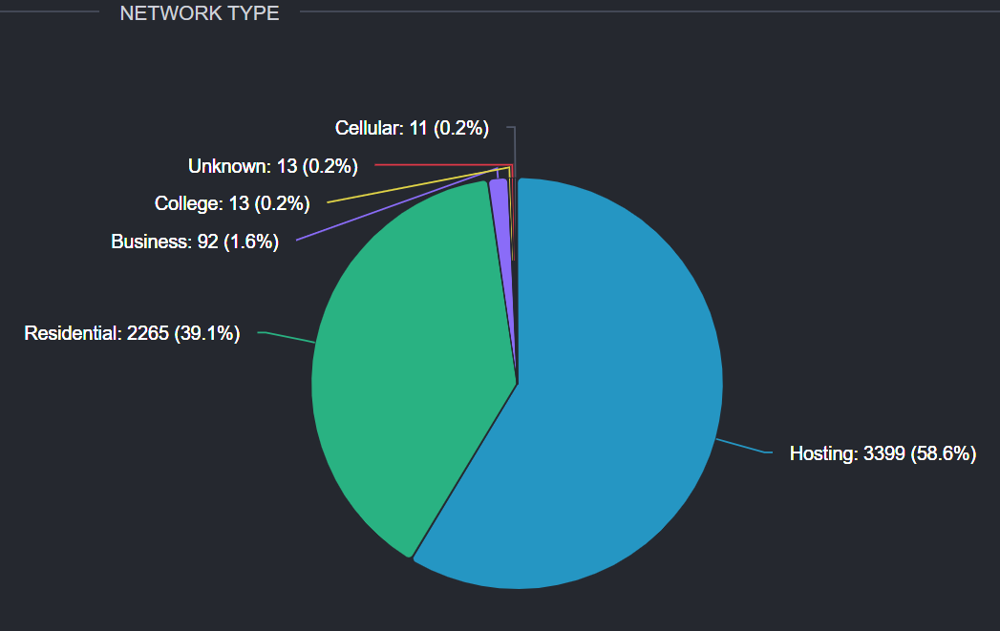
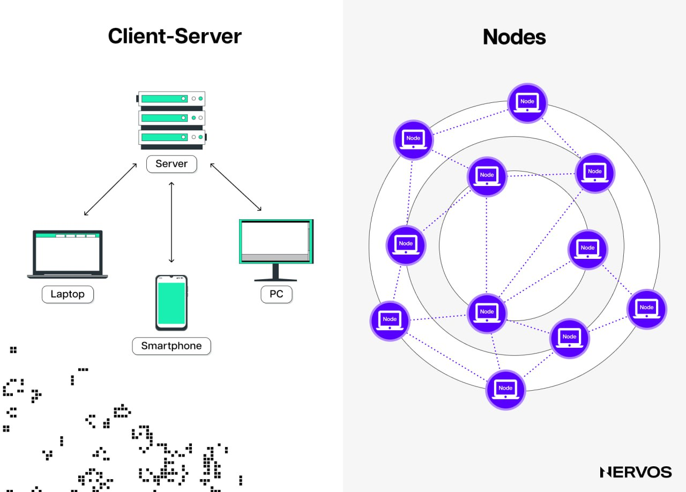
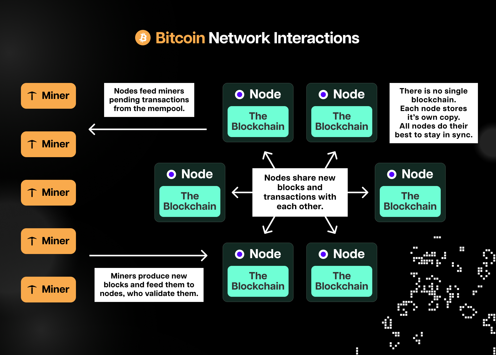
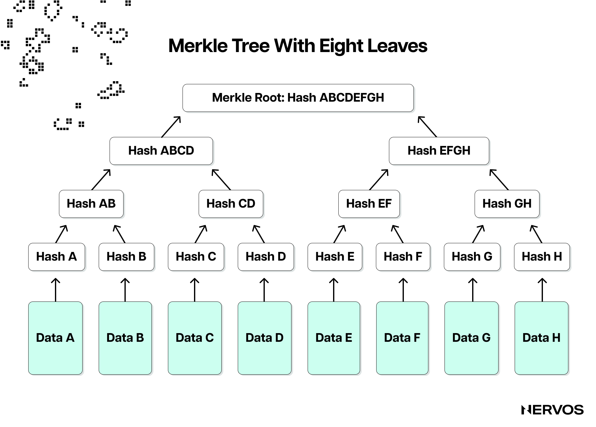
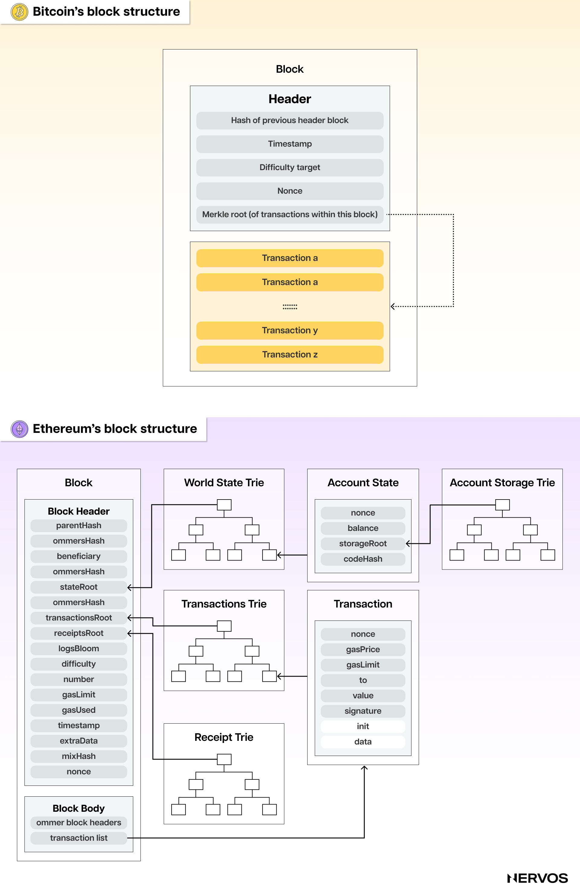
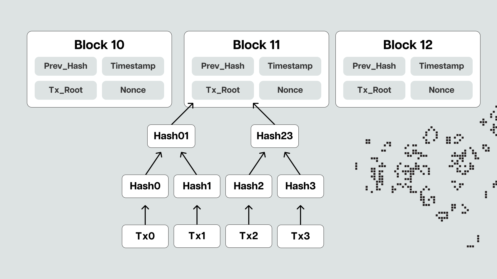
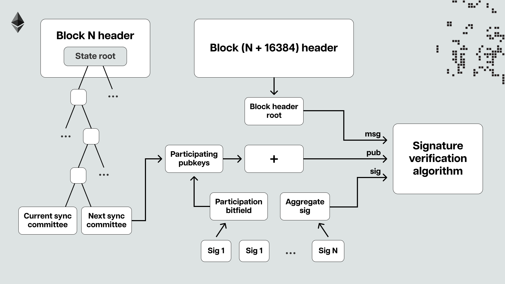
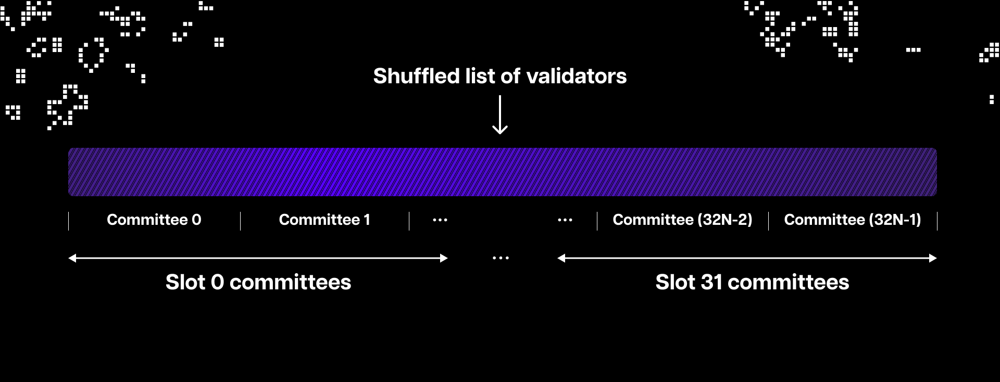
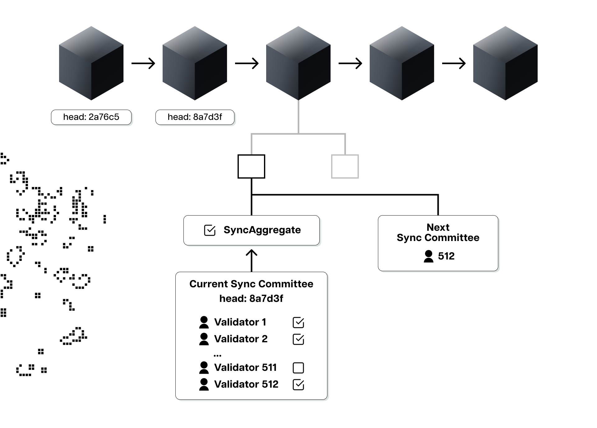

虽然去中心化可能是区块链的基本属性，但去中心化本身并不是最终目标。相反，去中心化往往以牺牲其他理想属性（如可扩展性）为代价，追求其带来的新属性：无需信任、无需许可和抗审查。这些属性赋予了加密货币用户对所有权的牢牢掌握，以及对其财富和数据的访问权——至少在理论上是这样。

实际上，目前大多数加密货币用户通过一个由中心化实体维护的 [RPC](https://en.wikipedia.org/wiki/Remote_procedure_call) 提供商连接到节点，连接到区块链中。

这样做虽然方便，但却违背了去中心化的初衷。中本聪推出比特币是为了解决根深蒂固的金融体系对可信第三方的依赖。他在《比特币白皮书》中写道：“传统货币的根本问题在于，它的运作需要信任。人们必须相信中央银行不会让货币贬值，但法定货币的历史充满了背信弃义。”

在这一点上，中心化和依赖可信第三方的危险并不只是理论上或未来才会出现的，而是在今天已经具体化了。例如，在 2022 年 8 月 OFAC [制裁](https://home.treasury.gov/news/press-releases/jy0916)了隐私协议 TornadoCash 后，托管了超过 60% 以太坊节点的中心化 RPC 提供商 [Alchemy](https://www.alchemy.com/) 和 [Infura](https://www.infura.io/) 立即阻止用户与 TornadoCash 进行交互。这意味着，任何使用流行的加密钱包 [MetaMask](https://metamask.io/) 的用户在默认设置下都无法访问运行在最大的智能合约平台以太坊上的去中心化应用程序 TornadoCash。

 _图：Alchemy 和 Infura 完全依赖 AWS 来托管其节点，来源 [ethernodes.org](https://www.ethernodes.org/network-types)_

除了审查之外，依赖中心化的 RPC 访问区块链还会使用户面临数据收集和各种类型的数据篡改攻击，这不仅有碍隐私，还可能导致资金损失。这就是运行一个完整节点如此重要的原因：它能让用户直接、无信任地访问区块链，增强网络和用户的安全性。然而，由于需要大量资源，运行全节点并不总是像听起来那么简单。因此，开发人员投入了大量资源来研究[轻客户端](https://www.nervos.org/knowledge-base/what_is_a_light_client_%28explainCKBot%29)，并使其尽可能轻量，这也是本文要介绍的内容。

## 客户端与节点的区别

要了解节点和客户端的区别以及后者的工作原理，首先要了解一些区块链基础知识。

区块链是在分布式计算机网络中更新和复制的公共数据库。区块链中的 "区块" 一词是指存储交易和状态信息的标准化、经过验证的数据批次。当某人向其他人发送加密货币时，该交易需要被包含在一个区块中才能得到 "确认" 或最终结算。这里的最终结算是指包含交易的区块已被矿工或验证者验证，并被网络中的所有其他计算机认可。术语 "链" 指的是区块在分类账中的记录方式，其中每个后续区块都与前一个父区块以加密方式链接，形成不可更改的区块链。之所以说链的历史是不可变的，是因为如果不改变所有后续区块，就无法改变区块中的数据，而这需要网络中大多数计算机达成[共识](https://www.nervos.org/knowledge-base/what_is_nakamoto_consensus)。

这些计算机被称为_节点_。它们运行名为_客户端_的计算机软件，该软件允许它们根据协议规则验证数据，并接收和向运行相同客户端的其他节点广播信息，从而形成一个网络。客户端软件是访问区块链网络所必需的，而节点则通过独立执行协议规则来帮助维护网络。

要运行区块链节点，用户需要下载访问该特定区块链所需的客户端之一。例如，要运行比特币节点，用户必须下载最新版本的 [Bitcoin Core](https://bitcoincore.org/) 客户端，而要运行以太坊节点，用户可以在多个以太坊客户端中进行选择，目前最流行的是 [Geth](https://geth.ethereum.org/) (go-ethereum)。

总而言之，如果用户想与以太坊协议进行交互，他们可以（i）运行一个节点或（ii）使用第三方 RPC 节点提供商，如 Infura、Alchemy 或其他。第一种方法可以让用户直接、无信任地访问协议，但需要更多的计算和存储资源。相比之下，后者的资源密集度较低（因此成为大多数用户的默认选择），但依赖于可信的第三方。第三种选择是运行轻客户端，它力求在两者之间取得完美平衡。

## 全节点 vs. 轻节点

不同类型的节点以不同的方式解释数据，并提供不同的同步方法，同步是指节点能多快跟上区块链的最新状态。

此外，不同区块链的节点类型也不尽相同。例如，在最大的基于 PoS 的智能合约平台以太坊上，客户可以运行三种不同类型的节点：轻节点、[全节点](https://www.nervos.org/knowledge-base/difference_between_miner_full_node_%28explainCKBot%29)和归档节点。另一方面，在最大的基于 PoW 的区块链比特币上，客户只能运行全节点和轻节点（也称为 [SPV](https://www.nervos.org/knowledge-base/what_is_SPV_%28explainCKBot%29) 节点）。由于比特币和以太坊使用不同的共识算法，处理数据的方式也不同，因此不同类型的节点或客户端的运行方式也不同。

### 全节点

运行全节点是与区块链交互的最安全、无需信任、私密且抗审查的方式。

从广义上讲，"全节点" 是指存储和同步区块链完整副本的计算机，它通过独立验证交易和区块并将其转发给网络中的其他节点来参与共识过程。此外，一些全节点还支持轻节点，允许它们访问点对点网络，并允许它们查询数据和传输交易。

由于完整节点会下载、验证和存储每个区块的全部内容和状态数据，因此运行它们需要大量的存储空间、内存和 CPU 能力。例如，[运行一个以太坊全节点](https://ethereum.org/en/run-a-node/) 的最低要求是 2 TB SSD、8 GB 内存和英特尔第七代或更高的处理器。对于比特币，全节点的要求要低得多，包括 2 GB 内存、500 GB 可用磁盘空间和低级 CPU。

虽然这些要求在今天看来并不太苛刻，但值得注意的是，区块链的规模在不断扩大，增加了节点的计算和存储负担。例如，比特币在超过 14 年的时间里已经增长到约 500 GB，而以太坊在 8 年的时间里已经增长到超过 1 TB。为了解决这个问题——也被称为状态膨胀或[状态爆炸](https://www.nervos.org/knowledge-base/state_bloat_blockchain_%28explainCKBot%29)——并尽可能保持去中心化，不同的区块链已经采用或正在积极研究不同的解决方案，包括限制区块大小和区块时间、状态修剪、状态租用和无状态。例如，与归档节点不同，以太坊全节点会修剪历史状态数据，只存储历史交易数据和当前状态；因此，运行这些节点所需的存储空间是 2 TB，而不是 15 TB。

无论哪种情况，全节点都无法在手机或浏览器内运行，这大大影响了它们的采用率以及区块链的去中心化和安全性。

### 轻节点

轻节点是通过轻客户端访问区块链的计算机。它们只下载区块头，而不是下载和验证每个区块的全部内容和状态数据并存储整个分类账本的副本。

对于新手来说，区块大致由区块头和区块主体两部分组成。简单来说，区块主体包含完整的交易列表，而区块头只包含（除其他元数据外，如父区块的哈希值）交易和状态根。

举个例子，比特币区块头只包含一个根，即所有区块交易的[默克尔树根（Merkle Tree Root）](https://en.wikipedia.org/wiki/Merkle_tree)。在密码学和计算机科学中，默克尔树（Merkle Tree）是一种[基于哈希的](https://www.nervos.org/knowledge-base/what_is_a_hash_function)数据结构，可以高效、安全地验证大型数据集的内容。一笔比特币交易的平均大小约为 250 字节，一个完整的区块最多可包含约 2000 笔交易。相比之下，比特币区块头的总大小约为 80 字节，而默克尔树根的大小仅为 32 字节。

以太坊区块头包含两个根，一个是状态根，一个是交易根，前者引用状态树（默克尔树的改进版）根哈希值，后者引用交易树根哈希值。状态树是一种紧凑型数据结构，用于存储以太坊网络的当前状态，包括合约存储数据、所有账户的余额和随机数，而交易树则包含区块内所有交易的哈希值。

由于状态树和交易树的默克尔根以浓缩但易于验证的格式包含了所有的状态和交易数据，因此轻节点只需下载区块头就能独立验证交易。这意味着，轻节点仍必须从某个提供者那里获取区块数据或区块头，无论是直接连接到全节点（比特币的典型做法）还是 RPC（以太坊的典型做法），但不必盲目信任它们。相反，它们可以独立验证交易，同时只需利用运行全节点所需的一小部分存储和计算要求。当然，由于轻节点不直接参与共识过程，它们必须依赖的安全假设要高于全节点。

## 轻客户端如何工作？

轻客户端是区块链的重要基础设施组成部分。它们允许用户独立验证交易，而无需下载和处理整个区块，也无需盲目信任数据提供商，同时所需的硬件仅为运行完整节点所需的一小部分。换句话说，它们的目标是在远程客户端的便利性与完整客户端的可信性和安全性之间取得 "适当的平衡"，而不是在任一方面做出巨大的妥协。

虽然轻客户端可以用于不同的用途，包括构建无信任的跨链桥，但它们通常是在[钱包](https://www.nervos.org/knowledge-base/what_is_a_cold_wallet_(explainCKBot))的背景下讨论的。在高层次上，钱包需要：(i) 跟踪链尖（tip of the chain）；(ii) 检查账户余额和随机数；(iii) 读取合约信息（如代币余额）；(iv) 估算交易费用；(v) 发送交易；(vi) 监控待处理交易。为此，钱包必须通过运行完整、轻型或远程客户端与区块链进行交互。

对于绝大多数用户来说，仅仅为了使用钱包而运行一个完整的节点显然是不可能的。通过远程客户端从第三方 RPC 提供商处获取上述数据非常方便，这也是大多数用户选择这种方式的原因，但这种方式需要高度信任，因此并不安全。这就剩下轻客户端了，它无需信任、安全、轻便，可以在移动设备、硬件钱包或浏览器上运行。

### 轻客户端和权益证明

以太坊轻客户端的主要功能之一是简化区块链同步。以太坊轻客户端不下载整个区块，而是采用区块头优先同步的方式，大大减少了与链尖同步所需的资源和时间。

如果要验证交易，轻客户端只需将其与区块头中包含的默克尔树的交易根进行核对。如果区块头是合法的，交易验证过程就很简单，因为所有必要的元数据都压缩在根中。但是，由于客户无法假定区块头是合法的，这显然是出于安全考虑，因此客户必须对其进行独立验证。

然而，在以太坊等基于 [PoS](https://ethos.dev/beacon-chain) 的区块链中，验证区块头比在 PoW 中要复杂一些，因为轻客户端不仅要验证之前的区块头，还要验证之前的状态。也就是说，为了验证区块头，以太坊轻客户端必须验证：(i) 基本内容，包括之前的哈希值、时间戳和格式；(ii) 验证者集信息，这是状态的一部分；(iii) 验证者投票；(iv) 这些投票是否超过三分之二的份额。

验证区块头比验证交易更棘手，因为需要验证的部分数据取决于前一个区块头。例如，只有通过验证前一个区块的区块头才能知道前一个区块的哈希值，并且验证者集信息只能通过验证前一个块的状态来验证。这就意味着，轻客户端要确定某个特定的区块头是合法的，就需要递归验证所有区块头，直到创世区块的区块头。

尽管区块头文件比整个区块小得多，而且这个过程比全节点下载整个链要快得多，但轻客户端仍然无法承受这样做，并且需要更快地同步。因此，在以太坊转向 PoS 时，引入了专门为支持轻客户端而设计的[新基础设施](https://github.com/ethereum/annotated-spec/blob/master/altair/sync-protocol.md#introduction)。

也就是说，以太坊轻客户端可以利用信标链上所谓的 "[Sync Committee](https://eth2book.info/capella/part2/building_blocks/committees/)" 和 "[弱主观性](https://ethereum.org/en/developers/docs/consensus-mechanisms/pos/weak-subjectivity/#ws-checkpoints)"，更高效地与链尖同步。对于新手来说，信标链指的是以太坊的共识层，这是一个由运行共识客户端的节点组成的点对点网络，负责处理区块信息（传播）和共识逻辑。交易传播、执行和状态管理由执行层完成，执行层是由运行执行客户端的计算机组成的点对点网络。这两层可以通过 Engine API 相互通信，以太坊节点可以运行任何客户端组合（即轻共识客户端和完整的执行客户端）。

Sync Committee 是 512 个验证者中随机选出的一个子集，服务时间约为 27 小时。他们签署最近区块的区块头，并在其中包含他们的汇总签名。区块头中还包含一份预计将参加下一个 Sync Committee 的验证者名单。这就意味着，当轻客户端收到一个区块头时，可以很快看到 Sync Committee 已经签署了该区块头，并通过与之前区块给的 Sync Committee 名单进行比较，检查其是否真实。

这里需要注意的是，Sync Committee 并不像整个以太坊验证者集那样具有安全保证，因为它是作为轻客户端协议的一部分专门引入的，以帮助降低验证区块头有效性的计算成本。轻客户端无需验证超过 40 万个验证者签名，而只需验证轮流 Sync Committee 随机抽取的 512 个验证者的签名，从而大大降低了计算开销。不过，轻客户端必须假定 Sync Committee 的大多数验证者都是诚实的，因为对他们没有任何惩罚。因此，如果整个以太坊验证者集的大部分都是诚实的，那么从统计学角度来看，Sync Committee 签署无效区块头的可能性极低。

这意味着，如果超过三分之二的 Sync Committee 签署了给定的区块头，那么这个区块就极有可能在规范链中。换句话说，如果轻客户端知道当前 Sync Committee 的构成，那么它就可以通过向提供者（全节点或 RPC）询问最新的 Sync Committee 签名，从而有把握地追踪到链尖。然而，轻客户端如何获得有关最新 Sync Committee 的信息呢？它们从之前的 Sync Committee 中获取。

正如已经解释的那样，每 27 小时，同步委员会就会发生变化，并将签署最新区块的权力传递给下一个同步委员会。为了获得前一个同步委员会，轻客户端需要该同步委员会之前的同步委员会，依此类推，一直回到合并转换块和第一个同步委员会。如果从那里开始，轻客户端可以将链的历史记录向上移动 27 小时，或者一次移动一个同步委员会，一直移动到当前的同步委员会。

如前所述，Sync Committee 每 27 小时更换一次，并将签署最新区块的权力移交给下一个 Sync Committee。要获得上一个 Sync Committee，轻客户端需要该 Sync Committee 之前的 Sync Committee，以此类推，直到合并过渡区块和有史以来第一个 Sync Committee。如果从那里开始，轻客户端可以在链的历史上移动 27 个小时，或者每次移动一个 Sync Committee，直到移动到现在的 Sync Committee。

每个 Sync Committee 的汇总签名都非常小，大约 25 KB，这意味着客户端只需花费很少的存储空间和精力就能同步到最新的区块头。为了进一步加快这一过程，轻客户端可以利用[弱主观性检查点](https://notes.ethereum.org/@adiasg/weak-subjectvity-eth2)，从最近的 "普遍真理"（所有节点都同意属于规范链的区块）而不是合并过渡区块开始同步。从理论上讲，这种方法可以让轻客户端在几秒钟内安全无误地与链尖同步，所需的存储空间微乎其微。

以上就是以太坊轻客户端理论上的工作原理。现实中，有多个客户端正在开发中，但目前还没有一个可以投入使用。开发者还在努力改进轻客户端访问以太坊数据的方式。目前，轻客户端主要使用客户端/服务器模式，依靠 RPC 获取数据，但在未来，它们可以利用点对点通信协议，以更加去中心化的方式访问数据。

### 比特币轻客户端（SPV 客户端）

由于 PoW 是客观的且难以伪造，因此比特币等区块链中的轻客户端或 SPV 客户端要简单得多。

比特币 SPV 客户端只下载区块头，而不是从整个节点下载整个区块并维护整个分类账的副本。这相当于大大降低了同步开销：每个区块的同步开销为 80 字节，而每个区块的同步开销约为 2 兆字节。与以太坊一样，比特币轻客户端通过与包含所有区块交易的哈希元数据的梅克尔树根核对来验证交易。然而，为了验证区块头本身，SPV 客户端需要下载并递归验证区块头，一直追溯到创世区块。幸运的是，验证区块头的有效性是一个非常简单的过程，因为轻客户端只需检查头中包含的工作量证明，然后遵循 "[最长链](https://www.youtube.com/watch?v=EkmvuKasWNY)" 原则，以确保它们在规范链上。

这里需要注意的是，SPV 客户端无法知道所有交易是否有效，也无法知道共识规则是否得到了遵守。相反，它们会假定累计哈希值最大的链是规范链，并遵循了协议的所有规则。由于矿工生成工作量证明的成本超高，因此轻节点可以放心地假设最长链上的所有交易都是有效的，而且大多数矿工或哈希值都支持相同的有效链。

正如中本聪在白皮书中写道："SPV 客户端无法亲自检查交易，但通过将交易链接到链中的某个位置，他可以看到某个网络节点已经接受了该交易，而在该交易之后添加的区块则进一步确认了网络已经接受了该交易"。换句话说，SPV 客户端相信，在特定区块 X 上添加的区块越多，伪造区块 X 内部交易的难度或成本就越高。当轻客户端需要验证账本中是否包含特定交易时，它们会利用点对点通信协议，向全节点询问链的 SPV 证明和提交到区块头的默克尔树的路径。这与 "完整的" 客户端截然不同，后者通过实际检查整个链直至该区块高度来验证交易的输入是否未被花费。

这里需要理解的关键是，以太坊轻客户端可以利用弱主观性和 Sync Committee 在链上一次跳过 27 个小时，而比特币 SPV 客户端则不能这样做，必须将整个链的区块头文件下载直到创世区块。这意味着对于资源最有限的客户端来说，仍然会有很大的开销，尤其是考虑到运行轻客户端所需的资源与区块数量呈线性增长时。对于具有快速区块间隔和较大区块头的 PoW 区块链来说，这已经是一个主要问题。

## 什么是 FlyClient？

2019 年，一个研究团队提出了一种名为 [FlyClient](https://ieeexplore.ieee.org/document/9152680) 的超级轻客户端设计，旨在解决困扰当前 PoW 区块链轻客户端的开销问题。

FlyClient 设计的总体思路是让超轻型客户端只下载次线性数量的信息。通过下载对数（与指数相反）而非线性增加的区块头信息来验证链的有效性，FlyClient 只需存储单个区块来有效地验证链上任何交易的包含情况，而且比 SPV 客户端具有更强的安全假设。

FlyClient 协议通过几项创新实现了这一目标，其中包括一种新颖的、仅附加的数据结构，称为 [Merkle Mountain Range](https://talk.nervos.org/t/merging-merkle-mountain-ranges/7273) 或 MMR。MMR 允许全节点或证明者向 FlyClient 或验证者证明，他们发送的最新区块头确实是规范链的链尖，而不是分叉的无效链。

假设 FlyCient 从不同的全节点接收到相互冲突的信息，比如在同一区块高度有两个不同的区块头。在这种情况下，客户端可以对对数数量的区块头进行概率抽样，检查工作量证明，以找到哪个节点运行了诚实链。这种机制与嵌入在 MMR 中的巧妙加密技术一起，使 FlyClient 能够以更高的安全性假设保持与诚实链尖的同步，而所需的开销甚至只有 SPV 客户端的一小部分。

FlyClient 协议目前正在 Nervos 底层公链 CKB 上实施。该 FlyClient 实现——[NC-Max](https://www.youtube.com/watch?v=LYb4nO2l1js)的首个此类实现——将允许用户在任何设备（包括旧手机）上运行无信任的 CKB 节点。

## 总结

全节点虽然非常安全，但由于其资源需求而带来了后勤挑战。相比之下，轻客户端提供了一种简化的方法，确保高效的区块链交互，而不需要大量的资源。

以太坊的轻客户端和比特币的 SPV 客户端所采用的机制表明，加密行业致力于完善和优化区块链的可访问性。拥有创新设计的 FlyClient 的出现进一步说明轻客户端领域正在取得的进步。无论如何，轻客户端仍然是加密行业重要基础设施的组成部分，因为没有它们，大多数加密货币用户就不可能进行无需信任的区块链交互。
