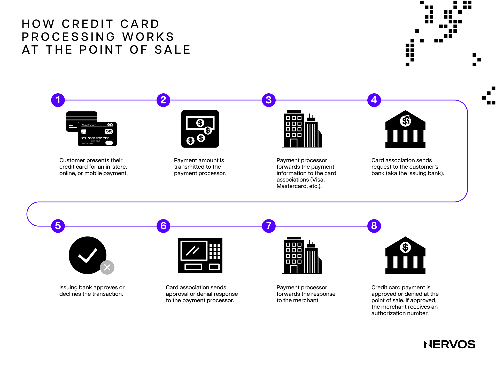
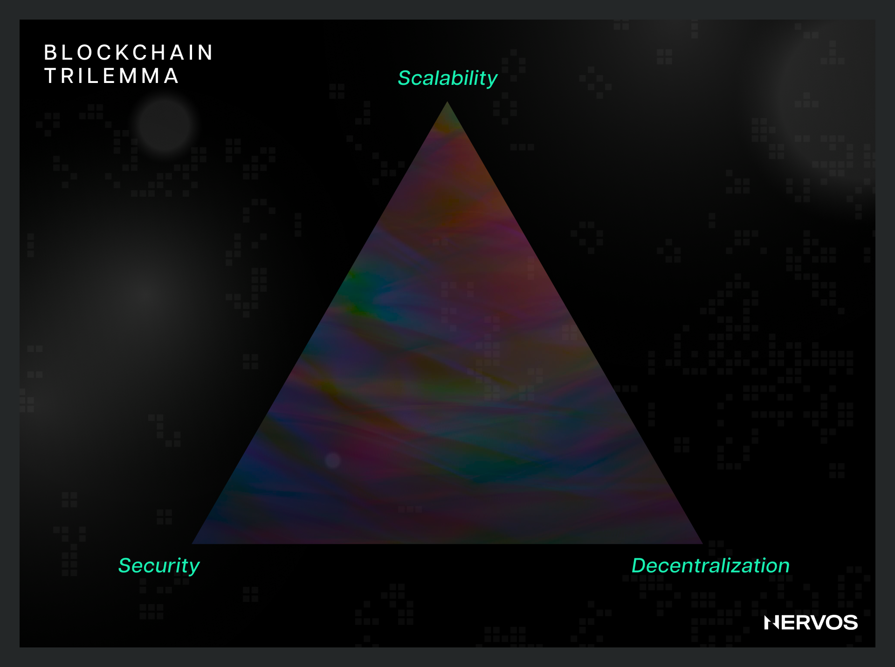
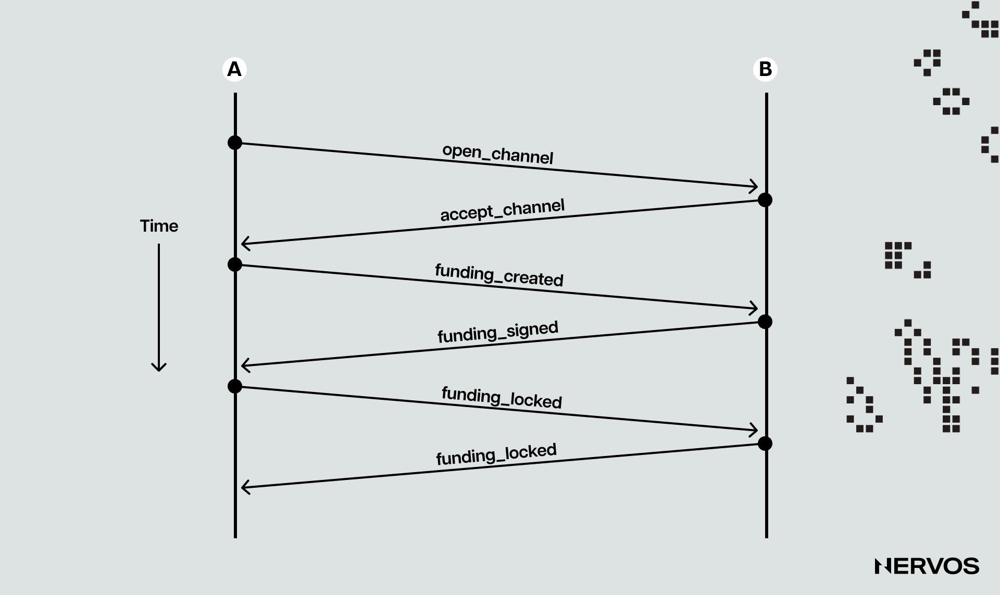
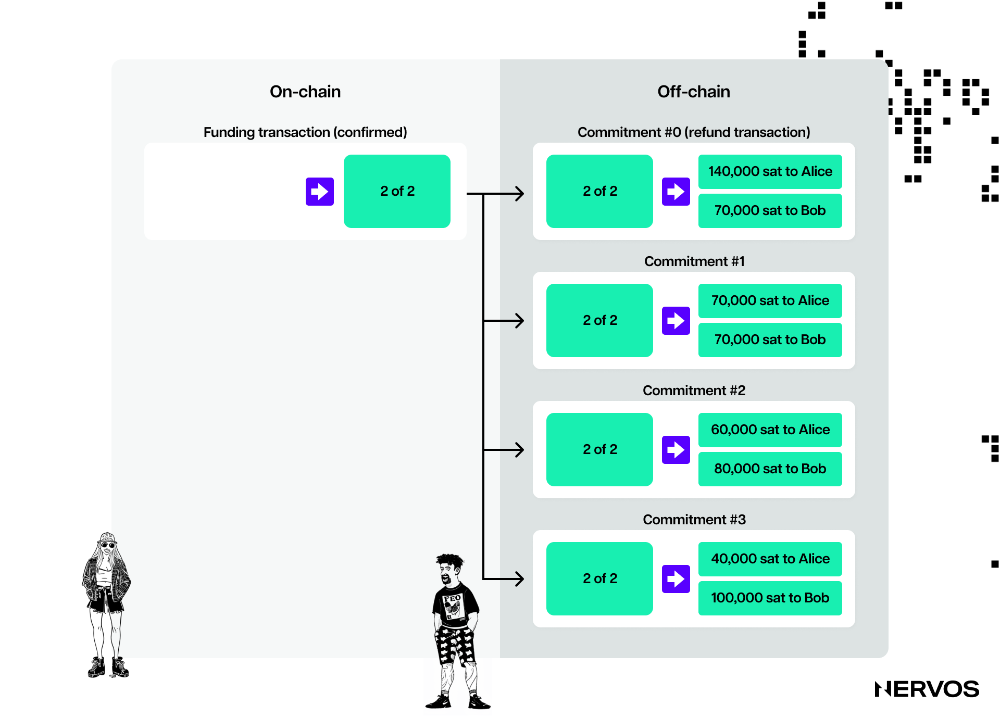
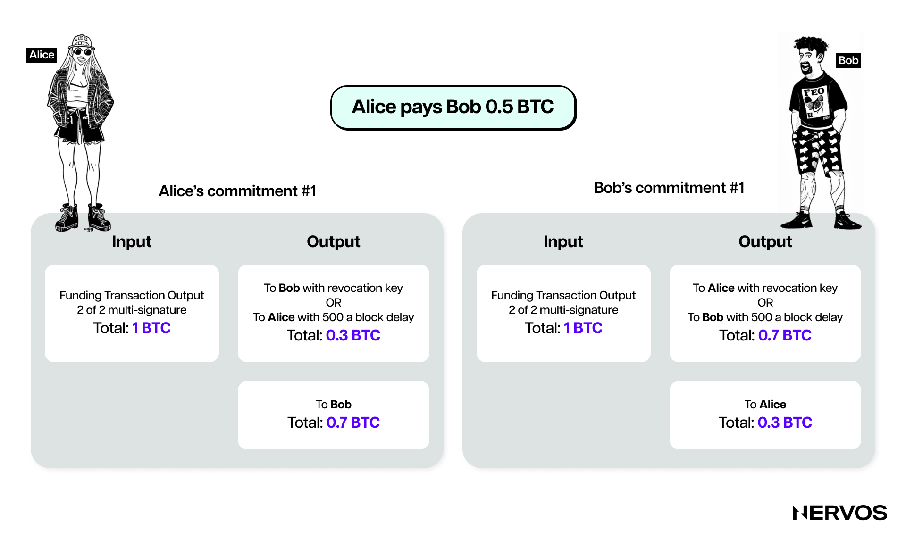
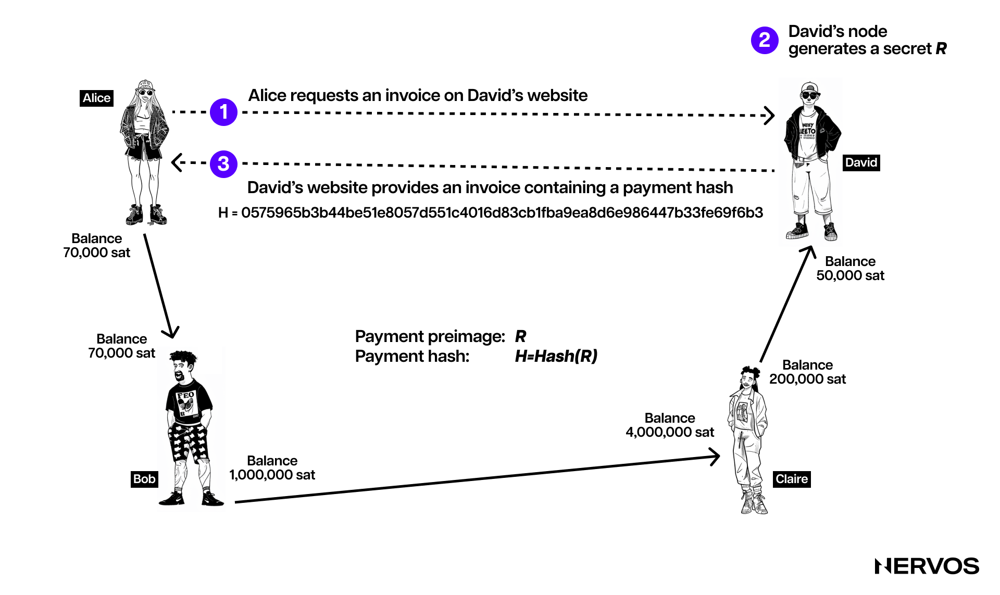

As things currently stand, most (micro) payments in the traditional financial system are settled via specialized payment processing companies like Visa and Mastercard, essentially [Layer 2](https://www.nervos.org/knowledge-base/layer_1_vs_layer_2) networks built on top of the commercial banking system that allow users to transact quickly and inexpensively. Despite popular belief, these transactions aren’t final until settled on the “underlying Layer 1 network” or deposited in the users’ commercial bank accounts. 

Even then, because fiat money is essentially a [pan-bank liability](https://www.sciencedirect.com/science/article/pii/S1057521914001070) of the commercial banking system)—meaning fiat payments represent _credit_, not asset transfers—interbank and especially cross-border transfers can take days to weeks to settle with finality and involve dozens of intermediaries with their own credit risk and compliance protocols, including interbank messaging conglomerates like [SWIFT](https://en.wikipedia.org/wiki/SWIFT), and “Layer 0 networks” like automated clearing houses (ACH) and central banks.

In other words, even though credit or debit card payments may seem instantaneous to merchants and consumers, they’re far from it. In the background, there’s a slew of processes increasing the costs and time to final settlement abstracted away from the users. The only reason the sluggishness of the traditional financial system remains mostly hidden from the end users is that everyone is mostly transacting on Layer 2s and above.

To that point, this [modular](https://www.nervos.org/knowledge-base/optimizing_layer_1_for_modularity) or layered architecture is even more necessary in the blockchain domain, where protocols are significantly more limited in throughput than their centralized counterparts. Blockchains are public databases updated and replicated across distributed networks of computers, meaning they can’t scale linearly by simply boosting the computational power of their nodes, unlike their centralized counterparts. Blockchains do decentralization by replication of computation, not distribution of it, meaning that the entire network scales at the rate or capacity of a single [node](https://www.nervos.org/knowledge-base/difference_between_miner_full_node_(explainCKBot)). In other words, unlike with centralized payment processors, employing more computers doesn’t imply higher processing power in blockchains.

More importantly, any increase in the hardware requirements for running full blockchain nodes leads to network centralization, effectively destroying the blockchains’ core value proposition of permissionlessness and censorship resistance. For this reason, blockchain architects must be mindful of the [Blockchain Trilemma](https://www.nervos.org/knowledge-base/blockchain_trilemma) and strive to find the right balance between security, scalability, and decentralization. Improving transaction throughput by increasing the block space and/or reducing the block time raises the hardware requirements for full nodes, leading to centralization. On the other hand, keeping the hardware requirements low enables more users to [run nodes](https://www.nervos.org/knowledge-base/ultimate_guide_to_light_clients), but significantly limits the network’s performance.

To this point, it has become increasingly evident over the last decade that the only way to scale blockchains without hurting decentralization is by moving transaction execution off-chain. As things currently stand, there are several methods of doing this, including rollups and payment and state channels—all commonly referred to as Layer 2 networks. 

Instead of broadcasting all state modifications to all network participants for [verification](https://www.nervos.org/knowledge-base/difference_blockchain_computation_verification_(explainCKBot)), Layer 2 networks allow blockchains to offload transaction execution onto separate networks that rely on different, less burdensome incentive mechanisms to achieve consensus and then broadcast only the end results of those transactions to the base layer for final settlement.

## What are Payment Channels?

The best way to understand payment channels is by looking at the largest or the most popular payment channel network in the industry, the Lightning Network built atop Bitcoin.

In this context, a payment channel represents a two-of-two [multi-signature account](https://www.nervos.org/knowledge-base/what_is_a_multisig_wallet_(explainCKBot)) or a Pay-to-Script-Hash (P2SH) address. For the uninitiated, a two-of-two multi-signature account is an account that necessitates the signatures of two different private keys to initiate transactions or spend bitcoin. Additionally, P2SH addresses allow users to commit to a script or a set of conditions that must be met to spend funds from the address, like requiring two private key signatures instead of one.

In simpler terms, payment channels can be understood as smart contracts that custody funds and set the conditions under which they can be spent. More specifically, the Lightning Network relies on two different types of “contracts:” (i) Revocable Sequence Maturity Contracts (RSMCs), which compose bilateral payment channels, and (ii) Hashed TimeLock Contracts (HTLCs), used to connect simple payment channels into a network. 

### Lifecycle of a Bidirectional Payment Channel

The general mechanism behind payment channels involves two frequently transacting parties depositing money into a two-of-two multi-signature account, doing a bunch of transactions that are only recorded locally, and then broadcasting only the final balance to the blockchain after they’ve finished transacting. Let’s explain the technicalities behind this process step by step.

#### Opening a Payment Channel

Suppose two parties, Alice and Bob, frequently exchange goods and services for bitcoin. If they were to settle all of their transactions on the Bitcoin network, they’d have to wait relatively long [confirmation times](https://www.nervos.org/knowledge-base/transaction_confirmation_in_blockchain_(explainCKBot)) (about 30 minutes for three confirmations, at which point everyone in the network would consider that transaction final) and pay excessive [transaction fees](https://www.nervos.org/knowledge-base/what_is_a_blockchain_gas_fee_(explainCKBot)). To save money and time, Alice and Bob can instead open a payment channel and transact instantaneously with negligent fees, and then close the channel when they’re done doing business with each other and ready to walk off with their money.

To open a payment channel, one of the two-channel partners, Alice, will initiate a so-called “funding transaction” that sends, for example, 10 BTC to a multi-signature address. These 10 BTC will thereafter represent the so-called “capacity” of the channel, which sets the maximum amount that can be sent across the payment channel. 

However, since funds can be sent back and forth, the channel capacity doesn’t set the limit for how much value can flow through the channel. Instead, it sets the maximum amount that can be sent by one transacting party to the other at a time. In other words, the parties may only be able to send a maximum of 1o BTC to each other at any time but they can transfer that (or a smaller) amount back and forth nearly infinite times over.

The next thing Alice does after sending 10 BTC to the multi-signature address constructed from Alice and Bob’s public keys is create an additional transaction that spends the 10 BTC from the multi-signature address, refunding Alice. Alice then has Bob sign this refund transaction _before_ she broadcasts the first funding transaction to the Bitcoin network. This way, Alice can get a refund or withdraw her 10 BTC from the multi-signature address even if Bob fails to cooperate or becomes unresponsive by simply broadcasting the signed refund transaction.

This additional step on Alice’s part is necessary for the payment channels’ security because if Alice were to broadcast the funding transaction without having Bob’s signature for the refund, Bob could refuse to sign a transaction to release the funds from the channel, effectively locking them in the multi-signature address forever.

The payment channel is now established, comprising the funding transaction and the subsequent “refund” transaction, which is the first in a class of transactions dubbed “commitment transactions,” representing the crux of payment channel transactions.

#### Commitment Transactions

Commitment transactions are intra-payment channel transactions— i.e., transactions stored locally by the transacting parties and ideally never broadcasted to the blockchain—that pay each channel partner their latest channel balance. 

Commitment transactions are the fundamental invention that allows channel partners to transact without trusting each other. By signing a commitment transaction, each channel partner “commits” to the current channel balance and allows the other party to withdraw their funds whenever they want.

In the above example, Alice’s refund transaction signed by Bob represents the payment channel’s first commitment transaction; from thereon forward and until the closing of the channel, the channel partners will transact only through commitment transactions. Beyond the first one, all subsequent commitment transactions will work by splitting the funds in the payment channel, paying each of the two parties according to the distribution or balance they hold. 

Because Alice funded the channel, meaning the channel balance was initially entirely hers, the first commitment transaction was a simple refund. However, as the channel parties keep exchanging value back and forth, they’ll exchange signatures for new commitment transactions that represent their latest balances, with some of the funds going to Alice and some to Bob.

For example, if Alice wants to send Bob 2 BTC for a Fortnite coaching lesson he gave her online, both would create a new version of their commitment transaction, paying 8 BTC to Alice and 2 to Bob. After the channel parties have exchanged signatures for the new commitment transactions, the payment is effectively “sent” across the channel. Important to note here is that channel parties transact by exchanging signatures, not actual bitcoin, as signed commitment transactions spending bitcoin are as good as exchanging bitcoin.

At this point, Alice holds two commitment transactions: the first “refund” transaction, paying her back the 10 BTC she used to fund the channel, and the latest commitment transaction, paying her 8 BTC and Bob 2 BTC. 

According to the payment channel protocol, as explained so far, nothing stops Alice from scamming Bob by receiving 2 BTC worth of his services in the real world and then publishing the first commitment transaction granting her the entire channel balance of 10 BTC. After all, Bitcoin is censorship resistant, meaning no one can stop Alice from publishing an old commitment transaction, and since Bob had already signed it, the transaction would be considered valid and included inside a valid block on the blockchain.

However, since this form of cheating can’t be allowed for obvious reasons, the Lightning Network and other payment channel protocols enforce a penalty mechanism to prevent it. 

Namely, beyond having at least two outputs paying each channel partner, commitment transactions also include a timelock mechanism and a revocation secret. The timelock prevents the output owner from spending the money immediately after the commitment transaction is included in a block. The revocation secret lets either party immediately spend that payment, bypassing the timelock.

This would mean that Bob holds a commitment transaction paying Alice immediately, but his payment is delayed (via the timelock) and revocable, and vice versa; Alice has a commitment transaction paying Bob immediately, but her payment is timelocked. Moreover, they both hold half of the revocation secret, so neither knows the full secret. If Alice shares her half, Bob would have the entire secret and can exercise the revocation condition. Every time the channel parties transact, they share their half of the revocation secret, thereby revoking the previous commitment transaction.

In other words, the channel parties exchange the necessary secret that can be exercised for their own punishment with every new commitment transaction they sign. This makes it unprofitable for them to cheat by broadcasting old commitments, as the other party could revoke them before the timelock (set to a number of blocks up to 2,016, approximately two weeks) for spending the output has expired. Moreover, by exercising the revoke condition, the other party can spend the entire channel’s balance immediately, meaning the cheater would lose all of their money.

This elaborate mechanism begets an incentive structure that ensures both parties remain honest throughout the lifecycle of the channel. It introduces severe repercussions for cheating, making the channel parties consider updates to the channel as final, even though they’re only computed locally.

#### Closing a Payment Channel

Payment channels can be closed under three circumstances: (i) both parties agree and close the channel mutually; (ii) one party unilaterally closes the channel because the other party has become unresponsive; and (iii) one party tries to cheat and gets caught, allowing the other party to claim the entire channel balance by enforcing the revocation mechanism.

##### **Mutual Closure**

In the first case, one channel partner informs the other of their intention to close the channel. Since both parties have mutually agreed on the closure, their LN nodes will start working on it together. The first order of business is to either settle or remove (after they time out) all ongoing _payment routing_ attempts (to be explained later) and stop accepting any new attempts from either channel partner. 

After this has been finalized (which takes time, meaning a mutual close also takes some time to complete), the nodes will prepare a closing transaction. This is a commitment transaction, similar to all previous ones that encode the last balance of the channel but not encumbered with a timelock. Once this transaction is broadcasted and confirmed by the Bitcoin network, the channel is effectively closed, and each channel partner receives their share of the final channel balance. 

##### **Unilateral Forced Closure**

When one party wants to close the channel but the other is nonresponsive, they could unilaterally do it by publishing their node's last commitment transaction. However, the party that initiates the channel closure has a slight disadvantage, as a timelock will lock its output, while its partner's output will be spendable immediately. 

The payment channel protocol is designed this way purposefully, so that the other party can have some time to dispute the closing transaction in case the one that initiated it attempts to cheat. Important to note here is that forced channel closure transactions are subject to much higher fees (up to five times the ones for mutual closure) because, at the time when they were signed, the parties couldn't know how much the on-chain fees would be at the time when the transaction would eventually be broadcast (and fees are committed to in the commitment transactions).

After the timelock period is over, the party that initiated the closure can spend their funds on-chain, effectively closing the channel. Due to the high transaction fees, forced closures are not typically recommended unless absolutely necessary.

##### **Malicious Channel Closure**

Malicious closures, or “protocol breaches,” occur when one of the channel parties tries to cheat by publishing an older commitment transaction to the Bitcoin network, forcefully and dishonestly closing the channel.

In this case, if the honest party notices the fraudulent channel closing transaction, they can execute the revoke mechanism and publish a “punishment” transaction before the cheating party’s timelock expires (typically set at two weeks). However, in order to do this, the honest party must run an LN channel node and constantly monitor the chain for fraudulent transactions or depend on a third-party Watchtower node that does the same.

If the honest party spots the cheating transaction and enforces the penalty, they’ll receive the channel’s entire balance, including the cheating party’s funds. In this case, the channel will close quicker than in the event of mutual or unilateral closures, as the parties don’t have to collaborate on closing the channel or wait for the timelock to expire. As with forced closures, however, all pending routing attempts must be resolved before the honest party’s commitment transaction is settled.

## Payment Channel Networks

While simple bidirectional payment channels are a solid blockchain scaling solution, they become exponentially more powerful when linked to a payment channel network like the Lightning Network on Bitcoin.

Payment channel networks allow two parties, say, Alice and David, to transact with each other without having a direct payment channel open between them. For example, David may have a channel open with Claire, an avid gamer who also has a channel open with the online Fortnite gaming coach Bob.

Because Alice and Bob have already established a payment channel, and Bob has one with Claire, who has one with David, Alice could _route _her payment to David via Bob and Claire’s respective channels using a Hashed Timelock Contract (HTLC).

For Alice and David, routing the payment using an HTLC is a better solution than simply opening a direct payment channel for two reasons. One, the payment is much cheaper, as it remains entirely off-chain and isn't subject to channel opening and closing transaction fees, and two, individual connections don't scale well. Namely, to connect three nodes, one needs three connections or edges (as they're called in graph theory); to connect five nodes, it's ten edges, and to connect 5,000 nodes, it's 12,497,500 edges. In other words, forming a peer-to-peer network based on direct connections is way more complex than creating one based on routing or indirect connections.

Before explaining how HTLCs work, it's first necessary to explain pathfinding and routing, two terms that refer to different processes but are often used interchangeably. Namely, pathfinding refers to the process of finding and choosing a valid path of payment channels that connect the sender to the recipient. The sender finds the valid path by examining the _channel graph_ they've assembled from channel announcements gossiped by other nodes in the payment channel network. On the other hand, routing refers to the actual process of sending a payment through the chosen path, which includes the cooperation of all intermediary nodes (called routing nodes) along that path.

The payment channel network protocol leverages HTLCs to ensure that the intermediary nodes are properly incentivized to pass along the payment routed through them and not steal it. The first component of an HTLC is the _[hash](https://www.nervos.org/knowledge-base/what_is_a_hash_function)_, which refers to using a cryptographic hash algorithm to commit to a randomly generated secret. In our case, the payment recipient, David, generates this hash, also called a _payment hash_, by hashing the secret (random number), also called a _payment preimage._

For David to enable Alice to route her payment to him using HTLCs, he first generates an invoice containing the payment hash. He then transmits this invoice to Alice through email, a direct message, or a QR code. Upon receiving the invoice, Alice uses the provided payment hash to create an HTLC that locks the payment. This HTLC serves as a secure mechanism, ensuring that the payment can be claimed only by the party who knows the corresponding secret, which in this case is David.

After creating the HTLC, Alice sends it to Bob, who doesn't know the secret but forwards the payment to Claire using another HTLC locked with the same hash. Claire, following suit, sends the payment to David with an HTLC. The final recipient, David, claims the payment by revealing the secret that matches the hash. This secret is then passed backward through the chain: Claire uses it to claim her payment from Bob, and Bob uses it to claim his payment from Alice. As a result, each participant updates their channel balances, reflecting the completed transactions, making the whole process secure and trustless, efficiently routing a payment through the network without requiring a direct channel between Alice and David.

Important to note here is that timelocks play a crucial role in the HTLC process by adding a time-bound element to the transaction. When Alice creates an HTLC to send a payment to David, she includes a timelock along with the payment hash. This timelock specifies a deadline by which the payment must be claimed by providing the correct secret (preimage) to the hash. If David does not reveal the secret before the timelock expires, the payment is automatically canceled, and the funds are returned to Alice. This feature ensures that the funds are not indefinitely locked if the recipient fails to claim the payment, adding a layer of security and urgency to the transaction.

Furthermore, channel capacity plays a vital role in the routing of payments using HTLCs in payment channel networks like the Lightning Network. Each channel in the network has a maximum capacity, which is the total amount of funds it can hold. This capacity sets a limit on the size of transactions that can be routed through that channel. Namely, for a payment to be successfully transmitted from the sender to the recipient, every intermediary channel along the chosen path must have sufficient capacity to handle the transaction.

Additionally, the distribution of funds within these channels, known as channel liquidity, is crucial. If the funds are unevenly distributed, it might impede the ability to route payments in certain directions despite the overall capacity appearing adequate. Therefore, both the capacity and liquidity of channels are critical factors influencing the efficiency and possibility of payment routing on the Layer 2 network.

These features also highlight HTLC’s atomic nature, in which a payment is either fully executed or fails and has no effect. It’s impossible for an intermediary to capture a routed payment and not pass it forward to the next node on the route. Thus, the intermediaries can’t cheat or steal.

## Conclusion

The development of systems like the Lightning Network atop Bitcoin is more than just a technical achievement; it's a paradigm shift in how we envision transaction processing in a decentralized framework.

The essence of payment channels and networks lies in their ability to enhance scalability without compromising on the core principles of decentralization and security that make blockchain technology so appealing. By offloading transaction execution to Layer 2 networks, these systems enable a high volume of transactions to be processed efficiently and at a lower cost, a feat unattainable through mere hardware improvements on the base layer.

The intricate design of payment channels, employing mechanisms like Hashed Timelock Contracts (HTLCs) and commitment transactions, enables not only the proper conduct of transactions between regular transacting parties but also the seamless connection of these individual channels into a robust network. This network architecture ensures that transactions can be securely and swiftly routed across multiple channels, facilitating interactions between parties who might not have a direct channel between them.

Moreover, the introduction of these channels addresses several critical issues faced by traditional blockchains, such as high transaction fees and long confirmation times, which have been barriers to the widespread adoption of cryptocurrencies for everyday transactions. By allowing for nearly instant transactions with negligible fees, payment channels make the use of cryptocurrencies more practical and appealing for regular transactions, bringing us a step closer to the vision of cryptocurrencies as a viable alternative to traditional fiat currencies in everyday commerce.

Ultimately, the evolution of payment channels and networks signifies a pivotal moment in the ongoing development of blockchain technology. As these solutions continue to mature and gain adoption, they promise to unlock new possibilities for the use of cryptocurrencies and decentralized ledger technologies, paving the way for a more efficient, secure, and accessible financial system in the digital age.
