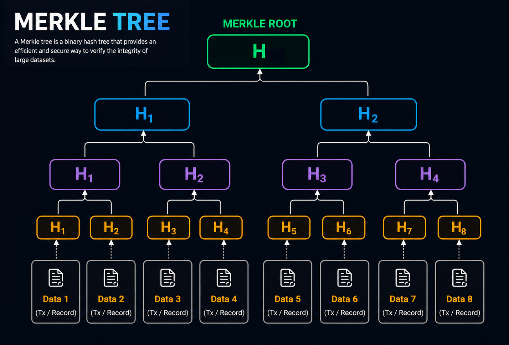
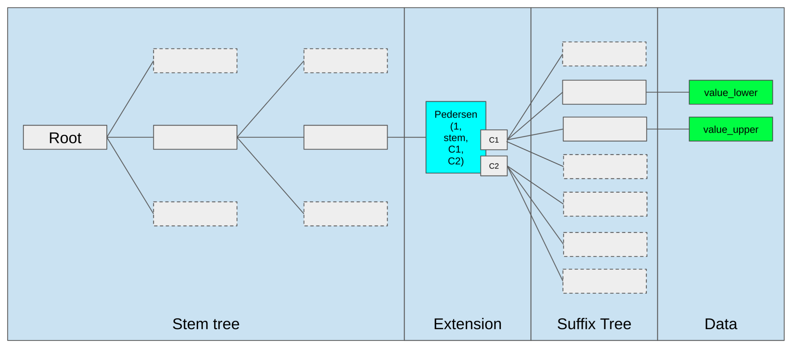

Every blockchain confronts the same core constraint: how to prove that data exists and is valid without requiring every participant to store the full [state](https://www.nervos.org/knowledge-base/state_and_state_change_(explainCKBot)).

For years, Merkle trees have served as the canonical solution. By structuring data into hash-based trees, nodes can verify inclusion and correctness using compact proofs rather than downloading entire datasets.

But this approach does not scale cleanly. As state size grows, Merkle proofs grow with it—introducing bandwidth and verification overhead that becomes increasingly material at scale. Verkle trees emerge as a response to this limitation, delivering significantly smaller proofs and making stateless client architectures far more practical.

## Understanding Merkle Trees in Blockchains

A Merkle tree is a cryptographic data structure optimized for organizing and verifying large datasets with minimal overhead. Conceptually, it can be viewed as a hierarchical composition of hashes—deterministic “fingerprints” derived from data. These hashes have a key property: even the smallest change in the underlying data produces a completely different output, making tampering immediately detectable.

At the base of the tree are *leaf nodes*, each representing the hash of a discrete piece of data—such as a transaction or account state. These leaf hashes are then combined in pairs and hashed again to form *parent nodes*. This aggregation process repeats recursively, layer by layer, until the structure collapses into a single hash at the top.

This top-level value, known as the *Merkle root*, serves as a succinct commitment to the entire dataset. It allows any participant to verify the integrity of individual data elements using only a small proof, rather than requiring access to the full dataset. Crucially, because the tree is recursively constructed, a modification anywhere in the data propagates upward, altering the Merkle root and exposing inconsistencies with minimal computational effort.

### Why Merkle Trees Are Important for Blockchains

Merkle trees play a crucial role in blockchain verification because they allow nodes to confirm the existence of specific data without downloading the entire blockchain.

A useful analogy is a large library catalog system. Instead of searching every shelf to confirm that a particular book exists, someone could follow a chain of references that leads directly to the book's location. Similarly, Merkle trees allow a node to verify a specific transaction by checking only a small portion of the tree rather than the entire dataset.

The data required for this verification is called a Merkle proof, which includes the hashes needed to reconstruct the path from a specific transaction to the Merkle root. Because the proof only contains a small number of hashes, it dramatically reduces the amount of data that must be transmitted across the network. This design enables [lightweight clients](https://www.nervos.org/knowledge-base/ultimate_guide_to_light_clients) or [Simplified Payment Verification](https://www.nervos.org/knowledge-base/what_is_SPV_(explainCKBot)) (SPV) nodes to operate with minimal storage, which is why Merkle trees are widely used across blockchain systems. 

For example, Bitcoin uses Merkle trees to organize transactions inside each block, allowing nodes to verify transactions efficiently without storing the entire transaction history. Meanwhile, Ethereum uses a more advanced structure known as a [Merkle Patricia Trie](https://www.nervos.org/knowledge-base/merkle_patricia_trie_(explainCKBot)) to store account balances, smart contract storage, and transaction receipts, ensuring that the global state of the network remains verifiable by all nodes.

### The Limitations of Merkle Proofs

Merkle trees have been a robust primitive for blockchain verification, but they were conceived in an era of smaller state and less demanding network conditions. As modern blockchains scale—accumulating millions of accounts, contracts, and storage slots—their limitations become increasingly apparent.

A Merkle proof consists of the sequence of sibling hashes required to reconstruct the path from a leaf node to the root. As the tree deepens with growing state, these paths lengthen, and proof sizes increase accordingly. In large systems, especially when a transaction touches multiple pieces of state, proofs can expand to tens of kilobytes, introducing nontrivial bandwidth and verification overhead.

This becomes a structural bottleneck for stateless client designs, where nodes rely on externally provided proofs rather than maintaining a full local copy of the state. Larger proofs directly translate into higher bandwidth requirements, slower validation, and degraded block propagation—constraints that are particularly acute for high-throughput platforms like Ethereum.

Merkle trees also exhibit inefficiencies when verifying multiple values simultaneously. Each element requires its own authentication path, and while these paths may overlap, the overlap is not efficiently compressed in standard constructions. The result is redundant data within proofs, further inflating their size and compounding the scalability challenge.

## Introduction to Verkle Trees

Verkle trees are a more recent data structure designed to address the scaling limitations of Merkle trees—most notably, the growth in proof sizes as blockchain state expands. Like Merkle trees, they allow a system to commit to a large dataset and generate proofs of inclusion or correctness for specific values. The distinction lies in how those proofs are constructed.

Merkle trees rely on recursive hashing: each step in the proof requires revealing sibling hashes along a path from the leaf to the root. Verkle trees replace this mechanism with *vector commitments*—a more advanced cryptographic primitive that allows an entire set of values to be committed within a single, compact structure. Instead of proving membership by traversing a path of hashes, Verkle proofs demonstrate that a value is part of a committed vector using succinct mathematical arguments.

*Structure of a Verkle Tree. [Source: [ethereum.org](https://ethereum.org/roadmap/verkle-trees/)]*

A useful way to frame the difference is in terms of information density. In a Merkle tree, verifying a single value requires disclosing a sequence of intermediate hashes—each one a piece of the path. In a Verkle tree, a single commitment can represent a large collection of values, and proofs can reference this commitment directly, requiring far less auxiliary data. The result is dramatically smaller proofs and a structure that scales more cleanly with large, complex states.

### How Verkle Trees Reduce Proof Sizes

In a Verkle tree, each internal node commits to a large set of children simultaneously, rather than combining them pairwise as in a Merkle tree. This high branching factor, combined with vector commitments, allows a verifier to confirm the existence of a value using a proof that remains compact even as the dataset scales to millions of entries. The result is a step-function improvement in proof size—measured in bytes per access—making Verkle trees far more efficient for large state systems.

Structurally, Verkle trees still resemble hierarchical trees: leaf nodes represent individual data entries, and a single root commitment summarizes the entire dataset. The key difference lies in the underlying cryptography. Instead of relying on iterative hashing, Verkle trees use algebraic constructions—most notably polynomial commitments defined over elliptic curves—to encode and verify data. This shifts the burden from bandwidth to computation.

A useful analogy is to compare how you would prove a book exists in a library. With a Merkle tree, it’s like being asked to show a chain of references: the shelf it’s on, the section that contains the shelf, the floor that contains the section, and so on—all the way up to the building. Each step adds more information you need to carry with you.

With a Verkle tree, it’s closer to having a single, authoritative library catalog that cryptographically commits to every book in the building. To prove a book exists, you don’t need to show the entire chain of intermediate locations—you reference the catalog and provide a compact proof tied to it. The catalog already “knows” about all books at once, so the amount of information you need to present stays small, regardless of how large the library becomes.

While the underlying math is more complex, the effect is straightforward: far less data needs to be transmitted and verified for each lookup.

Although these operations are more computationally intensive than hashing, they are well within the capabilities of modern hardware and can be optimized significantly. In practice, for blockchain systems operating under network constraints, reducing proof size and bandwidth usage yields greater systemic benefits than minimizing local computation.

### Other Advantages of Verkle Trees 

A primary advantage of Verkle trees is their ability to enable stateless client architectures. In a stateless model, nodes validate blocks using externally provided state data and accompanying proofs, without maintaining a full copy of the global state. Because Verkle proofs are compact, they can be included alongside transactions without overwhelming block size or network bandwidth.

This has direct implications for decentralization. Lower hardware and storage requirements reduce the barrier to running a validating node, enabling broader participation and improving the network’s resilience over time.

Verkle trees also handle multi-value verification more efficiently. Rather than generating independent proofs for each accessed value, they can aggregate multiple state queries into a single, compact proof. This eliminates redundant data and significantly improves efficiency for workloads where transactions touch many storage slots—common in complex smart contract execution. The downstream effects are smaller blocks, faster propagation, and more predictable performance under load.

## Ethereum Is Moving Toward Verkle Trees

The most prominent real-world adoption effort is underway in Ethereum’s roadmap. Transitioning to Verkle trees enables a series of structural improvements: smaller state proofs, reduced bandwidth requirements, faster block propagation, and lower resource demands for nodes.

This transition is tightly coupled with Ethereum’s long-term push toward stateless validation. In this model, validators do not store the full state locally; instead, each block carries the data and proofs required for its own verification. While conceptually straightforward, this approach is only practical if proofs remain compact.

Under Merkle-based designs, proof sizes scale poorly—particularly for transactions that access multiple storage slots—making stateless validation inefficient. Verkle trees resolve this constraint by dramatically reducing proof size, allowing stateless validation to operate within realistic network limits.

## Conclusion

Merkle trees and Verkle trees represent two generations of cryptographic data structures in blockchain design. Merkle trees have earned a reputation for simplicity, reliability, and robustness. They remain an excellent choice for applications where proof efficiency and stateless validation are less critical.

Verkle trees, in contrast, address the scalability challenges inherent in large, long-lived blockchain networks. By producing compact proofs, enabling stateless client operation, and supporting aggregated state verification, Verkle trees offer a pathway to more efficient, accessible, and decentralized blockchain architectures. 
