As one of his first forays into crypto, Twitter's founder Jack Dorsey sought to build [TBD](https://tbd.website/)—a new identity and trust layer for the Internet—intended to run exclusively on peer-to-peer rails, integrated with established Web2 services.

Many thought TBD sounded a lot like the Web3 decentralized identity service [ENS](https://ens.domains/), but Dorsey begged to differ. As an adamant Bitcoiner—a word that today is synonymous with a crypto skeptic—he felt the need to separate from the crowd, ensuring TBD would never be seen as just another Web3 project.

Specifically, Dorsey realized that Web3—a vision for a decentralized internet built on open protocols and blockchains, incorporating identity, finance, and social layers—was *surprisingly* not the kind of system he sought to build. 

He recognized that the reality of Web3 was fundamentally opposed to his vision—it was incompatible with the Web's existing infrastructure and engineered to replace it.

*Defining Web5. (Source: [TBD presentation](https://docs.google.com/presentation/d/1SaHGyY9TjPg4a0VNLCsfchoVG1yU3ffTDsPRcU99H1E/edit#slide=id.g12e604c56a9_0_121))*

With decentralization being TBD's professed and uncompromising goal, he sought to build on Bitcoin. In his eyes, this alone made TBD "not Web3," necessitating a new term for this kind of system.

To that end, Dorsey half-jokingly coined the term "Web5," partly as a jab at Web3 and partly as a throwback that pays homage to [HTML5](https://en.wikipedia.org/wiki/HTML5), the basis of today's Internet and the last significant effort to evolve the Web some 15 years ago.

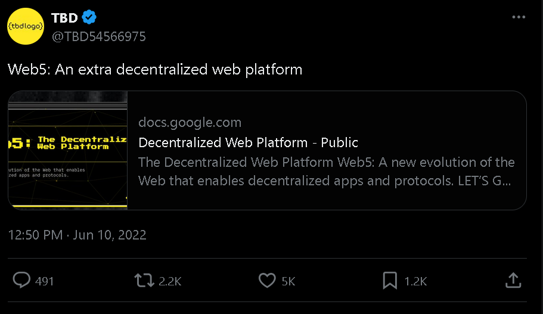

Judging by TBD's [whitepaper](https://github.com/TBD54566975/tbdex-whitepaper/blob/main/whitepaper.pdf), Dorsey saw Web5 as a peer-to-peer network that leverages Bitcoin as the base consensus layer and Lightning as a payment network. It centers around three pillars: 1) self-owned decentralized identifiers, 2) verifiable credentials, and 3) decentralized web nodes for storing data and relaying messages.

*“On the web today, identity and personal data have become the property of third parties. Web5 brings decentralized identity and data storage to your applications. It lets devs focus on creating delightful user experiences while returning ownership of data and identity to individuals,”* TBD’s website reads.

Considering the [Twitter Files](https://en.wikipedia.org/wiki/Twitter_Files)—a series of releases of select internal Twitter, Inc. documents showing how the company had been coerced to censor critical content—and TBD’s stated goals, we think it’s fair to assume that Dorsey essentially wanted to build “freedom tech.” 

His vision for what this tech could look like can be typified in [Nostr](https://nostr.com/)—an open protocol for decentralized and censorship-resistant message transmission built precisely in reaction to the moderation or censorship issues plaguing today’s centralized social media platforms.

For the uninitiated, Nostr operates similar to blockchains, each user generates a private key (which they keep secret) and is known by their public key. All messages—called “notes”—are cryptographically signed by their creators and can be verified by others. 

Instead of a single platform holding everyone’s data, Nostr relies on independently operated servers known as relays, which store and forward messages according to simple, open rules. Because users can choose any relay—or set up their own—*no central authority* can effectively censor or remove content. The protocol itself is deliberately minimal, defining only how messages are formatted, signed, and published, while developers are free to build additional features like direct messaging or image support on top.

After seeing how centralized social media companies are forced to operate, Dorsey became enamored with a different vision—one where web apps distribute control back to the users and away from corporations and points of failure which are subject to control. His interest and support for Nostr demonstrate the opportunity to move past the owned servers of Web2, which disturbingly have made their way into Web3.

Now, while we do not know if Dorsey intended any sarcasm when he coined the term Web5, we do know that he was on to something. Despite TBD never releasing a product and being [wound down](https://github.com/TBD54566975) recently, we see Dorsey's insights into the shortcomings of Web3 as accurate and prescient.

His vision for Web5, however, was unnecessarily constrained to Bitcoin and [Lightning](https://www.nervos.org/knowledge-base/ultimate_guide_to_payment_channels).

We see Web5 as something bigger than the sum of its parts and certainly more than “a peer-to-peer network” that exclusively utilizes Bitcoin for consensus and centers around decentralized identifiers.

Moreover, Web5 is not just a semantic "rebrand" or a clever way of cutting through the noise for us, but a material U-turn back to our industry's roots.

We see Web5 as a mesh of peer-to-peer networks connecting various PoW and UTXO-based consensus layers, channel networks, and other systems that have yet to be imagined. To further abstract, we imagine Web5 as a thriving ecosystem of dApps built upon this mesh of peer-to-peer networks.

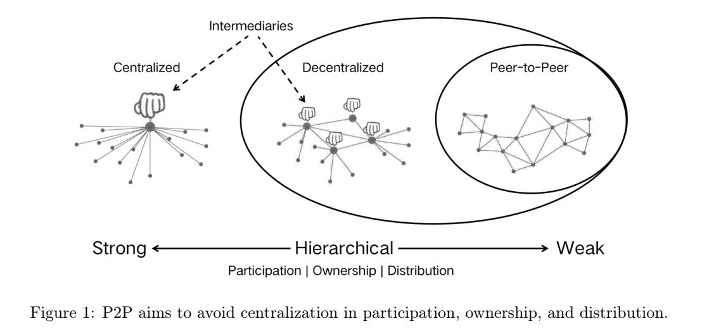

*Network topologies of decentralized and peer-to-peer networks. (Source: [CKBEcoFund](https://ckbecofund.substack.com/p/reclaiming-the-bitcoin-p2p-vision))*

The underlying rails are the key distinguisher between Web5 and Web3 here.

Web5 is built on a mesh of genuinely decentralized networks with peer-to-peer topologies, a direct downstream consequence of utilizing PoW for consensus and the UTXO data model. Rather than centering on blockchain technology or treating it as the sole actor, Web5 envisions a new ecosystem of open internet protocols—enhanced by the latest cryptographic primitives—that work together to usher in a new era for the internet.

Web3, on the other hand, has not fulfilled its stated goals of decentralization, censorship resistance, permissionlessness, and self-custody of data and assets largely due to poor choices made regarding its underlying architecture, particularly the decision to adopt PoS and the account-based data model.

## Web3 Today

Web3 today is a never-ending sprawl of decentralized-in-name-only networks that—following the rise of [MetaMask](https://metamask.io/) and [Infura](https://www.infura.io/) in 2017—quickly took on [client-server](https://en.wikipedia.org/wiki/Client%E2%80%93server_model) topologies.

Despite the herculean research and engineering efforts, we conclude that this outcome is an unavoidable consequence of building atop PoS and the account data model.

Though we have a great deal of respect for the principled efforts of the many fighting the gravity of these decisions, we ourselves do not hold hope that this client-server network topology is a reparable condition. But before we dig deeper into why, let’s take a quick glance at the state of play in Web3.

In February 2009, Satoshi [remarked](https://satoshi.nakamotoinstitute.org/posts/p2pfoundation/1/): “*The root problem with conventional currency is all the trust that's required to make it work.*”

Taking inventory of Ethereum today, "trust" seems to be on the rise. While stake pool operators and block builders aren't necessarily trusted third parties (TTPs) in these systems, they certainly are privileged actors that are getting more influential by the day.

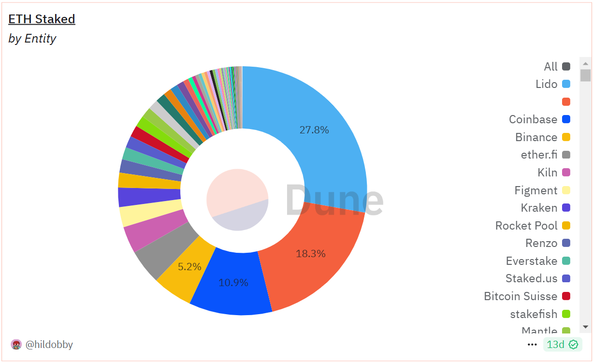
*Percentage of total ETH staked by entities. (Source: [dune.com](http://dune.com))*

Liquid staking protocol [Lido](https://lido.fi/) controls ~28% of total ETH staked while [Coinbase](https://www.coinbase.com/) controls ~11%, raising concerns about the potential concentration of governance and validation rights among a few influential industry players. [Beaverbuild](https://beaverbuild.org/) and [Titan Builder](https://www.titanbuilder.xyz/) are producing[ ~89% of all blocks](https://x.com/nero_eth/status/1846786871998759141) on Ethereum, which raises further concerns regarding censorship resistance and control over maximum extractable value ([MEV](https://cryptobriefing.com/what-is-mev-ethereums-invisible-tax-explained/)).

Moving on, although Ethereum's base layer is by many measures—and especially compared to most of Web3—"sufficiently decentralized," the community's chosen path of horizontal scaling has produced systems with obvious trust assumptions.

<blockquote class="twitter-tweet">
Not to give away the full game. But  Yes start with one and figure out how to make crosschain interop against other chains completely seemless   Once you do that, if unichain gets too full you just make more copies of it that interop together if/when vertical scaling caps out <a href="https://t.co/rKHzxCj8VJ">https://t.co/rKHzxCj8VJ</a>
&mdash; Hayden Adams 🦄 (@haydenzadams) <a href="https://twitter.com/haydenzadams/status/1860390973739561032?ref_src=twsrc%5Etfw">November 23, 2024</a></blockquote> 
These systems rely on centralized infrastructure providers that act as “servers,” while users become clients who depend on these servers for network access and functionality. This mirrors traditional Web2 architectures more than anything, undermining the decentralization that Web3 originally aimed to achieve.

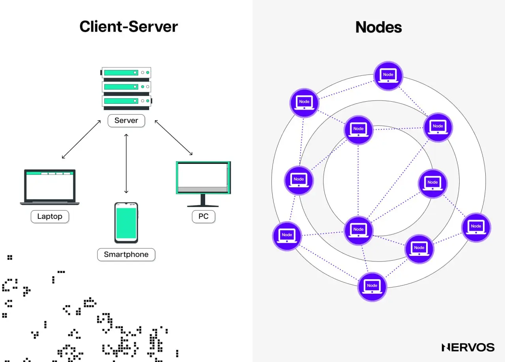

Concerning [rollups](https://www.nervos.org/knowledge-base/zk_rollup_vs_optimistic_rollup) specifically, the reliance on centralized sequencers creates a serious bottleneck. In the best case, a single entity has total control over transaction ordering and inclusion, meaning that users must trust them to behave honestly, which is antithetical to crypto’s trustless ethos. In the worst case, the same entity can halt the chain entirely, as Ethereum Layer 2 Linea demonstrated this year when it [paused its sequencer](https://www.dlnews.com/articles/defi/ethereum-layer-2-linea-pauses-chain-after-velocore-exploit/) in response to an exploit on one of the decentralized exchanges in its ecosystem.

Worse yet, Linea isn’t an exception. Almost all Ethereum rollups are centralized, with their operators being able to censor transactions or halt the chains indefinitely. If a chain can be halted, then what’s the point? Why run a chain vs., say, a traditional centralized database when the latter is clearly more performant?

Even if we ignored all of these red flags and naively assumed the trusted third parties running today’s Web3’s underlying infrastructure *could *be trusted, we’d still be left with the reality that they’re [security holes](https://nakamotoinstitute.org/library/trusted-third-parties/), as Nick Szabo pointed out years ago, and countless exploits demonstrated since.

To that point, in July 2023, the cross-chain protocol Multichain lost more than $125 million in user funds in what is suspected to be a rug pull by insiders. The [exploit](https://www.chainalysis.com/blog/multichain-exploit-july-2023/) occurred because the company's CEO, Zhaojun, who controlled most of the platform's multi-party computation (MPC) keys, got arrested by the Chinese police. A similar thing happened to Axie Infinity's Ronin Bridge a year before, where the Lazarus Group [stole](https://www.coindesk.com/tech/2022/03/29/axie-infinitys-ronin-network-suffers-625m-exploit) over $600 million in user funds by gaining control over 5/9 validator private keys required to authorize deposits and withdrawals.

<blockquote  class="twitter-tweet">
- <a  href="https://twitter.com/blast?ref_src=twsrc%5Etfw">@blast</a>  3/5 msig ($1.45B) - <a  href="https://twitter.com/0xMantle?ref_src=twsrc%5Etfw">@0xMantle</a>  6/13 msig ($1.44B) - <a  href="https://twitter.com/LineaBuild?ref_src=twsrc%5Etfw">@LineaBuild</a>  4/6 msig ($849M) - <a  href="https://twitter.com/Starknet?ref_src=twsrc%5Etfw">@Starknet</a>  2/5 msig ($676M) - <a  href="https://twitter.com/MetisL2?ref_src=twsrc%5Etfw">@MetisL2</a>  4/9 msig ($303M) - <a  href="https://twitter.com/fraxfinance?ref_src=twsrc%5Etfw">@fraxfinance</a>  3/5 msig ($170M) - <a  href="https://twitter.com/taikoxyz?ref_src=twsrc%5Etfw">@taikoxyz</a>  3/4 msig ($100M) - <a  href="https://twitter.com/loopringorg?ref_src=twsrc%5Etfw">@loopringorg</a>  4/6 msig ($45M) - <a  href="https://twitter.com/KintoXYZ?ref_src=twsrc%5Etfw">@KintoXYZ</a>  3/5 msig ($36M) <a  href="https://t.co/uLt82LdAtW">https://t.co/uLt82LdAtW</a>
&mdash;  donnoh.eth 💗 (@donnoh_eth) <a  href="https://twitter.com/donnoh_eth/status/1846833521073311906?ref_src=twsrc%5Etfw">October  17, 2024</a></blockquote> 
Beyond the trust and security issues, horizontal scaling (i.e., branching out, or offloading transaction execution to adjacent chains) also causes serious liquidity fragmentation and infrastructure cost issues. Currently, there are several dozen Ethereum Layer 2s, most of which are ghost chains because they couldn’t achieve escape velocity or attract and sustain enough liquidity.

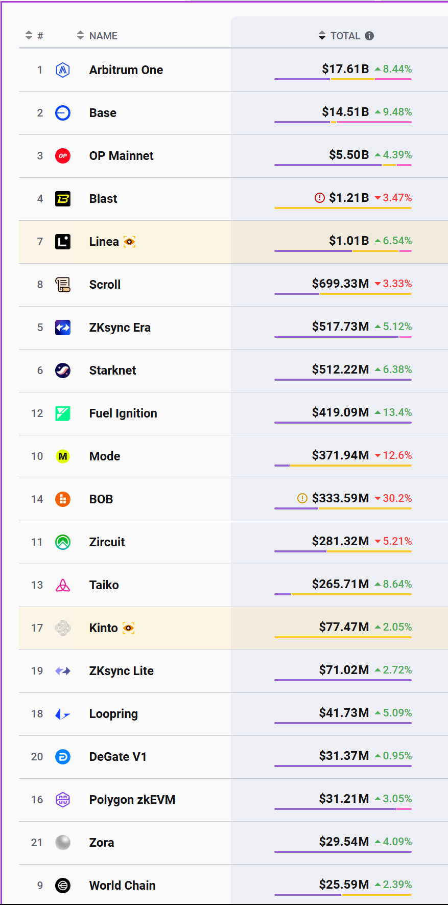

*The top two Layer 2 chains, Arbitrum and Base, have a total TVL ($32.12B) that exceeds the combined TVL of the remaining 18 chains ($11.43B). (Source: [L2Beat.com](L2Beat.com))*

Liquidity attracts traders, trading volume attracts liquidity, and both combined attract dApp builders. The liquidity fragmentation issue makes Layer 2 chains a heavy subject of network effects, where those that reach escape velocity first keep growing at the expense of others, leading to a form of centralization or consolidation of liquidity and user activity among a few winners.

While these systems are called rollups, they are nevertheless blockchains with scarce blockspace. This means that the winning Layer 2’s often still encounter the same issues of scalability and fee volatility that the base chain they were trying to scale had, which can create a need for additional Layer 3s with even more complicated security assumptions than the underlying Layer 2.

Adding more chains means higher infrastructure spending—after all, someone has to keep all the rollups running. Even after the [EIP-4844](https://www.eip4844.com/) update that introduced blobs to Ethereum, which reduced L1 data availability (DA) costs by 100x, the operational infrastructure of a rollup can still [cost](https://www.chaincatcher.com/en/article/2142428) between $10,000 to $16,000 per month (assuming two million transactions per month).

Under the same assumptions, the L1 costs alone are around $25,000, while settling on alternative DA layers like [Celestia](https://x.com/celestia) or [EigenDA](https://x.com/eigen_da) is cheaper by orders of magnitude. Unfortunately, for many Layer 2s, the fees paid by the users aren’t enough to cover the infrastructure costs, meaning the infrastructure or “server” owners must bear them. This financial burden creates barriers to entry for new participants and gives an advantage to well-funded entities, further promoting centralization.

In contrast, PoW+UTXO chains scale vertically by adding layers like payment channels or state channels on top of the base layer. Verification remains cheap and accessible; users can run full nodes or light clients on modest hardware, ensuring broad participation in the network. The state is managed through UTXOs, allowing users to verify only the transactions relevant to them without relying on centralized intermediaries.

Protocols like the Lightning Network, [Ark](https://x.com/ArkLabsHQ), and [RGB++](https://www.rgbppfans.com/) exemplify this approach. Users can establish payment channels directly with one another, and the security of these channels is anchored in the robust PoW consensus of the base layer. There's no need for bridges or centralized sequencers that could act as points of failure or control. This maintains the integrity of the network's topology, keeping it genuinely decentralized or peer-to-peer and resistant to censorship or control by any single entity.

## How Did Web3 Get Here?

To understand why we’re building Web5, one must first understand where Web3 went wrong. The best way to do that is to look at Ethereum’s history of design choices.

Right off the bat, we must clarify that we don’t have a bone to pick with Ethereum (or any other chain, for that matter). Instead, we only exemplify it to make the best steelman argument against PoS+Account-based chains.

Ethereum is the most decentralized chain—in tech, ethos, and community—in the category. It is also where the Web3 meme began and the platform on which most of it is built. It would, therefore, be disingenuous to use any other chain as the basis for highlighting Web3’s shortcomings. Moreover, we believe that the Ethereum community’s efforts to achieve Web3’s professed goals are sincere, and its failures result from decisions made a decade ago.

### Ethereum’s First Mistake

Ethereum’s first mistake comes from its original attempt to turn a blockchain into a “world computer.” In [this](https://www.nervos.org/knowledge-base/optimizing_layer_1_for_modularity) article, we explained in depth why this was always a fundamentally bad idea, so here we’ll only lay out the conclusion: blockchains are for verification, not computation.

When Bitcoin developer Gregory Maxwell [pointed this out](https://bitcointalk.org/index.php?topic=1427885.msg14601127#msg14601127) over nine years ago, Vitalik Buterin [refuted](https://www.reddit.com/r/ethereum/comments/4g1bh6/comment/d2e24sy/) it profusely.

Looking at Ethereum's state of play, it seems that the everything-on-chain thesis has been abandoned. Any and all attempts to scale the world computer have been via “on-another-chain scaling,” better known as the [rollup-centric roadmap](https://ethereum-magicians.org/t/a-rollup-centric-ethereum-roadmap/4698).

In other words, the Ethereum community capitulated on its original thesis, embracing a more technically conservative “modular blockchain” approach. Today, the base layer is used for verification and final settlement, while adjacent chains or Layer 2s are used for transaction processing.

### Ethereum’s Second Mistake

This pivot, however, has proven ineffective in establishing a peer-to-peer network in large part due to Ethereum's second architectural mistake: abandoning Bitcoin’s UTXO model in favor of the account model.

At the time, Vitalik [made two arguments](https://medium.com/@Consensys/thoughts-on-utxo-by-vitalik-buterin-2bb782c67e53) justifying this move: (i) *“UTXOs are unnecessarily complicated, and the complexity gets even greater in the implementation than in theory,”* and (ii) *“UTXOs are stateless and so are not well-suited to applications more complex than asset issuance and transfer that are generally stateful, such as various kinds of smart contracts.”*

While these arguments may have carried water then–and were rightfully heralded as an important innovation–the industry has come a long way since. Statefulness—the property of maintaining and updating the blockchain’s “state” or the collection of all current data, balances, and conditions resulting from past transactions—is indeed what enables computation, but the account model is *not *the only way to achieve this.

In 2017, Cardano introduced the extended UTXO ([e-UTXO](https://iohk.io/blog/posts/2025/01/08/six-reasons-why-eutxo-wins/)) model, and in 2019 Nervos introduced the [Cell](https://medium.com/nervosnetwork/https-medium-com-nervosnetwork-cell-model-7323fca57571) model, a stateful, generalized UTXO-based model. Recently, BitVM developers have even found ways to do stateful computation on Bitcoin via Taproot. 

In retrospect, choosing the account over the UTXO model seems like a high-time preference decision; something that made it easier for developers to build dApps right away but, in the process, sacrificed the many benefits that inherently stem from the UTXO model.

One of the many such benefits worth highlighting here is how the UTXO model enables genuine ownership of assets and data—which, coincidentally, is one of the key self-professed goals of both Web3 and Web5.

The UTXO-based ledger model does not have accounts in the traditional sense. Instead, it relies on addresses and Unspent Transaction Outputs (UTXOs) to track asset ownership and transfers.

UTXOs are discrete units of cryptocurrency that have been received but have yet to be spent. They're associated with addresses that specify who can spend them. *In this model, users control funds by controlling private keys corresponding to addresses with associated UTXOs.* The sum of these UTXOs represents the user's total available funds, managed without traditional accounts.

Conversely, the account-based data model has two types of accounts: externally owned accounts (EOAs) and contract accounts (CAs). The former are what users refer to as "accounts," which are controlled by private keys and can initiate transactions. The latter are what users call smart contracts. These can't initiate transactions and aren't controlled by private keys. Instead, they host code and data and are created and controlled by EOAs.

The problem with this setup is that, in the account-based ledger model, all non-native assets—all fungible and non-fungible tokens aside from ETH in Ethereum—are controlled by CAs. *This means that non-native assets in this model are second-class citizens. While users may see specific tokens in their wallet’s balance, they don’t effectively own them.* Instead, these tokens are managed by CAs or smart contracts controlled by the EOA that created them.

<blockquote class="twitter-tweet">
Dear <a href="https://twitter.com/AcrossProtocol?ref_src=twsrc%5Etfw">@AcrossProtocol</a> team,  I’m writing to you during your office hours of 9-5pm on M-F and have no reason to believe today is a national holiday.   I’d like to inform you that your token contract has a critical issue.   You mistakenly exposed what was meant to be an internal… <a href="https://t.co/EpMu8zvVM8">pic.twitter.com/EpMu8zvVM8</a>
&mdash; Bryan Pellegrino (臭企鹅) (@PrimordialAA) <a href="https://twitter.com/PrimordialAA/status/1848393812777066640?ref_src=twsrc%5Etfw">October 21, 2024</a></blockquote>  
The most straightforward way to capture the magnitude of this issue is through a real-world example. In a recent X [post](https://x.com/PrimordialAA/status/1848393812777066640), Brian Pellegrino, the co-founder and CEO of [LayerZero](https://layerzero.network/), called out the cross-chain interoperability protocol [Across](https://across.to/) for a critical bug in its token contract. A function in the token contract, seemingly a mistake, allowed the contract owner to transfer tokens from any wallet at any time. Effectively, the Across team can steal the respective tokens from any user holding them.

To make things worse, this is just one example demonstrating that users can’t and don’t own non-native assets in the account-based ledger model. Many other token contracts have similar features that allow the contract owners to arbitrarily burn or mint more tokens and censor or confiscate tokens from users’ wallets. 

Centralized stablecoin issuers have these functions built-in by default—as necessary compliance features—allowing them to confiscate tokens from users that have, for example, been suspected of having acquired them through illicit means (exploits, theft, etc.)

Conversely, all assets in the UTXO ledger model are first-class citizens directly controlled by private keys owned by users. On the Common Knowledge Base (CKB) blockchain, which utilizes a stateful UTXO-based ledger model, the token contracts only define the token’s operating logic, i.e., “the issuance cap is 1,000,000 tokens” or “the issuance rate is 50 tokens per block.”

The asset records that determine users’ balances, such as “Alice owns 100 tokens,” are stored in cells (think stateful UTXOs) controlled directly by the users. This means that, unlike in the account-based ledger model, hackers can’t steal users’ tokens even if the token contract is exploited.

### Ethereum’s Third Mistake

Ethereum’s third mistake was abandoning PoW in favor of PoS. The arguments favoring this decision [included](https://medium.com/@VitalikButerin/a-proof-of-stake-design-philosophy-506585978d51) “*significant advantages of PoS include security, reduced risk of centralization, and energy efficiency*” and “*more security for the same cost.*” It should be clear to many readers by now that PoS is not a replacement for PoW. If you're still skeptical, check out “[Why We Follow Satoshi](https://www.theblock.co/post/275254/why-we-follow-satoshi)” or “[Why the World Needs Miners](https://www.youtube.com/watch?v=4QbZ806gNsA).” 

Moreover, time has provided plenty of evidence that could be used to refute these arguments. In fact, last year, Buterin himself wrote an entire [blog post](https://vitalik.eth.limo/general/2024/10/20/futures3.html) highlighting and warning against the inherent centralization risks in PoS. To paint the picture, here’s a short excerpt from his introduction: 

*“One of the biggest risks to the Ethereum L1 is proof-of-stake centralizing due to economic pressures. If there are economies-of-scale in participating in core proof of stake mechanisms, this would naturally lead to large stakers dominating, and small stakers dropping out to join large pools. This leads to higher risk of 51% attacks, transaction censorship, and other crises. In addition to the centralization risk, there are also risks of value extraction: a small group capturing value that would otherwise go to Ethereum's users.”*

While Buterin proposed several Ethereum-specific solutions in his blog post, we believe that there's no way around this. The centralizing forces and the reliance on trusted third parties (TTPs) come naturally to PoS+Account-based chains. 

Besides, there are first, second, and even *n*th-order downstream effects from using the PoS consensus and account data models that ultimately cause these networks to develop client-server topologies, which are closer in nature to fully centralized Web2 systems than what Web3 aims to be.

Therefore, the only way to attain genuine decentralization, censorship resistance, permissionlessness, and self-custody of data and assets (Web3's goals) is by building on networks with peer-to-peer topologies, which only come naturally to PoW+UTXO-based systems (Web5). To understand why this is the case, let’s investigate the key differences between PoS+Account and PoW+UTXO-based chains.

## PoS+Account Chains vs. PoW+UTXO Chains

While the differences between PoS+Account and PoW+UTXO systems are significant, the downstream effects of their implementations are even greater. For this reason, what sometimes seems like a trivial detail can have significant consequences in the ultimate form that these chains assume.

We will now analyze some of the considerations informing a hypothesis: **Selecting either PoS or the Account model will never yield a flat, peer-to-peer network.**

### Differences in Statefullness

The first consideration that informs our hypothesis is the difference in statefulness assumptions between PoW+UTXO and PoS+Account-based chains. 

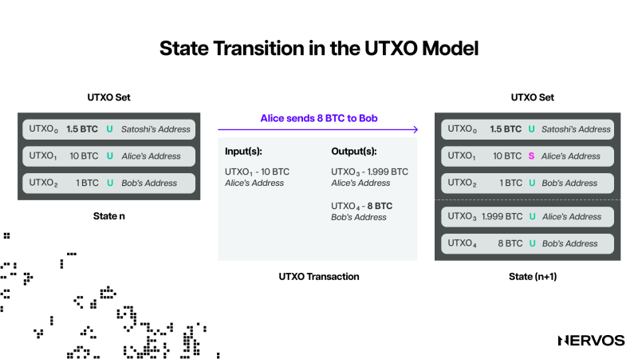

For instance, in UTXO-based systems, the transactions are stateful, including both inputs and outputs. Each transaction specifies which UTXOs it consumes and which new UTXOs it creates, meaning it carries all the necessary state information to update the ledger. On the other hand, the on-chain environment is effectively stateless. A transaction can only affect the UTXOs it directly references and cannot modify other parts of the ledger's state. 

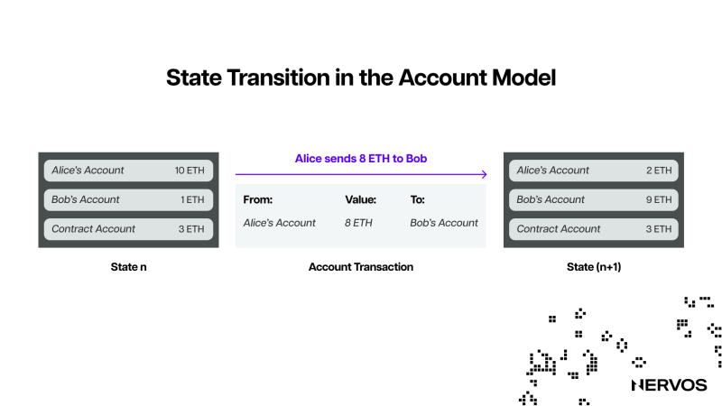

Conversely, in Account-based systems, transactions are stateless in the sense that they only contain an input—the desired action or method invocation—without explicitly stating the current state of the accounts involved. The on-chain environment is stateful because any transaction can potentially modify the state of any account or contract. For example, a smart contract can interact with multiple accounts and change various state variables, leading to a highly interconnected system state. 

In UTXO-based systems, users create transactions that specify exactly what ledger changes will take place as a result of a transaction, while in account-based systems they rely on blockchain nodes to compute these changes.

Considering the consensus mechanisms separately, in PoS, the consensus is stateful. Verifying consensus requires access to on-chain data, specifically the current set of validators, their stakes, and randomness. Since the validator set constantly changes, nodes must keep track of this evolving state to validate new blocks. 

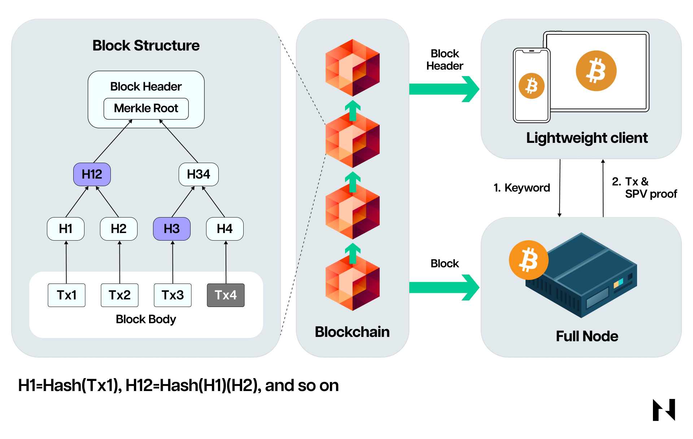

Conversely, the consensus in PoW is effectively stateless in that nodes can reasonably determine the validity of the blockchain by simply checking the block headers, which contain the proofs of work. They don't need additional on-chain state information to verify the longest valid chain; they rely on the accumulated computational work.

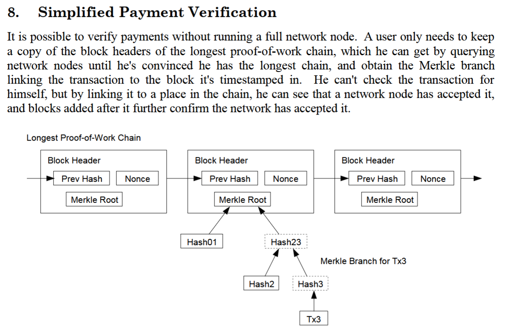

These different statefulness assumptions, among other things, mean that to verify a transaction in the PoS+Account model, users must keep track of the global state, which necessitates running a full node. 

However, the statefulness of the PoS+Account model significantly increases the overhead in terms of storage and computation for full nodes. Nodes must independently execute all smart contracts to validate transactions, keep track of the current set of validators, their stakes, and any changes to these over time, and process attestations, proposals, and other data related to block validation. This adds extra state information that nodes must compute and store. 

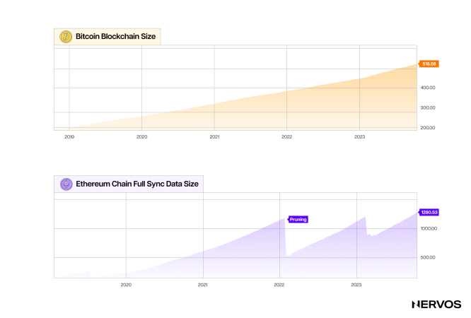

To illustrate this through numbers, the minimum requirements for running a full Ethereum node are a 2 TB Solid State Drive, 16 GB of RAM, and an Intel 7th generation processor or higher, whereas running a Bitcoin full node requires a low-tier CPU, 2 GB of RAM, and at least 15 GB of free disk space. Moreover, Ethereum is also facing a [state explosion](https://www.theblock.co/post/258960/solving-state-bloat) issue–with its state growing 3.5 times faster than Bitcoin’s–and it cannot prune old state data, meaning there’s no cap on the state growth.

Because the hardware requirements for running full nodes in PoS+Account-based systems are relatively high, few users run them. Due to implementation complexity and security trade-offs that result from PoS+Account, trust-minimizing light clients are nearly nonexistent—read our in-depth[ article](https://www.nervos.org/knowledge-base/ultimate_guide_to_light_clients) on this issue to understand why—and users are effectively forced to rely on centralized RPC providers [Alchemy](https://www.alchemy.com/) and [Infura](https://www.infura.io/) to access the blockchain.

In other words, by making it challenging to run full nodes and rendering trust-minimized light clients unfeasible—a consequence of using PoS consensus and account data models—these blockchain systems leave users with no option but to read and update state through a handful of centralized RPCs and APIs. This reliance leads to a client-server network topology that lacks true decentralization and resembles the traditional Web2 model.

As a result, "Web3" faces the same problems it originally aimed to address in Web2, such as a lack of security, privacy, and censorship resistance. The aforementioned RPC providers that serve most Web3 users can censor transactions, as demonstrated by the TornadoCash situation following OFAC [sanctions](https://home.treasury.gov/news/press-releases/jy0916).

They also collect user data, including blockchain addresses and IP addresses. Furthermore, because most users' traffic relies on these providers, if their centralized infrastructure experiences issues or goes offline, entire sectors of users (especially “mass adopters”) will be unable to access the blockchains, as demonstrated by Infura’s infamous [CryptoKitties congestion crisis](https://consensys.io/blog/the-inside-story-of-the-cryptokitties-congestion-crisis) in 2018.

Conversely, in PoW+UTXO systems, full nodes, SPV, and super-light clients are easy to implement. These allow users to verify their transactions without relying on trusted third parties. This promotes direct (and consequently more private) blockchain participation and peer-to-peer network topology, resulting in genuine decentralization—not one in name only.

### Determinism

At their core, blockchains are replicated deterministic state machines, which allows them to function as a "single source of truth" that everyone can agree on.

PoW+UTXO and PoS+Account-based systems differ in how and where aspects of determinism manifest, which also leads to some interesting downstream consequences, especially for their network topologies.

Leader election, block times, and finality are conversely deterministic and non-deterministic in these two systems.

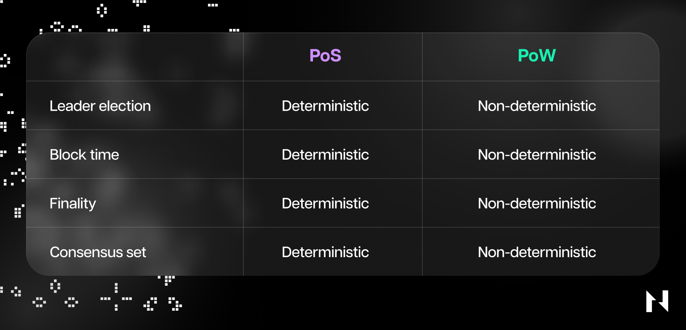

In PoS systems, leader election is deterministic. Validators are selected to produce a block based on predefined on-chain criteria, making it predictable who will produce the next block. While this can improve efficiency, it introduces vulnerabilities.

Validators and their IP addresses are well known, crashing or DDoS’ing a validator during their slot is effectively censoring the network for a block. Validators must get to know each other and work well together, as the network’s health depends on it.  

More importantly, because the block producer is known ahead of time and the blocks are produced and confirmed deterministically, the PoS validators are in a favorable position to extract economic rent from users.

Specialized firms use their power and revenue to improve their human and technical resources as well as increase their stake, extracting ever more block rewards and MEV, ad infinitum. Centralization of block builders and a transaction/MEV supply chain propels a feedback loop that incentivizes MEV and promotes the growth of stake in the chain. 

Conversely, leader election in PoW chains is non-deterministic.

It is unknown who will produce the next block until it's mined, promoting equality among nodes in the peer-to-peer network. The consensus set is also non-deterministic, meaning miners can freely join or leave the network, no miner is essential for the chain's progression, and any node is capable of publishing the next block. This isn’t the case in PoS, where the consensus set is deterministic, meaning certain validators must be present to progress the chain.

A PoW network is more robust, no node is in a favorable position, and none are guaranteed the opportunity to exploit users to their own benefit.

## How a Web5 Future May Look

The idea of a network of PoW+UTXO chains will be perceived as a ludicrous idea by many. Web3 is an industrial machine churning out system after system to address issues that weren't invented until after Ethereum.

While some critical thinkers are beginning to appreciate the nuances of PoW+UTXO, Web3 is entirely predicated on the PoS+Account model.

While Jack Dorsey fell short of leading the TBD project to the promised land, ironically, the future of Web5 is TBD (to be determined).

Even Satoshi Nakamoto imagined a world of huge blockchains and an industrial complex of nodes/miners. Today's Web3 universe comprises this; however, we are always thinking about chains: what RPC MetaMask is pointed at, what chain this asset is bridged to, what the correct address for this chain is, and so on.

In an industry where every nuance of technological doctrine seems to have a token and team, the idea of blockchains as genuine commitment layers for off-chain systems is, in contrast, an entirely novel domain. The great thing about our vision for Web5 is that it is already in motion.

Despite a beginning shrouded in controversy (maybe rgbp2p is a better name), [RGB++](https://talk.nervos.org/t/rgb-protocol-light-paper-translation/7790/59) is leading the charge of Web5, trustlessly integrating the Bitcoin and CKB blockchains without bridges or dubious security mechanisms. [Dogecoin support](https://github.com/ckb-devrel/rust-dogecoin/pull/1) is in the works, and hopefully, other PoW+UTXO blockchains like [Kaspa](https://kaspa.org/) and [Ergo](https://ergoplatform.org/en/) can find ways to plug in soon.

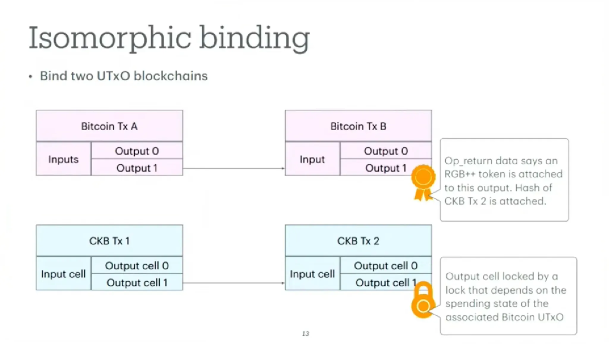

On the channel front, the work is even more exciting. The [Fiber Network](https://www.ckbfiber.net/) project, which implements Lightning-compatible channels on CKB, has been underway for most of 2024 and is quickly maturing toward mainnet. Lightning is synonymous with challenge, but CKB offers a new computational substrate for a channel network and can be used to test the ocean of ideas for improving Lightning, without requiring any consensus changes.

The [Polycrypt](https://github.com/perun-network) team, which has worked on state channel networks for the better part of seven years, has recently released functionality that converges across account and UTXO models, supporting eight chains, including Ethereum, Polkadot, Dfinity, Cardano, Cosmos, Stellar, Fabric, and CKB.

In the wake of [BitVM](https://bitvm.org/) and the Bitcoin Renaissance, the Off-Chain Renaissance is also starting up as [Taproot Assets](https://river.com/learn/what-is-taro-in-bitcoin/) matures. Teams like [Ark](https://ark-protocol.org/) and [Mercury](https://mercurylayer.com/) are pushing the envelope with entirely new ideas for off-chain computation natively on Bitcoin.

## Last Words

The only way to attain Web3's expressed goals of genuine decentralization, censorship resistance, permissionlessness, and self-custody is to build networks with peer-to-peer topologies, which to date have only been shown to be possible on PoW+UTXO-based systems.

In a PoW universe, blockchains have extremely low success rates. They're more akin to shooting stars than convenience stores. These miracles or beautiful accidents are used exclusively for consensus and final settlement.

Anyone can run them and the networks facilitate broad participation. Verification remains cheap and accessible; users can run full nodes or light clients on modest hardware.

Scaling is vertical, and throughput is increased by adding layers like payment channels or state channels on top of the base layer. The state is managed through UTXOs, allowing users to verify only the transactions relevant to them without relying on centralized intermediaries.

In innovation, the future is always uncertain and this is undoubtedly the case approaching web5. The opportunity is apparent through Nostr however, as [captured](https://talk.nervos.org/t/why-nostr-is-important-the-freedom-from-being-governed-by-servers/7538) by CKB and Nostr client developer Retric: “It’s a living, breathing community driven by values like freedom, decentralization, and open communication. This isn’t just technology — it’s a movement” 

After a decade of observing Web3, we have witnessed few surprises and are ready to free ourselves of the chains. We are ready for some uncertainty. We hope you are too.

*A huge thanks to Jan, Aijan and Neon for taking the time to review this article and provide their feedback.*

*Follow the authors on X [@radicalizedpleb](https://x.com/radicalizedpleb) [@matt_bitcoin](https://x.com/matt_bitcoin)*
