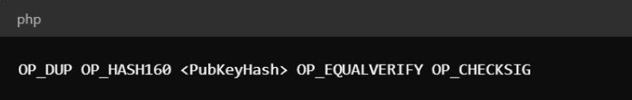

Bitcoin, the pioneering cryptocurrency, has long been celebrated for its simplicity, unmatched security, and decentralized nature. However, some aspects of Bitcoin's script, including certain opcodes, have stirred debate and curiosity within the community. One such opcode is OP_CAT, short for "Operation Concatenate." This article aims to demystify OP_CAT, exploring its history, potential reactivation, and the transformative impact it could have on Bitcoin's smart contracts and overall functionality.

## Bitcoin Script and Opcodes: The Foundation of Blockchain Transactions

Bitcoin’s scripting language is a fundamental yet often overlooked component of the network. [Bitcoin Script](https://www.nervos.org/knowledge-base/bitcoin_script_(explainCKBot)) is a stack-based language that enables the execution of complex instructions within Bitcoin transactions. Unlike programming languages used for general applications, Bitcoin Script is not "[Turing complete](https://en.wikipedia.org/wiki/Turing_completeness)", intentionally limiting its capabilities to enhance security and predictability. This constraint is crucial in preventing certain types of malicious activities and ensuring that the scripts run deterministically.

### What are Bitcoin Opcodes?

For the uninitiated, [оpcodes](https://www.nervos.org/knowledge-base/what_are_opcodes_(explainCKBot)), or operation codes, are the basic building blocks of Bitcoin's scripting language. Each opcode represents a specific command or function that the Bitcoin script can execute, ranging from simple arithmetic operations to complex cryptographic functions.

More specifically, opcodes are single-byte instructions that specify a particular operation to be performed on the stack during the execution of a script. The stack is a data structure used to store and manipulate data within the script. When a Bitcoin transaction is processed, the script is executed, and the opcodes dictate the sequence of operations to validate the transaction. For example, the opcode `OP_DUP` duplicates the top item on the stack, while `OP_HASH160` applies a hash function to the top item. There are different types of opcodes in Bitcoin Script:

- **Stack Operations:** These include basic manipulations of the stack, like duplicating (`OP_DUP`), dropping (`OP_DROP`), and swapping (`OP_SWAP`) items.
- **Arithmetic Operations:** Opcodes like `OP_ADD` and `OP_SUB` perform basic arithmetic on the stack items.
- **Cryptographic Operations:** These include operations for cryptographic functions such as `OP_CHECKSIG`, which verifies digital signatures, and `OP_SHA256`, which applies the [SHA-256](https://www.nervos.org/knowledge-base/SHA256_most_used_hash_function_(explainCKBot)) hash function.
- **Control Flow Operations:** Opcodes like `OP_IF` and `OP_ELSE` control the script's execution flow, allowing for conditional execution of code blocks.

Opcodes enable the creation of various transaction types and smart contracts on the Bitcoin network. For instance, multi-signature transactions utilize `OP_CHECKMULTISIG` to require multiple signatures for validation. Conditional payments and atomic swaps are also facilitated by specific combinations of opcodes, allowing for more complex financial transactions and interoperability between different blockchains.

### Example of an Opcode in Action

To better illustrate how opcodes work, consider the opcode `OP_CHECKSIG` used in a standard Bitcoin transaction script. The script might look like this:

In this script:

* `OP_DUP` duplicates the top item on the stack.
* `OP_HASH160` hashes the duplicated public key.
* `OP_EQUALVERIFY` checks if the hashed public key matches the provided public key hash.
* `OP_CHECKSIG` verifies the signature using the public key.

This sequence of operations ensures that the transaction is only valid if the correct signature is provided, demonstrating how opcodes work together to enforce security and validity conditions.

## What is OP_CAT in Bitcoin?

In the early days of Bitcoin, [Satoshi Nakamoto](https://en.wikipedia.org/wiki/Satoshi_Nakamoto) included various opcodes that allowed for a wide range of functionalities. Among these was OP_CAT, designed to concatenate (join) two data values on the stack. However, in 2010, OP_CAT, along with several other opcodes, was disabled due to security concerns. The primary issue was that OP_CAT could be exploited to create scripts that consumed excessive resources, potentially leading to [denial-of-service (DoS) attacks](https://en.wikipedia.org/wiki/Denial-of-service_attack) on the network.

### Original Use Cases and Limitations of OP_CAT

Initially, OP_CAT was envisioned to enhance Bitcoin’s scripting capabilities by enabling more sophisticated transaction conditions. However, its potential misuse led to its deactivation. The opcode's ability to concatenate data could be leveraged in ways that were not entirely predictable, raising concerns about the network's stability and security. The original limitations were primarily centered around the potential for DoS attacks, where large concatenated data values could disrupt the network's normal operation.

## The Push for OP_CAT Reactivation

The Bitcoin network has evolved significantly since the early days, particularly with the introduction of the [Taproot upgrade](https://www.investopedia.com/bitcoin-taproot-upgrade-5210039) in 2021. Taproot enhances Bitcoin's scripting language, making it more efficient and private. One of the critical advancements with Taproot is the mitigation of the vulnerabilities that originally led to the disabling of OP_CAT. This has rekindled interest in reactivating OP_CAT, as the improved scripting environment can now handle the opcode’s functionality more securely.

To that point, several key figures and groups within the Bitcoin community are advocating for the reactivation of OP_CAT. Among them are the Taproot Wizards and Botanix Labs, who argue that OP_CAT could significantly enhance Bitcoin’s smart contract capabilities. They highlight potential benefits such as improved security mechanisms, more flexible transaction conditions, and the ability to create more complex smart contracts. The argument is that with the enhanced security measures in place, the benefits of OP_CAT could outweigh the risks.

## Potential Use Cases of OP_CAT: Smart Contracts, Covenants, and Beyond

One of the most compelling use cases for OP_CAT is in the realm of smart contracts and covenants. Smart contracts are self-executing contracts with the terms of the agreement directly written into code. [Covenants](https://www.nervos.org/knowledge-base/what_are_bitcoin_covenants_(explainCKBot)), on the other hand, impose conditions on how UTXOs can be spent. OP_CAT can facilitate the creation of more dynamic and flexible smart contracts by allowing data concatenation within the script. This can enable complex transaction conditions that were previously not possible, enhancing the overall functionality of Bitcoin.

For instance, a contract could stipulate that funds are released only when multiple data points (e.g., multiple signatures, time-based conditions) are combined and validated. This would allow developers to implement more nuanced conditions in smart contracts, such as multi-stage payment systems, where payments are released in stages upon the completion of certain milestones. Moreover, OP_CAT could also support non-equivocation contracts, which are designed to prevent double-spending attempts in payment channels, such as the Lightning Network. By concatenating various pieces of transaction data, OP_CAT can enforce conditions that penalize or invalidate transactions if double-spending is detected.

By leveraging covenants, OP_CAT can facilitate the creation of on-chain allow lists, which specify the addresses that are permitted to receive funds. This capability is useful for creating inheritance schemes, where Bitcoin is passed on to designated beneficiaries under certain conditions. These allow lists can be dynamic, changing based on predefined rules encoded in the script. This allows for more flexible and secure management of funds, particularly in complex scenarios involving multiple beneficiaries or conditions.

OP_CAT can also play a crucial role in improving security mechanisms within the Bitcoin network. For instance, it can be used to create "vaults," which are special types of smart contracts that impose strict spending conditions. These vaults can require multiple steps and approvals to release funds, providing an added layer of security. Additionally, OP_CAT can support the creation of non-equivocation contracts, which can more effectively prevent misbehavior by participants within payment channels like the Lightning Network.

Perhaps most importantly, OP_CAT can enhance Bitcoin's interoperability with other blockchains and Layer 2 solutions. By enabling more complex data concatenation, OP_CAT can facilitate the creation of bridges that transfer assets between different blockchain networks securely. This interoperability feature is crucial for the development of decentralized exchanges and other applications that rely on seamless interaction between multiple blockchain ecosystems.

## Technical Considerations and Challenges

### Script Size and Network Efficiency

One of the primary concerns with reactivating OP_CAT is its potential impact on script size and network efficiency. Concatenating data values can lead to larger scripts, which in turn can consume more block space. This could affect the network's overall efficiency and transaction throughput. It's essential to thoroughly analyze and address these potential issues to ensure that the benefits of OP_CAT do not come at the expense of network performance.

### Security Risks and Mitigations

Reactivating OP_CAT also poses certain security risks. As with any change to the Bitcoin protocol, extensive testing and analysis are crucial to ensure that the opcode does not introduce new vulnerabilities. The Bitcoin community is known for its cautious approach to protocol changes, prioritizing security and stability. Any proposal to reactivate OP_CAT will need to undergo rigorous scrutiny to address these concerns adequately.

### Consensus and Implementation Challenges

Achieving consensus within the Bitcoin community is no small feat. Bitcoin's decentralized nature means that any significant protocol change requires broad agreement among developers, miners, and users. Various methods exist for implementing protocol changes, such as [soft forks and hard forks](https://www.nervos.org/knowledge-base/what_is_a_hard_fork_soft_fork_(explainCKBot)). A soft fork, which is backward compatible, is generally preferred for such upgrades. However, reaching consensus and coordinating the implementation of a soft fork can be challenging and time-consuming.

## Future Prospects and Community Sentiment

### Timeline for Activation

The timeline for the potential reactivation of OP_CAT is uncertain and depends on several factors. Prominent figures in the Bitcoin community suggest that if the proposal gains traction, we could see its implementation within six months to a year. However, the process of achieving consensus and thoroughly testing the opcode’s implementation could extend this timeline. The community’s cautious approach ensures that any change prioritizes the network’s security and stability.

### Ongoing Debates and Community Perspectives

The debate around OP_CAT is vibrant and ongoing. While some community members are enthusiastic about the potential benefits, others remain cautious about the risks. This diversity of opinion is a hallmark of the Bitcoin community, reflecting its decentralized and democratic nature. The ultimate decision will likely hinge on a thorough examination of the benefits versus the risks, with a strong emphasis on ensuring the network's security and stability.

## Conclusion

OP_CAT represents a fascinating chapter in Bitcoin's ongoing evolution. From its early days as a promising but flawed opcode to its potential reactivation, OP_CAT highlights the dynamic and innovative nature of the Bitcoin network. As the community continues to debate and explore its possibilities, OP_CAT could unlock new functionalities and enhance Bitcoin's role as a leading cryptocurrency. The journey of OP_CAT is a testament to Bitcoin's resilience and its community's commitment to continuous improvement.
