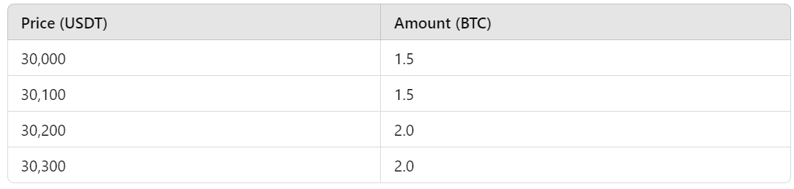

It refers to the difference between the expected price of a trade and the actual price at which the trade is executed. This phenomenon can significantly impact traders, especially in the volatile cryptocurrency market. Understanding slippage, its causes, and how it varies between centralized and decentralized exchanges is essential for anyone involved in crypto trading.

## Understanding Slippage in Cryptocurrency Trading

Slippage is a term that describes the difference between the expected price of a trade and the actual price at which the trade is executed. This discrepancy can occur with both buy and sell orders and is particularly prevalent in highly volatile markets such as cryptocurrencies. Slippage can manifest in two forms: positive and negative. Positive slippage occurs when a trade is executed at a more favorable price than anticipated, whereas negative slippage happens when a trade is executed at a less favorable price.

### Causes of Slippage

Several factors contribute to the occurrence of slippage in cryptocurrency trading. One primary cause is market volatility. The prices of cryptocurrencies can fluctuate significantly within short time frames, and sudden price movements can cause trades to execute at prices different from those expected.

Another factor is the size of the order. Large orders can significantly impact the market price, especially if the order size exceeds the available liquidity at the desired price level. When there is insufficient liquidity, the trade might not be fully executed at the intended price, leading to slippage.

Liquidity is a crucial element in slippage. In markets with low liquidity, there may not be enough buyers or sellers at the expected price, resulting in trades being executed at less favorable prices. This lack of sufficient market participants to absorb large orders at the intended price level causes slippage to occur more frequently in illiquid markets.

Latency, or the delay between placing an order and its execution, also plays a significant role in slippage. Even a slight delay can result in significant price changes in fast-moving markets, causing the trade to be executed at a different price than initially expected. This is particularly true in the cryptocurrency market, where rapid price changes are common.

### A Practical Example of Slippage on a Decentralized Exchange

To better understand the concept of slippage, consider the following example:

Imagine you want to trade 10 ETH for USDC) on Uniswap, a popular decentralized exchange (DEX) on Ethereum that uses an Automated Market Maker (AMM) model.

#### **Initial Conditions:**

* The current exchange rate is 1 ETH = 2000 USDC.
* The liquidity pool for the ETH/USDC pair has a total of 1000 ETH and 2,000,000 USDC.
* The AMM uses a constant product formula (**x * y = k**), where **x **and **y **are the amounts of ETH and USDC in the pool, respectively, and **k **is a constant.

#### **Expected Execution:**

Based on the current exchange rate, you expect to receive: 

10 ETH × 2000 USDC/ETH = 20,000 USDC

**Actual Execution:**

When you execute the trade, the AMM model adjusts the prices based on the new ratio of ETH and USDC in the pool after your trade. Let's calculate the impact.

1. **Initial Pool State:**
    * ETH: 1000
    * USDC: 2,000,000
    * Constant Product (k): 1000 ETH * 2,000,000 USDC = 2,000,000,000
2. **Post-Trade Pool State:**
    * After you add 10 ETH to the pool, the new ETH amount is 1010.
    * To maintain the constant product, the new USDC amount must satisfy the equation: 1010 ETH×New USDC=2,000,000,000.
    * New USDC=2,000,000,000/1010​≈1,980,198 USDC
3. **Amount of USDC Received:**
    * The amount of USDC you receive is the difference between the initial USDC amount and the new USDC amount: 

        USDC Received = 2,000,000 − 1,980,198 = 19,802 USDC

4. **Slippage Calculation:**
    * Expected USDC: 20,000 USDC
    * Actual USDC: 19,802 USDC
    * Slippage: 20,000 − 19,802 = 198 USDC

In this example, you intended to trade 10 ETH for 20,000 USDC based on the current exchange rate. However, due to the liquidity dynamics of the AMM model on Uniswap, the actual amount of USDC you received was 19,802 USDC, resulting in a negative slippage of 198 USDC. This example highlights how large trades relative to the liquidity pool can lead to significant slippage in decentralized exchanges. 

## Example of Slippage on a Centralized Exchange

Let's consider an example of slippage on a centralized exchange (CEX) like Binance.

#### **Scenario:**

You want to buy 5 BTC (Bitcoin) using USDT (Tether) on Binance.

#### **Initial Conditions:**

* The current market price of BTC is 30,000 USDT per BTC.
* The order book shows the following sell orders (simplified for this example):

#### **Expected Execution:**

Based on the current market price, you expect to spend: 

5 BTC×30,000 USDT/BTC=150,000 USDT

#### **Actual Execution:**

When you place a market order to buy 5 BTC, the order is filled based on the available sell orders in the order book, from the lowest to the highest price, until it is completely filled.

1. **Order Book Matching:**
    * The first 1.5 BTC is bought at 30,000 USDT/BTC.
    * The next 1.5 BTC is bought at 30,100 USDT/BTC.
    * The remaining 2.0 BTC is bought at 30,200 USDT/BTC.
2. **Total Cost Calculation:**
    * Cost for the first 1.5 BTC: 1.5 BTC×30,000 USDT/BTC=45,000 USDT
    * Cost for the next 1.5 BTC: 1.5 BTC×30,100 USDT/BTC=45,150 USDT
    * Cost for the remaining 2 BTC: 2 BTC×30,200 USDT/BTC=60,400 USDT
3. **Total Amount Spent:** 45,000 USDT+45,150 USDT+60,400 USDT=150,550 USDT
4. **Slippage Calculation:**
    * Expected Cost: 150,000 USDT
    * Actual Cost: 150,550 USDT
    * Slippage: 150,550−150,000=550 USDT

In this example, you intended to buy 5 BTC at the current market price of 30,000 USDT per BTC, expecting to spend 150,000 USDT. However, due to the limited liquidity at the exact price level and the need to match your order with higher-priced sell orders, the actual amount spent was 150,550 USDT. This resulted in a negative slippage of 550 USDT. This example demonstrates how large market orders can lead to slippage on centralized exchanges when the order book does not have sufficient depth at the desired price level.
