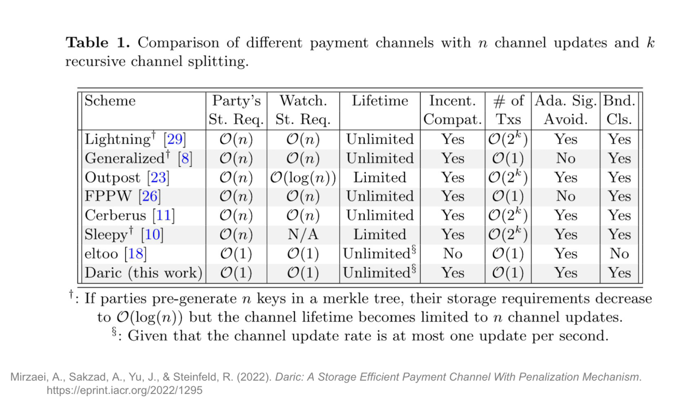

Bitcoin changed how money can move. For the first time, anyone could send value across the world without relying on a bank, payment processor, or other central intermediary.

But Bitcoin was designed first and foremost to be secure and decentralized—not to process a huge number of small, everyday payments. Every transaction is broadcast to the network, independently verified by thousands of nodes, and permanently recorded in a shared ledger replicated across them. This is what makes the system trustless and independently verifiable, but it also limits how many payments it can process, especially when they are small, frequent, or continuous.

The Lightning Network introduced a different model. Instead of recording every payment onchain, users lock funds into private, offchain ledgers known as payment channels, allowing them to update their balances privately and instantly. The blockchain is called on only to open the channel, settle the final balance, or resolve a dispute.

The real breakthrough came when these channels became connected. Users no longer needed to open a direct channel with every person or business they wanted to pay. Payments could instead be routed through a chain of existing channels, turning a collection of private financial relationships into a global payment network.

Lightning proved that payment channels could transform a slow settlement layer into fast, global payment infrastructure. But it also showed how much such a network is shaped by the blockchain beneath it. Bitcoin’s limited scripting system, single native asset, and cultural resistance to protocol change have set limits on how far Lightning can evolve.

Fiber begins with the same payment-channel model, but built on CKB—a more programmable and cryptographically flexible blockchain. This different foundation allows Fiber to preserve what works in Lightning while extending the model into areas Lightning was never designed to support.

To understand Fiber, we therefore need to begin with the problem payment channels solve, the breakthrough Lightning introduced, the limits Bitcoin imposes on Lightning, and what to expect from the next generation of payment channel networks.

## 1\. The Blockchain Trilemma and the Need for Layer 2

### 1.1 Why Blockchains Hit a Wall

Bitcoin’s limited throughput is not an accident. It stems from the way decentralized blockchains work.

Instead of relying on a central operator to maintain the ledger, Bitcoin asks thousands of independent nodes to keep their own copy and verify every transaction for themselves. This redundancy is what makes the network difficult to censor or manipulate. No single party decides which transactions are valid, and no one can quietly rewrite the ledger.

But that strength also creates a bottleneck. Every transaction must be distributed across the network, validated by every full node, and stored permanently by thousands of nodes. The more transactions Bitcoin handles, the more bandwidth, computing power, and storage each node needs.

This is the tension commonly described as the [blockchain trilemma](https://www.nervos.org/knowledge-base/blockchain_trilemma). Every blockchain aims to be secure, decentralized, and scalable, but improving one of these properties often places pressure on the others. Increasing the block size or producing blocks more frequently, for example, would allow Bitcoin to process more transactions, but it would also increase the hardware requirements for running a full node, gradually concentrating the network among better-resourced participants.

Bitcoin makes a deliberate choice in this trade-off. It keeps blocks relatively small and produces one roughly every ten minutes, protecting security and decentralization at the expense of throughput. The result is a highly robust base layer that can process only about seven transactions per second—far too few to support payments on a global scale.

That does not mean the industry has stopped looking for better ways to scale blockchains. Zero-knowledge (ZK) systems are one of the most promising approaches. They allow large amounts of computation to happen offchain, then compress the result into a small cryptographic proof that nodes can verify far more efficiently than repeating the entire computation themselves.

This reduces the burden on the base layer without giving up its role as the final verifier. But [zero-knowledge systems](https://www.nervos.org/knowledge-base/zero_knowledge_proofs) also come with trade-offs. Generating proofs is computationally demanding; the systems are complex, and [ZK rollups](https://www.nervos.org/knowledge-base/zk_rollup_vs_optimistic_rollup) are generally designed as shared execution environments for many kinds of applications rather than systems optimized for millions of tiny, instant, and inexpensive payments.

For the specific job of high-frequency, low-cost transfers, a different approach has proven more natural: moving most payment activity off the main chain. Several scaling designs have emerged around this idea, including sidechains, rollups, and payment channel networks.

### 1.2 Navigating Layer 2 Solutions: Why Payment Channel Networks?

Moving activity off the base layer does not solve every problem in the same way. Different scaling systems make different trade-offs and are suited to different kinds of activity.

[Sidechains](https://www.nervos.org/knowledge-base/sidechains_unlocking_the_potential) move transactions onto a separate blockchain connected to Bitcoin with its own rules, validators, and security model. This gives developers more flexibility, but users no longer rely directly on Bitcoin’s security. Their assets are only as secure as the sidechain and the bridge connecting it to Bitcoin. For that reason, sidechains are better understood as parallel networks than as true Layer 2 systems.

Rollups take another approach. They execute many transactions offchain, bundle the results, and publish data or cryptographic proofs back to a base layer. This makes them well suited to general-purpose applications that need shared state and complex smart contracts. But they still serve as common execution environments where many users compete for the same blockspace and processing capacity.

[Payment channel networks](https://www.nervos.org/knowledge-base/ultimate_guide_to_payment_channels) are more specialized. They are designed specifically for frequent, low-cost, real-time transfers. Rather than recording every payment in a shared ledger, two participants lock funds into an onchain contract and update the balance privately between themselves. The blockchain is used only when the channel is opened, closed, or disputed.

Although Fiber opens the door to more advanced multi-party designs, a payment channel traditionally connects two parties. A payment channel network links many of these channels together, allowing payments to be routed between people who do not share a direct channel.

This is what makes the model scalable: users do not need a separate funded relationship with everyone they want to pay. They only need a viable route through the network.

The next question is how such a network works in practice.

## 2\. The Lightning Network's Solution

The Lightning Network is the most widely recognized payment channel network.

To understand how it works, we need to examine two connected mechanisms: the lifecycle of a single channel and the routing logic that links many channels into a network.

### 2.1 Payment Channels & Multi-Hop Routing

**The lifecycle of a payment channel**

A single payment channel moves through three phases:

1. **Opening the channel:** Two participants agree on the channel terms and lock funds into a shared onchain contract. This funding transaction establishes how much liquidity is available inside the channel.  
2. **Updating the balance:** Once the channel is open, the participants can pay each other by signing new versions of the channel balance. Each update replaces the previous agreed state, while the funds themselves remain locked in the original contract. Because these updates happen offchain, they are nearly instant and do not require a transaction fee to the base layer.  
3. **Closing the channel:** When the participants are ready to settle, they publish the latest channel state onchain. The contract then distributes the locked funds according to the final balance. If both parties cooperate, the channel can close immediately. If they disagree or one party disappears, the protocol provides a way to settle the channel unilaterally.

A single channel makes repeated payments between two parties efficient. But the greater breakthrough comes from connecting many channels.

**Paying through the network**

Suppose Alice wants to pay Bob, but they do not share a channel. Alice does, however, have a channel with Claire. Claire has one with Dominic, and Dominic has one with Bob.

Lightning can route the payment along that chain:

**Alice → Claire → Dominic → Bob**

Each intermediary forwards the payment through one of its own channels and earns a small routing fee. Alice does not need to know or trust Claire and Dominic, nor does she need to open a new channel with Bob.

The route, however, only works if every channel along it has sufficient liquidity in the right direction.

Suppose Alice wants to send Bob 15,000 sats (0.00015000 BTC). Claire must have at least that amount available to forward toward Dominic, and Dominic must have enough available toward Bob. A channel may hold plenty of funds overall but still be unable to carry the payment if those funds are sitting on the wrong side.

This is why liquidity is the central constraint in a payment channel network. Payments can move only along routes where enough value is already available in the direction they need to travel.

When those conditions are met, the result is powerful. A payment can cross several independent channels in seconds without any of the individual transfers being recorded onchain. The network’s capacity is therefore determined less by Bitcoin’s transaction throughput than by the liquidity of its channels and the speed at which nodes can communicate.

But routing payments through strangers creates an obvious problem: how can the network guarantee that every intermediary forwards the funds rather than keeping them?

### 2.2 How Lightning Makes Routed Payments Trustless

Routing a payment through several strangers only works if no intermediary can steal the money or leave the payment half-complete.

Lightning solves this with a **Hashed Time-Locked Contract**, or **HTLC**. An HTLC combines two conditions:

* a **hashlock**, which releases the funds only when someone reveals the correct secret;  
* a **timelock**, which refunds the funds if that secret is not revealed before a deadline.

The payment begins with Bob, the recipient. He generates a random secret called a **preimage**, then sends Alice its cryptographic hash as part of the invoice. Alice cannot derive the secret from the hash, but she can use the hash to lock the payment.

Alice then creates an HTLC that says, in effect:

> Bob can claim these funds by revealing the secret that matches this hash. Otherwise, Alice gets the money back after the deadline.

When the payment travels through Claire and Dominic, each hop creates a matching HTLC using the same hash. Alice locks funds for Claire, Claire locks funds for Dominic, and Dominic locks funds for Bob.

The payment now forms a chain of conditional promises:

**Alice → Claire → Dominic → Bob**

Bob claims the final payment by revealing the preimage. Dominic learns that secret and uses it to claim his payment from Claire. Claire then uses the same secret to claim hers from Alice.

The preimage travels backward through the route while the payment moves forward.

This makes the entire transfer **atomic**: either every hop completes, or none of them does. If Bob never reveals the secret, the timelocks eventually expire, and each participant recovers their funds.

In practice, that means Alice can safely pay Bob through people she's never met, without having to trust any intermediary not to steal the funds.

### 2.3 Preventing Fraud: Penalties and Watchtowers

Because channel balances are updated privately offchain, there is an obvious temptation to cheat. A dishonest participant could broadcast an outdated commitment transaction to claim a more favorable previous balance. Lightning prevents this through a penalty mechanism.

Whenever the channel state changes, both parties exchange a revocation secret that invalidates the previous state. If someone later tries to cheat by broadcasting a revoked transaction, their funds are temporarily locked by a timelock. The honest party, who holds the corresponding revocation secret, can bypass that delay and execute a penalty transaction, claiming the entire channel balance.

The practical effect is powerful: honesty is enforced not through trust or goodwill, but by making fraud strictly unprofitable.

There is, however, a practical limitation. Catching a cheater requires monitoring the blockchain for revoked transactions and responding before the timelock expires. And since ordinary users cannot be expected to keep a computer online around the clock, the Lightning protocol allows them to delegate this task to so-called Watchtowers.

These are automated third-party nodes that monitor the blockchain for breached channel states. If one detects a revoked transaction, it broadcasts the penalty transaction on behalf of the offline user.

This lets users delegate the burden of fraud monitoring instead of keeping their wallets online around the clock. In practice, Watchtowers make Lightning far easier to use: people can come and go as needed without worrying that going offline could leave their funds exposed to theft.

### 2.4 Finding a Route: Gossip, Pathfinding, and Onion Routing

Before Alice can pay Bob, her wallet has to answer a basic question: which chain of channels can actually carry the payment from her to him?

That requires three things working together: a map of the network, a way to choose a viable route through it, and a way to keep that route private.

#### **Building the Network Map**

Lightning has no central directory showing who is connected to whom. Instead, nodes continuously share information about new channels, their capacities, and the fees they charge. These updates spread across the network the way rumors spread through a crowd. This is known as the **Gossip Protocol**, and it allows each node to assemble its own up-to-date map of the network.

#### **Choosing a Route**

Once Alice’s wallet has that map, it searches for a path to Bob. But a route must do more than simply connect them. Every channel along the way needs enough liquidity in the right direction, while the total routing fees and timelock delays must remain acceptable.

The best route is therefore not always the shortest one. It is the path that offers the best balance of liquidity, cost, reliability, and time.

#### **Keeping the Route Private**

Once a path is selected, Lightning uses [Onion Routing](https://www.onion-router.net/) to conceal the full payment route. The instructions are wrapped in layers of encryption, like the layers of an onion. Each intermediary can decrypt only the information needed to forward the payment: the next hop, the amount to send, the fee it earns, and the expiry time.

No intermediary sees the complete route. Each knows only where the payment came from and where it must go next.

Finally, Lightning supports lightweight devices such as mobile wallets through [Trampoline Routing](https://bitcoinops.org/en/topics/trampoline-payments/). This lets a mobile wallet (a light node) offload the hard work of route-finding to a more capable node, rather than doing it itself. That node is a Trampoline node—a routing hub that maintains a complete, up-to-date map of the network and channel liquidity, which an ordinary mobile client cannot afford to. Trampoline routing spares mobile clients the heavy data and computation, making Lightning usage on mobile phones practical.

## 3\. Challenges and Constraints

While Lightning proved that payment channel networks can make Bitcoin fast and inexpensive enough for everyday payments, the system still has limits.

Some come from how Lightning itself was designed: the way payments are routed, liquidity is managed, and old channel states are secured. Others come from Bitcoin: its limited scripting system restricts what Lightning can support and how easily it can evolve.

Working from the routing layer down to the base chain, these constraints show what the next generation of payment channel networks must improve upon.

### 3.1 HTLC Vulnerabilities & Limitations

HTLCs make trustless multi-hop payments possible, but their reliance on shared hashlocks and long timelocks creates privacy and security problems.

* **Privacy leakage.** Every hop in a routed payment uses the same hash. If two intermediary nodes observe the same hashlock at different points along the route, they may be able to infer that both transfers belong to the same payment. This makes activity easier to trace across the network.  
* **Vulnerability to attacks.** HTLC-based networks are exposed to attacks that delay payments, clog channels, and force honest users to waste time and liquidity. The vulnerability comes from using the same hashlock combined with staggered timelocks across a network. These timelocks form a sequence of shrinking expiration times, each of which must be long enough to account for worst-case blockchain confirmation delays and give an honest participant time to respond if a dispute reaches the base layer. A malicious actor can exploit that safety window by keeping payments unresolved until they approach expiry, tying up channel liquidity and reducing the network’s ability to process legitimate payments for extended periods. Because of the shared hashlock, senders cannot safely retry these stalled payments along a different route without risking a double payment.

A better alternative to HTLCs is Point Time-Locked Contracts (PTLCs), which we will expand on later.

### 3.2 The Watchtower Storage Problem

Watchtowers solve one problem but create another that becomes more serious as a channel is used.

Each time a channel balance changes, both participants revoke the previous state and give the watchtower a new encrypted penalty transaction for that update. Because the watchtower cannot know which revoked state might eventually be broadcast, it must keep every one of these transactions.

The result is a storage burden that grows continuously with the number of channel updates. Engineers describe this as **O(n) storage complexity**: if the number of updates doubles, the amount of data the watchtower must retain roughly doubles as well.

For busy channels—and watchtowers protecting many users—this can translate into substantial storage and infrastructure costs over time.

A proposed redesign, called [Eltoo](https://bitcoinops.org/en/topics/eltoo/), could solve this problem by allowing a newer channel state to override an older one. In this case, a watchtower would need to store only the latest state, rather than the channel’s entire history. However, the Eltoo upgrade depends on scripting functionality Bitcoin does not currently support, and introducing it would require a network-wide protocol upgrade through a soft fork, which could take years to coordinate.

As we will see later, Fiber’s use of the [Daric Protocol](https://eprint.iacr.org/2022/1295.pdf) achieves the same basic outcome: reducing watchtower storage from a growing requirement to a constant one.

### 3.3 Base Layer Rigidity and the Limits of Workarounds

Examining Eltoo illustrates a broader limitation: many of Lightning’s constraints stem from the underlying blockchain.

Bitcoin’s scripting language is deliberately limited. That makes the base layer easier to secure and reason about, but it also means new functionality can require years of research, debate, and network-wide coordination before Lightning can use it.

Bitcoin also natively recognizes only one asset: BTC. That works well for BTC payments, but stablecoins and other digital assets increasingly matter for everyday commerce.

Admittedly, Taproot Assets offers a workaround by allowing other assets to move through Bitcoin and Lightning. But because Bitcoin does not natively recognize those assets, supporting them requires additional software and specialized infrastructure, including edge nodes that convert between assets, manage liquidity, and account for exchange-rate risk.

The workaround is functional, but it adds complexity that would not exist if the underlying blockchain supported multiple assets natively.

Beyond these Bitcoin-specific limitations, Lightning also faces challenges shared by all payment channel networks. Capital must remain locked in channels, payments can fail when liquidity is unavailable in the required direction, and channels periodically need to be rebalanced.

Together, these constraints show how strongly a payment network is shaped by the blockchain beneath it, and why rebuilding a similar model on a different foundation can open new possibilities.

## 4\. Introducing Fiber: Built on a Different Foundation

Everything so far has been about Lightning: the breakthrough it introduced, how it works, and where the design begins to strain.

That context matters because Fiber does not abandon the payment-channel model. It starts from the same basic architecture—funds locked onchain, balances updated offchain, and payments routed across connected channels—but rebuilds it on a different base layer.

That is precisely where Fiber’s advantage begins. By building on CKB, Fiber can preserve the model Lightning proved while overcoming some of the constraints Bitcoin places on which assets channels can be carried, how the protocol can evolve, and what supporting infrastructure can be built around it.

Some of Fiber’s capabilities come directly from [CKB](https://www.nervos.org/knowledge-base/nervos_overview_of_a_layered_blockchain), including native support for multiple assets and greater freedom to introduce new cryptographic features. Others come from Fiber’s own design, such as a more efficient watchtower mechanism and infrastructure for connecting to other payment networks.

### 4.1 Why the Base Layer Matters

A payment channel network inherits both the strengths and limitations of the underlying blockchain.

Bitcoin gives Lightning a highly secure and decentralized settlement layer, but it also confines the network to Bitcoin’s scripting system and single native asset. CKB gives Fiber a different set of possibilities.

The first advantage is **native multi-asset support**. CKB can recognize and track different asset types directly at the protocol level. As a result, Fiber channels can hold and route CKB, stablecoins, RGB++ assets, and other tokens without first converting them into a common intermediary asset. This allows Fiber to support a much broader range of users and economic activity over a unified network.

Because of this foundation, Fiber bypasses the edge-node conversion model required to extend Lightning beyond BTC. Unlike the Lightning Network, where asset exchanges typically require complex [Submarine Swaps](https://docs.lightning.engineering/the-lightning-network/multihop-payments/understanding-submarine-swaps) between on-chain and off-chain environments, or depend on specialized edge nodes (Swap service providers like [Boltz](https://boltz.exchange/) or [Loop](https://lightning.engineering/loop/)) to handle conversion, Fiber payments do not need to be converted into a base asset to travel through the network. This eliminates the additional pricing complexity and exchange-rate volatility those conversions usually introduce.

Furthermore, this architecture enables the payment network itself to serve as a low-latency, decentralized exchange via native trustless swap functionality. In practice, the channels hold various token types simultaneously. Users perform trustless atomic swaps directly within the routing process. For instance, a user can send CKB from their channel, and the recipient can seamlessly receive a stablecoin. Intermediary routing nodes facilitate this swap along the channel, keeping the transaction secure and atomic while earning a fee for the liquidity they provide.

The second advantage may prove even more consequential: expressiveness. On CKB, the rules governing a payment channel are not limited to a narrow collection of operations built into the blockchain. They are programs.

CKB stores state inside [Cells](https://docs-old.nervos.org/docs/basics/concepts/cell-model), while scripts attached to those Cells determine who can access the assets and what conditions a transaction must satisfy. Those scripts run inside [CKB-VM](https://www.nervos.org/knowledge-base/comparing_blockchain_virtual_machines), a general-purpose, crypto-agnostic virtual machine based on RISC-V. Fiber’s channel funding and commitment rules are therefore implemented as programmable CKB Scripts rather than fixed behaviors embedded in the base protocol.

This gives Fiber’s developers far more control over the channel lifecycle. They can design richer rules for how channel states are updated, revoked, settled, or disputed; introduce new authorization and cryptographic mechanisms; and compose Fiber’s settlement logic with other assets and applications on CKB.

The difference becomes clearest when a new channel design requires functionality the base chain does not already support. On Bitcoin, Lightning must work within Bitcoin Script. If the required opcode or signature behavior is missing, as is seen with Eltoo support, the feature must wait for Bitcoin itself to change.

On CKB, that type of innovation can happen at the application layer. Developers can write new verification and state-transition logic as CKB Scripts without changing the blockchain’s consensus rules. [Covenants](https://www.nervos.org/knowledge-base/what_are_bitcoin_covenants), which allow assets to carry rules governing how they may be spent in the future, are one example of functionality CKB’s architecture can express directly.

This is what makes Fiber more than Lightning transplanted onto another blockchain. CKB gives the payment-channel model room to evolve: from fixed channels optimized primarily for transferring one asset into more flexible financial relationships capable of supporting new assets, new cryptography, novel dispute mechanisms, atomic swaps, and eventually more programmable forms of payment.

Together, these properties allow Fiber to retain the speed of Lightning while building toward a more expressive, multi-asset payment and swap network. As we will see next, CKB’s flexibility has already enabled Fiber to redesign one of Lightning’s most persistent infrastructure problems: the growing storage burden placed on watchtowers.

### 4.2 Fixing Watchtowers and Connecting Payment Networks

CKB’s programmability doesn’t just give Fiber room to evolve in the future; it also enables the network to improve aspects of the payment-channel model that already pose practical problems today.

#### **Fixing Watchtower Storage**

As we saw earlier, Lightning watchtowers must retain data for every revoked channel state. The more often a channel is updated, the more information the watchtower must store. Over time, that creates an ever-growing infrastructure burden.

Fiber solves this through the [Daric Protocol](https://eprint.iacr.org/2022/1295.pdf), made possible by CKB’s support for covenants. Under Daric, every channel state carries a version number, and a newer state automatically overrides any older one.

This changes what the watchtower needs to remember. Instead of storing a separate penalty transaction for every past update, it only needs the latest valid state. If someone attempts to settle an older version, the watchtower can respond with the newer one.

The result is a constant storage requirement. Lightning-style watchtowers have **O(n)** storage complexity, meaning their data burden grows with every channel update. Daric reduces this to **O(1)**: the amount of data remains constant regardless of how many payments pass through the channel.

For individual users, that difference may seem invisible. But for watchtowers protecting thousands of busy channels, it can dramatically reduce storage costs and make the infrastructure easier to operate at scale.

#### **Connecting PCNs**

Fiber is also designed to connect with other payment networks, including Lightning, through Cross-Chain Hubs.

A Cross-Chain Hub is a routing node that operates on two networks at once. It receives a payment on one side and creates a corresponding payment on the other, allowing value to move between networks without requiring the sender and recipient to share the same blockchain.

The mechanism builds on the same HTLC structure Lightning already uses. Suppose Alice wants to send funds from Fiber to Bob on Lightning. The hub creates conditional payments on both networks using the same hashlock. When Bob reveals the preimage to claim the Lightning payment, the hub uses that same preimage to claim the corresponding funds on Fiber.

Because both sides depend on the same secret, the transfer remains atomic: either both payments complete, or both expire, and the funds are returned. The hub never has to be trusted to complete one side once it receives the other.

For this design to work, both networks must support compatible cryptographic primitives so that the same preimage can unlock payments on both sides. The exchanged assets must also have a predictable relationship (typically a fixed 1:1 value) so the hub can route equivalent amounts without negotiating a new exchange rate for every transfer.

In this role, the Cross-Chain Hub does not act as a custodial bridge holding user funds. It acts as a routing node spanning two payment networks, earning a fee for connecting them.

Daric reduces the cost of maintaining channel security, while Cross-Chain Hubs extend the network’s reach beyond CKB. One improves how Fiber operates internally; the other allows it to connect with payment infrastructure elsewhere.

### 4.3 A Future Upgrade Path Toward PTLCs

Fiber currently uses HTLCs to secure routed payments. As we saw earlier, they work, but the shared hash lock used across an entire route introduces privacy and security limitations.

A longer-term upgrade path is the Point Time-Locked Contract, or PTLC. Rather than locking every hop with the same hash, a PTLC gives each hop its own cryptographically related lock, derived from elliptic-curve points.

That small change has several important consequences.

First, it improves privacy. With HTLCs, two colluding nodes can compare hashlocks and recognize that they belong to the same payment. PTLCs remove that shared identifier, making different parts of the route much harder to link.

Second, PTLCs make payment retries safer. If an HTLC payment stalls, retrying it can create a risk of paying twice because each attempt depends on the same underlying secret. With PTLCs, every attempt uses a fresh set of locks, allowing the sender to try another route without exposing the same payment condition again.

They also prevent wormhole attacks, in which two colluding intermediaries recognize the same payment at different points along the route, bypass the nodes between them, and collect fees for work they did not perform. Because PTLCs assign a distinct lock to each hop, attackers can no longer correlate and shortcut the route in the same way.

PTLCs are not unique to Fiber; Lightning developers are also working toward them. The difference is that CKB gives Fiber greater flexibility to adopt new cryptographic mechanisms without waiting for a base-layer upgrade.

For now, PTLCs remain a longer-term direction rather than a core production feature.

## 5\. Engineering Fiber for Scale

Fiber’s advantages do not come only from the blockchain beneath it. The Fiber node implementation has also been designed from the ground up to manage multiple channels, payments, and network updates simultaneously.

A payment-channel node may operate hundreds of active channels simultaneously. Traditional Lightning implementations such as rust-lightning coordinate these operations through shared-state locks. When one process updates a channel, other operations involving the same data must wait until the lock is released. Under heavy activity, this queuing can become a bottleneck.

Fiber instead uses the Actor Model. Each channel operates as an independent actor with its own state and message queue. Actors communicate by passing messages rather than sharing memory, allowing different channels to process activity concurrently without competing over the same data.

Fiber pairs this architecture with RocksDB for fast state storage and Molecule for deterministic message encoding. Molecule ensures that the same message is converted into the exact same sequence of bytes across different computing environments—essential when that data is hashed and signed.

The Fiber node implementation also streamlines how nodes catch up after going offline. Lightning nodes typically request ranges of historical gossip data to determine what they missed. Fiber instead records a cursor marking the node’s last known position. When the node reconnects, it resumes from that point and receives only the updates that have occurred since.

Finally, Fiber implements onion routing as an independent module rather than tightly coupling it to the rest of the node. This makes the codebase easier to maintain and allows individual components to be upgraded without forcing changes throughout the system.

These choices are mostly invisible to users, but their benefits become increasingly important as the network grows: more payments can be processed concurrently, nodes can recover more efficiently after going offline, and the software can evolve without every improvement rippling through the entire implementation.

## Lightning and Fiber at a Glance

The table below summarizes the main architectural differences discussed throughout the article.

<table border="1" cellpadding="8" cellspacing="0" style="border-collapse: collapse; width: 100%; font-size: 0.9em; border: 1px solid #ddd;">
  <thead>
    <tr>
      <th style="border: 1px solid #000; padding: 8px; text-align: left;">Feature / Architecture</th>
      <th style="border: 1px solid #000; padding: 8px; text-align: left;">Lightning Network on Bitcoin</th>
      <th style="border: 1px solid #000; padding: 8px; text-align: left;">Fiber Network on CKB</th>
    </tr>
  </thead>
  <tbody>
    <tr>
      <td style="border: 1px solid #000; padding: 8px;"><strong>Base layer</strong></td>
      <td style="border: 1px solid #000; padding: 8px;">Bitcoin: roughly 10-minute block intervals and a deliberately restricted scripting environment</td>
      <td style="border: 1px solid #000; padding: 8px;">CKB: roughly 10-second block intervals and a general-purpose execution environment through CKB-VM</td>
    </tr>
    <tr>
      <td style="border: 1px solid #000; padding: 8px;"><strong>Native asset support</strong></td>
      <td style="border: 1px solid #000; padding: 8px;">Bitcoin natively recognizes only BTC; other assets require additional protocols and infrastructure such as Taproot Assets and edge nodes</td>
      <td style="border: 1px solid #000; padding: 8px;">Designed to natively carry CKB, stablecoins, UDTs, RGB++ assets, and other tokens</td>
    </tr>
    <tr>
      <td style="border: 1px solid #000; padding: 8px;"><strong>Channel expressiveness</strong></td>
      <td style="border: 1px solid #000; padding: 8px;">Channel logic is limited to the functionality available through Bitcoin Script; major new capabilities may require a Bitcoin protocol upgrade</td>
      <td style="border: 1px solid #000; padding: 8px;">Channel contracts are implemented as programmable CKB Scripts, allowing developers to introduce richer state-transition, authorization, settlement, and dispute logic at the application layer</td>
    </tr>
    <tr>
      <td style="border: 1px solid #000; padding: 8px;"><strong>Node concurrency architecture</strong></td>
      <td style="border: 1px solid #000; padding: 8px;">Common implementations use shared-state locks, which can cause operations to queue when they access the same channel data</td>
      <td style="border: 1px solid #000; padding: 8px;">Uses the Actor Model to isolate channel state and process activity across different channels concurrently</td>
    </tr>
    <tr>
      <td style="border: 1px solid #000; padding: 8px;"><strong>Node gossip synchronization</strong></td>
      <td style="border: 1px solid #000; padding: 8px;">Nodes commonly request ranges of historical gossip data to recover updates missed while offline</td>
      <td style="border: 1px solid #000; padding: 8px;">Uses cursor-based subscriptions, allowing a reconnecting node to resume from its last known position and retrieve only newer updates</td>
    </tr>
    <tr>
      <td style="border: 1px solid #000; padding: 8px;"><strong>Watchtower storage</strong></td>
      <td style="border: 1px solid #000; padding: 8px;"><strong>O(n):</strong> storage requirements grow with the number of revoked channel states</td>
      <td style="border: 1px solid #000; padding: 8px;"><strong>O(1):</strong> the Daric Protocol allows a watchtower to retain only the latest valid state</td>
    </tr>
    <tr>
      <td style="border: 1px solid #000; padding: 8px;"><strong>Onion-routing implementation</strong></td>
      <td style="border: 1px solid #000; padding: 8px;">Onion-routing logic may be tightly coupled to the internal architecture of individual node implementations</td>
      <td style="border: 1px solid #000; padding: 8px;">Uses a modular onion-routing library that can be maintained and upgraded independently</td>
    </tr>
    <tr>
      <td style="border: 1px solid #000; padding: 8px;"><strong>Cross-network interoperability</strong></td>
      <td style="border: 1px solid #000; padding: 8px;">Cross-network swaps are possible through specialized infrastructure using compatible conditional-payment mechanisms</td>
      <td style="border: 1px solid #000; padding: 8px;">Designed to connect Fiber and Lightning through Cross-Chain Hubs that coordinate atomic payments across both networks</td>
    </tr>
    <tr>
      <td style="border: 1px solid #000; padding: 8px;"><strong>Payment-lock mechanism</strong></td>
      <td style="border: 1px solid #000; padding: 8px;">Uses HTLCs, with PTLCs under development in the broader Lightning ecosystem</td>
      <td style="border: 1px solid #000; padding: 8px;">Uses HTLCs today, with PTLCs as a future upgrade path</td>
    </tr>
    <tr>
      <td style="border: 1px solid #000; padding: 8px;"><strong>Overall design space</strong></td>
      <td style="border: 1px solid #000; padding: 8px;">A mature, BTC-focused payment network shaped by Bitcoin’s conservative base-layer design</td>
      <td style="border: 1px solid #000; padding: 8px;">A programmable, multi-asset payment and swap network designed to extend the payment-channel model into new assets, applications, and markets</td>
    </tr>
  </tbody>
</table>

## 6\. The Next Generation of Digital Payments

Lightning proved that a blockchain does not need to record every payment. Fiber asks the next question: what happens when that payment network is no longer limited to a single asset or a fixed form of transaction?

The answer is something much larger than a faster way to send tokens.

Fiber is being built as an open network where people, businesses, applications, and machines can exchange value continuously across assets, without placing a payment processor at the center of every relationship.

Stablecoins can move at the speed of the internet. Creators can be paid as their work is consumed. Devices can pay for the exact electricity or bandwidth they use. Applications can charge fractions of a cent per request. Software can purchase data, compute, and services on demand. Routing nodes and liquidity providers can join the network, connect markets, and earn fees for helping value move.

Because Fiber is multi-asset, the entire network need not converge on a single currency. Because it is routed, users do not need to establish a separate funded relationship with every recipient. Because it is built on CKB, channels can evolve beyond fixed transfers toward atomic swaps, streaming payments, conditional settlement, automated revenue sharing, and financial interactions that have not yet been designed.

This is the larger promise of Fiber. It does not merely make blockchain payments faster. It turns payment channels into open, programmable infrastructure for an economy that increasingly lives online.

Bitcoin gave the world decentralized money. Lightning showed that decentralized money could move instantly. Fiber is the network that moves value across assets, applications, and markets. 
