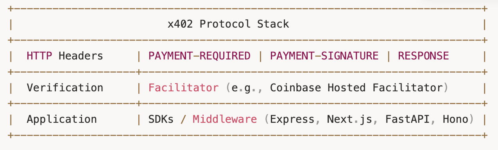
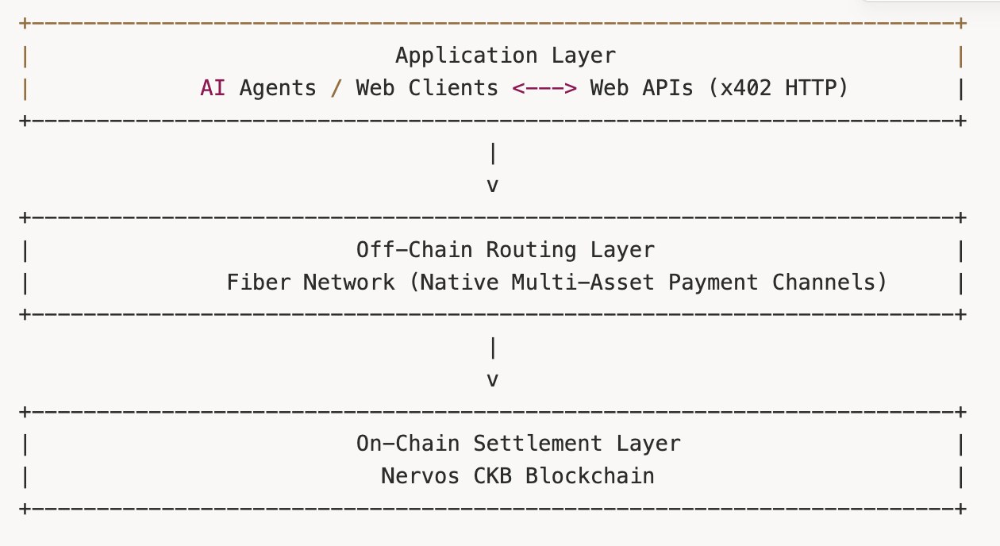

The early architects of the World Wide Web envisioned an internet where information and value could move with equal ease. When standardizing the Web's core communications protocols in the 1990s, founders like [Tim Berners-Lee](https://en.wikipedia.org/wiki/Tim_Berners-Lee) explicitly reserved a specific HTTP status code for native digital purchases. However, because no universal, software-native currency existed at the time, that vision was shelved.

The web evolved into an information network supported by external financial workarounds: ads, subscriptions, credit card gateways, and third-party processors to handle digital transactions. While this architecture powered thirty years of human-driven e-commerce, it faces an existential bottleneck as artificial intelligence transitions from passive text generators into autonomous, decision-making software.

To enable autonomous software to buy, sell, and negotiate resources on demand, developers are resurrecting the web's missing payment layer. The x402 protocol provides a standardized, stateless mechanism for machine-to-machine commerce, turning static web requests into instant digital transactions.

## What is the HTTP 402 status code?

Web browsers and servers communicate using HTTP (Hypertext Transfer Protocol), the foundational set of rules defining how data is requested and delivered across the web. Every request returns a three-digit code. Common examples include “200 Status OK” for successful requests and “404 Not Found” for missing resources. To signal a financial requirement, the HTTP standard includes the “402 Payment Required” code, a client error response indicating that the requested content cannot be served until a payment is made.

Because traditional fiat banking required identity verification, bank accounts, and centralized authorization, web developers could not initially implement a universal 402 standard. Consequently, instead of internet-native money, the web defaulted to third-party payment processors.

This framework functions adequately for human users, who can manually enter a credit card number or solve a CAPTCHA. It fails for autonomous software. The internet is shifting from human users to automated programs. An AI agent is an autonomous software system that performs tasks and makes decisions on behalf of a user. If an AI agent requires access to a specialized dataset at 3:00 a.m., it cannot fill out a sign-up form, agree to a monthly contract, or type in a CVV code, nor fill out a CAPTCHA. It requires the ability to spend fractions of a cent rapidly and frequently, with sub-second finality.

That requirement produced the x402 protocol.

## What is the x402 Protocol?

The **x402 protocol** is an open payment standard that uses the HTTP 402 status code to enable AI agents and software to make instant stablecoin payments onchain without human intervention.

Traditional online checkout flows function like a commercial tab requiring registration, identity verification, and account maintenance. In contrast, x402 protocol operates like an automated vending machine: the server states its price, the software client inserts the digital payment proof, and the resource is immediately delivered without registration, memory, or user account.

Two structural properties make this protocol uniquely suited for modern web architecture:

**Statelessness:** A stateless protocol treats every request as an independent, self-contained transaction. In the context of x402, this means servers do not need to maintain active user sessions, database logins, or subscription tables to grant access, which is exactly what autonomous software needs.

**HTTP Natively:** The standard works at the network protocol level. Because x402 builds directly on standard HTTP headers, any server, API gateway, or CDN (content delivery network: a geographically distributed group of servers that caches web content to reduce latency) can inspect payment challenges natively.

Because x402 operates at the protocol level, it requires open governance. In late 2025, Coinbase and Cloudflare [announced](https://www.coinbase.com/en-sg/blog/coinbase-and-cloudflare-will-launch-x402-foundation) plans to launch the x402 Foundation, governing the protocol as an open specification to prevent vendor lock-in.

## How do AI Agents Make Payments?

### The Role of Blockchains and Stablecoins in AI Payments

For AI-native payments to function globally at internet scale, autonomous software requires two distinct technical foundations: public blockchains to serve as the programmable execution rail, and stablecoins to serve as the predictable unit of account.

Public blockchains provide the open, permissionless settlement infrastructure required by non-human actors. Legacy banking networks rely on human identity verification, legal contracts, and localized business-hour clearing systems. Public blockchains eliminate these by anchoring an agent’s identity and spending authority to cryptographic public-private key pairs, which enables software to sign transactions autonomously.

While early cryptocurrency supplied the necessary execution rail, early unpegged cryptocurrencies introduced severe friction due to price volatility. A service provider pricing an API call at $0.001 cannot accept an unpegged token whose value fluctuates wildly second by second. This issue is resolved through stablecoins, which are cryptocurrency assets that maintain a stable value by pegging their exchange rate to an external reference, such as the US dollar. Stablecoins unite the pricing predictability of traditional fiat currency with the 24/7, programmatic execution of public blockchains. Autonomous AI agents execute workflows under programmatic budget limits assigned by human users, and pegged assets allow these agents to calculate exact micro-expenditures without risking budget overruns caused by sudden currency slippage.

By uniting the 24/7 programmatic execution of public blockchains with the economic predictability of stablecoins, software agents can operate embedded wallets to construct, sign, and transmit payments directly to resource providers.

This mechanism unlocks machine-to-machine commerce, allowing software to buy and combine specialized micro-services dynamically.

### The Shift Toward Micropayments

Micropayments are fractional-cent financial transactions that process amounts far too small to be economically viable on traditional credit card networks.

On traditional payment rails, a $0.02 transaction is impossible because flat credit card processing fees (typically $0.30 plus 2.9%) exceed the total value of the transaction. By utilizing low-cost blockchain settlement layers, stablecoin payments reduce transaction overhead to fractions of a cent, allowing digital resources to be metered down to individual requests, tokens, or bandwidth units.

*For a broader examination of autonomous payment, see: How Do AI Agents Pay for Things? A Guide to Machine-to-Machine Payments.*

## How Does an x402 Payment Work?

The execution loop between a client and a server typically follows six steps:

1. **The Request**: The client (an AI agent or application) sends a standard HTTP GET or POST request to a protected endpoint on the server.  
2. **The 402 Response**: The server's x402 middleware (specialized software acting as a bridge connecting the server's core functions with the web application) intercepts the request. Seeing no payment proof provided, it halts execution and returns an HTTP 402 Payment Required status code.  
3. **The Payment instructions**: The server includes structured payment requirements in its response headers, such as cost, accepted stablecoin network, target wallet address, and a unique cryptographic challenge nonce.  
4. Transaction Signing: The AI agent receives the 402 response, parses the payment instructions, verifies that the price falls within its programmed spending threshold, constructs a matching blockchain transaction, and signs with its private key.  
5. **The Retry with Proof**: The agent immediately resends the original HTTP request, appending an authorization header containing the signed transaction payload or cryptographic payment proof.  
6. **Verification and Control Access**: The server verifies the cryptographic proof and executes the original request, returning an HTTP 200 OK response alongside the requested data.

To implement this lifecycle cleanly, the x402 ecosystem relies on specific elements:

**HTTP Headers**: An HTTP header is a metadata component that provides essential context about a web request or response. Protocol specifications define standardized headers to manage the handshake. The server specifies its terms via a payment requirement header, the client submits its signed proof in a signature header, and the server acknowledges final settlement with a response header.

**Facilitators**: A facilitator is an intermediary service entity that verifies cryptographic transaction proofs and settles payments on behalf of a seller. It abstracts blockchain execution away from web application logic.

**SDKs and Middleware**: They provide the pre-built code libraries necessary to integrate x402 payments into existing web servers. Acting as a bridge for web servers, they intercept HTTP requests to lock endpoints behind a price tag and receiving address.

## Fiber and x402: Scaling Machine-to-Machine Commerce

While the x402 protocol standardizes how the web server requests and verifies payments over HTTP, executing every single micro-transaction on a blockchain introduces latency and gas cost constraints. For high-frequency, continuous machine-to-machine commerce, an off-chain settlement layer represents a prominent approach capable of near-instantaneous throughput.

Fiber Network is a payment channel network built on the Nervos CKB blockchain, designed to serve as the underlying infrastructure for future micropayments, streaming payments, and machine-to-machine commerce. It utilizes payment channels, an off-chain transaction mechanism that allows two parties to conduct multiple transfers without committing every single transaction to the blockchain.

This diagram illustrates the three-tiered architecture of the machine-to-machine payment stack on Fiber, where AI agents negotiate pricing at the Application Layer via x402 HTTP, the Fiber Network instantly processes stablecoin payments at the Off-Chain Routing Layer, and the Nervos CKB blockchain ensures secure cryptographic finality at the On-Chain Settlement Layer.

### Real-World Applications & Research Explorations

To evaluate how payment channels can support autonomous software, the Fiber team have conducted early experiments pairing Fiber Network with AI workloads.

In a recent demonstration, client applications invoked autonomous code generation models hosted across distributed machines directly through a web browser. This was achieved using [fiber-pay](https://github.com/RetricSu/fiber-pay), a machine-friendly CLI tool configured to expose local AI agents as paid HTTP services. Rather than charging flat monthly subscriptions or forcing users into billing accounts, the platform metered compute consumption per API call. Micropayment units moved off-chain across Fiber payment channels, settling in milliseconds with negligible fees.

At the protocol level, the Fiber team has been [designing](https://github.com/nervosnetwork/fiber/issues/1255#7-token-delegation-macaroon-vs-biscuit) ways to seamlessly integrate payment channels with web standards through a dual-track approach.

**x402 Facilitator Integration:** Design explorations and experimental code (such as [x402 facilitator MVP prototype](https://github.com/nervosnetwork/fiber/pull/1301)) demonstrate how Fiber can operate as a payment backend for the broader x402 ecosystem. This integration grants the network immediate access to the emerging HTTP-native payment standard.

**Fiber Native Agent Protocol:** This approach adopts the skeleton of the [L402](https://www.nervos.org/knowledge-base/introduction_to_l402) (Lightning-native payment protocol ) while introducing distinct architectural innovations. By upgrading the token system, embedding fair exchange mechanism, and adding multi-asset support (including native CKB tokens, stablecoins, and User Defined Tokens), this track broadens the commerce capabilities far beyond Bitcoin-only networks..

Together, these early architectural designs lay the groundwork for payment channel nodes to serve as robust, trust-minimized financial backends for AI agents.

## Conclusion

By breathing life into the long-dormant HTTP 402 Payment Required status code, developers are establishing an open, programmable financial layer for the web. The convergence of the x402 protocol, AI agents, and high-performance settlement layers, like the Fiber Network, represents a fundamental shift in web architecture. The internet is evolving beyond a closed ecosystem where human users manually handle subscriptions, paving the way for a global, machine-to-machine economy. 
